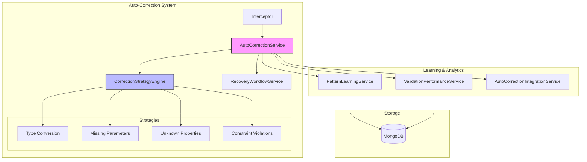

# Auto-Correction API Documentation

The Auto-Correction API provides comprehensive functionality for automatic parameter correction, error recovery, and intelligent learning from validation failures. This system operates transparently during tool execution and can be managed through dedicated REST endpoints.

## Overview

The Auto-Correction System is designed to:
- Automatically detect and correct parameter validation errors
- Learn from successful corrections to improve future performance
- Provide comprehensive monitoring and analytics
- Offer configurable correction strategies and safety mechanisms
- Integrate seamlessly with existing MXF tool execution pipeline

## Architecture



## REST API Endpoints

### System Status and Health

#### Get Auto-Correction Status

**GET** `/api/auto-correction/status`

Retrieve the current status and health metrics of the auto-correction system.

**Query Parameters:**
- `includeMetrics` (boolean) - Include performance metrics (default: true)
- `includeActiveCorrections` (boolean) - Include currently running corrections (default: false)
- `timeRange` (string) - Time range for metrics (1h, 24h, 7d, 30d) (default: 24h)

**Response:**
```json
{
    "success": true,
    "data": {
        "systemStatus": {
            "enabled": true,
            "healthy": true,
            "version": "4.0.1",
            "uptime": 86400,
            "lastRestart": "2024-01-19T10:30:00Z",
            "components": {
                "correctionEngine": "healthy",
                "patternLearning": "healthy",
                "validationService": "healthy",
                "recoveryWorkflow": "healthy"
            }
        },
        "metrics": {
            "totalCorrections": 1247,
            "successfulCorrections": 1089,
            "failedCorrections": 158,
            "successRate": 0.873,
            "averageCorrectionTime": 156,
            "correctionsToday": 89,
            "patternMatches": 743,
            "newPatternsLearned": 23,
            "circuitBreakerTrips": 3
        },
        "activeCorrections": [
            {
                "correctionId": "corr_456",
                "agentId": "agent-123",
                "toolName": "read_file",
                "attempt": 2,
                "startedAt": "2024-01-20T10:29:45Z",
                "status": "processing",
                "strategy": "typeConversion"
            }
        ],
        "strategyPerformance": {
            "typeConversion": {
                "attempts": 456,
                "successes": 421,
                "successRate": 0.923,
                "averageLatency": 89
            },
            "missingParameters": {
                "attempts": 234,
                "successes": 198,
                "successRate": 0.846,
                "averageLatency": 145
            },
            "unknownProperties": {
                "attempts": 178,
                "successes": 167,
                "successRate": 0.938,
                "averageLatency": 67
            },
            "constraintViolations": {
                "attempts": 89,
                "successes": 76,
                "successRate": 0.854,
                "averageLatency": 123
            }
        }
    }
}
```

#### Get System Configuration

**GET** `/api/auto-correction/config`

Retrieve current auto-correction system configuration.

**Response:**
```json
{
    "success": true,
    "data": {
        "configuration": {
            "enabled": true,
            "maxRetries": 3,
            "retryDelayMs": 1000,
            "exponentialBackoff": true,
            "confidenceThreshold": 0.7,
            "requireConfirmationThreshold": 0.5,
            "circuitBreakerThreshold": 10,
            "enableLearning": true,
            "enableMetrics": true,
            "strategies": {
                "typeConversion": {
                    "enabled": true,
                    "confidence": 0.85,
                    "maxAttempts": 2
                },
                "missingParameters": {
                    "enabled": true,
                    "confidence": 0.75,
                    "maxAttempts": 3
                },
                "unknownProperties": {
                    "enabled": true,
                    "confidence": 0.9,
                    "maxAttempts": 1
                },
                "constraintViolations": {
                    "enabled": true,
                    "confidence": 0.7,
                    "maxAttempts": 2
                }
            },
            "safety": {
                "enableRollback": true,
                "requireSchemaValidation": true,
                "maxCorrectionAttempts": 5,
                "timeoutMs": 30000
            }
        },
        "lastUpdated": "2024-01-20T09:15:00Z",
        "updatedBy": "system"
    }
}
```

### Configuration Management

#### Update Configuration

**PUT** `/api/auto-correction/config`

Update auto-correction system configuration.

**Request:**
```json
{
    "settings": {
        "enabled": true,
        "maxRetries": 3,
        "confidenceThreshold": 0.8,
        "enableLearning": true,
        "strategies": {
            "typeConversion": {
                "enabled": true,
                "confidence": 0.9
            },
            "missingParameters": {
                "enabled": false
            }
        }
    },
    "applyImmediately": true,
    "reason": "Increased confidence threshold for production stability"
}
```

**Response:**
```json
{
    "success": true,
    "data": {
        "configurationUpdated": true,
        "previousSettings": {
            "confidenceThreshold": 0.7,
            "strategies": {
                "typeConversion": {
                    "confidence": 0.85
                },
                "missingParameters": {
                    "enabled": true
                }
            }
        },
        "newSettings": {
            "confidenceThreshold": 0.8,
            "strategies": {
                "typeConversion": {
                    "confidence": 0.9
                },
                "missingParameters": {
                    "enabled": false
                }
            }
        },
        "changesApplied": [
            "Increased confidence threshold from 0.7 to 0.8",
            "Increased type conversion confidence from 0.85 to 0.9",
            "Disabled missing parameters strategy"
        ],
        "restartRequired": false,
        "effectiveImmediately": true,
        "timestamp": "2024-01-20T10:30:00Z"
    }
}
```

#### Reset Configuration

**POST** `/api/auto-correction/config/reset`

Reset configuration to system defaults.

**Request:**
```json
{
    "resetLevel": "full",
    "preservePatterns": true,
    "reason": "Testing default configuration performance"
}
```

**Response:**
```json
{
    "success": true,
    "data": {
        "configurationReset": true,
        "resetLevel": "full",
        "patternsPreserved": true,
        "defaultsApplied": {
            "confidenceThreshold": 0.7,
            "maxRetries": 3,
            "enableLearning": true
        },
        "timestamp": "2024-01-20T10:30:00Z"
    }
}
```

### Testing and Validation

#### Run Correction Tests

**POST** `/api/auto-correction/test`

Execute a suite of tests to validate auto-correction functionality.

**Request:**
```json
{
    "testSuite": "comprehensive",
    "testCases": [
        {
            "name": "type_mismatch_string_to_number",
            "toolName": "calculator",
            "parameters": {
                "operation": "add",
                "a": "5",
                "b": "3"
            },
            "expectedError": "typeMismatch",
            "expectedCorrection": {
                "a": 5,
                "b": 3
            }
        },
        {
            "name": "missing_required_parameter",
            "toolName": "write_file",
            "parameters": {
                "content": "Hello World"
            },
            "expectedError": "missingRequired",
            "expectedCorrection": {
                "path": "/tmp/output.txt",
                "content": "Hello World"
            }
        }
    ],
    "runDiagnostics": true,
    "includePerformanceMetrics": true
}
```

**Response:**
```json
{
    "success": true,
    "data": {
        "testExecution": {
            "testSuite": "comprehensive",
            "startedAt": "2024-01-20T10:30:00Z",
            "completedAt": "2024-01-20T10:31:15Z",
            "duration": 75000
        },
        "testResults": [
            {
                "testName": "type_mismatch_string_to_number",
                "passed": true,
                "executionTime": 89,
                "errorDetected": true,
                "correctionApplied": true,
                "correctionMatched": true,
                "confidence": 0.94,
                "strategy": "typeConversion",
                "details": {
                    "originalParameters": {
                        "operation": "add",
                        "a": "5",
                        "b": "3"
                    },
                    "correctedParameters": {
                        "operation": "add",
                        "a": 5,
                        "b": 3
                    },
                    "correctionType": "stringToNumber"
                }
            },
            {
                "testName": "missing_required_parameter",
                "passed": false,
                "executionTime": 156,
                "errorDetected": true,
                "correctionApplied": false,
                "reason": "No suitable pattern found for path parameter inference",
                "confidence": 0.23,
                "strategy": "missingParameters",
                "suggestions": [
                    "Add default parameter patterns for write_file tool",
                    "Train model with more missing parameter examples"
                ]
            }
        ],
        "overallResults": {
            "totalTests": 2,
            "passed": 1,
            "failed": 1,
            "successRate": 0.5,
            "averageExecutionTime": 122.5,
            "averageConfidence": 0.585
        },
        "diagnostics": {
            "systemLoad": "normal",
            "patternCacheHitRate": 0.78,
            "correctionEngineLatency": 45,
            "memoryUsage": "156MB",
            "activeConnections": 23,
            "recommendedOptimizations": [
                "Increase pattern cache size for better hit rates",
                "Add more training examples for missing parameter scenarios",
                "Consider enabling aggressive pattern matching for write_file"
            ]
        },
        "performanceMetrics": {
            "averageLatency": 122.5,
            "throughput": 16.0,
            "cacheEfficiency": 0.78,
            "patternMatchRate": 0.65
        }
    }
}
```

### Analytics and Insights

#### Get Correction Analytics

**GET** `/api/auto-correction/analytics`

Retrieve detailed analytics about correction patterns and performance.

**Query Parameters:**
- `timeRange` (string) - Time range for analytics (1h, 24h, 7d, 30d) (default: 7d)
- `groupBy` (string) - Group results by (tool, agent, strategy, errorType) (default: tool)
- `includePatterns` (boolean) - Include pattern details (default: true)
- `includeAgentBreakdown` (boolean) - Include per-agent analytics (default: false)
- `minUsage` (number) - Minimum usage count to include (default: 5)

**Response:**
```json
{
    "success": true,
    "data": {
        "timeRange": {
            "start": "2024-01-13T10:30:00Z",
            "end": "2024-01-20T10:30:00Z",
            "duration": "7 days"
        },
        "overallMetrics": {
            "totalCorrections": 2847,
            "successfulCorrections": 2456,
            "failedCorrections": 391,
            "successRate": 0.863,
            "averageLatency": 167,
            "totalTimeSaved": 8520,
            "errorsPrevented": 2456,
            "patternsUsed": 89,
            "newPatternsDiscovered": 23
        },
        "topPerformingPatterns": [
            {
                "id": "string_to_number_conversion",
                "name": "String to Number Conversion",
                "usageCount": 456,
                "successRate": 0.94,
                "averageConfidence": 0.89,
                "averageLatency": 67,
                "toolsApplied": ["calculator", "data_analyzer", "math_operations"],
                "description": "Converts string representations of numbers to numeric types",
                "categories": ["typeConversion"],
                "lastUsed": "2024-01-20T09:45:00Z"
            },
            {
                "id": "default_file_extension",
                "name": "Default File Extension Addition",
                "usageCount": 234,
                "successRate": 0.87,
                "averageConfidence": 0.82,
                "averageLatency": 89,
                "toolsApplied": ["write_file", "read_file", "edit_file"],
                "description": "Adds default .txt extension when missing from file paths",
                "categories": ["missingParameters", "constraintViolations"],
                "lastUsed": "2024-01-20T10:15:00Z"
            }
        ],
        "toolBreakdown": [
            {
                "toolName": "write_file",
                "correctionsApplied": 345,
                "successRate": 0.88,
                "averageLatency": 134,
                "commonErrors": ["typeMismatch", "unknownProperties", "missingRequired"],
                "mostEffectiveStrategies": ["typeConversion", "propertyFiltering"],
                "improvementTrend": 0.15,
                "recommendations": [
                    "Review schema documentation for common type mismatches",
                    "Consider adding default parameter inference"
                ]
            },
            {
                "toolName": "read_file",
                "correctionsApplied": 287,
                "successRate": 0.91,
                "averageLatency": 98,
                "commonErrors": ["missingRequired", "constraintViolations"],
                "mostEffectiveStrategies": ["defaultValues", "pathNormalization"],
                "improvementTrend": 0.08,
                "recommendations": [
                    "Implement smarter path completion patterns"
                ]
            }
        ],
        "errorTypeAnalysis": {
            "typeMismatch": {
                "occurrences": 1456,
                "corrected": 1298,
                "correctionRate": 0.891,
                "mostCommonTools": ["calculator", "write_file", "data_analyzer"],
                "trend": "stable"
            },
            "missingRequired": {
                "occurrences": 876,
                "corrected": 634,
                "correctionRate": 0.724,
                "mostCommonTools": ["read_file", "write_file", "api_call"],
                "trend": "improving"
            },
            "unknownProperties": {
                "occurrences": 456,
                "corrected": 398,
                "correctionRate": 0.873,
                "mostCommonTools": ["api_call", "database_query"],
                "trend": "stable"
            },
            "constraintViolations": {
                "occurrences": 234,
                "corrected": 189,
                "correctionRate": 0.808,
                "mostCommonTools": ["file_operations", "math_operations"],
                "trend": "improving"
            }
        },
        "trends": {
            "dailyCorrections": [
                {"date": "2024-01-13", "count": 234, "successRate": 0.82},
                {"date": "2024-01-14", "count": 267, "successRate": 0.85},
                {"date": "2024-01-15", "count": 298, "successRate": 0.87},
                {"date": "2024-01-16", "count": 312, "successRate": 0.89},
                {"date": "2024-01-17", "count": 289, "successRate": 0.88},
                {"date": "2024-01-18", "count": 334, "successRate": 0.91},
                {"date": "2024-01-19", "count": 356, "successRate": 0.92}
            ],
            "successRateImprovement": 0.12,
            "latencyTrend": -0.08,
            "newPatternsLearned": 23,
            "patternsDeprecated": 5,
            "confidenceImprovement": 0.06
        },
        "recommendations": [
            "Type conversion patterns show consistently high success rates - consider expanding coverage",
            "Missing parameter corrections have room for improvement - increase training data",
            "File operation tools benefit significantly from auto-correction - consider specialized patterns",
            "Overall system performance trending positively with 12% success rate improvement"
        ]
    }
}
```

#### Get Pattern Details

**GET** `/api/auto-correction/patterns/:patternId`

Get detailed information about a specific correction pattern.

**Response:**
```json
{
    "success": true,
    "data": {
        "pattern": {
            "id": "string_to_number_conversion",
            "name": "String to Number Conversion",
            "description": "Converts string representations of numbers to numeric types",
            "category": "typeConversion",
            "version": "2.1.0",
            "createdAt": "2024-01-10T14:20:00Z",
            "lastUpdated": "2024-01-19T16:45:00Z",
            "statistics": {
                "totalUsage": 456,
                "successfulApplications": 429,
                "failedApplications": 27,
                "successRate": 0.94,
                "averageConfidence": 0.89,
                "averageLatency": 67,
                "lastUsed": "2024-01-20T09:45:00Z"
            },
            "applicableTools": [
                "calculator",
                "data_analyzer", 
                "math_operations",
                "statistical_analysis"
            ],
            "conditions": {
                "errorTypes": ["typeMismatch"],
                "parameterTypes": ["number", "integer", "float"],
                "valuePatterns": ["^\\d+$", "^\\d+\\.\\d+$"]
            },
            "transformation": {
                "type": "typeConversion",
                "from": "string",
                "to": "number",
                "validationRules": [
                    "Must contain only numeric characters and decimal points",
                    "Must not exceed safe integer limits",
                    "Must be finite number"
                ]
            },
            "examples": [
                {
                    "input": {"value": "123", "type": "string"},
                    "output": {"value": 123, "type": "number"},
                    "confidence": 0.95
                },
                {
                    "input": {"value": "45.67", "type": "string"},
                    "output": {"value": 45.67, "type": "number"},
                    "confidence": 0.93
                }
            ],
            "metadata": {
                "learnedFrom": ["agent-123", "agent-456", "agent-789"],
                "improvementHistory": [
                    {
                        "date": "2024-01-15T10:00:00Z",
                        "change": "Improved regex pattern for decimal numbers",
                        "confidenceImprovement": 0.05
                    }
                ],
                "tags": ["numeric", "conversion", "high-confidence", "validated"]
            }
        }
    }
}
```

### Manual Correction Operations

#### Trigger Manual Correction

**POST** `/api/auto-correction/correct`

Manually trigger auto-correction for a specific error scenario.

**Request:**
```json
{
    "toolName": "write_file",
    "parameters": {
        "path": "/output/report.txt",
        "content": 12345
    },
    "error": {
        "type": "typeMismatch",
        "message": "Expected string but received number for parameter: content",
        "parameter": "content",
        "expectedType": "string",
        "actualType": "number"
    },
    "context": {
        "agentId": "agent-123",
        "channelId": "file-ops",
        "requestId": "req-456"
    },
    "options": {
        "maxAttempts": 3,
        "requireHighConfidence": true,
        "enableLearning": true
    }
}
```

**Response:**
```json
{
    "success": true,
    "data": {
        "correctionId": "corr_789",
        "correctionResult": {
            "success": true,
            "strategy": "typeConversion",
            "confidence": 0.94,
            "correctedParameters": {
                "path": "/output/report.txt",
                "content": "12345"
            },
            "originalParameters": {
                "path": "/output/report.txt",
                "content": 12345
            },
            "appliedPattern": "number_to_string_conversion",
            "processingTime": 89,
            "riskLevel": "low"
        },
        "validation": {
            "passed": true,
            "schemaValid": true,
            "semanticallyEquivalent": true,
            "safeTransformation": true
        },
        "learningOutcome": {
            "patternReinforced": true,
            "confidenceImproved": 0.02,
            "newInsightGained": false
        },
        "timestamp": "2024-01-20T10:30:00Z"
    }
}
```

### Circuit Breaker Management

#### Get Circuit Breaker Status

**GET** `/api/auto-correction/circuit-breaker`

Get current circuit breaker status for all tools.

**Response:**
```json
{
    "success": true,
    "data": {
        "globalStatus": "healthy",
        "circuitBreakers": [
            {
                "toolName": "write_file",
                "status": "closed",
                "failureCount": 2,
                "threshold": 10,
                "lastFailure": "2024-01-20T09:15:00Z",
                "nextRetryAt": null
            },
            {
                "toolName": "api_call",
                "status": "half-open",
                "failureCount": 10,
                "threshold": 10,
                "lastFailure": "2024-01-20T10:00:00Z",
                "nextRetryAt": "2024-01-20T10:35:00Z",
                "testRequestsPending": 1
            }
        ],
        "statistics": {
            "totalCircuitBreakers": 15,
            "openCircuits": 0,
            "halfOpenCircuits": 1,
            "closedCircuits": 14,
            "totalTrips": 23,
            "averageRecoveryTime": 300
        }
    }
}
```

#### Reset Circuit Breaker

**POST** `/api/auto-correction/circuit-breaker/:toolName/reset`

Manually reset a circuit breaker for a specific tool.

**Request:**
```json
{
    "reason": "Manual intervention after fixing underlying issue",
    "resetFailureCount": true
}
```

**Response:**
```json
{
    "success": true,
    "data": {
        "toolName": "api_call",
        "previousStatus": "open",
        "newStatus": "closed",
        "failureCountReset": true,
        "resetAt": "2024-01-20T10:30:00Z",
        "reason": "Manual intervention after fixing underlying issue"
    }
}
```

## Real-time Monitoring

### Polling for Auto-Correction Activity

Monitor auto-correction system activity via REST API polling:

```typescript
// Poll correction metrics
const pollCorrectionMetrics = async (): Promise<void> => {
    const response = await fetch('http://localhost:3001/api/auto-correction/metrics', {
        method: 'GET',
        headers: {
            'Authorization': `Bearer ${jwtToken}`,
            'Content-Type': 'application/json'
        }
    });
    
    const metrics = await response.json();
    console.log('Correction metrics:', {
        successRate: metrics.successRate,
        averageLatency: metrics.averageLatency,
        correctionsToday: metrics.correctionsToday,
        activeCorrections: metrics.activeCorrections
    });
};

// Poll every 10 seconds
setInterval(pollCorrectionMetrics, 10000);
```

### Recent Corrections

Fetch recent correction attempts:

```typescript
const getRecentCorrections = async (): Promise<void> => {
    const response = await fetch('http://localhost:3001/api/auto-correction/recent?limit=20', {
        method: 'GET',
        headers: {
            'Authorization': `Bearer ${jwtToken}`,
            'Content-Type': 'application/json'
        }
    });
    
    const corrections = await response.json();
    corrections.data.forEach(correction => {
        console.log('Correction:', {
            correctionId: correction.id,
            toolName: correction.toolName,
            success: correction.success,
            strategy: correction.strategy,
            timestamp: correction.timestamp
        });
    });
};
```

### Administrative Commands

For administrative commands, use the REST API endpoints:

```typescript
// Request immediate system status
const response = await fetch('http://localhost:3001/api/auto-correction/status', {
    method: 'GET',
    headers: {
        'Authorization': `Bearer ${jwtToken}`,
        'Content-Type': 'application/json'
    }
});
const status = await response.json();
console.log('Current status:', status);

// Test specific correction scenario
const testResult = await fetch('http://localhost:3001/api/auto-correction/test', {
    method: 'POST',
    headers: {
        'Authorization': `Bearer ${jwtToken}`,
        'Content-Type': 'application/json'
    },
    body: JSON.stringify({
        toolName: 'write_file',
        parameters: { content: 123 },
        errorType: 'typeMismatch'
    })
});
const result = await testResult.json();
console.log('Test result:', result);

// Update configuration in real-time
const configUpdate = await fetch('http://localhost:3001/api/auto-correction/config', {
    method: 'PUT',
    headers: {
        'Authorization': `Bearer ${jwtToken}`,
        'Content-Type': 'application/json'
    },
    body: JSON.stringify({
        confidenceThreshold: 0.8,
        maxRetries: 5
    })
});
const confirmation = await configUpdate.json();
console.log('Config updated:', confirmation);
```

## Error Handling

### Common Error Responses

```json
{
    "success": false,
    "error": {
        "code": "CORRECTION_FAILED",
        "message": "Unable to correct parameter validation error",
        "details": {
            "correctionId": "corr_456",
            "toolName": "write_file",
            "errorType": "typeMismatch",
            "strategiesAttempted": ["typeConversion", "defaultValues"],
            "failureReasons": [
                "Type conversion resulted in data loss",
                "No suitable default value available"
            ]
        },
        "timestamp": "2024-01-20T10:30:00Z"
    }
}
```

### Error Codes

- `SYSTEM_DISABLED` - Auto-correction system is disabled
- `CONFIGURATION_ERROR` - Invalid configuration provided
- `CORRECTION_FAILED` - Unable to correct the error
- `PATTERN_NOT_FOUND` - No suitable correction pattern available
- `CONFIDENCE_TOO_LOW` - Correction confidence below threshold
- `MAX_RETRIES_EXCEEDED` - Maximum correction attempts reached
- `CIRCUIT_BREAKER_OPEN` - Tool circuit breaker is open
- `VALIDATION_FAILED` - Corrected parameters failed validation
- `TIMEOUT_EXCEEDED` - Correction operation timed out

## Best Practices

### For Developers

1. **Monitor Correction Metrics**: Regularly check success rates and latency
2. **Configure Appropriate Thresholds**: Balance between safety and functionality
3. **Review Failed Corrections**: Analyze patterns in correction failures
4. **Test Correction Scenarios**: Use the testing API to validate behavior
5. **Handle Circuit Breaker Events**: Implement fallback strategies

### For System Administrators

1. **Regular Health Checks**: Monitor system health and component status
2. **Pattern Management**: Review and curate learned patterns
3. **Configuration Tuning**: Adjust settings based on performance metrics
4. **Security Considerations**: Ensure correction patterns don't expose sensitive data
5. **Backup and Recovery**: Maintain backups of successful patterns

### Integration Guidelines

1. **Event-Driven Architecture**: Use WebSocket events for real-time monitoring
2. **Graceful Degradation**: Handle system unavailability gracefully
3. **Logging and Audit**: Maintain comprehensive logs of correction activities
4. **Performance Monitoring**: Track correction impact on overall system performance
5. **Feedback Loops**: Implement mechanisms to improve correction accuracy

## See Also

- [MCP API Documentation](mcp.md) - For tool execution and validation
- [Validation Analytics API](validation-analytics.md) - For performance metrics
- [WebSocket Events](websocket.md) - For real-time system events
- [SDK Auto-Correction Guide](../sdk/auto-correction.md) - For client implementation