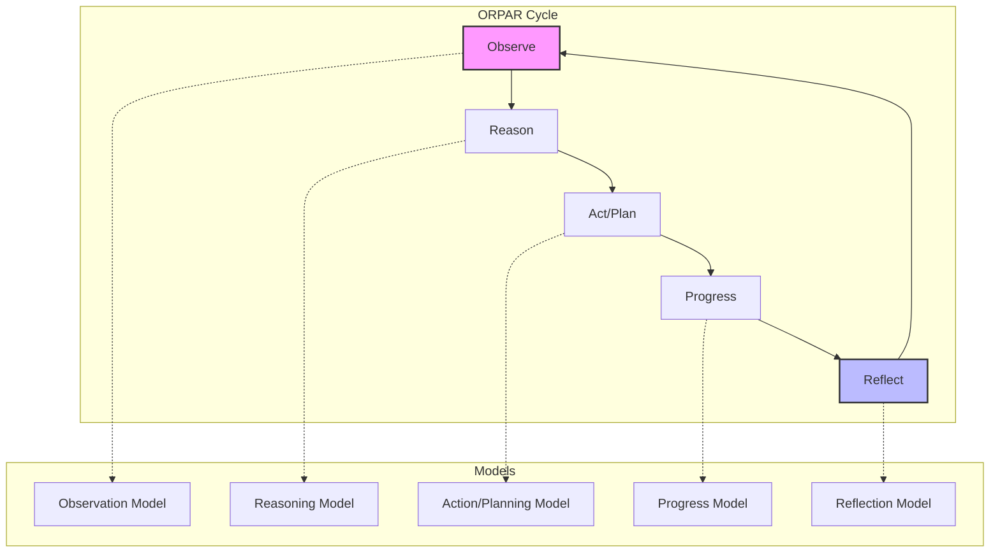

# Control Loop API Documentation

The Control Loop API implements the ORPAR (Observe-Reason-Act-Progress-Reflect) cycle, enabling sophisticated agent behavior through structured decision-making processes.

## Overview

The Control Loop system provides:
- Structured agent decision-making through the ORPAR cycle
- Model-specific processing for each phase
- Pattern recognition and learning
- Performance tracking and optimization
- Event-driven architecture for real-time updates

## Architecture

<div class="mermaid-fallback">



</div>

<iframe src="../diagram/orpar-control-loop.html" width="100%" height="750" style="border: none; border-radius: 10px; background: var(--bg-secondary);"></iframe>

## REST Endpoints

### Initialize Control Loop

**POST** `/api/control-loops`

Initialize a new control loop for an agent.

**Request:**
```json
{
    "agentId": "agent-123",
    "channelId": "channel-456",
    "config": {
        "observationModel": "gpt-4-vision",
        "reasoningModel": "claude-3-opus",
        "planningModel": "gpt-4-turbo",
        "progressModel": "gpt-3.5-turbo",
        "reflectionModel": "claude-3-sonnet",
        "cycleInterval": 5000,
        "maxCycles": 100,
        "enablePatternLearning": true
    }
}
```

**Response:**
```json
{
    "success": true,
    "data": {
        "controlLoopId": "cl_789",
        "status": "active",
        "createdAt": "2024-01-20T10:00:00Z"
    }
}
```

### Get Control Loop Status

**GET** `/api/control-loops/:controlLoopId`

**Response:**
```json
{
    "success": true,
    "data": {
        "controlLoopId": "cl_789",
        "agentId": "agent-123",
        "status": "active",
        "currentPhase": "reasoning",
        "cycleCount": 15,
        "lastCycleAt": "2024-01-20T10:15:00Z",
        "performance": {
            "avgCycleTime": 3500,
            "successRate": 0.93,
            "patternMatches": 12
        }
    }
}
```

### Update Control Loop Configuration

**PUT** `/api/control-loops/:controlLoopId`

**Request:**
```json
{
    "config": {
        "cycleInterval": 10000,
        "enablePatternLearning": false
    }
}
```

### Pause/Resume Control Loop

**POST** `/api/control-loops/:controlLoopId/pause`
**POST** `/api/control-loops/:controlLoopId/resume`

### Get Control Loop History

**GET** `/api/control-loops/:controlLoopId/history`

**Query Parameters:**
- `limit` - Number of cycles to return (default: 10)
- `phase` - Filter by specific phase
- `from` - Start date (ISO format)
- `to` - End date (ISO format)

**Response:**
```json
{
    "success": true,
    "data": {
        "cycles": [
            {
                "cycleNumber": 15,
                "timestamp": "2024-01-20T10:15:00Z",
                "phases": {
                    "observation": {
                        "input": { "type": "environment", "data": {...} },
                        "output": { "insights": [...], "patterns": [...] },
                        "duration": 850
                    },
                    "reasoning": {
                        "input": { "observations": [...] },
                        "output": { "analysis": "...", "hypotheses": [...] },
                        "duration": 1200
                    },
                    "action": {
                        "input": { "reasoning": {...} },
                        "output": { "plan": {...}, "priority": "high" },
                        "duration": 900
                    },
                    "progress": {
                        "input": { "plan": {...} },
                        "output": { "completed": 3, "pending": 2 },
                        "duration": 500
                    },
                    "reflection": {
                        "input": { "cycle": {...} },
                        "output": { "learnings": [...], "improvements": [...] },
                        "duration": 750
                    }
                }
            }
        ]
    }
}
```

## WebSocket Events

### Control Loop Initialization

```javascript
// Initialize control loop
socket.emit('controlLoop:init', {
    agentId: 'agent-123',
    config: {
        observationModel: 'gpt-4-vision',
        reasoningModel: 'claude-3-opus',
        planningModel: 'gpt-4-turbo',
        reflectionModel: 'claude-3-sonnet',
        cycleInterval: 5000
    }
});

// Response
socket.on('controlLoop:initialized', (data) => {
    console.log('Control loop started:', data.controlLoopId);
});
```

### Submit Observations

```javascript
// Submit observation
socket.emit('controlLoop:observation', {
    controlLoopId: 'cl_789',
    observation: {
        type: 'environment',
        data: {
            temperature: 72,
            humidity: 45,
            lightLevel: 'bright',
            soundLevel: 'quiet'
        },
        source: 'sensor_array',
        confidence: 0.95
    }
});

// Alternative: Batch observations
socket.emit('controlLoop:observations:batch', {
    controlLoopId: 'cl_789',
    observations: [
        { type: 'user_input', data: { message: 'Help needed' } },
        { type: 'system_state', data: { cpu: 45, memory: 72 } },
        { type: 'external_api', data: { weather: 'sunny' } }
    ]
});
```

### ORPAR Cycle Events

Each phase emits events when processing:

```javascript
// Observation Phase
socket.on('controlLoop:observation:start', (data) => {
    console.log('Processing observations...');
});

socket.on('controlLoop:observation:complete', (data) => {
    console.log('Insights:', data.insights);
    console.log('Patterns detected:', data.patterns);
});

// Reasoning Phase
socket.on('controlLoop:reasoning:start', (data) => {
    console.log('Analyzing observations...');
});

socket.on('controlLoop:reasoning:complete', (data) => {
    console.log('Analysis:', data.analysis);
    console.log('Hypotheses:', data.hypotheses);
    console.log('Confidence:', data.confidence);
});

// Action/Planning Phase
socket.on('controlLoop:action:start', (data) => {
    console.log('Planning actions...');
});

socket.on('controlLoop:action:complete', (data) => {
    console.log('Plan:', data.plan);
    console.log('Priority actions:', data.priorities);
    console.log('Resources needed:', data.resources);
});

// Progress Phase
socket.on('controlLoop:progress:start', (data) => {
    console.log('Executing plan...');
});

socket.on('controlLoop:progress:update', (data) => {
    console.log('Progress:', data.percentage + '%');
    console.log('Completed:', data.completed);
    console.log('Current action:', data.currentAction);
});

socket.on('controlLoop:progress:complete', (data) => {
    console.log('Execution complete');
    console.log('Success rate:', data.successRate);
});

// Reflection Phase
socket.on('controlLoop:reflection:start', (data) => {
    console.log('Reflecting on cycle...');
});

socket.on('controlLoop:reflection:complete', (data) => {
    console.log('Learnings:', data.learnings);
    console.log('Patterns identified:', data.patterns);
    console.log('Improvements:', data.improvements);
});
```

### Control Loop Management

```javascript
// Pause control loop
socket.emit('controlLoop:pause', {
    controlLoopId: 'cl_789',
    reason: 'User requested pause'
});

// Resume control loop
socket.emit('controlLoop:resume', {
    controlLoopId: 'cl_789'
});

// Stop control loop
socket.emit('controlLoop:stop', {
    controlLoopId: 'cl_789'
});

// Update configuration
socket.emit('controlLoop:update', {
    controlLoopId: 'cl_789',
    config: {
        cycleInterval: 10000,
        maxCycles: 50
    }
});
```

### Pattern Recognition

```javascript
// Pattern detected event
socket.on('controlLoop:pattern:detected', (data) => {
    console.log('Pattern found:', data.pattern);
    console.log('Confidence:', data.confidence);
    console.log('Occurrences:', data.occurrences);
});

// Query patterns
socket.emit('controlLoop:patterns:query', {
    controlLoopId: 'cl_789',
    type: 'behavioral' // or 'environmental', 'temporal'
});

socket.on('controlLoop:patterns:response', (patterns) => {
    patterns.forEach(p => {
        console.log(`Pattern: ${p.name}, Strength: ${p.strength}`);
    });
});
```

## Models and Prompts

### Model Configuration

Each phase can use a specific LLM model optimized for its task:

```javascript
{
    // Observation Model - Analyzes raw inputs
    observationModel: {
        provider: 'openai',
        model: 'gpt-4-vision',
        temperature: 0.3,
        maxTokens: 1000
    },
    
    // Reasoning Model - Deep analysis
    reasoningModel: {
        provider: 'anthropic',
        model: 'claude-3-opus',
        temperature: 0.5,
        maxTokens: 2000
    },
    
    // Planning Model - Strategic planning
    planningModel: {
        provider: 'openai',
        model: 'gpt-4-turbo',
        temperature: 0.7,
        maxTokens: 1500
    },
    
    // Progress Model - Execution tracking
    progressModel: {
        provider: 'openai',
        model: 'gpt-3.5-turbo',
        temperature: 0.2,
        maxTokens: 500
    },
    
    // Reflection Model - Meta-cognitive analysis
    reflectionModel: {
        provider: 'anthropic',
        model: 'claude-3-sonnet',
        temperature: 0.6,
        maxTokens: 1500
    }
}
```

### Fallback Behavior

When LLM models are unavailable:

```javascript
{
    enableFallback: true,
    fallbackStrategies: {
        observation: 'rule-based',
        reasoning: 'pattern-matching',
        planning: 'template-based',
        progress: 'metric-tracking',
        reflection: 'statistical-analysis'
    }
}
```

## Advanced Features

### Multi-Agent Coordination

```javascript
// Create coordinated control loop
socket.emit('controlLoop:coordinate', {
    primaryAgent: 'agent-123',
    supportingAgents: ['agent-456', 'agent-789'],
    coordinationStrategy: 'consensus',
    sharedObjective: 'Complete research project'
});

// Coordination events
socket.on('controlLoop:coordination:sync', (data) => {
    console.log('Synchronizing with agents:', data.agents);
});

socket.on('controlLoop:coordination:decision', (data) => {
    console.log('Coordinated decision:', data.decision);
    console.log('Agreement level:', data.consensus);
});
```

### Performance Optimization

```javascript
// Get performance metrics
socket.emit('controlLoop:metrics', {
    controlLoopId: 'cl_789',
    metrics: ['cycleTime', 'successRate', 'resourceUsage']
});

socket.on('controlLoop:metrics:response', (metrics) => {
    console.log('Average cycle time:', metrics.avgCycleTime);
    console.log('Success rate:', metrics.successRate);
    console.log('Resource efficiency:', metrics.resourceEfficiency);
});

// Optimize configuration based on performance
socket.emit('controlLoop:optimize', {
    controlLoopId: 'cl_789',
    targetMetric: 'cycleTime',
    constraints: {
        minSuccessRate: 0.8,
        maxResourceUsage: 0.7
    }
});
```

### Custom Phases

Add custom phases to the control loop:

```javascript
socket.emit('controlLoop:phase:add', {
    controlLoopId: 'cl_789',
    phase: {
        name: 'validate',
        position: 'after_progress',
        model: 'gpt-4',
        prompt: 'Validate the execution results...',
        timeout: 5000
    }
});
```

## Error Handling

### Error Events

```javascript
socket.on('controlLoop:error', (error) => {
    switch (error.phase) {
        case 'observation':
            console.error('Failed to process observations:', error.message);
            break;
        case 'reasoning':
            console.error('Reasoning failed:', error.message);
            break;
        case 'action':
            console.error('Planning failed:', error.message);
            break;
        case 'progress':
            console.error('Execution failed:', error.message);
            break;
        case 'reflection':
            console.error('Reflection failed:', error.message);
            break;
    }
});

// Recovery strategies
socket.on('controlLoop:error:recovery', (recovery) => {
    console.log('Recovery action:', recovery.action);
    console.log('Retry attempt:', recovery.attempt);
});

// Phase 3: Enhanced error recovery with intelligent recommendations
socket.on('controlLoop:error:advanced', (errorData) => {
    console.log('Advanced error recovery triggered');
    
    // Use tools_recommend_on_error for intelligent recovery suggestions
    socket.emit('mcp:tool:execute', {
        toolName: 'tools_recommend_on_error',
        arguments: {
            failedTool: errorData.failedTool,
            errorMessage: errorData.message,
            failedParameters: errorData.parameters,
            intent: errorData.originalIntent,
            maxAlternatives: 3
        }
    });
});

socket.on('mcp:tool:result', (result) => {
    if (result.toolName === 'tools_recommend_on_error') {
        console.log('Error recovery recommendations received:');
        console.log('Alternatives:', result.output.alternatives);
        console.log('Parameter corrections:', result.output.parameterCorrections);
        console.log('Prevention tips:', result.output.preventionTips);
        
        // Apply recovery recommendations to control loop execution
        // This enables self-healing agent behavior
    }
});
```

## Best Practices

1. **Observation Quality**: Provide structured, consistent observations
2. **Model Selection**: Choose appropriate models for each phase
3. **Cycle Timing**: Balance responsiveness with resource usage
4. **Pattern Learning**: Enable for repetitive tasks
5. **Error Recovery**: Implement robust fallback strategies
6. **Monitoring**: Track performance metrics regularly
7. **Coordination**: Use multi-agent loops for complex tasks

## Examples

### Environmental Monitoring Agent

```javascript
// Initialize environmental monitoring loop
socket.emit('controlLoop:init', {
    agentId: 'env-monitor',
    config: {
        observationModel: 'gpt-4-vision',
        cycleInterval: 60000, // 1 minute
        patterns: ['temperature_trends', 'anomaly_detection']
    }
});

// Submit sensor data
setInterval(() => {
    socket.emit('controlLoop:observation', {
        controlLoopId: 'cl_env',
        observation: {
            type: 'sensor_reading',
            data: {
                temperature: readTemperature(),
                humidity: readHumidity(),
                pressure: readPressure()
            }
        }
    });
}, 10000);

// React to insights
socket.on('controlLoop:action:complete', (data) => {
    if (data.plan.actions.includes('alert')) {
        sendAlert(data.plan.alertDetails);
    }
});
```

### Task Management Agent

```javascript
// Initialize task management loop
socket.emit('controlLoop:init', {
    agentId: 'task-manager',
    config: {
        reasoningModel: 'claude-3-opus',
        planningModel: 'gpt-4-turbo',
        enablePatternLearning: true
    }
});

// Observe task queue
socket.on('task:created', (task) => {
    socket.emit('controlLoop:observation', {
        controlLoopId: 'cl_tasks',
        observation: {
            type: 'new_task',
            data: task
        }
    });
});

// Execute planned assignments
socket.on('controlLoop:action:complete', (data) => {
    data.plan.assignments.forEach(assignment => {
        socket.emit('task:assign', {
            taskId: assignment.taskId,
            agentId: assignment.agentId
        });
    });
});
```

## Next Steps

- Review [WebSocket Events](websocket.md) for event system details
- See [MCP Integration](mcp.md) for tool execution in control loops
- Explore [Memory API](memory.md) for pattern storage
- Check [SDK Documentation](../sdk/index.md) for client implementation