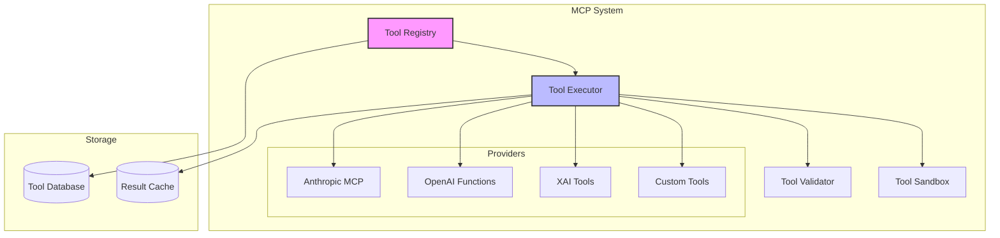

# MCP (Model Context Protocol) API Documentation

The MCP API provides a standardized interface for tool discovery, registration, and execution within the MXF framework. It enables agents to extend their capabilities through a rich ecosystem of tools.

## Overview

The MCP system provides:
- Dynamic tool discovery and registration
- Provider-agnostic tool execution
- Resource management (prompts, templates, data)
- Tool validation and sandboxing
- Performance monitoring and caching

## Architecture

<div class="mermaid-fallback">



</div>

<iframe src="../diagram/mcp-tool-integration.html" width="100%" height="500" style="border: none; border-radius: 10px; background: var(--bg-secondary);"></iframe>

## REST Endpoints

### List Available Tools

**GET** `/api/mcp/tools`

List all available tools with optional filtering.

**Query Parameters:**
- `category` - Filter by category (e.g., 'search', 'analysis', 'generation')
- `provider` - Filter by provider (e.g., 'anthropic', 'openai', 'custom')
- `capabilities` - Comma-separated list of required capabilities
- `search` - Search term for tool name or description

**Response:**
```json
{
    "success": true,
    "data": {
        "tools": [
            {
                "id": "tool_123",
                "name": "web_search",
                "description": "Search the web for information",
                "category": "search",
                "provider": "mxf",
                "inputSchema": {
                    "type": "object",
                    "properties": {
                        "query": {
                            "type": "string",
                            "description": "Search query"
                        },
                        "limit": {
                            "type": "integer",
                            "default": 10
                        }
                    },
                    "required": ["query"]
                },
                "outputSchema": {
                    "type": "object",
                    "properties": {
                        "results": {
                            "type": "array",
                            "items": {
                                "type": "object"
                            }
                        }
                    }
                },
                "pricing": {
                    "model": "per_call",
                    "cost": 0.001
                },
                "performance": {
                    "avgLatency": 1500,
                    "successRate": 0.98
                }
            }
        ],
        "total": 45,
        "categories": ["search", "analysis", "generation", "utility"]
    }
}
```

### Get Tool Details

**GET** `/api/mcp/tools/:toolId`

Get detailed information about a specific tool.

**Response:**
```json
{
    "success": true,
    "data": {
        "tool": {
            "id": "tool_123",
            "name": "web_search",
            "description": "Search the web for information",
            "longDescription": "Advanced web search tool with support for...",
            "version": "2.1.0",
            "author": "MXF Team",
            "category": "search",
            "tags": ["web", "search", "research"],
            "inputSchema": { /* JSON Schema */ },
            "outputSchema": { /* JSON Schema */ },
            "examples": [
                {
                    "input": { "query": "AI news 2024" },
                    "output": { "results": [/* ... */] }
                }
            ],
            "configuration": {
                "timeout": 30000,
                "retries": 3,
                "cache": true
            },
            "requirements": {
                "permissions": ["internet_access"],
                "resources": ["search_api_key"]
            },
            "statistics": {
                "totalCalls": 15234,
                "successRate": 0.98,
                "avgLatency": 1500,
                "lastUsed": "2024-01-20T10:00:00Z"
            }
        }
    }
}
```

### Register Custom Tool

**POST** `/api/mcp/tools`

Register a new custom tool.

**Request:**
```json
{
    "name": "sentiment_analyzer",
    "description": "Analyze sentiment of text",
    "category": "analysis",
    "inputSchema": {
        "type": "object",
        "properties": {
            "text": {
                "type": "string",
                "description": "Text to analyze",
                "maxLength": 5000
            },
            "language": {
                "type": "string",
                "enum": ["en", "es", "fr", "de"],
                "default": "en"
            }
        },
        "required": ["text"]
    },
    "outputSchema": {
        "type": "object",
        "properties": {
            "sentiment": {
                "type": "string",
                "enum": ["positive", "negative", "neutral"]
            },
            "confidence": {
                "type": "number",
                "minimum": 0,
                "maximum": 1
            }
        }
    },
    "handler": {
        "type": "webhook",
        "url": "https://api.example.com/sentiment",
        "method": "POST",
        "headers": {
            "Authorization": "Bearer ${API_KEY}"
        }
    }
}
```

**Response:**
```json
{
    "success": true,
    "data": {
        "toolId": "tool_456",
        "status": "active",
        "validation": {
            "passed": true,
            "warnings": []
        }
    }
}
```

### Execute Tool

**POST** `/api/mcp/tools/:toolId/execute`

Execute a tool with the provided arguments.

**Request:**
```json
{
    "arguments": {
        "query": "latest AI research",
        "limit": 5
    },
    "options": {
        "timeout": 10000,
        "skipCache": false,
        "priority": "high"
    },
    "context": {
        "agentId": "agent-123",
        "channelId": "channel-456",
        "requestId": "req-789"
    }
}
```

**Response:**
```json
{
    "success": true,
    "data": {
        "executionId": "exec_123",
        "result": {
            "results": [
                {
                    "title": "New AI Model Achieves...",
                    "url": "https://example.com/article1",
                    "snippet": "Researchers announce..."
                }
            ]
        },
        "metadata": {
            "duration": 1234,
            "cached": false,
            "provider": "search_api"
        }
    }
}
```

### Get Tool Execution History

**GET** `/api/mcp/tools/:toolId/executions`

**Query Parameters:**
- `agentId` - Filter by agent
- `from` - Start date (ISO format)
- `to` - End date (ISO format)
- `status` - Filter by status (success, failed, timeout)
- `limit` - Number of results (default: 20)

### Update Tool Configuration

**PUT** `/api/mcp/tools/:toolId`

Update tool configuration or metadata.

**Request:**
```json
{
    "description": "Updated description",
    "configuration": {
        "timeout": 20000,
        "cache": false
    },
    "status": "deprecated"
}
```

## WebSocket Events

### Tool Discovery

```javascript
// List available tools
socket.emit('mcp:tools:list', {
    category: 'search',
    capabilities: ['real-time']
});

socket.on('mcp:tools:list:response', (tools) => {
    console.log('Available tools:', tools);
});

// Get tool details
socket.emit('mcp:tool:get', {
    toolId: 'tool_123'
});

socket.on('mcp:tool:details', (tool) => {
    console.log('Tool details:', tool);
});
```

### Tool Execution

```javascript
// Execute a tool
socket.emit('mcp:tool:execute', {
    toolName: 'web_search',
    arguments: {
        query: 'MXF framework documentation',
        limit: 10
    },
    options: {
        timeout: 5000,
        retries: 2
    }
});

// Execution progress
socket.on('mcp:tool:progress', (progress) => {
    console.log(`Execution ${progress.percentage}% complete`);
});

// Execution result
socket.on('mcp:tool:result', (result) => {
    if (result.success) {
        console.log('Tool output:', result.output);
    } else {
        console.error('Tool failed:', result.error);
    }
});

// Execution timeout
socket.on('mcp:tool:timeout', (data) => {
    console.error('Tool execution timed out:', data.toolName);
});
```

### Tool Registration

```javascript
// Register a custom tool
socket.emit('mcp:tool:register', {
    name: 'custom_analyzer',
    description: 'Custom analysis tool',
    inputSchema: {
        type: 'object',
        properties: {
            data: { type: 'string' }
        }
    },
    handler: async (args) => {
        // Tool implementation
        return { result: 'analyzed' };
    }
});

socket.on('mcp:tool:registered', (registration) => {
    console.log('Tool registered:', registration.toolId);
});
```

### Tool Events

```javascript
// Tool availability changes
socket.on('mcp:tool:available', (tool) => {
    console.log('New tool available:', tool.name);
});

socket.on('mcp:tool:unavailable', (tool) => {
    console.log('Tool unavailable:', tool.name);
});

// Tool updates
socket.on('mcp:tool:updated', (update) => {
    console.log('Tool updated:', update.toolId);
    console.log('Changes:', update.changes);
});
```

## Resource Management

### List Resources

**GET** `/api/mcp/resources`

**Query Parameters:**
- `type` - Resource type (prompt, template, data)
- `tags` - Comma-separated tags
- `search` - Search term

**Response:**
```json
{
    "success": true,
    "data": {
        "resources": [
            {
                "id": "res_123",
                "type": "prompt",
                "name": "research_assistant",
                "description": "Prompt for research tasks",
                "content": "You are a research assistant...",
                "variables": ["topic", "depth"],
                "tags": ["research", "assistant"],
                "version": "1.2.0"
            }
        ]
    }
}
```

### Get Resource

**GET** `/api/mcp/resources/:resourceId`

**Query Parameters:**
- `variables` - JSON object of variable values for template rendering

### Create Resource

**POST** `/api/mcp/resources`

**Request:**
```json
{
    "type": "prompt",
    "name": "code_reviewer",
    "description": "Code review assistant prompt",
    "content": "You are a code reviewer. Review the following {{language}} code:\n\n{{code}}\n\nFocus on: {{focus_areas}}",
    "variables": ["language", "code", "focus_areas"],
    "tags": ["code", "review"],
    "metadata": {
        "author": "DevTeam",
        "bestPractices": true
    }
}
```

## Tool Categories

### Search Tools
- `web_search` - General web search
- `academic_search` - Academic papers
- `news_search` - News articles
- `image_search` - Image search

### Analysis Tools
- `sentiment_analysis` - Text sentiment
- `entity_extraction` - Named entities
- `summarization` - Text summarization
- `code_analysis` - Code quality analysis

### Generation Tools
- `text_generation` - Generate text
- `code_generation` - Generate code
- `image_generation` - Generate images
- `data_synthesis` - Synthetic data

### Utility Tools
- `calculator` - Mathematical operations
- `date_time` - Date/time operations
- `file_converter` - File format conversion
- `data_transformer` - Data transformation

### Integration Tools
- `api_caller` - Call external APIs
- `database_query` - Database operations
- `webhook_trigger` - Trigger webhooks
- `email_sender` - Send emails

### Meta Tools (Enhanced in Phase 3)
- `tools_recommend` - AI-powered tool recommendations with validation insights
- `tools_recommend_on_error` - Error-specific tool recommendations and recovery
- `tools_validate` - Validate tool availability and configuration
- `tools_discover` - Interactive tool discovery with filtering
- `tools_compare` - Compare tools and suggest alternatives
- `workflow_plan` - Plan multi-step workflows using available tools

### Auto-Correction Tools (Phase 4)
- `error_diagnose` - Enhanced error diagnosis with auto-correction capabilities
- `auto_correction_status` - Check auto-correction system status and metrics
- `auto_correction_configure` - Configure auto-correction settings and thresholds
- `auto_correction_test` - Test auto-correction capabilities with sample errors
- `auto_correction_insights` - Get insights and analytics about correction patterns

## Auto-Correction System Tools (Phase 4)

The Auto-Correction System provides intelligent error diagnosis and automatic parameter correction capabilities. These tools enable agents to recover from validation errors and learn from successful corrections.

### Enhanced error_diagnose Tool

**POST** `/api/mcp/tools/error_diagnose/execute`

The enhanced error_diagnose tool now includes auto-correction capabilities alongside comprehensive error analysis.

**Request:**
```json
{
    "arguments": {
        "error": "Expected string but received number for parameter: content",
        "toolName": "write_file",
        "parameters": {
            "path": "/output/report.txt",
            "content": 12345
        },
        "enableAutoCorrection": true,
        "includeAlternatives": true,
        "maxCorrections": 3
    },
    "context": {
        "agentId": "agent-123",
        "channelId": "file-ops",
        "requestId": "req-456"
    }
}
```

**Enhanced Response:**
```json
{
    "success": true,
    "data": {
        "diagnosis": {
            "errorType": "typeMismatch",
            "errorCategory": "parameterValidation",
            "severity": "medium",
            "rootCause": "Parameter 'content' expects string but received number (12345)",
            "affectedParameters": ["content"],
            "fixable": true,
            "confidence": 0.95
        },
        "autoCorrection": {
            "available": true,
            "corrections": [
                {
                    "type": "typeConversion",
                    "description": "Convert number to string",
                    "correctedParameters": {
                        "path": "/output/report.txt",
                        "content": "12345"
                    },
                    "confidence": 0.92,
                    "reasoning": "Simple numeric to string conversion preserves data",
                    "riskLevel": "low",
                    "appliedPattern": "number_to_string_conversion"
                }
            ],
            "appliedCorrection": {
                "type": "typeConversion",
                "correctedParameters": {
                    "path": "/output/report.txt",
                    "content": "12345"
                },
                "confidence": 0.92
            }
        },
        "alternatives": [
            {
                "toolName": "create_directory",
                "reasoning": "Alternative filesystem operation if file writing fails",
                "parameters": {
                    "path": "/output"
                }
            }
        ],
        "preventionTips": [
            "Ensure data types match tool parameter requirements",
            "Use string conversion for numeric content in file operations",
            "Validate parameters before tool execution"
        ],
        "learningInsights": {
            "similarErrors": 3,
            "successfulPattern": true,
            "recommendedActions": [
                "Store this correction pattern for future use",
                "Review parameter validation in preprocessing"
            ]
        },
        "processingTime": 124,
        "timestamp": "2024-01-20T10:30:00Z"
    }
}
```

### auto_correction_status Tool

**POST** `/api/mcp/tools/auto_correction_status/execute`

Check the current status and health of the auto-correction system.

**Request:**
```json
{
    "arguments": {
        "includeMetrics": true,
        "includeActiveCorrections": true,
        "timeRange": "24h"
    }
}
```

**Response:**
```json
{
    "success": true,
    "data": {
        "systemStatus": {
            "enabled": true,
            "healthy": true,
            "version": "4.0.1",
            "uptime": 86400,
            "lastRestart": "2024-01-19T10:30:00Z"
        },
        "metrics": {
            "totalCorrections": 1247,
            "successfulCorrections": 1089,
            "successRate": 0.873,
            "averageCorrectionTime": 156,
            "correctionsToday": 89,
            "patternMatches": 743,
            "newPatternsLearned": 23
        },
        "activeCorrections": [
            {
                "agentId": "agent-456",
                "toolName": "read_file",
                "attempt": 2,
                "startedAt": "2024-01-20T10:29:45Z",
                "status": "processing"
            }
        ],
        "strategyPerformance": {
            "typeConversion": {
                "attempts": 456,
                "successes": 421,
                "successRate": 0.923
            },
            "missingParameters": {
                "attempts": 234,
                "successes": 198,
                "successRate": 0.846
            },
            "unknownProperties": {
                "attempts": 178,
                "successes": 167,
                "successRate": 0.938
            }
        },
        "healthChecks": {
            "patternService": "healthy",
            "validationService": "healthy",
            "correctionEngine": "healthy",
            "learningPipeline": "healthy"
        }
    }
}
```

### auto_correction_configure Tool

**POST** `/api/mcp/tools/auto_correction_configure/execute`

Configure auto-correction system settings and thresholds.

**Request:**
```json
{
    "arguments": {
        "settings": {
            "enabled": true,
            "maxRetries": 3,
            "confidenceThreshold": 0.7,
            "enableLearning": true,
            "enableCircuitBreaker": true,
            "strategies": {
                "typeConversion": {
                    "enabled": true,
                    "confidence": 0.85
                },
                "missingParameters": {
                    "enabled": true,
                    "confidence": 0.75
                },
                "unknownProperties": {
                    "enabled": true,
                    "confidence": 0.9
                }
            }
        },
        "applyImmediately": true
    }
}
```

**Response:**
```json
{
    "success": true,
    "data": {
        "configurationUpdated": true,
        "previousSettings": {
            "enabled": true,
            "maxRetries": 2,
            "confidenceThreshold": 0.6
        },
        "newSettings": {
            "enabled": true,
            "maxRetries": 3,
            "confidenceThreshold": 0.7,
            "enableLearning": true,
            "enableCircuitBreaker": true
        },
        "changesApplied": [
            "Increased max retries from 2 to 3",
            "Raised confidence threshold from 0.6 to 0.7",
            "Enabled learning pipeline",
            "Enabled circuit breaker protection"
        ],
        "restartRequired": false,
        "effectiveImmediately": true,
        "timestamp": "2024-01-20T10:30:00Z"
    }
}
```

### auto_correction_test Tool

**POST** `/api/mcp/tools/auto_correction_test/execute`

Test auto-correction capabilities with sample errors to validate system functionality.

**Request:**
```json
{
    "arguments": {
        "testCases": [
            {
                "name": "type_mismatch_test",
                "toolName": "write_file",
                "parameters": {
                    "path": "/test/file.txt",
                    "content": 12345
                },
                "expectedError": "typeMismatch",
                "expectedCorrection": {
                    "content": "12345"
                }
            },
            {
                "name": "missing_parameter_test",
                "toolName": "read_file",
                "parameters": {},
                "expectedError": "missingRequired",
                "expectedCorrection": {
                    "path": "/default/path.txt"
                }
            }
        ],
        "runDiagnostics": true
    }
}
```

**Response:**
```json
{
    "success": true,
    "data": {
        "testResults": [
            {
                "testName": "type_mismatch_test",
                "passed": true,
                "executionTime": 89,
                "errorDetected": true,
                "correctionApplied": true,
                "correctionMatched": true,
                "confidence": 0.92,
                "details": {
                    "originalParameters": {
                        "path": "/test/file.txt",
                        "content": 12345
                    },
                    "correctedParameters": {
                        "path": "/test/file.txt",
                        "content": "12345"
                    },
                    "correctionType": "typeConversion"
                }
            },
            {
                "testName": "missing_parameter_test",
                "passed": false,
                "executionTime": 156,
                "errorDetected": true,
                "correctionApplied": false,
                "reason": "No suitable pattern found for parameter inference",
                "confidence": 0.23,
                "suggestions": [
                    "Add default parameter patterns for read_file tool",
                    "Increase training data for missing parameter scenarios"
                ]
            }
        ],
        "overallResults": {
            "totalTests": 2,
            "passed": 1,
            "failed": 1,
            "successRate": 0.5,
            "averageExecutionTime": 122.5
        },
        "diagnostics": {
            "systemLoad": "normal",
            "patternCacheHitRate": 0.78,
            "correctionEngineLatency": 45,
            "recommendedOptimizations": [
                "Increase pattern cache size",
                "Add more training examples for missing parameters"
            ]
        }
    }
}
```

### auto_correction_insights Tool

**POST** `/api/mcp/tools/auto_correction_insights/execute`

Get detailed insights and analytics about correction patterns and system performance.

**Request:**
```json
{
    "arguments": {
        "timeRange": "7d",
        "includePatterns": true,
        "includeAgentBreakdown": true,
        "includeToolBreakdown": true,
        "minPatternUsage": 5
    }
}
```

**Response:**
```json
{
    "success": true,
    "data": {
        "timeRange": {
            "start": "2024-01-13T10:30:00Z",
            "end": "2024-01-20T10:30:00Z",
            "duration": "7 days"
        },
        "overallMetrics": {
            "totalCorrections": 2847,
            "successfulCorrections": 2456,
            "failedCorrections": 391,
            "successRate": 0.863,
            "averageLatency": 167,
            "totalTimeSaved": 8520,
            "errorsPrevented": 2456
        },
        "topPatterns": [
            {
                "id": "string_to_number_conversion",
                "name": "String to Number Conversion",
                "usageCount": 456,
                "successRate": 0.94,
                "averageConfidence": 0.89,
                "toolsApplied": ["calculator", "data_analyzer"],
                "description": "Converts string representations of numbers to numeric types"
            },
            {
                "id": "default_file_extension",
                "name": "Default File Extension Addition",
                "usageCount": 234,
                "successRate": 0.87,
                "averageConfidence": 0.82,
                "toolsApplied": ["write_file", "read_file"],
                "description": "Adds default .txt extension when missing"
            }
        ],
        "agentBreakdown": [
            {
                "agentId": "agent-123",
                "correctionsUsed": 89,
                "successRate": 0.91,
                "topErrorTypes": ["typeMismatch", "missingRequired"],
                "improvementSuggestions": [
                    "Review parameter validation in preprocessing",
                    "Use tool_help before attempting new tools"
                ]
            }
        ],
        "toolBreakdown": [
            {
                "toolName": "write_file",
                "correctionsApplied": 345,
                "successRate": 0.88,
                "commonErrors": ["typeMismatch", "unknownProperties"],
                "mostEffectiveStrategies": ["typeConversion", "propertyFiltering"]
            }
        ],
        "trends": {
            "dailyCorrections": [
                {"date": "2024-01-13", "count": 234},
                {"date": "2024-01-14", "count": 267},
                {"date": "2024-01-15", "count": 298}
            ],
            "successRateImprovement": 0.12,
            "newPatternsLearned": 23,
            "patternsDeprecated": 5
        },
        "recommendations": [
            "Type conversion patterns show high success rates - consider expanding",
            "Agent-123 would benefit from additional parameter validation training",
            "write_file tool corrections are common - review schema documentation"
        ]
    }
}
```

## Auto-Correction WebSocket Events

### Real-time Correction Monitoring

```javascript
// Subscribe to correction events
socket.emit('auto_correction:subscribe', {
    agentId: 'agent-123',
    includeMetrics: true
});

// Correction attempt started
socket.on('auto_correction:attempt:started', (data) => {
    console.log(`Correction started for ${data.toolName}:`, data);
});

// Correction completed successfully
socket.on('auto_correction:attempt:success', (data) => {
    console.log(`Correction succeeded:`, data.correctionResult);
});

// Correction failed
socket.on('auto_correction:attempt:failed', (data) => {
    console.log(`Correction failed:`, data.error);
});

// Pattern learned from correction
socket.on('auto_correction:pattern:learned', (pattern) => {
    console.log('New pattern learned:', pattern.name);
});
```

### Configuration Updates

```javascript
// Update auto-correction configuration
socket.emit('auto_correction:configure', {
    settings: {
        confidenceThreshold: 0.8,
        maxRetries: 3,
        enableLearning: true
    }
});

socket.on('auto_correction:configured', (result) => {
    console.log('Configuration updated:', result.newSettings);
});
```

### Testing and Diagnostics

```javascript
// Run correction test suite
socket.emit('auto_correction:test:run', {
    testSuite: 'validation_errors',
    includePerformance: true
});

socket.on('auto_correction:test:results', (results) => {
    console.log(`Tests completed: ${results.passed}/${results.total} passed`);
});
```

## Integration with Existing Systems

### Circuit Breaker Pattern

The auto-correction system implements circuit breaker protection to prevent cascading failures:

```javascript
// Circuit breaker status
socket.on('auto_correction:circuit:opened', (data) => {
    console.warn(`Circuit breaker opened for ${data.toolName}: ${data.reason}`);
});

socket.on('auto_correction:circuit:closed', (data) => {
    console.log(`Circuit breaker closed for ${data.toolName}`);
});
```

### Learning Pipeline Integration

Auto-corrections feed into the pattern learning system:

```javascript
// Pattern evolution events
socket.on('auto_correction:pattern:evolved', (evolution) => {
    console.log(`Pattern ${evolution.patternId} evolved:`, evolution.changes);
});

socket.on('auto_correction:pattern:deprecated', (pattern) => {
    console.log(`Pattern deprecated due to low success rate:`, pattern.name);
});
```

## Provider Integration

### Anthropic MCP

```javascript
// Configure Anthropic tools
socket.emit('mcp:provider:configure', {
    provider: 'anthropic',
    config: {
        apiKey: process.env.ANTHROPIC_API_KEY,
        model: 'claude-3-opus',
        enabledTools: ['web_search', 'calculator'],
        maxTokens: 4096
    }
});
```

### OpenAI Functions

```javascript
// Configure OpenAI functions
socket.emit('mcp:provider:configure', {
    provider: 'openai',
    config: {
        apiKey: process.env.OPENAI_API_KEY,
        model: 'gpt-4-turbo',
        functions: 'auto',
        temperature: 0.7
    }
});
```

### Custom Provider

```javascript
// Register custom provider
socket.emit('mcp:provider:register', {
    name: 'custom_provider',
    description: 'Custom tool provider',
    initialize: async (config) => {
        // Provider initialization
    },
    listTools: async () => {
        // Return available tools
    },
    executeTool: async (toolName, args) => {
        // Execute tool
    }
});
```

## Security and Sandboxing

### Tool Permissions

```json
{
    "permissions": {
        "network_access": true,
        "file_system": false,
        "process_execution": false,
        "memory_limit": "256MB",
        "time_limit": 30000
    }
}
```

### Sandboxed Execution

```javascript
// Execute tool in sandbox
socket.emit('mcp:tool:execute', {
    toolName: 'code_executor',
    arguments: {
        code: userCode,
        language: 'javascript'
    },
    sandbox: {
        enabled: true,
        permissions: {
            network: false,
            filesystem: 'readonly',
            memory: '128MB',
            timeout: 5000
        }
    }
});
```

## Performance Optimization

### Caching

```javascript
// Configure caching
socket.emit('mcp:cache:configure', {
    enabled: true,
    ttl: 3600, // 1 hour
    maxSize: '100MB',
    strategy: 'lru'
});

// Clear cache
socket.emit('mcp:cache:clear', {
    toolId: 'tool_123'
});
```

### Batch Execution

```javascript
// Execute multiple tools
socket.emit('mcp:tools:batch', {
    executions: [
        {
            toolName: 'web_search',
            arguments: { query: 'AI news' }
        },
        {
            toolName: 'sentiment_analysis',
            arguments: { text: 'Great product!' }
        }
    ],
    parallel: true
});

socket.on('mcp:tools:batch:results', (results) => {
    results.forEach(result => {
        console.log(`${result.toolName}: ${result.success}`);
    });
});
```

## Error Handling

### Error Types

```javascript
socket.on('mcp:error', (error) => {
    switch (error.code) {
        case 'TOOL_NOT_FOUND':
            console.error('Tool does not exist');
            break;
        case 'VALIDATION_ERROR':
            console.error('Invalid arguments:', error.details);
            break;
        case 'EXECUTION_ERROR':
            console.error('Tool execution failed:', error.message);
            break;
        case 'PERMISSION_DENIED':
            console.error('Insufficient permissions');
            break;
        case 'RATE_LIMITED':
            console.error('Rate limit exceeded');
            break;
        case 'TIMEOUT':
            console.error('Execution timed out');
            break;
    }
});
```

## Examples

### Web Research Agent

```javascript
// Initialize research tools
socket.emit('mcp:tools:init', {
    agentId: 'research-agent',
    requiredTools: ['web_search', 'summarization', 'entity_extraction']
});

// Perform research
async function research(topic) {
    // Search for information
    socket.emit('mcp:tool:execute', {
        toolName: 'web_search',
        arguments: { query: topic, limit: 20 }
    });
    
    socket.once('mcp:tool:result', async (searchResults) => {
        // Summarize each result
        for (const result of searchResults.output.results) {
            socket.emit('mcp:tool:execute', {
                toolName: 'summarization',
                arguments: {
                    text: result.content,
                    maxLength: 200
                }
            });
        }
    });
}
```

### Code Analysis Pipeline

```javascript
// Analyze code repository
socket.emit('mcp:tools:pipeline', {
    name: 'code_analysis',
    steps: [
        {
            tool: 'code_parser',
            arguments: { repository: 'github.com/user/repo' }
        },
        {
            tool: 'complexity_analyzer',
            arguments: { threshold: 10 }
        },
        {
            tool: 'security_scanner',
            arguments: { rules: 'owasp-top-10' }
        },
        {
            tool: 'report_generator',
            arguments: { format: 'pdf' }
        }
    ]
});

socket.on('mcp:tools:pipeline:complete', (report) => {
    console.log('Analysis complete:', report);
});
```

## Best Practices

### General Tool Usage

1. **Tool Selection**: Choose appropriate tools for the task
2. **Input Validation**: Always validate inputs before execution
3. **Error Handling**: Implement comprehensive error handling
4. **Caching**: Use caching for expensive operations
5. **Rate Limiting**: Respect rate limits and implement backoff
6. **Security**: Never expose sensitive data to tools
7. **Monitoring**: Track tool usage and performance
8. **Documentation**: Document custom tools thoroughly

### Auto-Correction Best Practices

#### For Developers

1. **Monitor Correction Metrics**
   ```javascript
   // Regular health checks
   setInterval(async () => {
       const status = await getAutoCorrectionStatus();
       if (status.metrics.successRate < 0.8) {
           console.warn('Auto-correction success rate below threshold');
           // Alert or take corrective action
       }
   }, 300000); // Every 5 minutes
   ```

2. **Configure Appropriate Thresholds**
   ```javascript
   // Conservative settings for production
   const productionConfig = {
       confidenceThreshold: 0.8,     // High confidence required
       maxRetries: 3,                // Limited retry attempts
       requireConfirmation: true,    // Manual approval for risky corrections
       enabledStrategies: ['typeConversion'] // Only safe strategies
   };
   
   // Aggressive settings for development
   const developmentConfig = {
       confidenceThreshold: 0.6,     // Lower threshold for experimentation
       maxRetries: 5,                // More retry attempts
       requireConfirmation: false,   // Automatic corrections
       enabledStrategies: ['all']    // All correction strategies
   };
   ```

3. **Review Failed Corrections**
   ```javascript
   // Analyze patterns in correction failures
   const insights = await getAutoCorrectionInsights({
       timeRange: '7d',
       includeFailures: true
   });
   
   insights.failurePatterns.forEach(pattern => {
       console.log(`Common failure: ${pattern.errorType}`);
       console.log(`Tools affected: ${pattern.affectedTools.join(', ')}`);
       console.log('Recommended actions:', pattern.recommendations);
   });
   ```

4. **Test Correction Scenarios**
   ```javascript
   // Regular testing of correction capabilities
   const testScenarios = [
       { type: 'typeMismatch', tool: 'calculator', expectedSuccess: true },
       { type: 'missingParameter', tool: 'write_file', expectedSuccess: false },
       { type: 'unknownProperty', tool: 'api_call', expectedSuccess: true }
   ];
   
   for (const scenario of testScenarios) {
       const result = await testAutoCorrection(scenario);
       if (result.success !== scenario.expectedSuccess) {
           console.error(`Test failed for ${scenario.type} on ${scenario.tool}`);
       }
   }
   ```

#### For System Administrators

1. **Regular Health Monitoring**
   ```bash
   # Set up automated monitoring
   curl -s /api/auto-correction/status | jq '.data.systemStatus.healthy'
   
   # Monitor key metrics
   curl -s /api/auto-correction/analytics?timeRange=1h \
     | jq '.data.overallMetrics.successRate'
   ```

2. **Pattern Management**
   ```javascript
   // Review and curate patterns monthly
   const patterns = await getTopPerformingPatterns({ minUsage: 10 });
   
   patterns.forEach(pattern => {
       if (pattern.successRate < 0.7) {
           console.log(`Consider deprecating pattern: ${pattern.name}`);
       }
   });
   
   // Backup high-value patterns
   const criticalPatterns = patterns.filter(p => 
       p.successRate > 0.9 && p.usageCount > 100
   );
   await backupPatterns(criticalPatterns);
   ```

3. **Configuration Management**
   ```javascript
   // Environment-specific configurations
   const environments = {
       production: {
           confidenceThreshold: 0.8,
           enableCircuitBreaker: true,
           maxCorrectionAttempts: 3,
           enableLearning: true,
           requireAuditLog: true
       },
       staging: {
           confidenceThreshold: 0.7,
           enableCircuitBreaker: false,
           maxCorrectionAttempts: 5,
           enableLearning: true,
           experimentalFeatures: true
       },
       development: {
           confidenceThreshold: 0.5,
           enableCircuitBreaker: false,
           maxCorrectionAttempts: 10,
           enableLearning: true,
           debugMode: true
       }
   };
   ```

4. **Security Considerations**
   ```javascript
   // Ensure corrections don't expose sensitive data
   const securityChecks = {
       // Whitelist safe correction types
       allowedCorrectionTypes: ['typeConversion', 'unknownPropertyRemoval'],
       
       // Blacklist sensitive tools
       restrictedTools: ['database_query', 'file_delete', 'api_key_operations'],
       
       // Require confirmation for high-risk corrections
       confirmationRequired: {
           riskLevel: 'high',
           toolCategories: ['filesystem', 'network', 'system']
       }
   };
   ```

#### Integration Guidelines

1. **Event-Driven Architecture**
   ```javascript
   // Subscribe to correction events for monitoring
   socket.on('auto_correction:attempt:success', (data) => {
       // Log successful corrections for audit
       auditLogger.info('Auto-correction succeeded', {
           toolName: data.toolName,
           strategy: data.strategy,
           confidence: data.confidence,
           agentId: data.agentId
       });
   });
   
   socket.on('auto_correction:pattern:learned', (pattern) => {
       // Notify relevant teams of new patterns
       notificationService.send({
           type: 'pattern_learned',
           pattern: pattern.name,
           tools: pattern.applicableTools
       });
   });
   ```

2. **Graceful Degradation**
   ```javascript
   // Handle auto-correction system unavailability
   async function executeToolWithFallback(toolName, params) {
       try {
           return await executeTool(toolName, params);
       } catch (error) {
           if (error.code === 'AUTO_CORRECTION_UNAVAILABLE') {
               console.warn('Auto-correction system unavailable, using manual fallback');
               return await manualErrorRecovery(toolName, params, error);
           }
           throw error;
       }
   }
   ```

3. **Logging and Audit**
   ```javascript
   // Comprehensive correction logging
   const correctionLogger = {
       logAttempt: (toolName, originalParams, error) => {
           logger.info('Correction attempt initiated', {
               tool: toolName,
               errorType: error.type,
               originalParams: sanitizeParams(originalParams),
               timestamp: new Date().toISOString()
           });
       },
       
       logSuccess: (correctionResult) => {
           logger.info('Correction successful', {
               strategy: correctionResult.strategy,
               confidence: correctionResult.confidence,
               riskLevel: correctionResult.riskLevel,
               processingTime: correctionResult.processingTime
           });
       },
       
       logFailure: (error, attemptedStrategies) => {
           logger.warn('Correction failed', {
               error: error.message,
               strategiesAttempted: attemptedStrategies,
               suggestedActions: error.suggestedActions
           });
       }
   };
   ```

#### Performance Optimization

1. **Caching Strategy**
   ```javascript
   // Implement correction result caching
   const correctionCache = new LRUCache({
       max: 1000,
       ttl: 3600000 // 1 hour
   });
   
   async function getCachedCorrection(errorSignature) {
       const cached = correctionCache.get(errorSignature);
       if (cached && cached.confidence > 0.8) {
           return cached;
       }
       return null;
   }
   ```

2. **Batch Operations**
   ```javascript
   // Process multiple corrections in batch
   async function batchCorrections(corrections) {
       const results = await Promise.allSettled(
           corrections.map(correction => 
               processCorrection(correction).catch(error => ({
                   correction,
                   error: error.message
               }))
           )
       );
       
       return {
           successful: results.filter(r => r.status === 'fulfilled'),
           failed: results.filter(r => r.status === 'rejected')
       };
   }
   ```

3. **Circuit Breaker Management**
   ```javascript
   // Monitor and manage circuit breakers
   const circuitBreakerMonitor = {
       checkStatus: async () => {
           const status = await getCircuitBreakerStatus();
           const openCircuits = status.circuitBreakers.filter(cb => cb.status === 'open');
           
           if (openCircuits.length > 0) {
               console.warn(`${openCircuits.length} circuit breakers are open:`, 
                   openCircuits.map(cb => cb.toolName));
           }
           
           return status;
       },
       
       resetIfNeeded: async (toolName) => {
           const status = await getCircuitBreakerStatus();
           const circuit = status.circuitBreakers.find(cb => cb.toolName === toolName);
           
           if (circuit && circuit.status === 'open' && 
               Date.now() - circuit.lastFailure > 300000) { // 5 minutes
               await resetCircuitBreaker(toolName, 'Automatic reset after cooldown');
           }
       }
   };
   ```

#### Troubleshooting Guide

1. **Low Success Rates**
   - Review confidence thresholds (may be too high)
   - Check pattern quality and coverage
   - Analyze common error types
   - Increase training data for specific tools

2. **High Latency**
   - Enable caching for frequent corrections
   - Optimize pattern matching algorithms
   - Consider async processing for non-critical corrections
   - Review database query performance

3. **False Positives**
   - Increase confidence thresholds
   - Add semantic validation checks
   - Implement user feedback loops
   - Review correction strategies for accuracy

4. **Circuit Breaker Issues**
   - Monitor failure patterns
   - Adjust threshold settings
   - Implement gradual recovery mechanisms
   - Review underlying tool reliability

## Enhanced Meta-Tools (Phase 3)

The MXF framework includes advanced meta-tools that provide intelligent tool management and recommendation capabilities, enhanced with validation-aware features and pattern learning.

### Enhanced Tool Recommendations

**POST** `/api/mcp/tools/tools_recommend/execute`

Get AI-powered tool recommendations enhanced with validation performance data and successful parameter patterns.

**Request:**
```json
{
    "arguments": {
        "intent": "I need to process and analyze some data files",
        "context": "Working with CSV files containing sales data",
        "maxRecommendations": 5,
        "includeValidationInsights": true,
        "includeParameterExamples": true,
        "includePatternRecommendations": true
    },
    "context": {
        "agentId": "agent-123",
        "channelId": "data-analysis",
        "requestId": "req-456"
    }
}
```

**Enhanced Response:**
```json
{
    "success": true,
    "data": {
        "agentId": "agent-123",
        "intent": "I need to process and analyze some data files",
        "recommendedTools": [
            {
                "name": "read_file",
                "description": "Read file contents",
                "category": "filesystem",
                "relevanceScore": 0.95,
                "reasoning": "Perfect for reading CSV data files",
                "usageHint": "Use with path parameter pointing to your CSV file",
                "validationInsights": {
                    "successRate": 0.98,
                    "commonErrors": ["File not found", "Permission denied"],
                    "avgRecoveryTime": 2000
                },
                "parameterExamples": [
                    {
                        "example": {
                            "path": "/data/sales_2024.csv"
                        },
                        "description": "Successful pattern used 15 times",
                        "confidence": 0.92,
                        "usageCount": 15
                    }
                ],
                "toolChains": [
                    {
                        "sequence": ["read_file", "data_analyzer", "report_generator"],
                        "description": "Common data processing workflow",
                        "successRate": 0.89
                    }
                ]
            }
        ],
        "totalAvailableTools": 67,
        "processingTime": 1234,
        "llmProvider": "SystemLlmService",
        "confidence": 0.91,
        "validationInsights": {
            "agentPerformanceScore": 0.87,
            "riskLevel": "low",
            "recommendedHelpTools": ["tool_help", "tools_validate"],
            "learningOpportunities": [
                "Study successful parameter examples",
                "Use validation tools before execution"
            ]
        },
        "patternRecommendations": [
            {
                "toolName": "read_file",
                "confidence": 0.85,
                "reason": "Similar agents used this successfully",
                "parameters": {
                    "path": "/data/*.csv"
                }
            }
        ]
    }
}
```

### Error-Based Tool Recommendations

**POST** `/api/mcp/tools/tools_recommend_on_error/execute`

Get intelligent recommendations specifically for error recovery and alternative approaches.

**Request:**
```json
{
    "arguments": {
        "failedTool": "write_file",
        "errorMessage": "Expected string but received number for parameter: content",
        "failedParameters": {
            "path": "/output/report.txt",
            "content": 12345
        },
        "intent": "I was trying to save a report to a file",
        "maxAlternatives": 3,
        "includeParameterCorrections": true,
        "includeLearningRecommendations": true
    },
    "context": {
        "agentId": "agent-123",
        "channelId": "file-ops",
        "requestId": "req-789"
    }
}
```

**Response:**
```json
{
    "success": true,
    "data": {
        "failedTool": "write_file",
        "errorType": "typeMismatch",
        "errorMessage": "Expected string but received number for parameter: content",
        "alternatives": [
            {
                "name": "create_directory",
                "description": "Create a directory structure",
                "category": "filesystem",
                "relevanceScore": 0.82,
                "reasoning": "Alternative filesystem operation with 95% success rate",
                "usageHint": "Try create_directory for filesystem operations",
                "validationInsights": {
                    "successRate": 0.95,
                    "commonErrors": ["Directory exists"]
                },
                "parameterExamples": [
                    {
                        "example": {
                            "path": "/output/reports"
                        },
                        "description": "Proven successful pattern",
                        "confidence": 0.88,
                        "usageCount": 23
                    }
                ]
            }
        ],
        "parameterCorrections": [
            {
                "suggested": {
                    "path": "/output/report.txt",
                    "content": "12345"
                },
                "reason": "Convert number to string for content parameter",
                "confidence": 0.94
            }
        ],
        "preventionTips": [
            "Verify parameter data types match schema requirements",
            "Convert strings to numbers or booleans as needed",
            "Use tool_help to review parameter requirements"
        ],
        "learningInsights": {
            "patternStored": true,
            "similarFailuresInChannel": 2,
            "recommendedLearningActions": [
                "Study successful parameter examples",
                "Use help tools before attempting similar operations",
                "Review patterns from other agents"
            ]
        },
        "processingTime": 892,
        "agentId": "agent-123",
        "channelId": "file-ops"
    }
}
```

### Tool Validation

**POST** `/api/mcp/tools/tools_validate/execute`

Validate tool availability and configuration before execution to prevent errors.

**Request:**
```json
{
    "arguments": {
        "toolNames": ["read_file", "write_file", "data_analyzer"],
        "checkConfiguration": true
    }
}
```

**Response:**
```json
{
    "success": true,
    "data": {
        "totalChecked": 3,
        "availableCount": 3,
        "unavailableCount": 0,
        "allAvailable": true,
        "results": [
            {
                "toolName": "read_file",
                "available": true,
                "category": "filesystem",
                "description": "Read file contents",
                "source": "internal"
            },
            {
                "toolName": "write_file",
                "available": true,
                "category": "filesystem", 
                "description": "Write content to file",
                "source": "external"
            },
            {
                "toolName": "data_analyzer",
                "available": true,
                "category": "analysis",
                "description": "Analyze data patterns",
                "source": "internal"
            }
        ],
        "processingTime": 45
    }
}
```

### Interactive Tool Discovery

**POST** `/api/mcp/tools/tools_discover/execute`

Discover tools with advanced filtering capabilities.

**Request:**
```json
{
    "arguments": {
        "category": "filesystem",
        "source": "external",
        "namePattern": "file",
        "includeSchema": true,
        "limit": 10
    }
}
```

**Response:**
```json
{
    "success": true,
    "data": {
        "totalAvailable": 67,
        "filteredCount": 8,
        "filters": {
            "category": "filesystem",
            "source": "external",
            "namePattern": "file"
        },
        "categoryGroups": {
            "filesystem": ["read_file", "write_file", "edit_file", "delete_file"]
        },
        "tools": [
            {
                "name": "read_file",
                "description": "Read file contents",
                "category": "filesystem",
                "source": "external",
                "inputSchema": {
                    "type": "object",
                    "properties": {
                        "path": {
                            "type": "string",
                            "description": "Path to the file to read"
                        }
                    },
                    "required": ["path"]
                }
            }
        ],
        "processingTime": 67
    }
}
```

### Validation-Aware Features

All enhanced meta-tools leverage two new services:

#### ValidationPerformanceService Integration
- **Tool Success Rates**: Historical validation success rates per tool
- **Common Error Patterns**: Frequent validation errors and their solutions
- **Agent Performance Scoring**: Overall agent validation health metrics
- **Recovery Time Analysis**: Time to recover from validation failures

#### PatternLearningService Integration
- **Parameter Examples**: Successful parameter patterns from other agents
- **Pattern Recommendations**: AI-suggested parameters based on successful usage
- **Cross-Agent Learning**: Shared patterns across different agents in channels
- **Failure Pattern Storage**: Learning from failed attempts to prevent repetition

### Error Handling for Enhanced Features

The enhanced meta-tools gracefully degrade when validation services are unavailable:

```javascript
// If ValidationPerformanceService fails
try {
    const validationMetrics = await validationService.getValidationMetrics(agentId, channelId);
    // Use validation insights
} catch (error) {
    logger.warn(`Validation service unavailable: ${error}, continuing without validation insights`);
    // Fall back to basic recommendations
}
```

**Error Response Example:**
```json
{
    "success": true,
    "data": {
        "recommendedTools": [/* basic recommendations */],
        "validationInsights": null,
        "patternRecommendations": null,
        "fallbackMode": true,
        "serviceStatus": {
            "validationService": "unavailable",
            "patternService": "unavailable"
        }
    }
}
```

## Next Steps

- Review [SDK MCP Integration](../sdk/mcp.md) for client implementation
- See [Control Loop API](control-loop.md) for tool usage in ORPAR
- Explore [WebSocket Events](websocket.md) for real-time tool execution
- Check [Examples](../sdk/examples.md) for practical implementations