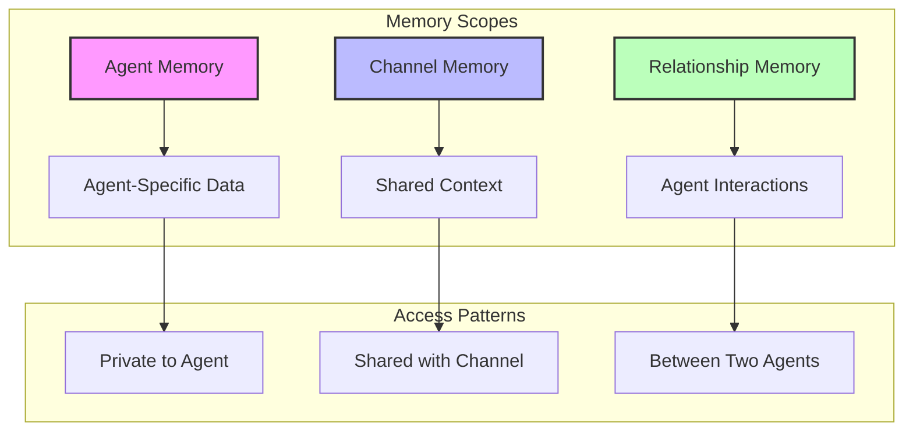

# Memory API Documentation

The Memory API provides persistent storage and retrieval of contextual information across three scopes: agent-specific, channel-shared, and agent-to-agent relationships.

## Overview

The Memory system enables:
- Persistent context storage across sessions
- Scoped access control (agent, channel, relationship)
- Flexible key-value storage with metadata
- Memory lifecycle management
- Pattern recognition and learning
- Real-time synchronization

## Memory Scopes

<div class="mermaid-fallback">



</div>

<iframe src="../diagram/architecture-memory-system.html" width="100%" height="550" style="border: none; border-radius: 10px; background: var(--bg-secondary);"></iframe>

## REST Endpoints

### Get Memory

**GET** `/api/memory/:scope/:targetId`

Retrieve memory entries for a specific scope and target.

**Parameters:**
- `scope` - Memory scope: `agent`, `channel`, or `relationship`
- `targetId` - ID of the target (agentId, channelId, or relationship pair)

**Query Parameters:**
- `key` - Specific key to retrieve (optional)
- `keys` - Comma-separated list of keys
- `tags` - Filter by tags
- `since` - Entries modified since date (ISO format)
- `limit` - Maximum entries to return

**Response:**
```json
{
    "success": true,
    "data": {
        "scope": "agent",
        "targetId": "agent-123",
        "entries": {
            "preferences": {
                "value": {
                    "theme": "dark",
                    "language": "en",
                    "notifications": true
                },
                "metadata": {
                    "createdAt": "2024-01-20T10:00:00Z",
                    "updatedAt": "2024-01-20T15:30:00Z",
                    "version": 3,
                    "tags": ["user-settings"]
                }
            },
            "conversation_history": {
                "value": [/* ... */],
                "metadata": {
                    "persistent": true,
                    "maxSize": 1000
                }
            }
        }
    }
}
```

### Create/Update Memory

**PUT** `/api/memory/:scope/:targetId/:key`

Create or update a memory entry.

**Request:**
```json
{
    "value": {
        "lastActivity": "research",
        "expertise": ["NLP", "computer vision"],
        "projectContext": {
            "name": "AI Assistant",
            "stage": "development"
        }
    },
    "metadata": {
        "persistent": true,
        "expiresAt": "2024-12-31T23:59:59Z",
        "tags": ["profile", "context"],
        "importance": "high"
    }
}
```

**Response:**
```json
{
    "success": true,
    "data": {
        "key": "agent_profile",
        "version": 1,
        "createdAt": "2024-01-20T10:00:00Z"
    }
}
```

### Delete Memory

**DELETE** `/api/memory/:scope/:targetId/:key`

Delete a specific memory entry.

**Response:**
```json
{
    "success": true,
    "data": {
        "deleted": true,
        "key": "temporary_data"
    }
}
```

### Bulk Operations

**POST** `/api/memory/bulk`

Perform multiple memory operations in a single request.

**Request:**
```json
{
    "operations": [
        {
            "action": "upsert",
            "scope": "agent",
            "targetId": "agent-123",
            "key": "skills",
            "value": ["python", "typescript"]
        },
        {
            "action": "delete",
            "scope": "channel",
            "targetId": "channel-456",
            "key": "old_context"
        },
        {
            "action": "upsert",
            "scope": "relationship",
            "targetId": "agent-123:agent-456",
            "key": "trust_level",
            "value": 0.85
        }
    ]
}
```

### Search Memory

**POST** `/api/memory/search`

Search across memory entries.

**Request:**
```json
{
    "query": "project deadline",
    "scopes": ["agent", "channel"],
    "filters": {
        "tags": ["project", "important"],
        "since": "2024-01-01T00:00:00Z",
        "importance": ["high", "critical"]
    },
    "limit": 20
}
```

## WebSocket Events

### Memory Retrieval

```javascript
// Get memory entries
socket.emit('memory:get', {
    scope: 'agent',
    targetId: 'agent-123',
    keys: ['preferences', 'state']
});

socket.on('memory:data', (data) => {
    console.log('Memory entries:', data.entries);
});

// Get all channel memory
socket.emit('memory:get', {
    scope: 'channel',
    targetId: 'channel-456'
});
```

### Memory Updates

```javascript
// Update single entry
socket.emit('memory:update', {
    scope: 'agent',
    targetId: 'agent-123',
    key: 'current_task',
    value: {
        taskId: 'task-789',
        status: 'in_progress',
        startedAt: new Date()
    },
    metadata: {
        temporary: true,
        ttl: 3600 // 1 hour
    }
});

// Confirmation event
socket.on('memory:update:result', (update) => {
    console.log(`Memory updated: ${update.key} (v${update.version})`);
});
```

### Memory Deletion

```javascript
// Delete specific key
socket.emit('memory:delete', {
    scope: 'channel',
    targetId: 'channel-456',
    key: 'outdated_info'
});

// Clear all agent memory
socket.emit('memory:clear', {
    scope: 'agent',
    targetId: 'agent-123',
    confirm: true
});

socket.on('memory:deleted', (result) => {
    console.log(`Deleted ${result.count} entries`);
});
```

### Bulk Operations

```javascript
// Bulk update
socket.emit('memory:bulk', {
    operations: [
        {
            action: 'upsert',
            scope: 'agent',
            targetId: 'agent-123',
            key: 'skill_python',
            value: { level: 'expert', years: 5 }
        },
        {
            action: 'upsert',
            scope: 'agent',
            targetId: 'agent-123',
            key: 'skill_javascript',
            value: { level: 'advanced', years: 3 }
        }
    ]
});

socket.on('memory:bulk:complete', (result) => {
    console.log(`Processed ${result.success} operations`);
    if (result.failures.length > 0) {
        console.error('Failed operations:', result.failures);
    }
});
```

### Memory Synchronization

```javascript
// Watch for memory changes
socket.emit('memory:watch', {
    scope: 'channel',
    targetId: 'channel-456',
    keys: ['shared_context', 'current_topic']
});

// Receive updates when watched memory changes
socket.on('memory:changed', (change) => {
    console.log(`Memory changed: ${change.key}`);
    console.log('New value:', change.value);
    console.log('Changed by:', change.agentId);
});

// Stop watching
socket.emit('memory:unwatch', {
    scope: 'channel',
    targetId: 'channel-456'
});
```

## Memory Types and Use Cases

### Agent Memory

Store agent-specific information:

```javascript
// Agent preferences
socket.emit('memory:update', {
    scope: 'agent',
    targetId: 'agent-123',
    key: 'preferences',
    value: {
        responseStyle: 'concise',
        expertiseAreas: ['backend', 'databases'],
        workingHours: { start: '09:00', end: '17:00' }
    }
});

// Agent state
socket.emit('memory:update', {
    scope: 'agent',
    targetId: 'agent-123',
    key: 'state',
    value: {
        currentProject: 'data-pipeline',
        activeTickets: ['TASK-123', 'TASK-456'],
        lastActive: new Date()
    }
});

// Learning patterns
socket.emit('memory:update', {
    scope: 'agent',
    targetId: 'agent-123',
    key: 'patterns',
    value: {
        commonQueries: ['status', 'help', 'analyze'],
        responsePatterns: {
            greeting: 0.8,
            technical: 0.9
        }
    }
});
```

### Channel Memory

Store shared context:

```javascript
// Channel context
socket.emit('memory:update', {
    scope: 'channel',
    targetId: 'channel-456',
    key: 'project_context',
    value: {
        name: 'E-commerce Platform',
        stage: 'MVP Development',
        deadline: '2024-06-30',
        teamSize: 5,
        techStack: ['Node.js', 'React', 'PostgreSQL']
    }
});

// Shared knowledge base
socket.emit('memory:update', {
    scope: 'channel',
    targetId: 'channel-456',
    key: 'knowledge_base',
    value: {
        apiEndpoints: {
            production: 'https://api.example.com',
            staging: 'https://staging-api.example.com'
        },
        documentation: 'https://docs.example.com',
        conventions: {
            codeStyle: 'prettier',
            commitFormat: 'conventional'
        }
    }
});

// Channel decisions
socket.emit('memory:update', {
    scope: 'channel',
    targetId: 'channel-456',
    key: 'decisions',
    value: [
        {
            date: '2024-01-15',
            decision: 'Use PostgreSQL for main database',
            rationale: 'Better performance for our use case',
            participants: ['agent-123', 'agent-456']
        }
    ]
});
```

### Relationship Memory

Store agent-to-agent context:

```javascript
// Trust and collaboration
socket.emit('memory:update', {
    scope: 'relationship',
    targetId: 'agent-123:agent-456',
    key: 'collaboration',
    value: {
        trustLevel: 0.9,
        successfulTasks: 15,
        totalInteractions: 20,
        specialties: {
            'agent-123': ['backend'],
            'agent-456': ['frontend']
        }
    }
});

// Communication preferences
socket.emit('memory:update', {
    scope: 'relationship',
    targetId: 'agent-123:agent-789',
    key: 'communication',
    value: {
        preferredChannel: 'direct',
        responseTime: 'immediate',
        style: 'technical'
    }
});
```

## Advanced Features

### Memory Versioning

```javascript
// Get version history
socket.emit('memory:versions', {
    scope: 'channel',
    targetId: 'channel-456',
    key: 'project_requirements',
    limit: 10
});

socket.on('memory:versions:response', (versions) => {
    versions.forEach(v => {
        console.log(`Version ${v.version}: ${v.updatedAt}`);
        console.log('Changes:', v.diff);
    });
});

// Restore previous version
socket.emit('memory:restore', {
    scope: 'channel',
    targetId: 'channel-456',
    key: 'project_requirements',
    version: 3
});
```

### Memory Analytics

```javascript
// Get memory usage statistics
socket.emit('memory:stats', {
    scope: 'agent',
    targetId: 'agent-123'
});

socket.on('memory:stats:response', (stats) => {
    console.log('Total entries:', stats.entryCount);
    console.log('Storage used:', stats.storageBytes);
    console.log('Most accessed:', stats.topKeys);
    console.log('Last modified:', stats.lastModified);
});
```

### Memory Templates

```javascript
// Create from template
socket.emit('memory:template:apply', {
    templateId: 'research_agent_defaults',
    scope: 'agent',
    targetId: 'agent-new',
    overrides: {
        name: 'Research Bot 2'
    }
});

// Save as template
socket.emit('memory:template:create', {
    name: 'project_template',
    description: 'Standard project setup',
    fromScope: 'channel',
    fromTarget: 'channel-456',
    keys: ['project_context', 'knowledge_base']
});
```

### Memory Policies

```javascript
// Set retention policy
socket.emit('memory:policy:set', {
    scope: 'channel',
    targetId: 'channel-456',
    policies: [
        {
            keyPattern: 'temp_*',
            retention: '24h'
        },
        {
            keyPattern: 'log_*',
            retention: '7d',
            maxEntries: 1000
        },
        {
            keyPattern: 'context_*',
            retention: 'permanent',
            backup: true
        }
    ]
});
```

## Memory Metadata

### Standard Metadata Fields

```typescript
interface MemoryMetadata {
    // Lifecycle
    createdAt: Date;
    updatedAt: Date;
    expiresAt?: Date;
    version: number;
    
    // Organization
    tags?: string[];
    category?: string;
    importance?: 'low' | 'normal' | 'high' | 'critical';
    
    // Access control
    readOnly?: boolean;
    private?: boolean;
    sharedWith?: string[];
    
    // Storage
    persistent?: boolean;
    compressed?: boolean;
    encrypted?: boolean;
    maxSize?: number;
    
    // Tracking
    accessCount?: number;
    lastAccessedAt?: Date;
    lastAccessedBy?: string;
}
```

### Custom Metadata

```javascript
socket.emit('memory:update', {
    scope: 'agent',
    targetId: 'agent-123',
    key: 'ml_model_state',
    value: modelWeights,
    metadata: {
        // Standard fields
        tags: ['ml', 'model'],
        importance: 'high',
        
        // Custom fields
        modelVersion: '2.1.0',
        trainingEpochs: 100,
        accuracy: 0.95,
        lastTrainingDate: '2024-01-15',
        datasetVersion: 'v3'
    }
});
```

## Error Handling

### Common Errors

```javascript
socket.on('memory:error', (error) => {
    switch (error.code) {
        case 'MEMORY_NOT_FOUND':
            console.error('Memory key not found');
            break;
        case 'ACCESS_DENIED':
            console.error('No access to memory scope');
            break;
        case 'QUOTA_EXCEEDED':
            console.error('Memory quota exceeded');
            break;
        case 'INVALID_SCOPE':
            console.error('Invalid memory scope');
            break;
        case 'VERSION_CONFLICT':
            console.error('Concurrent update conflict');
            handleVersionConflict(error);
            break;
    }
});

function handleVersionConflict(error) {
    // Get latest version
    socket.emit('memory:get', {
        scope: error.scope,
        targetId: error.targetId,
        key: error.key
    });
    
    socket.once('memory:data', (data) => {
        // Merge changes and retry
        const merged = mergeChanges(
            error.attemptedValue,
            data.entries[error.key].value
        );
        
        socket.emit('memory:update', {
            scope: error.scope,
            targetId: error.targetId,
            key: error.key,
            value: merged,
            expectedVersion: data.entries[error.key].metadata.version
        });
    });
}
```

## Best Practices

### 1. Scope Selection

```javascript
// Use agent scope for private data
const privateData = {
    apiKeys: '...',
    personalNotes: '...'
};

// Use channel scope for shared context
const sharedContext = {
    projectGoals: '...',
    teamDecisions: '...'
};

// Use relationship scope for collaboration
const collaboration = {
    workDivision: '...',
    communicationStyle: '...'
};
```

### 2. Key Naming Conventions

```javascript
// Use descriptive, hierarchical keys
'user:preferences'
'project:backend:config'
'context:current:topic'
'history:conversations:2024-01'

// Avoid generic keys
'data'  // Bad
'temp'  // Bad
'config' // Bad - too generic
```

### 3. Memory Lifecycle

```javascript
// Set appropriate TTL for temporary data
socket.emit('memory:update', {
    key: 'session_data',
    value: { /* ... */ },
    metadata: {
        ttl: 3600, // 1 hour
        temporary: true
    }
});

// Mark important data as persistent
socket.emit('memory:update', {
    key: 'core_configuration',
    value: { /* ... */ },
    metadata: {
        persistent: true,
        importance: 'critical'
    }
});
```

### 4. Batch Operations

```javascript
// Group related updates
const updates = relatedData.map(item => ({
    action: 'upsert',
    scope: 'agent',
    targetId: 'agent-123',
    key: `skill:${item.name}`,
    value: item.data
}));

socket.emit('memory:bulk', { operations: updates });
```

### 5. Memory Hygiene

```javascript
// Regular cleanup
async function cleanupMemory() {
    // Remove expired entries
    socket.emit('memory:cleanup', {
        scope: 'agent',
        targetId: 'agent-123',
        removeExpired: true
    });
    
    // Archive old data
    socket.emit('memory:archive', {
        scope: 'channel',
        targetId: 'channel-456',
        olderThan: '30d',
        destination: 'cold_storage'
    });
}

// Schedule regular cleanup
setInterval(cleanupMemory, 24 * 60 * 60 * 1000); // Daily
```

## Examples

### Conversational Agent Memory

```javascript
// Store conversation context
class ConversationMemory {
    constructor(agentId, channelId) {
        this.agentId = agentId;
        this.channelId = channelId;
    }
    
    async addMessage(message) {
        // Add to conversation history
        const history = await this.getHistory();
        history.push({
            timestamp: new Date(),
            from: message.from,
            content: message.content,
            sentiment: await analyzeSentiment(message.content)
        });
        
        // Keep last 100 messages
        if (history.length > 100) {
            history.shift();
        }
        
        socket.emit('memory:update', {
            scope: 'channel',
            targetId: this.channelId,
            key: 'conversation_history',
            value: history
        });
        
        // Update conversation summary
        if (history.length % 10 === 0) {
            const summary = await summarizeConversation(history);
            socket.emit('memory:update', {
                scope: 'channel',
                targetId: this.channelId,
                key: 'conversation_summary',
                value: summary
            });
        }
    }
    
    async getHistory() {
        return new Promise((resolve) => {
            socket.emit('memory:get', {
                scope: 'channel',
                targetId: this.channelId,
                key: 'conversation_history'
            });
            
            socket.once('memory:data', (data) => {
                resolve(data.entries.conversation_history?.value || []);
            });
        });
    }
}
```

### Project Context Manager

```javascript
class ProjectContextManager {
    constructor(channelId) {
        this.channelId = channelId;
    }
    
    async updateProjectStage(newStage) {
        // Get current context
        const context = await this.getContext();
        
        // Record stage transition
        context.stageHistory = context.stageHistory || [];
        context.stageHistory.push({
            from: context.currentStage,
            to: newStage,
            timestamp: new Date(),
            updatedBy: this.agentId
        });
        
        context.currentStage = newStage;
        
        // Update memory
        socket.emit('memory:update', {
            scope: 'channel',
            targetId: this.channelId,
            key: 'project_context',
            value: context,
            metadata: {
                importance: 'high',
                tags: ['project', 'milestone']
            }
        });
        
        // Notify channel
        socket.emit('message:send', {
            channelId: this.channelId,
            content: `Project stage updated to: ${newStage}`,
            metadata: { type: 'announcement' }
        });
    }
}
```

## Next Steps

- Review [WebSocket Events](websocket.md) for real-time memory sync
- See [SDK Documentation](../sdk/index.md) for client implementation
- Explore [Control Loop API](control-loop.md) for pattern memory
- Check [Examples](../sdk/examples.md) for practical use cases