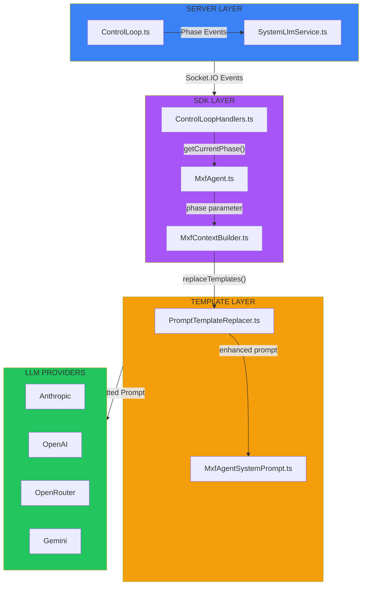

# Prompt Assembly Pipeline

## Overview

The MXF Prompt Assembly Pipeline is a multi-layered system that constructs context-aware prompts for LLM agents. It enables dynamic template replacement, ORPAR phase awareness, and provider-specific formatting.

## Architecture

<div class="mermaid-fallback">



</div>

<iframe src="../diagram/prompt-assembly.html" width="100%" height="800" style="border: none; border-radius: 10px; background: var(--bg-secondary);"></iframe>

## ORPAR Phase Awareness

The system tracks the current ORPAR cognitive phase and injects it into agent prompts, enabling phase-specific behavioral guidance.

### Phase Flow

```
IDLE → RUNNING → OBSERVING → REASONING → PLANNING → EXECUTING → REFLECTING → (loop)
```

### Server Layer

**ControlLoop.ts** (`src/server/socket/implementations/ControlLoop.ts`)

Manages the ORPAR cognitive cycle state machine and emits events on each phase transition:

| Phase | Events Emitted |
|-------|----------------|
| OBSERVING | `OBSERVATION` |
| REASONING | `REASONING`, `TOPICS_EXTRACT`, `SUMMARY_GENERATE` |
| PLANNING | `PLAN` |
| EXECUTING | `EXECUTION`, `ACTION` |
| REFLECTING | `REFLECTION` |

**SystemLlmService.ts** (`src/server/socket/services/SystemLlmService.ts`)

Additionally emits SystemEvents with `orparPhase` metadata:

- `PRE_REASONING_HINT` - Before reasoning phase
- `POST_ACTION_ANALYSIS` - After action phase
- `COORDINATION_OPPORTUNITY` - Coordination hints
- `PATTERN_RECOGNITION` - Pattern insights

```typescript
// Payload structure
{
  eventData: {
    metadata: {
      orparPhase: 'observation' | 'reasoning' | 'planning' | 'action' | 'reflection'
    }
  }
}
```

### SDK Layer

**ControlLoopHandlers.ts** (`src/sdk/handlers/ControlLoopHandlers.ts`)

Tracks current phase and subscribes to server events:

```typescript
// Properties
currentPhase: OrparPhase = 'Observe' | 'Reason' | 'Plan' | 'Act' | 'Reflect' | null
activeControlLoopId: string | null

// Public Methods
getCurrentPhase(): OrparPhase     // Returns current phase for prompt injection
setCurrentPhase(phase): void      // Allows external phase control
```

**Event Subscriptions:**

| Control Loop Events | Handler | Phase Set |
|---------------------|---------|-----------|
| `ControlLoop.OBSERVATION` | `handleObservationEvent()` | `'Observe'` |
| `ControlLoop.REASONING` | `handleReasoningEvent()` | `'Reason'` |
| `ControlLoop.PLAN` | `handlePlanEvent()` | `'Plan'` |
| `ControlLoop.ACTION` | `handleActionEvent()` | `'Act'` |
| `ControlLoop.REFLECTION` | `handleReflectionEvent()` | `'Reflect'` |

**Phase Name Mapping:**

| Server Phase | SDK Phase |
|--------------|-----------|
| `'observation'` | `'Observe'` |
| `'reasoning'` | `'Reason'` |
| `'planning'` | `'Plan'` |
| `'action'` | `'Act'` |
| `'reflection'` | `'Reflect'` |

**MxfAgent.ts** (`src/sdk/MxfAgent.ts`)

Gets current phase and passes to context builder:

```typescript
// In sendMessage() / processResponse()
const currentOrparPhase = this.controlLoopHandlers?.getCurrentPhase() || null;

const agentContext = await this.contextBuilder.buildContext(
    systemPrompt,
    this.modelConfig,
    conversationHistory,
    taskContext,
    toolsToSend,
    this.config.channelId,
    this.mxfService.getChannelConfig(),
    this.mxfService.getActiveAgents(),
    currentOrparPhase  // Phase passed here
);
```

**MxfContextBuilder.ts** (`src/sdk/services/MxfContextBuilder.ts`)

Accepts phase parameter and injects into template context:

```typescript
buildContext(..., currentOrparPhase?: OrparPhase): Promise<AgentContext> {
    const enhancedSystemPrompt = PromptTemplateReplacer.replaceTemplates(systemPrompt, {
        agentId: agentConfig.agentId,
        channelId,
        llmProvider: agentConfig.llmProvider,
        systemLlmEnabled: channelConfig?.systemLlmEnabled,
        currentOrparPhase: currentOrparPhase || null,  // Phase injected here
        currentTaskId: currentTask?.taskId,
        // ...
    });
}
```

## Template Replacement

**PromptTemplateReplacer.ts** (`src/shared/utils/PromptTemplateReplacer.ts`)

### Available Templates

| Template | Description |
|----------|-------------|
| `{{CURRENT_ORPAR_PHASE}}` | Current phase name or "(Not in active cycle)" |
| `{{CURRENT_ORPAR_PHASE_GUIDANCE}}` | Phase-specific behavioral guidance |
| `{{DATE_TIME}}` | Current date and time |
| `{{TIME_ZONE}}` | Current timezone |
| `{{AGENT_ID}}` | Agent identifier |
| `{{CHANNEL_ID}}` | Channel identifier |
| `{{LLM_PROVIDER}}` | LLM provider name |
| `{{LLM_MODEL}}` | LLM model name |
| `{{SYSTEM_LLM_STATUS}}` | SystemLLM enabled/disabled |
| `{{CURRENT_TASK_ID}}` | Current task ID |
| `{{CURRENT_TASK_TITLE}}` | Current task title |
| `{{CURRENT_TASK_STATUS}}` | Current task status |
| `{{CURRENT_TASK_PROGRESS}}` | Task progress percentage |

### Phase-Specific Guidance

| Phase | Behavioral Guidance |
|-------|---------------------|
| `'Observe'` | Focus on gathering information and context. Use discovery and read tools. Do not take actions yet. |
| `'Reason'` | Analyze the observations. Consider multiple perspectives. Identify patterns and insights. |
| `'Plan'` | Create a strategic plan based on your reasoning. Define clear steps and priorities. |
| `'Act'` | Execute your plan. Use appropriate tools to accomplish each step. |
| `'Reflect'` | Evaluate the outcomes. Extract learnings. Store insights for future reference. |
| `null` | Phase: "(Not in active cycle)", Guidance: "" (empty) |

## System Prompt Output

**MxfAgentSystemPrompt.ts** (`src/shared/prompts/MxfAgentSystemPrompt.ts`)

The `buildOrparGuidelines()` method generates prompts using templates:

**Before Template Replacement:**
```markdown
## MXF Operational Guidelines

**Current ORPAR Phase: {{CURRENT_ORPAR_PHASE}}**
{{CURRENT_ORPAR_PHASE_GUIDANCE}}

**Follow ORPAR Cognitive Cycles:**
- **Observe**: Gather information, submit observations via controlLoop_observe
- **Reason**: Analyze data, consider multiple perspectives (SystemLLM assists)
- **Act**: Execute specific actions using controlLoop_execute and other tools
- **Plan**: Strategize next steps, coordinate with other agents
- **Reflect**: Learn from outcomes, store insights in memory
```

**After Template Replacement (phase = 'Observe'):**
```markdown
## MXF Operational Guidelines

**Current ORPAR Phase: Observe**
Focus on gathering information and context. Use discovery and read tools.
Do not take actions yet.

**Follow ORPAR Cognitive Cycles:**
...
```

**After Template Replacement (phase = null):**
```markdown
## MXF Operational Guidelines

**Current ORPAR Phase: (Not in active cycle)**

**Follow ORPAR Cognitive Cycles:**
...
```

## LLM Provider Layer

Different providers handle system prompts differently:

| Provider | System Prompt Handling |
|----------|------------------------|
| **Anthropic** | Passed via separate `system` parameter |
| **OpenAI** | First message in array with `role: 'system'` |
| **OpenRouter** | First message in array |
| **Gemini** | System instruction parameter |

All providers receive the phase-aware system prompt with:
- Current phase clearly indicated
- Phase-specific behavioral guidance
- ORPAR cycle reference for context

## Message Layering Order

The `MxfStructuredPromptBuilder` assembles messages in this order:

1. **System Prompt** - Framework rules and operational guidelines
2. **Agent Identity** - Agent configuration and capabilities
3. **Recent Actions** - Last 10 actions for context
4. **SystemLLM Insight** - Coordination hints (if present)
5. **Meilisearch Notice** - Trimmed history notice (if applicable)
6. **Conversation History** - Dialogue messages with tool calls
7. **Task Prompt** - Current task (after conversation for chronological order)
8. **Current Message** - New incoming message requiring response

## Event-Based Architecture

The same phase events can be consumed by multiple systems:

```
                ┌──────────────┐
                │ Phase Events │
                │ from Server  │
                └──────┬───────┘
                       │
    ┌──────────┬───────┼───────┬──────────┬──────────┐
    ▼          ▼       ▼       ▼          ▼          ▼
┌──────┐  ┌──────┐ ┌────────┐ ┌─────────┐ ┌──────────┐
│ SDK  │  │ Dash │ │Analytics│ │   ML    │ │ External │
│Prompt│  │board │ │ Service │ │Pipeline │ │  Tools   │
└──────┘  └──────┘ └────────┘ └─────────┘ └──────────┘
```

Future extensions can subscribe to the same events without modifying core code.

## File Reference

### Server Files
- `src/server/socket/implementations/ControlLoop.ts` - Emits phase events
- `src/server/socket/services/SystemLlmService.ts` - Emits SystemEvents
- `src/shared/events/event-definitions/SystemEvents.ts` - Event definitions

### SDK Files
- `src/sdk/handlers/ControlLoopHandlers.ts` - Phase tracking + handlers
- `src/sdk/MxfAgent.ts` - Passes phase to context
- `src/sdk/services/MxfContextBuilder.ts` - Accepts phase parameter
- `src/sdk/services/MxfStructuredPromptBuilder.ts` - Message layering

### Shared Files
- `src/shared/utils/PromptTemplateReplacer.ts` - Template definitions
- `src/shared/prompts/MxfAgentSystemPrompt.ts` - Uses templates

## See Also

- [Control Loop Documentation](control-loop.md)
- [ORPAR Cognitive Cycles](../mxf/orpar.md)
- [SDK Documentation](../sdk/index.md)
- [System Prompt Examples](../sdk/system-prompt-example.md)
