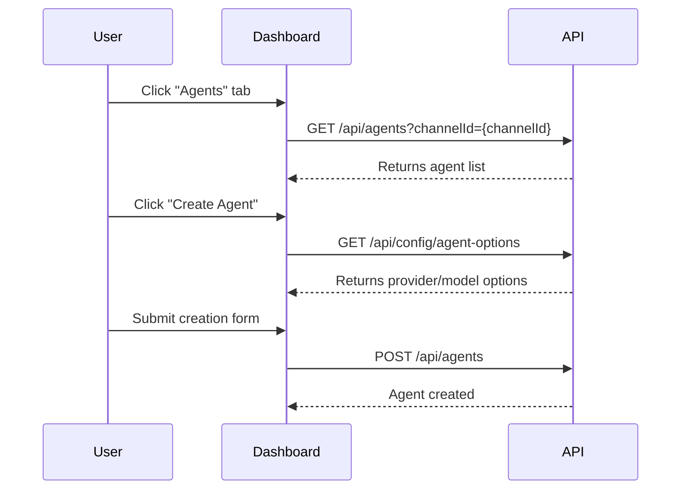

# Agents Tab

The Agents tab lets you view, create, configure, and manage AI agents for your channels.

Key features:
- List all agents for the selected channel, filter by status and service type.
- Create new agents with comprehensive configuration (LLM provider, system prompt, capabilities, network settings).
- Generate, rotate, and revoke agent authentication keys.
- Manage agent lifecycle actions (pause, resume, restart, shutdown) and view metrics.

For detailed API reference, see: [Agents API](../api/agents.md)
