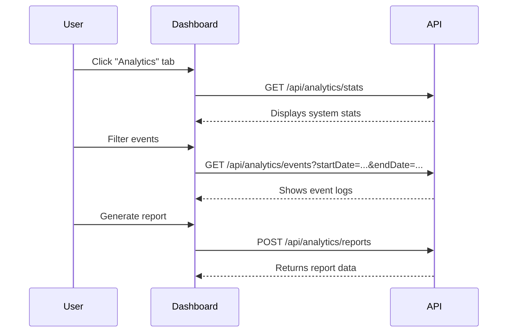

# Analytics Tab

The Analytics tab presents system and channel-specific metrics, logs, and reports.

Key features:
- View overall system statistics (user counts, channel counts, uptime).
- Inspect event logs with filters (date range, event type, limit).
- Monitor performance metrics (latency, throughput, CPU/memory usage).
- Analyze agent, channel, and task-specific analytics.
- Generate and retrieve custom reports.

For detailed API reference, see: [Analytics API](../api/analytics.md)

**📊 For comprehensive analytics documentation, see the [Analytics & Metrics Guide](../analytics/index.md) which covers task effectiveness, validation analytics, performance optimization, and available MCP tools for agents.**
