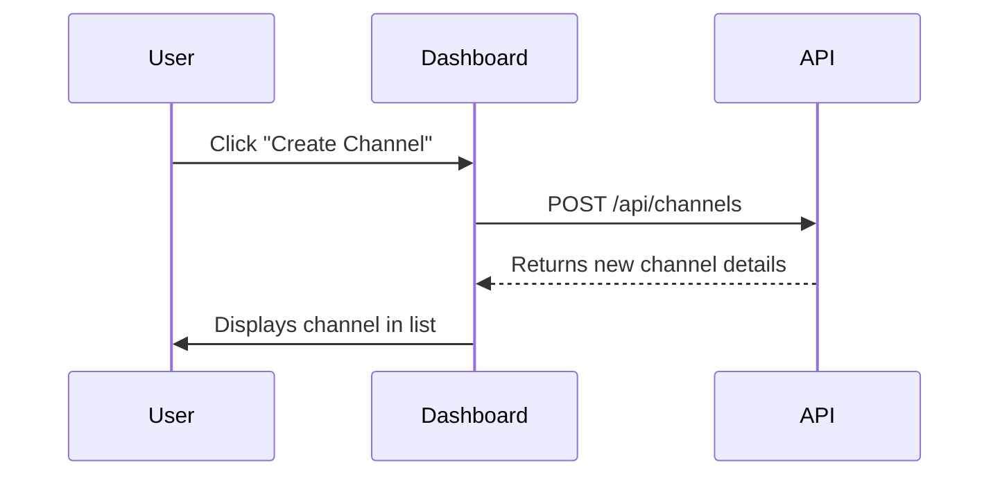

# Channels Tab

The Channels tab allows you to create, view, and manage communication channels within MXF.

Key features:
- List all existing channels.
- Create new channels with name, description, and auto-generated ID.
- Edit or delete channels you own.
- Navigate to channel-specific tabs (Memory, Context, Agents, Tasks, Analytics).

For detailed API reference, see: [Channels API](../api/channels.md)
