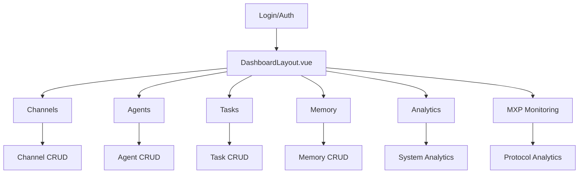
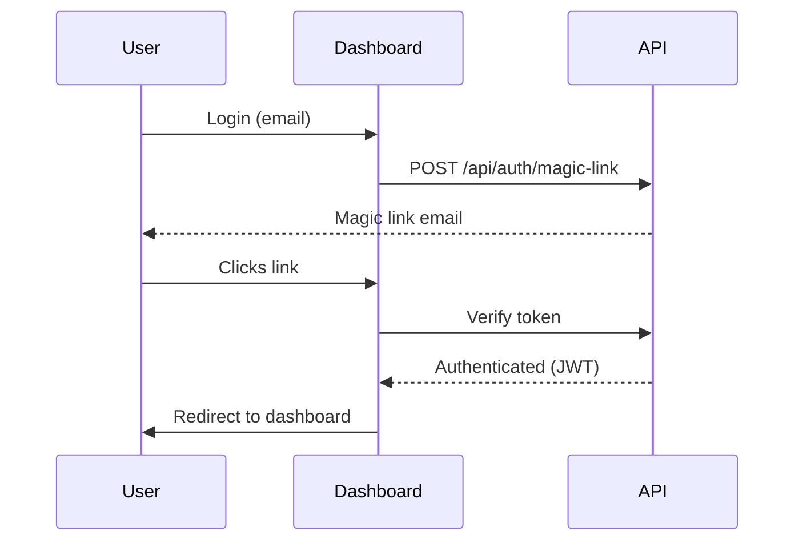

# MXF Dashboard Documentation

> ⚠️ **Status: In Development** - The MXF Dashboard is currently under active development. Some features may be incomplete or subject to change.

The MXF Dashboard is a modern web application built with Vue 3, Vuetify, TypeScript, and Pinia. It provides a user-friendly interface for managing channels, agents, tasks, memory, and analytics in the Model Exchange Framework.

## Overview

- **Frontend Stack:** Vue 3, Vuetify 3, TypeScript, Pinia
- **Dev Server Port:** 3002 (proxies API on 3001)
- **Authentication:** JWT-based, magic link support, localStorage persistence
- **Features:**
    - Channel management (CRUD)
    - Agent management (CRUD, config, key management)
    - Task management (CRUD, assignment, analytics)
    - Memory/context management
    - Real analytics dashboard
    - MXP protocol monitoring and analytics
    - User profile and authentication flows
    - Responsive navigation and protected routes

## Dashboard Tabs

- [Channels](channels.md): Create, edit, and navigate channels.
- [Agents](agents.md): Configure and manage AI agents.
- [Tasks](tasks.md): Task creation, assignment, and tracking.
- [Memory](memory.md): Contextual memory and data entries.
- [Analytics](analytics.md): System and channel metrics, logs, and reports.
- [MXP Monitoring](mxp-monitoring.md): Model Exchange Protocol performance and analytics.

## Architecture Diagram



## Main Components

- **DashboardLayout.vue:** Main shell, navigation, and route outlet
- **Channels.vue:** Channel list, creation, and navigation
- **Agents.vue:** Agent list, creation, and configuration
- **Tasks.vue:** Task dashboard, creation, assignment, and analytics
- **Memory.vue:** Channel memory and context management
- **Analytics.vue:** System and channel analytics
- **MXP Monitoring:** Model Exchange Protocol performance dashboards and real-time monitoring

## State Management

- **Pinia stores:** `auth`, `channels`, `agents`, `tasks`, `memory`
- All API calls use Axios with interceptors for auth
- Channel/agent/task data is always scoped to the current channel

## Developer Guide

- **Run Dashboard:**
    ```bash
    cd dashboard
    pnpm install
    pnpm dev
    ```
- **Dev server:** http://localhost:3002 (auto-proxies API)
- **Main entry:** `dashboard/src/App.vue`
- **Router:** `dashboard/src/router/index.ts`
- **State:** `dashboard/src/stores/`
- **API config:** `dashboard/src/plugins/axios.ts`

## Customization & Extending

- Add new tabs by editing `DashboardLayout.vue` and router
- Add new store modules in `stores/`
- Add new API endpoints in backend and call via Axios
- Use Vuetify components for consistent UI

## Authentication Flow



## Useful Links

- [Vue 3 Docs](https://vuejs.org/)
- [Vuetify Docs](https://vuetifyjs.com/)
- [Pinia Docs](https://pinia.vuejs.org/)

---

For more details, see other sections in the MXF documentation.
