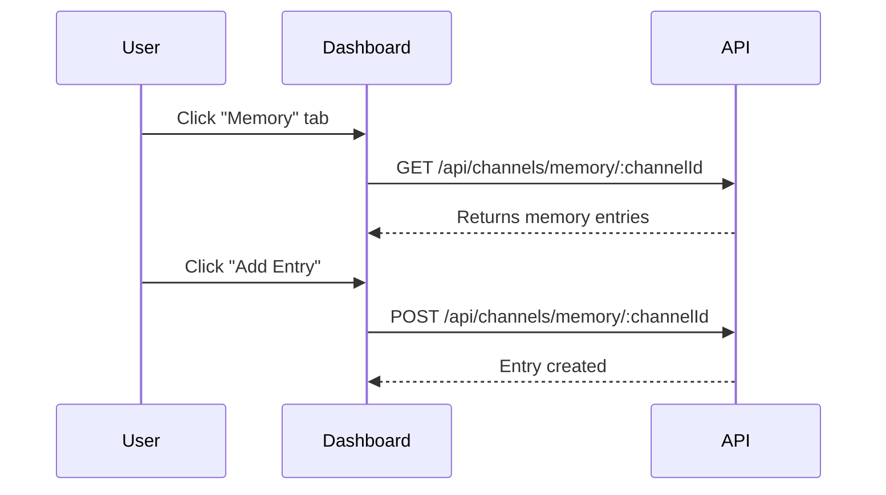

# Memory Tab

The Memory tab enables you to view, create, update, and delete contextual memory entries for a channel.

Key features:
- List all memory entries (notes, shared state, conversation history, custom data).
- Add new memory entries with tags and importance levels.
- Edit or delete existing entries.
- Export all memory/context to JSON or CSV.

For detailed API reference, see: [Channels API – Memory](../api/channels.md#memory-endpoints)
