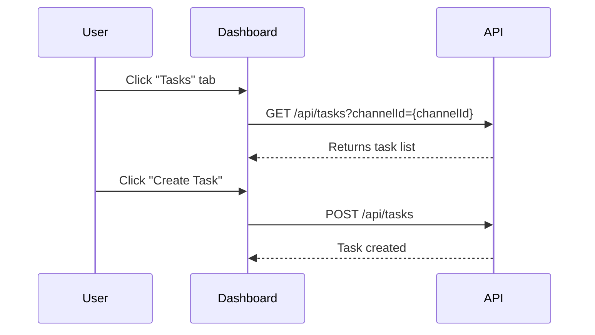

# Tasks Tab

The Tasks tab provides comprehensive task management for the selected channel.

Key features:
- List and filter tasks by status, priority, and assignee.
- Create, edit, and delete tasks.
- Assign tasks manually or use intelligent assignment.
- View workload analytics and task completion stats.
- Advanced filtering, sorting, and progress tracking.

For detailed API reference, see: [Tasks API](../api/tasks.md)
