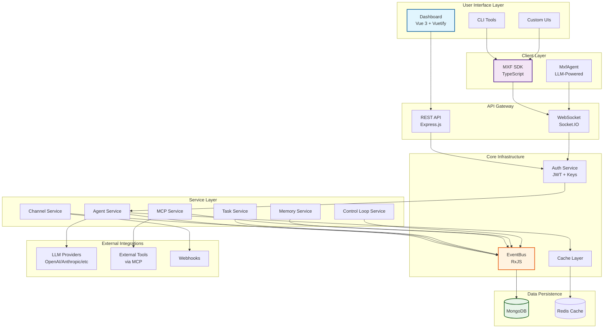
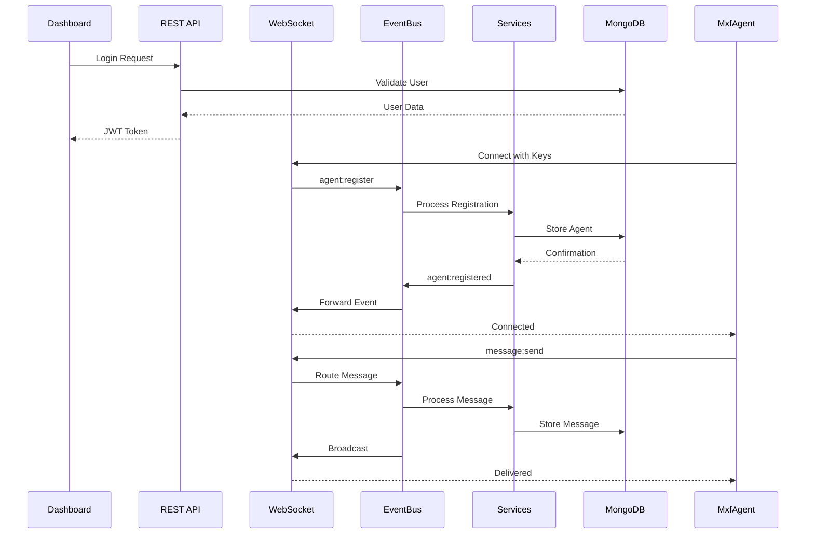
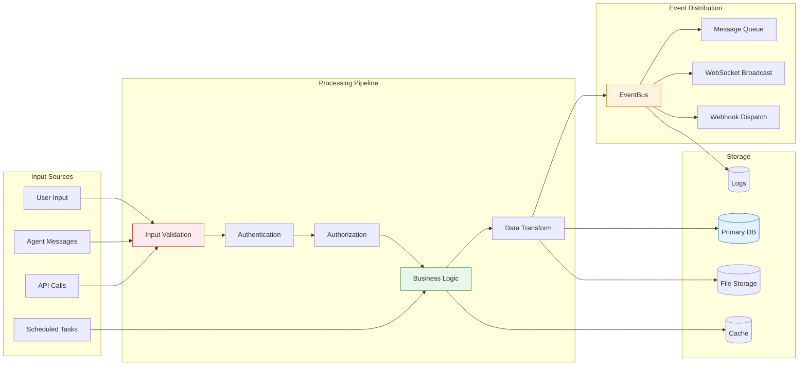
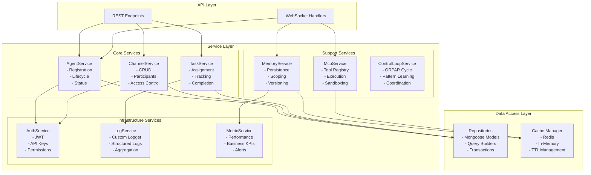
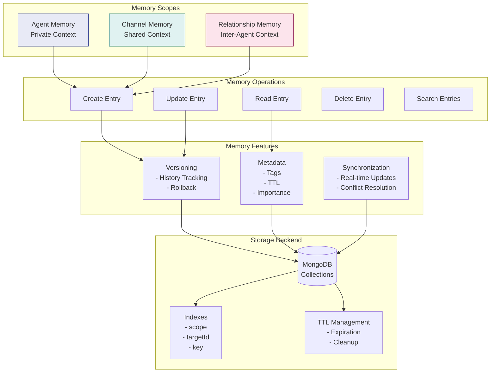
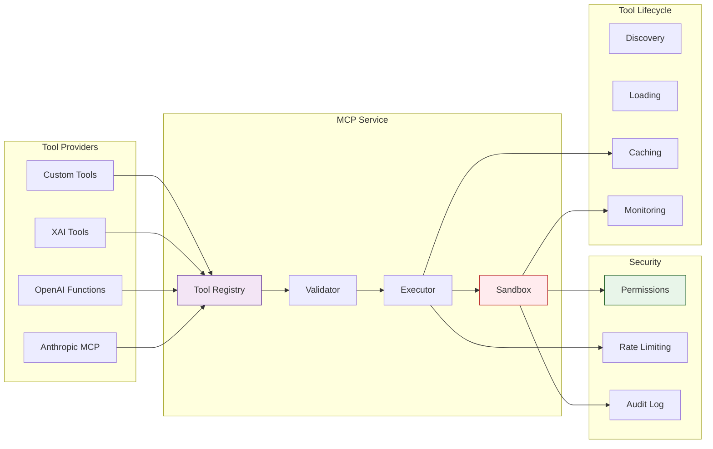
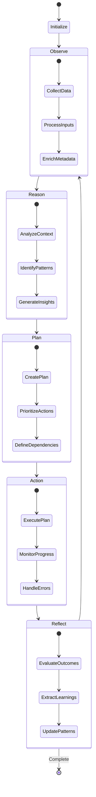
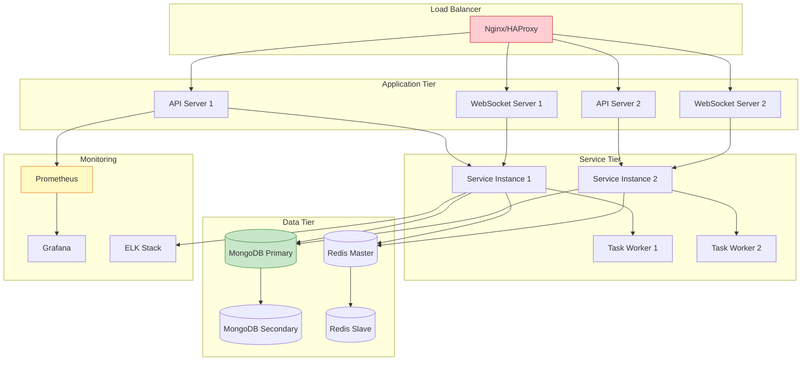
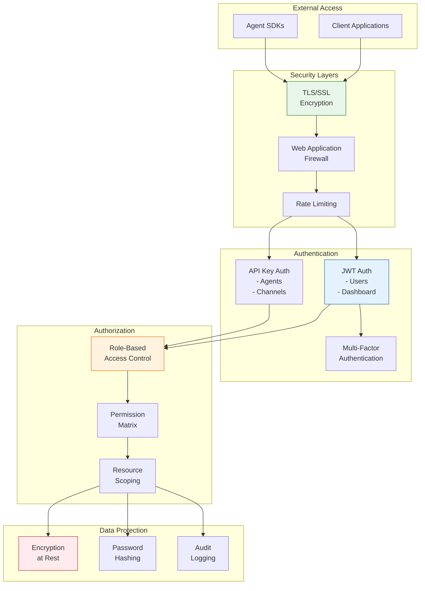

# Architecture Diagrams

This section provides comprehensive visual representations of the MXF architecture at different levels of abstraction.

## High-Level System Architecture

## Component Communication Flow

## Data Flow Architecture

## Service Layer Architecture

## Memory System Architecture

## MCP Tool Integration Architecture

## Control Loop (ORPAR) Architecture

## Deployment Architecture

## Security Architecture

## Performance Optimization Architecture

```mermaid
graph LR
    subgraph "Frontend Optimizations"
        CDN[CDN<br/>Static Assets]
        LAZY[Lazy Loading<br/>Components]
        CACHE_FE[Browser<br/>Caching]
    end

    subgraph "API Optimizations"
        POOL[Connection<br/>Pooling]
        BATCH[Request<br/>Batching]
        COMPRESS[Response<br/>Compression]
    end

    subgraph "Database Optimizations"
        INDEX[Query<br/>Indexing]
        SHARD[Data<br/>Sharding]
        REPLICA[Read<br/>Replicas]
    end

    subgraph "Caching Strategy"
        MEM[In-Memory<br/>Cache]
        REDIS_C[Redis<br/>Cache]
        QUERY[Query Result<br/>Cache]
    end

    CDN --> LAZY
    LAZY --> CACHE_FE

    CACHE_FE --> POOL
    POOL --> BATCH
    BATCH --> COMPRESS

    COMPRESS --> MEM
    MEM --> REDIS_C
    REDIS_C --> QUERY

    QUERY --> INDEX
    INDEX --> SHARD
    SHARD --> REPLICA

    style CDN fill:#e1f5fe,stroke:#01579b
    style MEM fill:#fff3e0,stroke:#e65100
    style INDEX fill:#e8f5e9,stroke:#1b5e20
```

---

## Next Steps

1. Understand [Key Concepts](key-concepts.md) that drive the architecture
2. Learn about [Data Flow](data-flow.md) patterns in detail
3. Explore [System Overview](system-overview.md) for component details
4. Review [Security](security.md) architecture implementation
5. Check [Development Lifecycle](development-lifecycle.md) for best practices