# Code Execution Service

## Overview

The **CodeExecutionSandboxService** enables agents to execute JavaScript and TypeScript code in secure, isolated Docker containers with the Bun runtime. This feature reduces multi-step workflow latency by eliminating model round-trips for data transformations, calculations, and complex control flow operations.

## Architecture

### Sandbox Isolation

Code execution uses **Docker containers** with **Bun runtime** for complete isolation:

```mermaid
flowchart TB
    subgraph Request["📥 Agent Code Request"]
        A[Code to Execute]
    end

    subgraph Validation["🔒 ProactiveValidationService"]
        B[BLOCKING - validation required]
    end

    subgraph Security["🛡️ CodeExecutionSandboxService"]
        C1[Pattern Detection]
        C2[Security Validation]
        C3[Resource Monitoring]
    end

    subgraph Sandbox["🔐 Docker Container (Bun)"]
        D1["❌ No network (NetworkMode: none)"]
        D2["❌ Read-only root filesystem"]
        D3["❌ All capabilities dropped"]
        D4["❌ Non-root user (UID 1000)"]
        D5["✅ Safe built-ins only"]
    end

    subgraph Persistence["💾 Result + Persistence"]
        E1[MongoDB audit trail]
        E2[Event emission]
        E3[Pattern learning]
    end

    Request --> Validation
    Validation --> Security
    Security --> Sandbox
    Sandbox --> Persistence

    style Request fill:#3b82f6
    style Validation fill:#f59e0b
    style Security fill:#a855f7
    style Sandbox fill:#ef4444
    style Persistence fill:#22c55e
```

<div class="mermaid-fallback">



</div>

<iframe src="../diagram/sandbox-isolation.html" width="100%" height="620" style="border: none; border-radius: 10px; background: var(--bg-secondary);"></iframe>

### Security Layers

**1. Pre-Execution Validation (BLOCKING)**
- Execution blocked until ProactiveValidationService approves
- High security impact rating (0.9/1.0)
- Risk-based validation with parameter checking

**2. Pattern Detection**
- Regex patterns for known threats
- Heuristic loop detection
- Blocks dangerous patterns before container execution

**3. Docker Container Isolation**
- Bun runtime in isolated container
- No network access (NetworkMode: none)
- Read-only root filesystem
- All Linux capabilities dropped
- Non-root user (UID 1000)
- tmpfs /tmp with noexec, nosuid

**4. Resource Limits**
- Memory: 128MB (no swap)
- CPU: 0.5 cores
- PIDs: 64 processes max
- File handles: 64 max
- Configurable timeout (default 5s, max 30s)

**5. Audit Trail**
- Complete execution history in MongoDB
- Real-time event emission
- TTL cleanup after 30 days

## Dangerous Patterns Blocked

The sandbox automatically blocks code containing:

```javascript
// ❌ Dynamic code execution
eval("code")
Function("code")

// ❌ Module loading
require("module")
import module from "module"

// ❌ Process manipulation
process.exit()
process.kill()
child_process

// ❌ Bun-specific APIs (blocked in container)
Bun.spawn()
Bun.spawnSync()
Bun.file()
Bun.write()

// ❌ Prototype pollution
obj.__proto__ = {}
constructor[...]
```

**Note:** File system and network access are blocked at the Docker container level even if not caught by pattern detection.

## Safe Operations

```javascript
// ✅ Math operations
Math.sqrt(144)
Math.max(1, 2, 3)

// ✅ Array/Object manipulation
[1,2,3].map(x => x * 2)
Object.keys(obj)

// ✅ Date operations
new Date()
Date.now()

// ✅ JSON operations
JSON.parse(str)
JSON.stringify(obj)

// ✅ String operations
"hello".toUpperCase()

// ✅ Timers
setTimeout(() => {}, 1000)
setInterval(() => {}, 1000)

// ✅ Console output
console.log("message")
console.error("error")
```

## Resource Management

### Timeout Configuration

```typescript
// Default timeout: 5000ms
await sandbox.executeJavaScript(code, context);

// Custom timeout
await sandbox.executeJavaScript(code, context, {
    timeout: 10000  // 10 seconds
});

// Maximum: 30000ms (30 seconds)
```

### Memory Monitoring

The sandbox tracks memory usage during execution:

```typescript
const result = await sandbox.executeJavaScript(code, context);

console.log(result.resourceUsage);
// { memory: 12.5, timeout: false }  // MB
```

## TypeScript Support

TypeScript execution via Bun's native transpiler (no separate transpilation step):

```typescript
const result = await sandbox.executeTypeScript(`
    interface User {
        name: string;
        age: number;
    }

    const user: User = { name: 'Alice', age: 30 };
    return user.age;
`, context);
```

**Bun TypeScript Support:**
- Bun natively handles TypeScript without transpilation overhead
- Interfaces, type annotations, and enums work out of the box
- Faster execution compared to traditional transpile-then-run

**Limitations:**
- Some advanced TypeScript features may not work
- Decorators not fully supported
- Complex generics may fail
- Use JavaScript for maximum compatibility

## MongoDB Persistence

All executions are persisted with:

```typescript
{
    agentId: string,
    channelId: string,
    language: 'javascript' | 'typescript',
    codeHash: string,        // SHA-256 for deduplication
    codeLength: number,
    codeSnippet: string,     // First 500 chars
    success: boolean,
    output: any,
    logs: string[],
    error?: string,
    executionTime: number,   // milliseconds
    memoryUsage: number,     // MB
    timeoutOccurred: boolean,
    executedAt: Date
}
```

**TTL Index**: Records automatically deleted after 30 days.

## Analytics

Query execution statistics:

```typescript
// Get agent statistics
const stats = await CodeExecution.getAgentStats(agentId);
// Returns: totalExecutions, successRate, avgTime, timeouts, languages

// Find similar code executions
const similar = await CodeExecution.findByCodeHash(codeHash);

// Debug recent failures
const failures = await CodeExecution.getRecentFailures(agentId, 10);
```

## Event System

Eight typed events emitted during execution:

```typescript
Events.CodeExecution.CODE_EXECUTION_STARTED
Events.CodeExecution.CODE_EXECUTION_COMPLETED
Events.CodeExecution.CODE_EXECUTION_FAILED
Events.CodeExecution.CODE_VALIDATION_STARTED
Events.CodeExecution.CODE_VALIDATION_COMPLETED
Events.CodeExecution.CODE_SECURITY_ISSUE
Events.CodeExecution.CODE_RESOURCE_LIMIT_EXCEEDED
Events.CodeExecution.CODE_EXECUTION_TIMEOUT
```

Monitor events in real-time:

```typescript
EventBus.server.on(Events.CodeExecution.CODE_SECURITY_ISSUE, (payload) => {
    console.warn('Security issue:', payload.description);
});
```

## Configuration

Update sandbox defaults:

```typescript
const sandbox = CodeExecutionSandboxService.getInstance();

sandbox.updateConfig({
    timeout: 10000,
    memoryLimit: 256,
    captureConsole: true,
    allowBuiltinModules: false
});
```

## Best Practices

### ✅ DO

- Keep code simple and focused
- Use context for data passing
- Return structured results
- Handle errors in code
- Monitor execution times
- Test code locally first

### ❌ DON'T

- Don't use eval() or Function()
- Don't assume infinite time
- Don't hardcode sensitive data
- Don't create deep nested loops
- Don't ignore timeout limits
- Don't bypass validation

## Performance Characteristics

| Operation | Latency | Notes |
|-----------|---------|-------|
| Validation | Low latency | BLOCKING |
| Pattern detection | Low latency | AST analysis |
| Simple execution | <20ms | No complex operations |
| Data processing | <100ms | Array operations |
| Complex execution | <500ms | Multiple operations |
| TypeScript | +20-50ms | Type stripping overhead |

## Security Checklist

- [x] BLOCKING validation enabled
- [x] Pattern detection active (eval, require, Bun.spawn, etc.)
- [x] Docker container isolation with Bun runtime
- [x] No network access (NetworkMode: none)
- [x] Read-only root filesystem
- [x] All capabilities dropped (CapDrop: ALL)
- [x] Non-root user (UID 1000)
- [x] Memory limit: 128MB (no swap)
- [x] CPU limit: 0.5 cores
- [x] PID limit: 64 processes
- [x] tmpfs /tmp with noexec, nosuid
- [x] Timeout limits configured
- [x] Resource monitoring enabled
- [x] Audit trail in MongoDB
- [x] Event emission for alerts
- [x] TTL cleanup configured
- [x] High security impact rating
- [x] No file system access
- [x] No process manipulation (Bun.spawn blocked)

## See Also

- [code_execute Tool Documentation](../api/mcp.md#code_execute)
- [SDK Code Execution Examples](../sdk/examples-code-execution.md)
- [Analytics: Code Execution Metrics](../analytics/code-execution.md)
