# Multi-Layer Compaction Pipeline

## Overview

MXF's compaction pipeline manages context window usage through multiple layers of escalating cost and aggressiveness. Rather than relying on a single strategy, the pipeline applies the cheapest viable compaction first, escalates only when needed, and restores critical state after any compaction pass.

The pipeline consists of three compaction layers, one restoration layer, and one orthogonal reinforcement system:

| Layer | Cost | LLM Required | Purpose |
|-------|------|--------------|---------|
| **Microcompaction** | Cheapest | No | Strip old tool result bodies |
| **Auto-compaction** | Medium | Yes (SystemLLM) | ResNet-inspired tiered compression |
| **Reactive compaction** | Emergency | No | 413 overflow recovery with escalating strategies |
| **PostCompactionRestorer** | Cheap | No | Restore critical artifacts after any compaction |
| **SystemReminders** | Cheap | No | Mid-conversation instruction reinforcement |

All feature flags default to `false` for safe, incremental rollout.

For the ResNet-inspired importance scoring and tiered compression system (auto-compaction), see [Prompt Auto-Compaction](prompt-auto-compaction.md).

## Architecture

```mermaid
flowchart TB
    subgraph Input["Context Builder (MxfContextBuilder)"]
        A[Conversation History + System Prompt]
    end

    subgraph Layer1["Layer 1: Microcompaction (cheapest, no LLM)"]
        B1[Estimate total tokens]
        B2{Tokens > threshold?}
        B3[Strip old tool result bodies]
        B4[Preserve recent N messages]
    end

    subgraph Layer2["Layer 2: Auto-Compaction (ResNet scoring)"]
        C1[Importance scoring per message]
        C2[Residual extraction - skip connections]
        C3[Tiered compression - Tiers 0-3]
        C4[Token budget allocation]
    end

    subgraph Layer3["Layer 3: Reactive Compaction (413 emergency)"]
        D1[Detect context overflow error]
        D2["Strategy 1: Microcompact ALL tool results"]
        D3["Strategy 2: Structured summary + keep 3 recent"]
        D4["Strategy 3: Aggressive drop + keep 2 recent"]
    end

    subgraph Restore["PostCompactionRestorer"]
        E1[Restore task state]
        E2[Restore ORPAR phase]
        E3[Restore active agents]
        E4[Fill-as-many-as-fit within token budget]
    end

    subgraph Reminders["SystemReminderService (orthogonal)"]
        F1[Evaluate trigger + condition + cooldown]
        F2[Inject system-role messages]
    end

    Input --> Layer1
    Layer1 --> Layer2
    Layer2 --> Restore
    Layer3 --> Restore
    Restore --> Reminders
    Reminders --> G[Final context sent to LLM]

    Layer2 -.->|"LLM returns 413"| Layer3

    style Layer1 fill:#3b82f6
    style Layer2 fill:#a855f7
    style Layer3 fill:#ef4444
    style Restore fill:#22c55e
    style Reminders fill:#f59e0b
```

<div class="mermaid-fallback">



</div>

## ToolResultMicrocompactor

**Source:** `src/sdk/services/ToolResultMicrocompactor.ts`

The cheapest compaction layer. Strips old tool result bodies without any LLM call, replacing them with a compact summary line while preserving conversation structure.

### What it preserves

- Tool name, call ID, and success/failure status
- `tool_call_id` linkage (required by LLM APIs for tool_calls/results pairing)
- Conversation structure and message ordering
- The most recent N messages (default 10) are left untouched

### Replacement format

Each stripped tool result body is replaced with:

```
[Tool result: <name> - <status> - <N chars removed>]
```

### How it triggers

Microcompaction only runs when total estimated tokens exceed the configured threshold (default 50,000). Below that threshold, the history passes through unchanged.

```typescript
const microcompactor = ToolResultMicrocompactor.getInstance();
const result = microcompactor.compact(
    messages,
    50000,  // token threshold
    10      // preserve recent N messages
);

if (result.wasApplied) {
    console.log(`Stripped ${result.toolResultsStripped} tool results`);
    console.log(`Tokens: ${result.tokensBefore} -> ${result.tokensAfter}`);
}
```

The `compactAll()` method strips every tool result regardless of recency or threshold, used by reactive compaction as a first escalation step.

### Integration point

Microcompaction runs inside `MxfContextBuilder.buildContext()` when `microcompactionEnabled` is `true`. It executes before auto-compaction and before system reminders.

## StructuredSummaryBuilder

**Source:** `src/shared/services/StructuredSummaryBuilder.ts`

Builds structured summaries from conversation history using heuristic extraction. No LLM call required. Used by reactive compaction to replace older messages with a compact summary.

### Extracted sections

| Section | Source | Cap |
|---------|--------|-----|
| **Primary request** | First user message (truncated to 500 chars) | 1 |
| **Preserved user messages** | All user messages verbatim (truncated to 200 chars each) | Unlimited |
| **Key decisions** | Assistant messages matching decision-language patterns | 10 |
| **Tool executions** | Tool-role messages with name, status, and brief summary | 20 |
| **Errors** | Tool results with error indicators | 10 |
| **Current state** | ORPAR phase indicators and task state from system messages | 5 |
| **Pending work** | Patterns like "still need to", "remaining", "next step" from assistant messages | 5 |

### Output format

The `formatAsPrompt()` method produces a compact string wrapped in `<conversation-summary>` tags with markdown sections. This string replaces all the older messages in the conversation when used by reactive compaction.

## ReactiveCompactionService

**Source:** `src/sdk/services/ReactiveCompactionService.ts`

Emergency handler for context overflow (HTTP 413) errors. When an LLM request fails because the context is too large, this service applies escalating compaction strategies and retries.

### Three escalating strategies

| Retry | Strategy | Description |
|-------|----------|-------------|
| 1 | `microcompact_all` | Strip ALL tool result bodies (cheapest, no LLM) |
| 2 | `structured_summary` | Replace older messages with structured summary, keep last 3 messages |
| 3+ | `aggressive_drop` | Replace older messages with structured summary, keep last 2 messages |

### Guardrails

- **Max retries:** 2 attempts to prevent infinite compaction loops
- **Success threshold:** Compaction must achieve at least 10% token reduction to count as successful. A near-no-op compaction does not halt retry escalation.
- **Error detection:** Recognizes 413 status codes and provider-specific error messages (`context length exceeded`, `too many tokens`, `payload too large`, etc.)

### Event emission

Each reactive compaction attempt emits a `REACTIVE_COMPACTION_TRIGGERED` event with the strategy used, retry attempt number, and before/after token counts.

```typescript
const reactive = ReactiveCompactionService.getInstance();

if (reactive.isContextOverflowError(error)) {
    const result = await reactive.compact(
        messages, agentId, channelId,
        1,    // retry attempt (1-based)
        413   // status code
    );

    if (result.success) {
        // Retry the LLM request with result.messages
    }
}
```

## PostCompactionRestorer

**Source:** `src/sdk/services/PostCompactionRestorer.ts`

After compaction drops messages, critical state can be lost. This service restores artifacts that must survive compaction by injecting system-role messages with the restored content.

### Artifact registration

Components register restoration artifacts with a name, priority (1-10), and an async content provider:

```typescript
const restorer = PostCompactionRestorer.getInstance();

restorer.registerArtifact({
    name: 'task_state',
    priority: 10,  // highest priority, restored first
    getContent: async (agentId, channelId) => {
        const task = await getActiveTask(agentId, channelId);
        return task ? `Task: ${task.title} (${task.status})` : null;
    },
});
```

### Priority and budget system

Artifacts are sorted by priority (highest first) and restored in order. Each restoration message's token cost is checked against the remaining token budget. If an artifact exceeds the remaining budget, it is skipped, but smaller artifacts further down the priority list can still fit.

Restoration messages are injected as system-role messages with `metadata.ephemeral = true` and wrapped in `<system-reminder>` tags.

### Typical artifacts

- Task state (title, description, status)
- ORPAR cognitive cycle phase
- Active agents in the channel
- Recent errors (for error-recovery context)
- Tool availability summary

## SystemReminderService

**Source:** `src/sdk/services/SystemReminderService.ts`

Generates contextual system reminders injected mid-conversation to reinforce instructions at strategic points. Inspired by Claude Code's `<system-reminder>` pattern.

### Trigger types

| Trigger | When it fires |
|---------|---------------|
| `after_tool_execution` | After a tool call completes |
| `after_error` | After an error occurs |
| `phase_transition` | When ORPAR phase changes |
| `conversation_length` | Periodic re-anchoring after many messages |
| `before_llm_request` | Before each LLM request (most common injection point) |
| `task_assigned` | When a new task is assigned |

### Cooldown mechanism

Each reminder has a `cooldownSeconds` value. Cooldowns are scoped per `reminderId:agentId:channelId` so the same reminder fires independently across different channels.

### Priority ordering and token budget

Applicable reminders are sorted by priority (1-10, highest first) and emitted until the token budget is exhausted (default 500 tokens). This prevents flooding the context with reminders.

### Default reminders

The service registers six default reminders out of the box:

| ID | Trigger | Priority | Condition |
|----|---------|----------|-----------|
| `orpar-observe-guidance` | `phase_transition` | 8 | ORPAR phase is `observe` |
| `orpar-reflect-guidance` | `phase_transition` | 8 | ORPAR phase is `reflect` |
| `error-recovery` | `after_error` | 9 | Recent error occurred |
| `tool-no-retry` | `after_tool_execution` | 6 | Last tool execution failed |
| `task-reanchor` | `conversation_length` | 5 | Conversation > 20 messages with active task |
| `context-pressure` | `before_llm_request` | 7 | Token usage > 70% of context limit |

### Custom reminders

```typescript
const reminders = SystemReminderService.getInstance();

reminders.register({
    id: 'my-custom-reminder',
    trigger: 'after_error',
    priority: 8,
    content: 'Check the logs before retrying.',
    cooldownSeconds: 60,
    condition: (ctx) => ctx.hasRecentError === true,
});
```

## ModelContextLimits

**Source:** `src/shared/config/ModelContextLimits.ts`

Maps model IDs to their context window sizes in tokens. Used by percentage-based compaction to know when to trigger.

### Lookup order

1. **Exact match** — `MODEL_CONTEXT_LIMITS[modelId]`
2. **Prefix match** — Longest matching prefix wins. For example, `claude-3.5-sonnet-20241022` matches the `claude-3.5-sonnet` entry (200,000 tokens).
3. **OpenRouter format** — If the model ID contains `/`, the part after the last `/` is extracted and looked up again (e.g., `anthropic/claude-sonnet-4` tries `claude-sonnet-4`).
4. **Fallback** — 128,000 tokens with a logged warning.

### Supported model families

Claude (200K), GPT-4o/4-turbo (128K), GPT-4 (8K), o1/o3/o4-mini (128-200K), Gemini 2.x (1M), Gemini 1.5-pro (2M), Llama 3.x (131K), Mistral (32-128K), DeepSeek (128K), Qwen (131K).

### Runtime registration

```typescript
import { registerModelContextLimit } from '../config/ModelContextLimits';

// Register a model launched after deployment
registerModelContextLimit('my-custom-model', 256_000);
```

## Configuration

All compaction features are controlled through `PromptCompactionConfig` (`src/shared/config/PromptCompactionConfig.ts`). Every feature flag defaults to `false`.

### Complete flag reference

| Flag | Env Var | Default | Description |
|------|---------|---------|-------------|
| `enabled` | `PROMPT_COMPACTION_ENABLED` | `false` | Master switch for the compaction system |
| `residualsEnabled` | `PROMPT_COMPACTION_RESIDUALS_ENABLED` | `false` | Enable ResNet skip connections |
| `tieredEnabled` | `PROMPT_COMPACTION_TIERED_ENABLED` | `false` | Enable tiered compression (Tiers 0-3) |
| `budgetEnabled` | `PROMPT_COMPACTION_BUDGET_ENABLED` | `false` | Enable token budget allocation |
| `residualThreshold` | `PROMPT_COMPACTION_RESIDUAL_THRESHOLD` | `60` | Importance score threshold for residuals (0-100) |
| `residualMaxPercent` | `PROMPT_COMPACTION_RESIDUAL_MAX_PERCENT` | `0.20` | Max fraction of messages that can be residuals |
| `tier0Size` | `PROMPT_COMPACTION_TIER0_SIZE` | `10` | Recent messages kept uncompressed |
| `tier1Size` | `PROMPT_COMPACTION_TIER1_SIZE` | `25` | Boundary for light compression tier |
| `tier2Size` | `PROMPT_COMPACTION_TIER2_SIZE` | `50` | Boundary for medium compression tier |
| `defaultTokenBudget` | `PROMPT_COMPACTION_DEFAULT_BUDGET` | `8000` | Default token budget for allocation |
| `condensedMode` | `PROMPT_COMPACTION_CONDENSED_MODE` | `false` | Use condensed system prompts |
| `maxSystemPromptTokens` | `PROMPT_COMPACTION_MAX_SYSTEM_PROMPT_TOKENS` | `2500` | Max tokens for system prompt |
| `microcompactionEnabled` | `MICROCOMPACTION_ENABLED` | `false` | Enable tool result microcompaction |
| `microcompactionTokenThreshold` | `MICROCOMPACTION_TOKEN_THRESHOLD` | `50000` | Token count above which microcompaction triggers |
| `percentageCompactionEnabled` | `PERCENTAGE_COMPACTION_ENABLED` | `false` | Enable percentage-based compaction thresholds |
| `compactionThresholdPercent` | `COMPACTION_THRESHOLD_PERCENT` | `0.80` | Context usage percentage that triggers auto-compaction |
| `structuredSummariesEnabled` | `STRUCTURED_SUMMARIES_ENABLED` | `false` | Enable structured summary format |
| `postCompactionRestorationEnabled` | `POST_COMPACTION_RESTORATION_ENABLED` | `false` | Enable post-compaction artifact restoration |
| `reactiveCompactionEnabled` | `REACTIVE_COMPACTION_ENABLED` | `false` | Enable reactive compaction for 413 recovery |
| `systemRemindersEnabled` | `SYSTEM_REMINDERS_ENABLED` | `false` | Enable mid-conversation system reminders |
| `systemReminderTokenBudget` | `SYSTEM_REMINDER_TOKEN_BUDGET` | `500` | Max tokens for system reminders per LLM request |
| `toolBehavioralGuidanceEnabled` | `TOOL_BEHAVIORAL_GUIDANCE_ENABLED` | `false` | Enable tool-specific behavioral guidance |
| `deferredToolSchemasEnabled` | `DEFERRED_TOOL_SCHEMAS_ENABLED` | `false` | Enable progressive tool schema disclosure |
| `dynamicContextInjectionEnabled` | `DYNAMIC_CONTEXT_INJECTION_ENABLED` | `false` | Enable dynamic context injection |
| `dynamicContextTokenBudget` | `DYNAMIC_CONTEXT_TOKEN_BUDGET` | `1000` | Max tokens for dynamic context injection |

## CompactionEvents

**Source:** `src/shared/events/event-definitions/CompactionEvents.ts`

Five typed events provide observability into compaction operations.

| Event | Constant | Key Payload Fields |
|-------|----------|--------------------|
| Microcompaction applied | `compaction:micro:applied` | `toolResultsStripped`, `tokensRemoved`, `tokensBefore`, `tokensAfter` |
| Auto-compaction triggered | `compaction:auto:triggered` | `usagePercent`, `messagesBefore`, `messagesAfter`, `tokensBefore`, `tokensAfter` |
| Reactive compaction triggered | `compaction:reactive:triggered` | `statusCode`, `retryAttempt`, `strategy`, `tokensBefore`, `tokensAfter` |
| Post-compaction restored | `compaction:restoration:completed` | `artifactsRestored`, `artifactNames`, `tokensAdded` |
| Compaction summary generated | `compaction:summary:generated` | `method` (`heuristic` or `systemllm`), `messagesSummarized`, `sections`, `summaryTokens` |

All payloads include `agentId`, `channelId`, and `timestamp`.

```typescript
import { Events } from '../events/EventNames';

EventBus.client.on(Events.Compaction.REACTIVE_COMPACTION_TRIGGERED, (payload) => {
    console.log(`Reactive compaction: strategy=${payload.strategy}, attempt=${payload.retryAttempt}`);
    console.log(`Tokens: ${payload.tokensBefore} -> ${payload.tokensAfter}`);
});
```

## Enabling the Pipeline

All features default to off. Enable them incrementally based on your needs.

### Step 1: Microcompaction only (safest start)

The cheapest layer with zero LLM cost. Strips old tool result bodies once the conversation exceeds 50K tokens.

```bash
MICROCOMPACTION_ENABLED=true
MICROCOMPACTION_TOKEN_THRESHOLD=50000
```

### Step 2: Add system reminders

Reinforce instructions mid-conversation without compacting anything.

```bash
SYSTEM_REMINDERS_ENABLED=true
SYSTEM_REMINDER_TOKEN_BUDGET=500
```

### Step 3: Add reactive compaction (413 recovery)

Automatically recover from context overflow errors instead of failing the request.

```bash
REACTIVE_COMPACTION_ENABLED=true
```

### Step 4: Add post-compaction restoration

Restore critical state (task, ORPAR phase, active agents) after any compaction pass.

```bash
POST_COMPACTION_RESTORATION_ENABLED=true
```

### Step 5: Enable auto-compaction (ResNet layer)

The full tiered compression system with importance scoring and SystemLLM summarization. See [Prompt Auto-Compaction](prompt-auto-compaction.md) for details.

```bash
PROMPT_COMPACTION_ENABLED=true
PROMPT_COMPACTION_RESIDUALS_ENABLED=true
PROMPT_COMPACTION_TIERED_ENABLED=true
PROMPT_COMPACTION_BUDGET_ENABLED=true
PERCENTAGE_COMPACTION_ENABLED=true
COMPACTION_THRESHOLD_PERCENT=0.80
STRUCTURED_SUMMARIES_ENABLED=true
```

### Full pipeline example (.env)

```bash
# Layer 1: Microcompaction
MICROCOMPACTION_ENABLED=true
MICROCOMPACTION_TOKEN_THRESHOLD=50000

# Layer 2: Auto-compaction (ResNet)
PROMPT_COMPACTION_ENABLED=true
PROMPT_COMPACTION_RESIDUALS_ENABLED=true
PROMPT_COMPACTION_TIERED_ENABLED=true
PROMPT_COMPACTION_BUDGET_ENABLED=true
PERCENTAGE_COMPACTION_ENABLED=true
COMPACTION_THRESHOLD_PERCENT=0.80
STRUCTURED_SUMMARIES_ENABLED=true

# Layer 3: Reactive compaction (413 recovery)
REACTIVE_COMPACTION_ENABLED=true

# Restoration
POST_COMPACTION_RESTORATION_ENABLED=true

# System reminders
SYSTEM_REMINDERS_ENABLED=true
SYSTEM_REMINDER_TOKEN_BUDGET=500
```

## Related Documentation

- [Prompt Auto-Compaction](prompt-auto-compaction.md) -- ResNet-inspired importance scoring and tiered compression
- [Dynamic Inference Parameters](dynamic-inference-parameters.md)
- [TOON Optimization](toon-optimization.md)
- [System Overview](system-overview.md)

## Implementation Files

| File | Location |
|------|----------|
| ToolResultMicrocompactor | `src/sdk/services/ToolResultMicrocompactor.ts` |
| StructuredSummaryBuilder | `src/shared/services/StructuredSummaryBuilder.ts` |
| ReactiveCompactionService | `src/sdk/services/ReactiveCompactionService.ts` |
| PostCompactionRestorer | `src/sdk/services/PostCompactionRestorer.ts` |
| SystemReminderService | `src/sdk/services/SystemReminderService.ts` |
| ModelContextLimits | `src/shared/config/ModelContextLimits.ts` |
| PromptCompactionConfig | `src/shared/config/PromptCompactionConfig.ts` |
| CompactionEvents | `src/shared/events/event-definitions/CompactionEvents.ts` |
| MxfContextBuilder (wiring) | `src/sdk/services/MxfContextBuilder.ts` |
