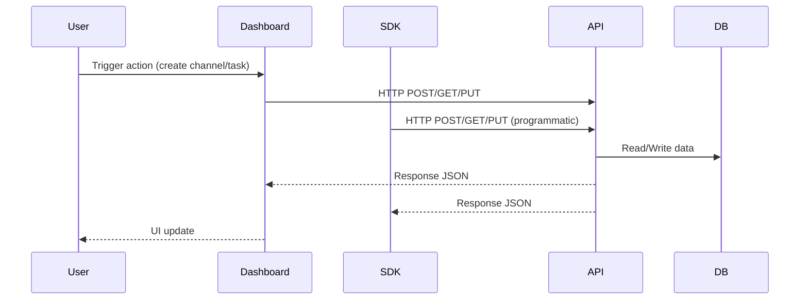

# Data Flow

The following sequence illustrates request and response flow in MXF:

Key points:
- Both Dashboard and SDK use the same API endpoints.
- Real-time updates via WebSocket (Socket.IO) for task and memory changes.
- Persistent storage in MongoDB ensures data consistency.
