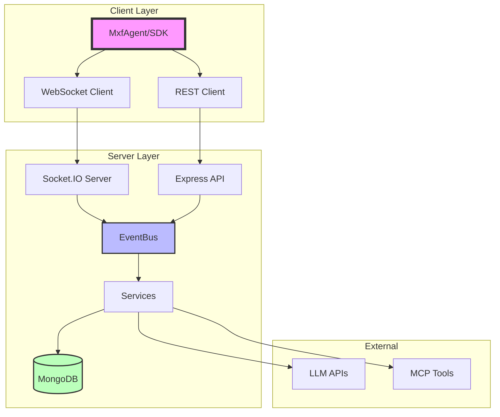
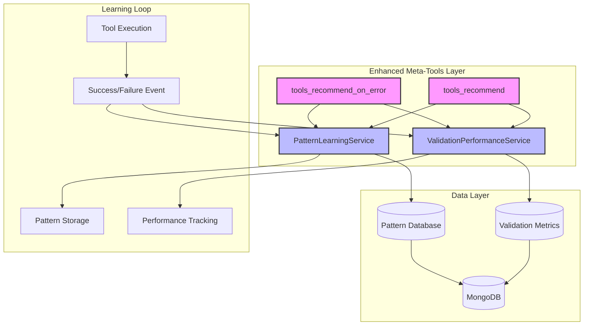

# Core MXF Architecture Documentation

The Model Exchange Framework (MXF) is an event-driven platform for orchestrating AI-powered agents in collaborative environments. Built on modern web technologies, MXF provides a robust foundation for multi-agent systems with real-time communication, persistent memory, and extensible tool integration.

## Architecture Overview

MXF follows a modular, service-oriented architecture that enables:

- **Scalable Agent Orchestration**: Manage hundreds of agents across multiple channels
- **Real-time Communication**: WebSocket-based messaging with event-driven architecture
- **Intelligent Coordination**: Task assignment, load balancing, and collaborative workflows
- **Persistent Context**: Multi-scope memory system for continuity across sessions
- **Extensible Tools**: Model Context Protocol (MCP) integration for custom capabilities
- **ORPAR Control Loops**: Structured cognitive cycles for agent behavior

## Core Components

### 1. **Server Layer** (`/src/server`)
The backbone of MXF, providing:
- RESTful API endpoints for management operations
- WebSocket server for real-time communication
- Service layer for business logic
- MongoDB integration for persistence
- Meilisearch integration for semantic search
- Redis caching layer for performance
- Proactive validation and auto-correction services
- Authentication and authorization

### 2. **SDK Layer** (`/src/sdk`)
Client libraries for agent development:
- `MxfClient`: Base class for agent connectivity
- `MxfAgent`: LLM-powered agent with AI capabilities
- Event handlers for various agent behaviors
- Memory and tool management interfaces

### 3. **Shared Components** (`/src/shared`)
Common code between server and SDK:
- TypeScript interfaces and types
- Event definitions and EventBus
- Data models and schemas
- Validation utilities
- MCP tool definitions
- MXP protocol schemas and middleware

### 4. **Dashboard** (`/dashboard`)
Vue 3-based web interface for:
- Agent and channel management
- Real-time monitoring and analytics
- Task coordination and tracking
- System configuration

## Key Technologies

- **Runtime**: Bun with TypeScript
- **API Framework**: Express.js
- **Real-time**: Socket.IO
- **Database**: MongoDB with Mongoose
- **Search Engine**: Meilisearch for semantic search
- **Caching**: Redis for high-performance caching
- **Container Orchestration**: Docker & Docker Compose
- **Workflow Automation**: Optional n8n integration (requires self-hosted or n8n Cloud)
- **Authentication**: JWT + API Keys
- **Frontend**: Vue 3 + Vuetify 3
- **AI Integration**: OpenAI, Anthropic, Google AI, OpenRouter
- **Machine Learning**: TensorFlow.js (opt-in, pure JS backend for Bun compatibility) for on-device ML models including error prediction (Dense classifier), anomaly detection (autoencoder with reconstruction error scoring), and knowledge graph embeddings
- **Embeddings**: OpenAI text-embedding-3-small for semantic understanding
- **Protocol**: MXP (Model Exchange Protocol) for efficient agent communication
- **Encryption**: AES-256-GCM for secure messaging
- **Validation**: AJV JSON Schema validation with auto-correction
- **Logging**: Custom logger

## Architecture Patterns

1. **Event-Driven Architecture**
   - Central EventBus for decoupled communication
   - Pub/sub pattern for real-time updates
   - Event sourcing for audit trails

2. **Service-Oriented Design**
   - Modular services with single responsibilities
   - Dependency injection for testability
   - Clear separation of concerns

3. **Repository Pattern**
   - Abstracted data access through Mongoose models
   - Consistent CRUD operations
   - Query optimization

4. **Factory Pattern**
   - LLM provider factory for multi-model support
   - MCP client factory for tool integration
   - Dynamic service instantiation

5. **Observer Pattern**
   - Real-time status updates
   - Memory change notifications
   - Task progress tracking

## Documentation Sections

### Core Concepts
- **[System Overview](system-overview.md)** - High-level system architecture
- **[Architecture Diagram](architecture-diagram.md)** - Visual system representation
- **[Key Concepts](key-concepts.md)** - Fundamental MXF concepts
- **[Data Flow](data-flow.md)** - How data moves through the system

### Server Architecture
- **[Server Services](server-services.md)** - Comprehensive server services documentation
  - Core Services (Socket, Channel, Agent)
  - AI Services (SystemLLM, ModeDetection, Reflection)
  - Task Services (Task management, Completion monitoring)
  - MCP Services (Tool execution and management)
  - Pattern Services (Ephemeral events, Pattern detection)

### Advanced Topics
- **[Extensibility](extensibility.md)** - Plugin and extension development
- **[Security](security.md)** - Security model and best practices
- **[Development Lifecycle](development-lifecycle.md)** - From development to deployment
- **[Validation System](validation-system.md)** - Comprehensive validation and error prevention architecture

### Memory & Learning
- **[Nested Learning](nested-learning.md)** - Multi-timescale memory architecture
- **[Memory Utility Learning (MULS)](memory-utility-learning.md)** - Q-value based retrieval
- **[ORPAR-Memory Integration](orpar-memory-integration.md)** - Phase-aware memory coupling

### Advanced Systems
- **[Task DAG & Knowledge Graph](../features/dag-knowledge-graph.md)** - DAG workflows and KG operations
- **[DAG API Tools](../api/dag-tools.md)** - DAG tool reference
- **[Knowledge Graph API Tools](../api/knowledge-graph-tools.md)** - KG tool reference
- **[Code Execution](code-execution.md)** - Secure sandboxed execution
- **[Workflow System](workflow-system.md)** - Sequential, parallel, loop patterns
- **[LSP Integration](lsp-integration.md)** - Language Server Protocol bridge
- **[P2P Foundation](p2p-foundation.md)** - Decentralized coordination
- **[Dynamic Inference Parameters](dynamic-inference-parameters.md)** - Complexity-based model selection
- **[TOON Optimization](toon-optimization.md)** - Token-optimized encoding
- **[Prompt Auto-Compaction](prompt-auto-compaction.md)** - Automatic prompt compression
- **[Database Abstraction](database-abstraction.md)** - Swappable database backends

### Implementation Guides
- **[Event System](../api/websocket.md)** - WebSocket and event architecture
- **[Memory System](../api/memory.md)** - Persistent context management
- **[MCP Integration](../api/mcp.md)** - Tool development and integration
- **[Control Loops](../api/control-loop.md)** - ORPAR cycle implementation

### MXP 2.0 Documentation
- **[MXP Protocol](mxp-protocol.md)** - Model Exchange Protocol architecture
- **[MXP Enterprise Guide](mxp-enterprise.md)** - Enterprise deployment and ROI tracking
- **[MXP Monitoring](mxp-monitoring.md)** - Production monitoring and analytics
- **[MXP Troubleshooting](mxp-troubleshooting.md)** - Diagnostic and resolution guide

## Quick Start Architecture

<iframe src="../diagram/architecture-high-level.html" width="100%" height="800" style="border: none; border-radius: 10px; background: var(--bg-secondary);"></iframe>

## Design Principles

1. **Modularity**: Components are loosely coupled and independently deployable
2. **Extensibility**: New features can be added without modifying core
3. **Scalability**: Horizontal scaling through service distribution
4. **Resilience**: Graceful degradation and error recovery
5. **Security**: Defense in depth with multiple authentication layers
6. **Observability**: Comprehensive logging and monitoring

## Performance Characteristics

- **Latency**: Sub-second message delivery for typical operations
- **Throughput**: Designed for high-volume message processing
- **Concurrency**: Supports many concurrent WebSocket connections
- **Memory**: Efficient memory usage with garbage collection
- **Storage**: Optimized MongoDB queries with indexing
- **MXP Efficiency**: Bandwidth optimization through structured messaging

## Deployment Architecture

MXF supports multiple deployment configurations:

1. **Monolithic**: Single server instance (development/small scale)
2. **Distributed**: Separate API and WebSocket servers
3. **Microservices**: Individual services deployed independently
4. **Cloud-Native**: Kubernetes-ready with container support
5. **Edge Deployment**: Lightweight agents at edge locations

## Validation Enhancement System

MXF includes an intelligent validation and pattern learning system that enhances tool recommendations with historical performance data and successful usage patterns.

### Key Components

1. **ValidationPerformanceService**
   - Tracks tool validation success rates per agent and channel
   - Monitors common validation errors and recovery patterns
   - Calculates agent performance scores and risk levels
   - Provides validation insights for meta-tool recommendations

2. **PatternLearningService**
   - Stores successful parameter patterns from tool executions
   - Learns from failed patterns to prevent repetition
   - Provides pattern-based recommendations across agents
   - Enables cross-agent knowledge sharing within channels

3. **Enhanced Meta-Tools**
   - `tools_recommend`: Now includes validation insights and parameter examples
   - `tools_recommend_on_error`: New tool for error-specific recovery recommendations
   - Graceful degradation when validation services are unavailable
   - Pattern-driven suggestions based on successful usage

### Architecture Integration

<iframe src="../diagram/validation-system.html" width="100%" height="680" style="border: none; border-radius: 10px; background: var(--bg-secondary);"></iframe>

### Benefits

- **Reduced Validation Errors**: Learn from past failures to prevent repetition
- **Improved Success Rates**: Recommend tools based on historical performance
- **Parameter Guidance**: Provide successful parameter examples to agents
- **Error Recovery**: Intelligent suggestions when tool executions fail
- **Cross-Agent Learning**: Share knowledge across agents in the same channel

## Integration Points

- **LLM Providers**: OpenAI, Anthropic, Google, XAI, Custom
- **Databases**: MongoDB (primary), Redis (caching)
- **Message Queues**: Compatible with RabbitMQ, Kafka
- **Monitoring**: Prometheus, Grafana, OpenTelemetry
- **CI/CD**: GitHub Actions, Docker, Kubernetes

## Future Architecture

The MXF architecture is designed to evolve:

- **GraphQL API**: Alternative to REST for complex queries
- **gRPC Support**: High-performance inter-service communication
- **Multi-Region**: Geographic distribution for global scale
- **Extended P2P**: Full decentralized agent coordination (foundation layer implemented — see [P2P Foundation](p2p-foundation.md))
- **Quantum-Ready**: Preparation for quantum computing integration

---

## Next Steps

1. Review the [System Overview](system-overview.md) for detailed architecture
2. Explore [Key Concepts](key-concepts.md) to understand MXF fundamentals
3. Check [API Documentation](../api/index.md) for implementation details
4. See [SDK Documentation](../sdk/index.md) for agent development
5. Visit [Dashboard Guide](../dashboard/index.md) for UI documentation

For questions or contributions, please refer to the [GitHub repository](https://github.com/BradA1878/model-exchange-framework).