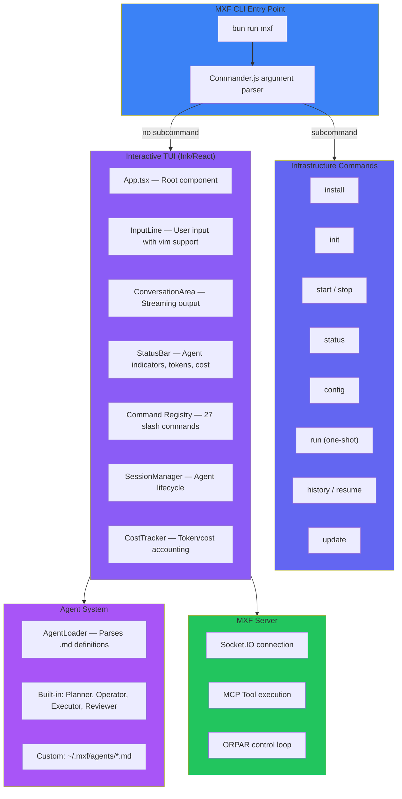

# Interactive CLI (TUI)

## Overview

The MXF Interactive CLI is a persistent terminal UI session launched with `bun run mxf`. Built with [Ink](https://github.com/vadimdemedes/ink) (React for CLIs), it provides a rich interface for multi-agent task orchestration directly from the terminal. You type natural language tasks, and the built-in agent team (Planner, Operator, Executor, Reviewer) decomposes and executes them using MXF's ORPAR control loop and MCP tool system.

**How it differs from the SDK CLI (`bun run sdk:cli`):** The SDK CLI is a developer tool for managing individual agent connections, channels, and raw MCP tool calls against a running server. The Interactive CLI is the user-facing orchestration layer -- it manages agent lifecycles, task delegation, cost tracking, session persistence, and confirmation prompts automatically.

Key capabilities:

- Natural language task input with multi-agent decomposition
- Streaming agent reasoning and tool call output
- Slash commands for session control, model switching, and diagnostics
- Shell pass-through (`!command`) for running terminal commands inline
- `@agent` mentions to direct messages to specific agents
- Real-time cost tracking with budget alerts
- Session history with resume support
- File conflict detection and confirmation prompts
- Vim keybindings and color themes

## Quick Start

```bash
# 1. Install infrastructure (Docker containers, credentials, .env bridge)
bun run mxf install

# 2. Start the MXF server in a separate terminal
bun run dev

# 3. Complete setup (creates user + access token, requires running server)
bun run mxf install --complete-setup

# 4. Configure LLM provider and API key
bun run mxf init

# 5. Launch the interactive TUI
bun run mxf
```

Once inside the TUI, type a task in natural language and press Enter. The Planner agent will decompose the task and delegate subtasks to specialist agents.

```
> Refactor the UserService to use dependency injection and add unit tests

  Planner: I'll break this into subtasks...
  Task created: refactor-user-service (assigned to Operator)
  Task created: write-unit-tests (assigned to Executor, depends on refactor-user-service)
  Operator: Reading src/services/UserService.ts...
  ...
```

## Architecture

<div class="mermaid-fallback">



</div>

## Infrastructure Commands

All commands are run as `bun run mxf <command>` (or `mxf <command>` if installed globally).

| Command | Description |
|---------|-------------|
| *(none)* | Launch the interactive TUI session |
| `install` | First-time setup: Docker infrastructure, credentials, `.env` bridge |
| `install --complete-setup` | Phase B: create user and access token (requires running server) |
| `init` | Configure LLM provider, API key, and default model (interactive prompts) |
| `start` | Start Docker containers (MongoDB, Meilisearch, Redis) |
| `stop` | Stop Docker containers |
| `status` | Show server health, infrastructure status, and config validation |
| `config list` | View all configuration values (secrets masked) |
| `config get <path>` | Get a specific value (e.g., `server.port`) |
| `config set <path> <val>` | Set a value and update the `.env` bridge file |
| `config path` | Show the config file path (`~/.mxf/config.json`) |
| `run "<task>"` | One-shot task execution (see below) |
| `history` | List past interactive sessions |
| `resume <id>` | Display a past session conversation (view-only) |
| `update` | Check for and apply MXF updates |

The TUI also accepts launch options:

```bash
bun run mxf --session my-project     # Join or create a named shared session
bun run mxf --agents planner,operator # Enable only specific agents
bun run mxf --timeout 600             # Set task timeout in seconds
```

## One-Shot Mode

`mxf run` executes a single task without entering the interactive TUI. It creates a Planner agent, submits the task, streams output, and exits on completion.

```bash
bun run mxf run "What is the current architecture of the auth module?"
```

### Flags

| Flag | Description | Default |
|------|-------------|---------|
| `--context <path>` | File or directory to include as context | none |
| `--format <fmt>` | Output format: `text`, `json`, `md` | `text` |
| `--model <model>` | Override the default LLM model | config default |
| `--timeout <seconds>` | Task timeout in seconds | `300` |

### Examples

```bash
# Include a file as context
bun run mxf run "Summarize this service" --context src/services/AuthService.ts

# Include an entire directory
bun run mxf run "Find potential bugs" --context ./src --format json

# Use a specific model
bun run mxf run "Quick question about TypeScript generics" --model anthropic/claude-haiku-4.5

# Set a longer timeout for complex tasks
bun run mxf run "Refactor the entire test suite" --timeout 600

# Pipe and redirect
bun run mxf run "List all exported functions in src/utils/" | head -20
bun run mxf run "Write a haiku about distributed systems" > haiku.txt
```

### Pre-Flight Checks

Before executing, `mxf run` validates:

1. Configuration exists (`~/.mxf/config.json`)
2. User access token is present (`mxf install --complete-setup`)
3. LLM provider and API key are configured (`mxf init`)
4. MXF server is running
5. Context path is valid (if `--context` provided)

If any check fails, you get an actionable error message pointing to the setup command to run.

### Output Formats

- **text** (default) -- Streams agent output to the terminal with status lines. In non-TTY mode (piped), prints raw output only.
- **json** -- Structured output to stdout: `{ success, output, toolCalls, elapsedMs, error }`. Ideal for scripting.
- **md** -- Markdown-formatted output suitable for documentation pipelines.

## Session Management

### History

Sessions are automatically persisted to `~/.mxf/sessions/`. Use `mxf history` to list past sessions:

```bash
bun run mxf history
```

This shows session IDs, timestamps, entry counts, and iteration totals.

### Resume

Resume a past session from the CLI (view-only):

```bash
bun run mxf resume <session-id>
```

Or from within the TUI using the `/resume` slash command, which loads the session's entries into the current conversation and injects a condensed summary as context for the next task -- giving the agent continuity from where the previous session left off.

## Slash Commands Reference

The TUI supports 27 slash commands. Type `/help` to see the full list inside a session.

### Session Control

| Command | Description | Usage |
|---------|-------------|-------|
| `/help` | Show all available commands, agent mentions, and usage tips | `/help` |
| `/clear` | Clear the conversation display | `/clear` |
| `/stop` | Cancel current agent activity | `/stop` |
| `/exit` | Gracefully disconnect all agents and exit | `/exit` |
| `/retry` | Resubmit the last user task to the orchestrator | `/retry` |

### Agent Management

| Command | Description | Usage |
|---------|-------------|-------|
| `/agents` | Show currently active agents and connection status | `/agents` |
| `/agents list` | List all available agents (built-in + custom), showing which are connected | `/agents list` |
| `/agents enable <id>` | Connect an agent mid-session (resolves by ID, name, or `mxf-` prefix) | `/agents enable reviewer` |
| `/agents disable <id>` | Disconnect an agent mid-session | `/agents disable mxf-executor` |

### Model and Mode

| Command | Description | Usage |
|---------|-------------|-------|
| `/model` | Show current model and enter interactive model picker | `/model` |
| `/model <id>` | Switch to a specific model immediately | `/model anthropic/claude-sonnet-4.5` |
| `/mode` | Show current interaction mode and options | `/mode` |
| `/mode chat` | Conversational replies only -- no delegation or file changes | `/mode chat` |
| `/mode plan` | Planning only -- no execution | `/mode plan` |
| `/mode action` | Full delegation and execution (default) | `/mode action` |

### Context and Search

| Command | Description | Usage |
|---------|-------------|-------|
| `/context <path>` | Load a file or directory as context for the next task | `/context src/services/` |
| `/search <term>` | Case-insensitive search across all conversation entries | `/search authentication` |
| `/filter <type>` | Show only specific entry types (user, agent, tool-call, error, reasoning, etc.) | `/filter agent` |
| `/filter all` | Clear the filter and show all entries | `/filter all` |

### Cost and Budget

| Command | Description | Usage |
|---------|-------------|-------|
| `/cost` | Show session cost summary: elapsed time, iterations, tokens, per-agent breakdown | `/cost` |
| `/budget` | View current budget status | `/budget` |
| `/budget <amount>` | Set a session cost budget in USD (warns at 80%, alerts at 100%) | `/budget 5.00` |
| `/budget clear` | Remove the budget limit | `/budget clear` |

### Permissions

| Command | Description | Usage |
|---------|-------------|-------|
| `/permissions` | View current tool permission rules | `/permissions` |
| `/approve-all` | Toggle auto-approve for all tool calls (on/off) | `/approve-all` |
| `/approve <pattern>` | Auto-approve a specific tool pattern for this session | `/approve read_file` |

### Diagnostics

| Command | Description | Usage |
|---------|-------------|-------|
| `/debug` | Show internal TUI state: connection, tokens, context usage per agent, compaction status | `/debug` |
| `/compact` | Manually trigger context compaction for all agents | `/compact` |
| `/compact <id>` | Compact a specific agent's context | `/compact mxf-operator` |
| `/diff` | Show all file changes made by agents this session (writes, edits, moves) | `/diff` |
| `/tasks` | Show task activity: current task, completed/failed counts, recent task events | `/tasks` |

### Session Persistence

| Command | Description | Usage |
|---------|-------------|-------|
| `/history` | Show recent sessions from `~/.mxf/sessions/` | `/history` |
| `/resume` | Show 5 most recent sessions to choose from | `/resume` |
| `/resume <id>` | Load a past session's conversation and inject context for continuity | `/resume abc123` |
| `/export` | Export conversation to markdown file in the working directory | `/export` |
| `/export json` | Export conversation with full metadata as JSON | `/export json` |

### Appearance

| Command | Description | Usage |
|---------|-------------|-------|
| `/theme` | Show current theme and available options | `/theme` |
| `/theme <name>` | Switch color theme (`dark`, `light`, `minimal`) | `/theme light` |
| `/vim` | Toggle vim keybindings for the input area | `/vim` |
| `/hooks` | Show loaded tool lifecycle hooks from `~/.mxf/hooks/` | `/hooks` |

### Shell Pass-Through

Prefix any command with `!` to execute it directly in the shell:

```
> !git status
> !ls -la src/services/
> !bun test src/utils/auth.test.ts
```

### Agent Mentions

Use `@agent` to direct a message to a specific agent instead of the orchestrator:

```
> @operator fix the import on line 23 of src/index.ts
> @reviewer check the error handling in AuthService
```

## Agent System

### Built-in Agents

MXF ships with four built-in agents defined as `.md` files in `src/cli/tui/agents/built-in/`:

| Agent | ID | Role | Color | Description |
|-------|-----|------|-------|-------------|
| **Planner** | `mxf-planner` | orchestrator | white | Decomposes tasks and delegates to specialist agents via `task_create_with_plan` and `messaging_send` |
| **Operator** | `mxf-operator` | specialist | cyan | Reads and writes files, runs shell commands. Primary workhorse for code changes. |
| **Executor** | `mxf-executor` | specialist | yellow | Runs code in sandboxed containers and shell commands. Used for build, test, and computation tasks. |
| **Reviewer** | `mxf-reviewer` | specialist | green | Reviews code quality, finds bugs, and provides feedback. Read-only -- cannot modify files. |

The Planner acts as the orchestrator: it receives your task, creates a plan, and delegates subtasks to the specialist agents. Specialists report results back to the Planner, which synthesizes the final response.

### Custom Agents

Create custom agents by placing `.md` files in `~/.mxf/agents/`. Custom agents with a matching `agentId` override the corresponding built-in agent.

#### Agent File Format

Agent definitions use YAML frontmatter for configuration and the markdown body as the system prompt:

```markdown
---
name: Analyst
agentId: mxf-analyst
description: Analyzes data patterns and generates reports
role: specialist
color: magenta
temperature: 0.3
maxTokens: 8000
maxIterations: 20
reasoningEnabled: true
reasoningEffort: medium
allowedTools:
  - read_file
  - list_directory
  - code_execute
  - messaging_send
  - task_complete
---

You are the Analyst agent -- a specialist for data analysis and reporting.

When given a task:
1. Read the relevant data files
2. Analyze patterns and anomalies
3. Generate a clear, structured report
4. Report your findings back to the Planner

Always include specific numbers and examples in your analysis.
```

#### Frontmatter Fields

| Field | Required | Default | Description |
|-------|----------|---------|-------------|
| `name` | Yes | -- | Display name shown in the TUI |
| `agentId` | Yes | -- | Unique identifier (conventionally `mxf-<name>`) |
| `allowedTools` | Yes | -- | YAML array of MCP tool names this agent can call |
| `description` | No | `""` | Short description shown in `/agents list` |
| `role` | No | `specialist` | `orchestrator` or `specialist` |
| `color` | No | `white` | TUI display color (chalk color name) |
| `temperature` | No | `0.3` | LLM temperature (lower = more deterministic) |
| `maxTokens` | No | `8000` | Max output tokens per LLM call |
| `maxIterations` | No | `20` | Max ORPAR iterations before forced completion |
| `reasoningEnabled` | No | `true` | Enable extended thinking/reasoning |
| `reasoningEffort` | No | `medium` | Reasoning effort: `low`, `medium`, `high` |

#### Loading Order

1. Built-in agents from `src/cli/tui/agents/built-in/`
2. Custom agents from `~/.mxf/agents/`
3. Custom agents with a matching `agentId` override the built-in version

Enable specific agents at launch with `--agents`:

```bash
bun run mxf --agents mxf-planner,mxf-operator,mxf-analyst
```

Or manage agents mid-session with `/agents enable <id>` and `/agents disable <id>`.

## TUI Features

### Status Bar

The status bar is fixed at the bottom of the terminal and displays:

- **Agent indicators** -- Each agent shows as a colored dot: green (active), gray (idle), red (error). When an agent is working, a spinner shows its name and current activity.
- **Token/iteration count** -- Total tokens consumed across all agents (falls back to iteration count when token tracking is unavailable).
- **Estimated cost** -- Running cost estimate in USD based on model pricing tables.
- **Elapsed time** -- Session duration.
- **Connection status** -- Colored indicator for the SDK connection: green (connected), yellow (connecting), gray (disconnected), red (error).

### Streaming Reasoning

When agents have `reasoningEnabled: true`, the TUI streams their internal reasoning in real time. This gives visibility into the agent's thought process before it takes action. Use `/filter reasoning` to isolate reasoning entries.

### Cost Tracking

The `CostTracker` service tracks per-agent usage metrics throughout the session:

- **Iterations** -- Each agent message and tool call counts as one iteration.
- **Token usage** -- Input and output tokens tracked via LLM usage events, with per-agent breakdown.
- **Cost estimation** -- Calculated from token counts using built-in model pricing tables covering Anthropic, OpenAI, Google, xAI, Meta, and DeepSeek models.

View the full breakdown with `/cost`:

```
Session Cost Summary:
  Elapsed:     3m 42s
  Iterations:  47 total
  Tokens:      128,340 total (96,200 in / 32,140 out)

  Agent Breakdown:
    Planner    12 iters (8 msg, 4 tools, 42,100 tokens, ~$0.6090)
    Operator   28 iters (14 msg, 14 tools, 72,400 tokens, ~$1.0150)
    Reviewer   7 iters (5 msg, 2 tools, 13,840 tokens, ~$0.2490)

  Tasks completed: 3
  Est. cost:   ~$1.8730
  Budget:      ~$1.8730 / $5.00 (37.5%)
```

### Budget Alerts

Set a cost budget with `/budget <amount>` or in `~/.mxf/config.json` under the `costBudget` field. The system warns at 80% usage and alerts at 100%.

```
> /budget 5.00
Budget set to $5.00. Warnings at 80%, alerts at 100%.
```

### Context Compaction

When an agent approaches its model's context window limit (75% threshold), the TUI can trigger automatic compaction. You can also trigger it manually:

```
> /compact                 # Compact all agents
> /compact mxf-operator    # Compact a specific agent
```

The `/compact` command reports token recovery statistics:

```
Context compacted for mxf-operator (was 78% full) -- recovered ~12,800 tokens (38% reduction)
```

### Tool Hooks

Place shell scripts or JavaScript files in `~/.mxf/hooks/` to run custom logic before or after tool calls:

```
~/.mxf/hooks/
  pre-write_file.sh     # Runs before any write_file call
  post-shell_execute.sh # Runs after any shell_execute call
  pre-all.sh            # Runs before every tool call
  post-all.js           # Runs after every tool call (JS supported)
```

View loaded hooks with `/hooks`.

### Vim Mode

Toggle vim keybindings with `/vim`. When enabled, the input area supports normal/insert mode switching and basic vim movement: `h`, `l`, `0`, `$`, `dd`, `x`. Press Escape to enter normal mode.

### Themes

Three built-in themes are available, switchable with `/theme <name>`:

| Theme | Description |
|-------|-------------|
| `dark` | Default. Cyan accent, white text. Optimized for dark terminal backgrounds. |
| `light` | Blue accent, dark text. For light terminal backgrounds. |
| `minimal` | White/gray only. Reduced color palette for minimal visual noise. |

Each theme defines colors for borders, text, agent indicators, status dots, prompts, and accents. Agent-specific colors (Planner = white, Operator = cyan, Executor = yellow, Reviewer = green) vary by theme.

### File Conflict Detection

When agents modify files, the TUI tracks all changes via tool-call entries. Use `/diff` to see a summary of every file modification in the session, grouped by file path with timestamps and responsible agents.

### Confirmation Prompts

By default, potentially destructive tool calls (file writes, shell commands) require user confirmation before execution. Control this behavior with:

- `/approve-all` -- Toggle blanket auto-approval on/off
- `/approve <pattern>` -- Auto-approve a specific tool (e.g., `/approve read_file`)
- `/permissions` -- View current permission rules

### Conversation Export

Export the full conversation for documentation or review:

```
> /export          # Markdown file with headers and timestamps
> /export json     # JSON with full entry metadata (type, timestamp, agent, tool info)
```

Files are saved to the working directory as `mxf-conversation-<session-id>-<timestamp>.<ext>`.
