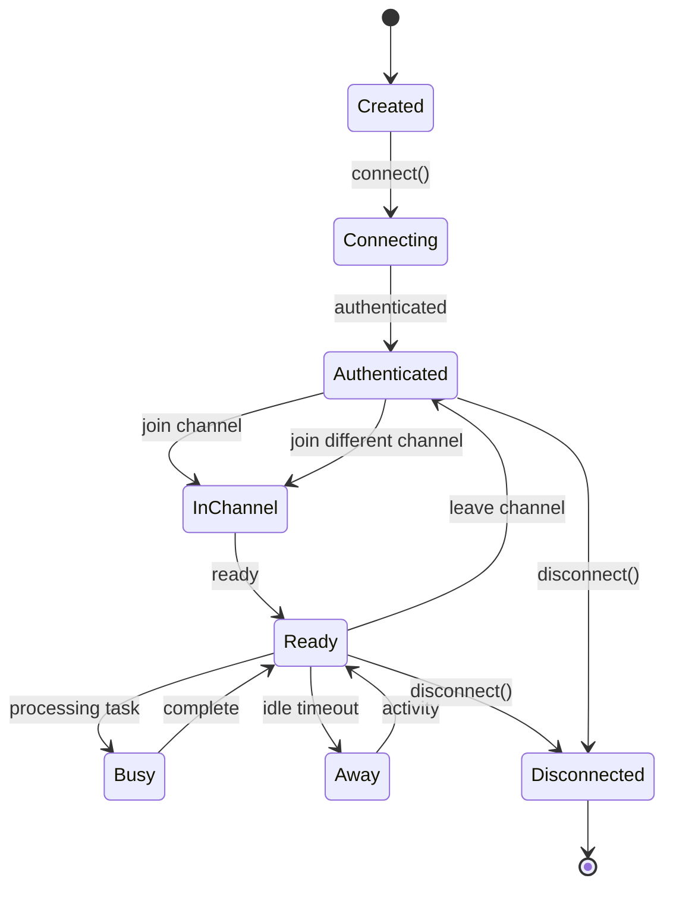
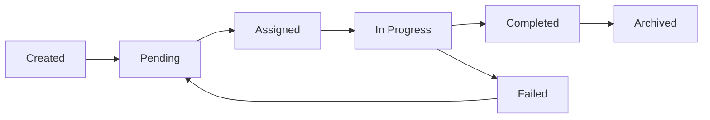
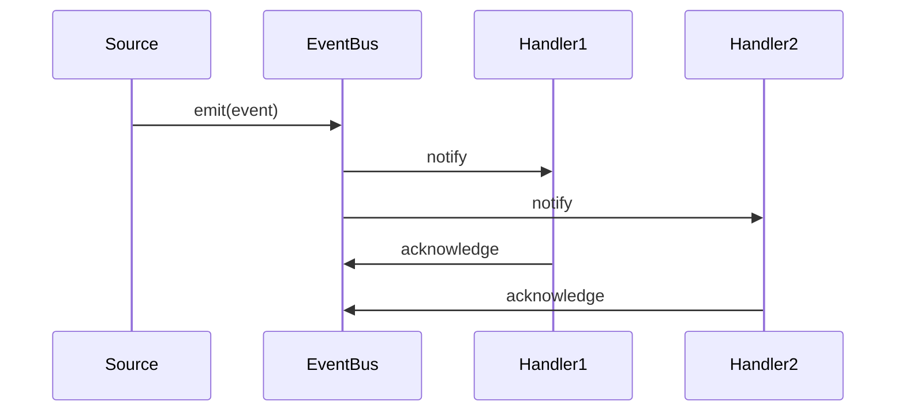
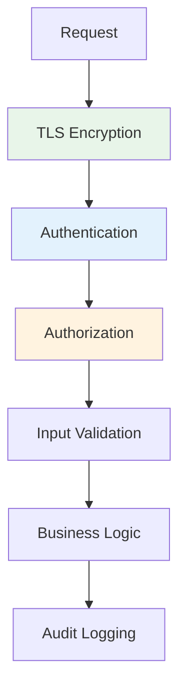
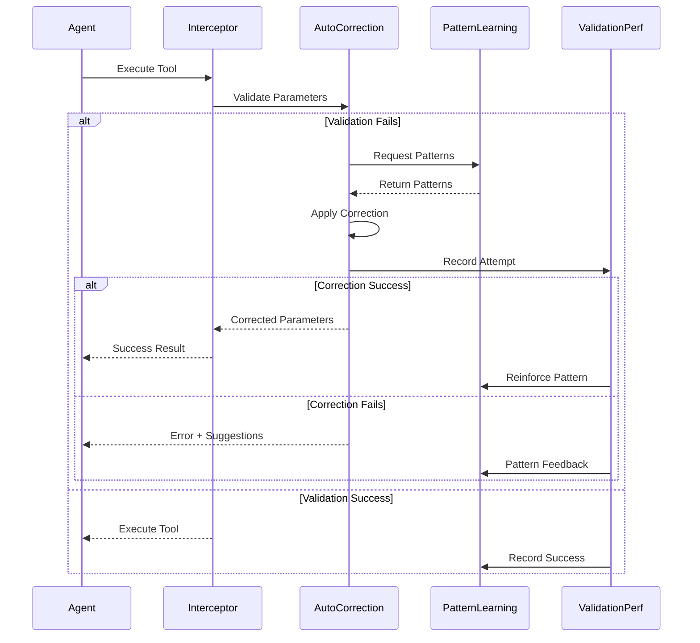
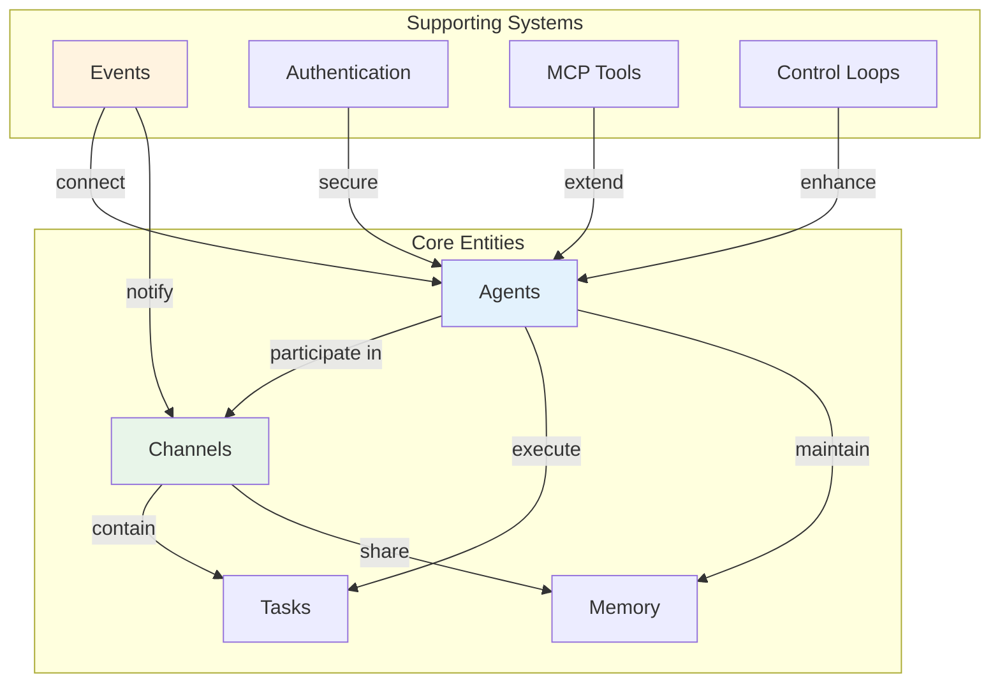

# Key Concepts

This document explains the fundamental concepts that form the foundation of the Model Exchange Framework (MXF). Understanding these concepts is essential for effectively using and extending the platform.

## Core Concepts

### 1. Agents

Agents are the fundamental units of intelligence in MXF. They represent autonomous or semi-autonomous entities that can process information, make decisions, and take actions.

#### Types of Agents

1. **Basic Agents** (`MxfClient`)
   - Simple message processing
   - Event-driven responses
   - Manual task handling
   - Tool execution

2. **AI-Powered Agents** (`MxfAgent`)
   - LLM integration for intelligent responses
   - Automatic tool selection
   - Context-aware decision making
   - Self-directed task completion

#### Agent Properties

```typescript
interface Agent {
    agentId: string;        // Unique identifier
    name: string;           // Human-readable name
    role: string;           // Operational role
    capabilities: string[]; // Declared abilities
    model?: string;         // LLM model (if AI-powered)
    status: AgentStatus;    // Current operational state
    metadata: object;       // Custom properties
}
```

#### Agent Lifecycle

<div class="mermaid-fallback">



</div>

<iframe src="../diagram/agent-lifecycle.html" width="100%" height="650" style="border: none; border-radius: 10px; background: var(--bg-secondary);"></iframe>

### 2. Channels

Channels are collaborative spaces where agents interact, share information, and coordinate activities. They provide isolation, context, and access control.

#### Channel Characteristics

- **Isolation**: Each channel is a separate workspace
- **Persistence**: Channel state and history are maintained
- **Access Control**: Membership and permissions management
- **Shared Context**: Common memory and configuration

#### Channel Security Model

**IMPORTANT**: ALL channels require cryptographic key authentication. There is no concept of "open" or "public join" channels.

**Channel Discovery Settings:**

1. **Discoverable Channels** (`isPrivate: false`)
   - Visible in channel listings and search results
   - Channel existence can be discovered
   - **Still requires `keyId` + `secretKey` to join**
   - Useful for channels that want to advertise their existence

2. **Hidden Channels** (`isPrivate: true`)
   - Not visible in public channel listings
   - Cannot be discovered through search
   - **Requires `keyId` + `secretKey` to join**
   - Hidden from unauthorized agents

**Authentication Requirements:**
- Every agent **MUST** have a valid `keyId` and `secretKey` pair to join ANY channel
- Keys are generated per-channel and can be revoked
- Keys can have expiration dates
- Keys are validated cryptographically via `ChannelKeyService`

#### Channel Configuration

```typescript
interface ChannelConfig {
    maxAgents: number;         // Participant limit
    requireApproval: boolean;  // Join approval needed
    allowAnonymous: boolean;   // Anonymous agents allowed
    retentionDays: number;     // Data retention period
    allowedModels: string[];   // Permitted LLM models
}
```

### 3. Tasks

Tasks represent units of work that need to be completed. MXF provides task management with assignment and tracking capabilities.

#### Task Properties

```typescript
interface Task {
    taskId: string;
    name: string;
    description: string;
    requirements: string[];      // Required capabilities
    priority: Priority;          // urgent|high|normal|low
    assignmentStrategy: Strategy; // How to assign
    status: TaskStatus;          // Current state
    assignedTo?: string;         // Assigned agent
    deadline?: Date;             // Due date
    dependencies?: string[];     // Other task IDs
}
```

#### Task Assignment Strategies

1. **Capability-Based**: Match agent skills to requirements
2. **Workload-Based**: Balance across available agents
3. **Role-Based**: Assign by agent role
4. **LLM-Based**: AI-powered optimal assignment
5. **Manual**: Direct assignment by user

#### Task Lifecycle

<div class="mermaid-fallback">



</div>

<iframe src="../diagram/task-lifecycle.html" width="100%" height="420" style="border: none; border-radius: 10px; background: var(--bg-secondary);"></iframe>

### 4. Memory System

The memory system provides persistent context storage with different scopes and access patterns, enabling agents to maintain state across sessions.

#### Memory Scopes

1. **Agent Memory**
   - Private to individual agent
   - Personal preferences, state, history
   - Examples: user preferences, conversation history

2. **Channel Memory**
   - Shared among channel participants
   - Common context and knowledge
   - Examples: project details, shared decisions

3. **Relationship Memory**
   - Between specific agent pairs
   - Bilateral context and history
   - Examples: collaboration patterns, trust levels

#### Memory Operations

```typescript
interface MemoryEntry {
    key: string;           // Unique identifier
    value: any;           // Stored data
    metadata: {
        scope: MemoryScope;
        createdAt: Date;
        updatedAt: Date;
        version: number;
        tags?: string[];
        ttl?: number;     // Time to live
        importance?: string;
    };
}
```

#### Memory Features

- **Versioning**: Track changes over time
- **Metadata**: Rich annotations
- **Search**: Query across entries
- **Synchronization**: Real-time updates
- **Garbage Collection**: Automatic cleanup

### 5. Event-Driven Architecture

MXF uses events as the primary communication mechanism, enabling loose coupling and real-time updates.

#### Event Categories

1. **System Events**
   - Connection/disconnection
   - Authentication
   - Error handling

2. **Agent Events**
   - Registration
   - Status changes
   - Lifecycle updates

3. **Channel Events**
   - Member joins/leaves
   - Configuration changes
   - Message broadcasts

4. **Task Events**
   - Assignment
   - Progress updates
   - Completion

5. **Memory Events**
   - CRUD operations
   - Synchronization
   - Cleanup

#### Event Flow

<div class="mermaid-fallback">



</div>

<iframe src="../diagram/architecture-communication-flow.html" width="100%" height="500" style="border: none; border-radius: 10px; background: var(--bg-secondary);"></iframe>

### 6. Authentication & Security

MXF implements a dual authentication system to support different use cases while maintaining security.

#### Authentication Modes

1. **JWT Authentication**
   - For human users via dashboard
   - Session-based with expiration
   - Role-based access control
   - Magic link support

2. **API Key Authentication**
   - For agents and programmatic access
   - Channel-specific keys
   - Cryptographically secure
   - No expiration (unless set)

#### Security Layers

<div class="mermaid-fallback">



</div>

<iframe src="../diagram/security-layers.html" width="100%" height="530" style="border: none; border-radius: 10px; background: var(--bg-secondary);"></iframe>

### 7. Model Context Protocol (MCP)

MCP provides a standardized way to extend agent capabilities through tools and resources.

#### Tool Categories

1. **Search Tools**: Web search, database queries
2. **Analysis Tools**: Data processing, calculations
3. **Generation Tools**: Content creation, synthesis
4. **Integration Tools**: External API calls
5. **Utility Tools**: File operations, conversions

#### Tool Definition

```typescript
interface MCPTool {
    name: string;
    description: string;
    inputSchema: JSONSchema;  // Validation
    outputSchema: JSONSchema; // Expected output
    handler: ToolHandler;     // Execution logic
    permissions: string[];    // Required permissions
    pricing?: ToolPricing;    // Usage costs
}
```

#### Tool Execution Flow

1. Discovery: Agent finds available tools
2. Selection: Choose appropriate tool
3. Validation: Check inputs and permissions
4. Execution: Run in sandboxed environment
5. Result: Return validated output

### 8. Control Loops (ORPAR)

Control loops enable structured decision-making cycles for agent behavior.

#### ORPAR Phases

1. **Observe**: Gather information from environment
2. **Reason**: Analyze and understand context
3. **Act/Plan**: Decide on actions to take
4. **Progress**: Execute planned actions
5. **Reflect**: Evaluate outcomes and learn

#### Control Loop Benefits

- Structured decision making
- Continuous improvement
- Pattern recognition
- Autonomous operation
- Meta-cognitive capabilities

### 9. Real-time Communication

MXF uses WebSocket connections for low-latency, bidirectional communication.

#### Communication Patterns

1. **Request-Response**: Traditional call and reply
2. **Publish-Subscribe**: Event broadcasting
3. **Streaming**: Continuous data flow
4. **Peer-to-Peer**: Direct agent communication

#### Message Types

```typescript
interface Message {
    id: string;
    from: string;         // Sender agent ID
    to?: string;          // Target (optional)
    channelId: string;    // Channel context
    content: any;         // Message payload
    metadata: {
        timestamp: Date;
        priority?: Priority;
        replyTo?: string; // Thread reference
        tags?: string[];
    };
}
```

### 10. Extensibility

MXF is designed for extension at multiple levels.

#### Extension Points

1. **Custom Agents**: Extend base classes
2. **Tool Development**: Add MCP tools
3. **Event Handlers**: Custom event processing
4. **Service Plugins**: Additional services
5. **Provider Adapters**: New LLM providers
6. **Storage Backends**: Alternative databases

#### Plugin Architecture

```typescript
interface MXFPlugin {
    name: string;
    version: string;
    initialize(context: PluginContext): void;
    handlers?: EventHandlers;
    services?: ServiceDefinitions;
    tools?: MCPTool[];
}
```

### 9. Intelligence Layer

The Intelligence Layer provides AI-powered capabilities for validation, learning, and error recovery.

#### Auto-Correction System

Automatic error detection and correction for tool execution failures:

```typescript
interface CorrectionResult {
    success: boolean;
    correctedParameters?: Record<string, any>;
    correctionType: CorrectionType;
    confidence: number;
    appliedStrategies: string[];
    riskLevel: 'low' | 'medium' | 'high';
}
```

**Key Features:**
- **Automatic Detection**: Real-time validation error identification
- **Multiple Strategies**: Type conversion, missing parameters, unknown properties
- **Pattern Learning**: Improves from successful corrections
- **Safety Constraints**: Confidence thresholds and semantic validation
- **Circuit Breaker**: Prevents cascading failures

#### Correction Strategies

1. **Type Conversion**
   - String ↔ number conversion
   - Boolean parsing
   - Array/object transformations
   - Confidence: 0.85-0.95

2. **Missing Parameters**
   - Default value inference
   - Context-based completion
   - Pattern-based suggestions
   - Confidence: 0.70-0.85

3. **Unknown Properties**
   - Property filtering
   - Schema-based removal
   - Property mapping
   - Confidence: 0.80-0.95

4. **Constraint Violations**
   - Range adjustments
   - Format corrections
   - Value normalization
   - Confidence: 0.65-0.80

#### Pattern Learning System

Machine learning system for parameter optimization:

```typescript
interface EnhancedParameterPattern {
    patternId: string;
    toolName: string;
    parameters: Record<string, any>;
    successCount: number;
    totalAttempts: number;
    confidence: number;
    lastUsed: Date;
    learnedFrom: string[]; // Agent IDs
}
```

**Capabilities:**
- **Cross-Agent Learning**: Share successful patterns between agents
- **Confidence Scoring**: Statistical reliability measures
- **Pattern Evolution**: Adaptive improvement based on outcomes
- **Context Awareness**: Tool-specific and environment-specific patterns

#### Validation Performance Service

Real-time tracking and analysis of validation performance:

```typescript
interface ValidationMetrics {
    agentId: string;
    channelId: string;
    toolName: string;
    successRate: number;
    averageLatency: number;
    commonErrors: ValidationError[];
    trendAnalysis: PerformanceTrend;
}
```

**Analytics:**
- **Success Rate Tracking**: Tool and agent performance metrics  
- **Error Pattern Analysis**: Common failure identification
- **Performance Trends**: Historical analysis and predictions
- **Agent Scoring**: Overall effectiveness evaluation

#### Integration Workflow

<div class="mermaid-fallback">



</div>

<iframe src="../diagram/validation-system.html" width="100%" height="680" style="border: none; border-radius: 10px; background: var(--bg-secondary);"></iframe>

## Additional Concepts

### Coordination Patterns

1. **Leader-Follower**: Hierarchical control
2. **Peer Coordination**: Equal collaboration
3. **Swarm Intelligence**: Emergent behavior
4. **Consensus Building**: Democratic decisions

### Scalability Patterns

1. **Horizontal Scaling**: Add more instances
2. **Vertical Scaling**: Increase resources
3. **Sharding**: Distribute by channel
4. **Federation**: Cross-instance communication

### Fault Tolerance

1. **Circuit Breakers**: Prevent cascading failures
2. **Retry Logic**: Handle transient errors
3. **Fallback Strategies**: Graceful degradation
4. **Health Checks**: Continuous monitoring

## Concept Relationships

<div class="mermaid-fallback">



</div>

<iframe src="../diagram/concept-relationships.html" width="100%" height="520" style="border: none; border-radius: 10px; background: var(--bg-secondary);"></iframe>

## Best Practices

### Agent Design
1. Clear capability declaration
2. Appropriate model selection
3. Proper error handling
4. Resource efficiency

### Channel Management
1. Logical grouping of agents
2. Appropriate access controls
3. Regular maintenance
4. Clear naming conventions

### Task Orchestration
1. Well-defined requirements
2. Realistic deadlines
3. Dependency management
4. Progress tracking

### Memory Usage
1. Appropriate scope selection
2. Regular cleanup
3. Efficient indexing
4. Version management

## Next Steps

1. Explore [System Overview](system-overview.md) for implementation details
2. Review [Architecture Diagrams](architecture-diagram.md) for visual understanding
3. Learn about [Data Flow](data-flow.md) patterns
4. Check [API Documentation](../api/index.md) for practical usage
5. See [SDK Documentation](../sdk/index.md) for development guide