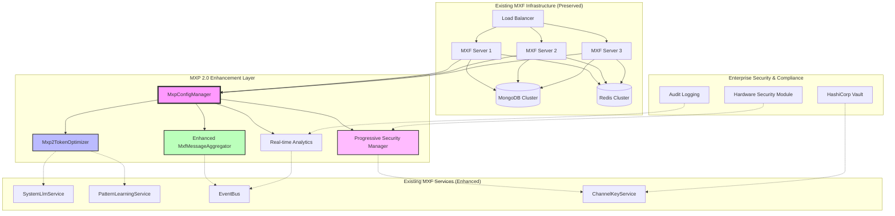

# MXP 2.0 Enterprise Implementation Guide

This guide provides comprehensive instructions for implementing MXP 2.0's modular optimization suite in enterprise environments. MXP 2.0 transforms existing MXF deployments through intelligent enhancement rather than replacement, ensuring seamless adoption with immediate cost benefits.

## Executive Summary

MXP 2.0 delivers enterprise-grade optimization through:
- **60-80% reduction in LLM API costs** via AI-driven token optimization
- **70-90% reduction in network bandwidth** through enhanced message aggregation
- **Progressive security architecture** supporting compliance requirements (Standard → Enhanced → Regulated → Classified)
- **Zero disruption deployment** with existing MXF infrastructure preservation
- **Real-time cost tracking** and ROI measurement for executive reporting
- **Seamless integration** with existing SystemLLM, PatternLearning, and ChannelKey services

## Enterprise Deployment Architecture

### MXP 2.0 Integration Architecture



### Key Architectural Principles

**1. Enhancement, Not Replacement**
- Existing MXF infrastructure remains unchanged
- Zero-downtime deployment possible
- All existing agents continue working during migration

**2. Progressive Security Model**
- **Standard**: Existing MXF security (no overhead)
- **Enhanced**: Audit logging + compliance features
- **Regulated**: Government/enterprise requirements
- **Classified**: Maximum security with E2E encryption

**3. Service Integration**
- MxpConfigManager orchestrates all optimization modules
- SystemLlmService powers intelligent token compression
- PatternLearningService stores optimization patterns
- EventBus provides real-time monitoring and statistics

## Enterprise Deployment Strategy

### Phased Rollout Approach (Recommended)

MXP 2.0's modular architecture enables a low-risk, high-value deployment strategy:

#### Phase 1: Analytics Baseline (Week 1)
```typescript
// Deploy with monitoring only - zero operational risk
const enterpriseConfig = {
    enableTokenOptimization: false,
    enableBandwidthOptimization: false,
    securityLevel: SecurityLevel.STANDARD,
    modules: {
        analytics: {
            enabled: true,
            realTimeMetrics: true,
            costCalculation: { 
                enabled: true,
                detailedReporting: true  // Executive dashboards
            }
        }
    }
};

// Configure for all production channels
['production', 'staging', 'qa'].forEach(env => {
    mxpManager.createChannelConfig(`${env}-channel`, enterpriseConfig);
});
```

#### Phase 2: Token Optimization (Week 2) 
```typescript
// Enable cost optimization after baseline established
const optimizationConfig = {
    enableTokenOptimization: true,      // 60-80% cost reduction
    enableBandwidthOptimization: false, // Phase 3
    securityLevel: SecurityLevel.ENHANCED, // Audit logging
    tokenStrategies: {
        contextCompression: true,       // High impact, low risk
        conversationSummarization: true, // Reduces long conversations
        promptOptimization: false,      // Test in staging first
        entityDeduplication: false,     // Advanced feature
        toolSchemaReduction: false,     // Requires testing
        templateMatching: false         // Phase 4
    }
};

// Deploy to production after staging validation
mxpManager.setChannelConfig('production-channel', optimizationConfig);
```

#### Phase 3: Bandwidth Optimization (Week 3)
```typescript
// Add infrastructure optimization
const fullOptimizationConfig = {
    enableTokenOptimization: true,
    enableBandwidthOptimization: true,  // 70-90% bandwidth reduction
    securityLevel: SecurityLevel.ENHANCED,
    // Previous token strategies preserved
    modules: {
        bandwidthOptimization: {
            binaryEncodingThreshold: 1024,      // 1KB threshold
            compressionLevel: 'balanced',       // Production setting
            priorityAwareCompression: true,     // Respect EventBus priorities
            aggregationSettings: {
                preserveExistingThreshold: true, // Keep 80% similarity
                maintainFailsafe: true          // Keep 3-min timeout
            }
        }
    }
};
```

#### Phase 4: Advanced Features (Week 4+)
```typescript
// Add advanced optimization strategies after validation
const advancedConfig = {
    // All previous settings preserved
    tokenStrategies: {
        contextCompression: true,
        conversationSummarization: true,
        promptOptimization: true,       // Now enabled
        entityDeduplication: true,      // Domain-specific tuning
        toolSchemaReduction: true,      // Requires careful testing
        templateMatching: true          // Pattern recognition
    },
    securityLevel: SecurityLevel.REGULATED  // Compliance features
};
```

### Zero-Downtime Deployment

MXP 2.0 enables zero-downtime deployment through its enhancement architecture:

```yaml
# kubernetes-deployment.yml
apiVersion: apps/v1
kind: Deployment
metadata:
  name: mxf-server-with-mxp2
spec:
  replicas: 5
  strategy:
    type: RollingUpdate
    rollingUpdate:
      maxSurge: 2
      maxUnavailable: 1
  template:
    metadata:
      labels:
        app: mxf-server
        version: mxp2-enabled
    spec:
      containers:
      - name: mxf-server
        image: mxf/server:latest-mxp2
        env:
        # Existing MXF configuration preserved
        - name: NODE_ENV
          value: "production"
        - name: MONGODB_URI
          valueFrom:
            secretKeyRef:
              name: mxf-secrets
              key: mongodb-uri
        # MXP 2.0 configuration added
        - name: MXP2_ENABLED
          value: "true"
        - name: MXP2_CONFIG_STRATEGY
          value: "incremental"  # Phased enablement
        - name: MXP2_SECURITY_LEVEL
          value: "enhanced"
        readinessProbe:
          httpGet:
            path: /health/mxp2
            port: 3001
          initialDelaySeconds: 30
          periodSeconds: 10
        livenessProbe:
          httpGet:
            path: /health
            port: 3001
          initialDelaySeconds: 60
          periodSeconds: 30
```

## Enterprise Security & Compliance

### Progressive Security Architecture

MXP 2.0's progressive security model meets diverse enterprise requirements:

#### Security Level Implementation
```typescript
// enterprise-security-config.ts
import { MxpConfigManager, SecurityLevel } from '@mxf/mxp';

export class EnterpriseSecurityManager {
    private mxpManager = MxpConfigManager.getInstance();
    
    // Standard: Existing MXF security (baseline)
    configureStandardSecurity(channelId: string) {
        this.mxpManager.createChannelConfig(channelId, {
            securityLevel: SecurityLevel.STANDARD,
            // Uses existing ChannelKeyService
            // No additional security overhead
            // Compatible with all existing agents
        });
    }
    
    // Enhanced: SOC 2 Type II compliance
    configureEnhancedSecurity(channelId: string) {
        this.mxpManager.createChannelConfig(channelId, {
            securityLevel: SecurityLevel.ENHANCED,
            modules: {
                security: {
                    auditLogging: true,           // All optimization events logged
                    complianceFeatures: true,     // SOC 2 Type II compliance
                    keyRotationInterval: 86400,   // 24-hour rotation
                    serverDecryptable: true,      // Preserves analytics capability
                },
                analytics: {
                    auditTrail: true,            // Complete audit trail
                    costCalculation: { 
                        detailedReporting: true   // Compliance reporting
                    }
                }
            }
        });
    }
    
    // Regulated: Government/financial compliance (FIPS 140-2)
    configureRegulatedSecurity(channelId: string) {
        this.mxpManager.createChannelConfig(channelId, {
            securityLevel: SecurityLevel.REGULATED,
            modules: {
                security: {
                    auditLogging: true,
                    complianceFeatures: true,
                    keyRotationInterval: 3600,    // 1-hour rotation
                    serverDecryptable: true,      // Required for compliance logging
                    fipsCompliant: true,          // FIPS 140-2 Level 2
                    hsm: {
                        enabled: true,
                        provider: 'aws-cloudhsm',  // Or Azure Dedicated HSM
                        keystore: 'enterprise-mxp-keys'
                    }
                }
            }
        });
    }
    
    // Classified: Maximum security (FIPS 140-2 Level 3/4)
    configureClassifiedSecurity(channelId: string) {
        this.mxpManager.createChannelConfig(channelId, {
            securityLevel: SecurityLevel.CLASSIFIED,
            modules: {
                security: {
                    auditLogging: true,
                    complianceFeatures: true,
                    keyRotationInterval: 900,     // 15-minute rotation
                    serverDecryptable: false,     // E2E encryption only
                    fipsCompliant: true,
                    hsm: {
                        enabled: true,
                        provider: 'dedicated-hsm',
                        keystore: 'classified-mxp-keys',
                        tamperEvident: true,
                        zeroKnowledgeProof: true
                    }
                }
            }
        });
    }
}
```

### Integration with Enterprise Key Management

MXP 2.0 integrates with existing enterprise key management systems:

```typescript
// vault-integration.ts
import { ChannelKeyService } from '@mxf/core';

export class MXP2VaultIntegration {
    private channelKeyService: ChannelKeyService;
    
    constructor() {
        this.channelKeyService = new ChannelKeyService({
            vault: {
                endpoint: process.env.VAULT_ENDPOINT,
                namespace: process.env.VAULT_NAMESPACE,
                authMethod: 'kubernetes',  // Or AWS IAM, Azure AD, etc.
                secretPath: 'mxp2/keys'
            },
            hsm: {
                endpoint: process.env.HSM_ENDPOINT,
                partition: 'mxp2-production',
                credentials: process.env.HSM_CREDENTIALS
            }
        });
    }
    
    // MXP 2.0 leverages existing ChannelKeyService for key management
    async rotateChannelKeys(channelId: string): Promise<void> {
        // Uses existing key rotation infrastructure
        await this.channelKeyService.rotateKeys(channelId);
        
        // Emit audit event for compliance
        EventBus.server.emit('mxp2.security.keyRotated', {
            channelId,
            timestamp: new Date(),
            securityLevel: this.getSecurityLevel(channelId),
            rotationReason: 'scheduled'
        });
    }
}
```

## Executive Reporting & ROI Measurement

### Real-time Cost Impact Dashboard

MXP 2.0 provides executive-level visibility into optimization impact:

```typescript
// executive-reporting.ts
export class MXP2ExecutiveReporting {
    private mxpManager = MxpConfigManager.getInstance();
    
    async generateExecutiveSummary(timeframe: 'daily' | 'weekly' | 'monthly'): Promise<ExecutiveSummary> {
        const allChannels = await this.getAllProductionChannels();
        const aggregatedStats = await this.aggregateChannelStats(allChannels, timeframe);
        
        return {
            // Financial Impact
            costSavings: {
                tokenOptimizationSavings: aggregatedStats.tokenSavings,
                bandwidthOptimizationSavings: aggregatedStats.bandwidthSavings,
                totalMonthlySavings: aggregatedStats.totalSavings,
                projectedAnnualSavings: aggregatedStats.totalSavings * 12,
                roi: this.calculateROI(aggregatedStats.totalSavings)
            },
            
            // Operational Metrics
            performance: {
                averageTokenReduction: aggregatedStats.avgTokenReduction,
                averageBandwidthReduction: aggregatedStats.avgBandwidthReduction,
                systemReliability: aggregatedStats.reliabilityScore,
                securityIncidents: aggregatedStats.securityIncidents
            },
            
            // Adoption Metrics
            adoption: {
                channelsOptimized: aggregatedStats.optimizedChannels,
                totalChannels: allChannels.length,
                adoptionRate: aggregatedStats.adoptionRate,
                agentsUsingOptimization: aggregatedStats.optimizedAgents
            },
            
            // Strategic Recommendations
            recommendations: await this.generateRecommendations(aggregatedStats)
        };
    }
    
    async generateCostBreakdown(channelId: string): Promise<DetailedCostBreakdown> {
        const stats = this.mxpManager.getChannelStats(channelId);
        
        return {
            // Token optimization breakdown
            tokenOptimization: {
                contextCompressionSavings: stats.tokenOptimization.strategySavings.contextCompression,
                conversationSummarizationSavings: stats.tokenOptimization.strategySavings.conversationSummarization,
                promptOptimizationSavings: stats.tokenOptimization.strategySavings.promptOptimization,
                totalTokensSaved: stats.tokenOptimization.totalTokensSaved,
                costPerToken: 0.00002, // OpenAI GPT-4 pricing
                monthlySavings: stats.tokenOptimization.totalTokensSaved * 0.00002
            },
            
            // Bandwidth optimization breakdown
            bandwidthOptimization: {
                binaryEncodingSavings: stats.bandwidthOptimization.binaryEncodingSavings,
                compressionSavings: stats.bandwidthOptimization.compressionSavings,
                aggregationSavings: stats.bandwidthOptimization.aggregationSavings,
                totalBytesReduced: stats.bandwidthOptimization.totalBytesReduced,
                infrastructureCostSavings: this.calculateInfrastructureSavings(stats.bandwidthOptimization.totalBytesReduced)
            },
            
            // Security investment
            securityInvestment: {
                level: stats.security.level,
                additionalCosts: this.getSecurityLevelCosts(stats.security.level),
                complianceValue: this.getComplianceValue(stats.security.level),
                riskReduction: this.getRiskReductionValue(stats.security.level)
            }
        };
    }
    
    private calculateROI(monthlySavings: number): number {
        const implementationCost = 50000; // One-time implementation cost
        const operationalCost = 5000;    // Monthly operational cost
        const annualSavings = monthlySavings * 12;
        const annualCost = operationalCost * 12;
        
        return ((annualSavings - annualCost - implementationCost) / implementationCost) * 100;
    }
}
```

### Enterprise Health Monitoring

Monitor the health and performance of MXP 2.0 across enterprise deployments:

```typescript
// enterprise-monitoring.ts
export class MXP2EnterpriseMonitoring {
    async generateHealthReport(): Promise<EnterpriseHealthReport> {
        const channels = await this.getAllChannels();
        const healthChecks = await Promise.all(
            channels.map(channel => this.checkChannelHealth(channel))
        );
        
        return {
            overall: {
                status: this.determineOverallHealth(healthChecks),
                availabilityPercentage: this.calculateAvailability(healthChecks),
                performanceScore: this.calculatePerformanceScore(healthChecks)
            },
            modules: {
                tokenOptimization: this.getModuleHealth('tokenOptimization'),
                bandwidthOptimization: this.getModuleHealth('bandwidthOptimization'),
                security: this.getModuleHealth('security'),
                analytics: this.getModuleHealth('analytics')
            },
            integration: {
                systemLlm: await this.checkSystemLlmIntegration(),
                patternLearning: await this.checkPatternLearningIntegration(),
                eventBus: await this.checkEventBusIntegration(),
                messageAggregator: await this.checkMessageAggregatorIntegration()
            },
            alerts: await this.getActiveAlerts()
        };
    }
    
    private async checkChannelHealth(channelId: string): Promise<ChannelHealth> {
        const stats = this.mxpManager.getChannelStats(channelId);
        const config = this.mxpManager.getChannelConfig(channelId);
        
        return {
            channelId,
            status: this.determineChannelStatus(stats),
            optimizationEffectiveness: {
                tokenReduction: stats.tokenOptimization.averageCompressionRatio,
                bandwidthReduction: stats.bandwidthOptimization.compressionEffectiveness,
                errorRate: stats.analytics.errorRate
            },
            configurationCompliance: this.validateConfiguration(config),
            lastOptimization: stats.analytics.lastOptimizationTime,
            issues: this.identifyIssues(stats, config)
        };
    }
}
```

## Enterprise Deployment Checklist

### Pre-Deployment Requirements

**Infrastructure Readiness:**
- [ ] Existing MXF deployment healthy and stable
- [ ] SystemLLM service operational and accessible
- [ ] PatternLearningService configured and functional
- [ ] EventBus performance validated under load
- [ ] ChannelKeyService integrated with enterprise key management
- [ ] Monitoring and alerting systems configured

**Security & Compliance:**
- [ ] Security level requirements defined (Standard/Enhanced/Regulated/Classified)
- [ ] Compliance frameworks identified (SOC 2, HIPAA, GDPR, etc.)
- [ ] Key management strategy approved by security team
- [ ] Audit logging requirements documented
- [ ] Network security policies updated

**Business Requirements:**
- [ ] Cost reduction targets established (60-80% token reduction expected)
- [ ] Performance impact thresholds defined (<5% latency increase acceptable)
- [ ] Rollback procedures documented and tested
- [ ] Executive reporting requirements specified
- [ ] Success metrics and KPIs defined

### Deployment Execution

**Phase 1: Analytics Baseline (Week 1)**
- [ ] Deploy MXP 2.0 with analytics-only configuration
- [ ] Validate integration with existing monitoring systems
- [ ] Establish baseline metrics for all channels
- [ ] Confirm zero impact on existing operations
- [ ] Generate first executive report

**Phase 2: Token Optimization (Week 2)**
- [ ] Enable token optimization on staging channels
- [ ] Validate SystemLLM integration and performance
- [ ] Monitor cost reduction and quality impact
- [ ] Enable token optimization on production channels
- [ ] Validate 60-80% token reduction targets

**Phase 3: Bandwidth Optimization (Week 3)**
- [ ] Enable bandwidth optimization on staging channels
- [ ] Validate MxfMessageAggregator enhancement
- [ ] Monitor network utilization and latency impact
- [ ] Enable bandwidth optimization on production channels
- [ ] Validate 70-90% bandwidth reduction targets

**Phase 4: Security Enhancement (Week 4)**
- [ ] Upgrade security level as required by compliance
- [ ] Validate audit logging and compliance features
- [ ] Test key rotation and security procedures
- [ ] Generate compliance reports
- [ ] Document security configuration

### Post-Deployment Validation

**Performance Validation:**
- [ ] Token reduction meets or exceeds 60% target
- [ ] Bandwidth reduction meets or exceeds 70% target
- [ ] Latency impact stays below 5% threshold
- [ ] Error rates remain below baseline
- [ ] System reliability maintained or improved

**Business Value Validation:**
- [ ] Monthly cost savings quantified and reported
- [ ] ROI calculation completed and validated
- [ ] Executive stakeholders briefed on results
- [ ] Success metrics achieved and documented
- [ ] Optimization recommendations implemented

**Operational Readiness:**
- [ ] Operations team trained on MXP 2.0 features
- [ ] Monitoring dashboards configured and accessible
- [ ] Alert thresholds tuned and validated
- [ ] Runbooks updated with MXP 2.0 procedures
- [ ] Incident response procedures tested

## Best Practices & Recommendations

### 1. Start Small, Scale Fast
- Begin with low-risk channels (development, staging)
- Validate each optimization module before enabling the next
- Use phased rollout to minimize business impact
- Monitor continuously and adjust configuration as needed

### 2. Focus on High-Impact Areas
- Prioritize channels with high LLM usage for token optimization
- Target high-traffic channels for bandwidth optimization
- Apply enhanced security to compliance-critical channels
- Measure and report ROI regularly

### 3. Maintain Operational Excellence
- Keep existing MXF infrastructure stable and performant
- Ensure zero breaking changes during deployment
- Preserve all existing agent functionality
- Document all configuration decisions and changes

### 4. Leverage Integration Benefits
- Use SystemLLM for intelligent compression decisions
- Store optimization patterns in PatternLearningService
- Monitor optimization events through EventBus
- Maintain security through existing ChannelKeyService

---

## Support Resources

- **Protocol Overview**: [MXP 2.0 Protocol](./mxp-protocol.md)
- **Technical Specification**: [MXP 2.0 Technical Specification](./mxp-technical-specification.md)
- **Configuration**: [MXP Configuration Manager](../sdk/mxp-config.md)
- **Monitoring Setup**: [MXP Monitoring Guide](./mxp-monitoring.md)
- **Troubleshooting**: [MXP Troubleshooting Guide](./mxp-troubleshooting.md)
- **Troubleshooting**: [MXP Troubleshooting Guide](./mxp-troubleshooting.md)

*Enterprise deployment successful? Share your results and help other organizations optimize their multi-agent systems with MXP 2.0!*
        Buffer.from(environment, 'utf8'),
        Buffer.from(newVersion.toString(), 'utf8')
      ]),
      algorithm: 'HKDF-SHA256'
    });
    
    // Store new keys
    await this.vault.write(`mxp/keys/${environment}`, {
      ...newKeys,
      keyVersion: newVersion,
      createdAt: new Date().toISOString(),
      expiresAt: this.calculateExpiration(365)
    });
    
    // Keep old keys for decryption with grace period
    await this.vault.write(`mxp/keys/${environment}/v${currentKeys.keyVersion}`, {
      ...currentKeys,
      status: 'deprecated',
      gracePeriodEnds: this.calculateExpiration(30) // 30 days
    });
    
    // Notify services of key rotation
    await this.notifyKeyRotation(environment, newVersion);
  }
  
  // Get keys for specific environment and service
  async getServiceKeys(environment: string, service: string): Promise<ServiceKeys> {
    const environmentKeys = await this.vault.read(`mxp/keys/${environment}`);
    
    // Derive service-specific keys
    const serviceKeys = await this.hsm.deriveKey({
      baseKey: environmentKeys.encryptionKey,
      derivationData: Buffer.from(service, 'utf8'),
      algorithm: 'HKDF-SHA256'
    });
    
    return {
      encryptionKey: serviceKeys.encryptionKey,
      keyId: `${environment}-${service}-v${environmentKeys.keyVersion}`,
      environment,
      service,
      version: environmentKeys.keyVersion
    };
  }
  
  private calculateExpiration(days: number): string {
    const expiration = new Date();
    expiration.setDate(expiration.getDate() + days);
    return expiration.toISOString();
  }
  
  private async notifyKeyRotation(environment: string, version: number): Promise<void> {
    // Implement notification mechanism (webhook, message queue, etc.)
    const notification = {
      event: 'key-rotation',
      environment,
      newVersion: version,
      timestamp: new Date().toISOString()
    };
    
    // Send to all services in environment
    await this.sendNotification(notification);
  }
}
```

### Environment-Specific Configuration

#### Development Environment
```yaml
# dev-mxp-config.yml
mxp:
  enabled: true
  encryption:
    enabled: false              # Disabled for easier debugging
    keySource: "local"          # Local key generation
  monitoring:
    level: "debug"              # Verbose logging
    metrics: true
  performance:
    optimizations: false        # Disable optimizations for debugging
    caching: false
```

#### Staging Environment
```yaml
# staging-mxp-config.yml
mxp:
  enabled: true
  encryption:
    enabled: true               # Test encryption in staging
    keySource: "vault"          # Use Vault for key management
    keyRotation: "weekly"       # Frequent rotation for testing
  monitoring:
    level: "info"
    metrics: true
    alerts: true
  performance:
    optimizations: true
    caching: true
    pooling: true
```

#### Production Environment
```yaml
# prod-mxp-config.yml
mxp:
  enabled: true
  encryption:
    enabled: true               # Always encrypted in production
    keySource: "hsm"            # Hardware Security Module
    keyRotation: "monthly"      # Regular rotation
    compliance: "fips-140-2"    # FIPS compliance
  monitoring:
    level: "warn"               # Reduce log volume
    metrics: true
    alerts: true
    audit: true                 # Full audit logging
  performance:
    optimizations: true
    caching: true
    pooling: true
    clustering: true
  security:
    accessControl: "rbac"       # Role-based access control
    networkPolicy: "strict"     # Network isolation
    auditTrail: true           # Complete audit trail
```

## Load Balancing with MXP

### Load Balancer Configuration

#### NGINX Configuration
```nginx
# nginx-mxp.conf
upstream mxf_backend {
    # Use consistent hashing to maintain WebSocket connections
    hash $remote_addr consistent;
    
    server mxf-server-1:3001 weight=3 max_fails=3 fail_timeout=30s;
    server mxf-server-2:3001 weight=3 max_fails=3 fail_timeout=30s;
    server mxf-server-3:3001 weight=3 max_fails=3 fail_timeout=30s;
    
    # Health check
    keepalive 32;
}

server {
    listen 443 ssl http2;
    server_name mxf.company.com;
    
    # SSL configuration
    ssl_certificate /etc/ssl/mxf.crt;
    ssl_certificate_key /etc/ssl/mxf.key;
    ssl_protocols TLSv1.2 TLSv1.3;
    ssl_ciphers ECDHE-RSA-AES256-GCM-SHA384:ECDHE-RSA-AES128-GCM-SHA256;
    
    # WebSocket upgrade support
    location / {
        proxy_pass http://mxf_backend;
        proxy_http_version 1.1;
        proxy_set_header Upgrade $http_upgrade;
        proxy_set_header Connection "upgrade";
        proxy_set_header Host $host;
        proxy_set_header X-Real-IP $remote_addr;
        proxy_set_header X-Forwarded-For $proxy_add_x_forwarded_for;
        proxy_set_header X-Forwarded-Proto $scheme;
        
        # Timeouts for MXP
        proxy_connect_timeout 60s;
        proxy_send_timeout 60s;
        proxy_read_timeout 60s;
    }
    
    # Health check endpoint
    location /health {
        access_log off;
        proxy_pass http://mxf_backend/health;
    }
    
    # MXP metrics endpoint (restricted access)
    location /metrics {
        allow 10.0.0.0/8;
        allow 172.16.0.0/12;
        allow 192.168.0.0/16;
        deny all;
        
        proxy_pass http://mxf_backend/metrics;
    }
}
```

#### HAProxy Configuration
```haproxy
# haproxy-mxp.cfg
global
    daemon
    maxconn 4096
    
defaults
    mode http
    timeout connect 5000ms
    timeout client 50000ms
    timeout server 50000ms
    option httplog
    
frontend mxf_frontend
    bind *:443 ssl crt /etc/ssl/mxf.pem
    bind *:80
    redirect scheme https if !{ ssl_fc }
    
    # MXP-specific routing
    acl is_websocket hdr_val(upgrade) -i websocket
    acl is_mxp_api path_beg /api/mxp
    
    use_backend mxf_websocket if is_websocket
    use_backend mxf_api if is_mxp_api
    default_backend mxf_default
    
backend mxf_websocket
    # Sticky sessions for WebSocket connections
    stick-table type string len 32 size 100k expire 30m
    stick on req.hdr(sec-websocket-key)
    
    server mxf1 mxf-server-1:3001 check inter 5s rise 2 fall 3
    server mxf2 mxf-server-2:3001 check inter 5s rise 2 fall 3
    server mxf3 mxf-server-3:3001 check inter 5s rise 2 fall 3
    
backend mxf_api
    balance roundrobin
    option httpchk GET /health
    
    server mxf1 mxf-server-1:3001 check
    server mxf2 mxf-server-2:3001 check
    server mxf3 mxf-server-3:3001 check
    
backend mxf_default
    balance leastconn
    
    server mxf1 mxf-server-1:3001 check
    server mxf2 mxf-server-2:3001 check
    server mxf3 mxf-server-3:3001 check
```

### Application-Level Load Balancing

#### MXP-Aware Load Balancing
```typescript
// mxp-load-balancer.ts
export class MxpLoadBalancer {
  private servers: ServerNode[];
  private healthChecks: Map<string, HealthStatus>;
  
  constructor(servers: ServerConfig[]) {
    this.servers = servers.map(config => new ServerNode(config));
    this.healthChecks = new Map();
    this.startHealthChecking();
  }
  
  // Route MXP messages based on encryption capabilities
  async routeMessage(message: MxpMessage): Promise<ServerNode> {
    const availableServers = this.getHealthyServers();
    
    // Route encrypted messages to servers with HSM support
    if (message.encrypted && message.payload.algorithm === 'aes-256-gcm') {
      const hsmServers = availableServers.filter(s => s.capabilities.hsm);
      if (hsmServers.length > 0) {
        return this.selectServer(hsmServers, message);
      }
    }
    
    // Route high-volume agents to dedicated servers
    if (message.senderId && this.isHighVolumeAgent(message.senderId)) {
      const dedicatedServers = availableServers.filter(s => s.tier === 'dedicated');
      if (dedicatedServers.length > 0) {
        return this.selectServer(dedicatedServers, message);
      }
    }
    
    // Default routing
    return this.selectServer(availableServers, message);
  }
  
  private selectServer(servers: ServerNode[], message: MxpMessage): ServerNode {
    // Use consistent hashing for agent affinity
    const hash = this.hashMessage(message);
    const serverIndex = hash % servers.length;
    return servers[serverIndex];
  }
  
  private hashMessage(message: MxpMessage): number {
    const data = `${message.senderId}-${message.channelId}`;
    return this.simpleHash(data);
  }
  
  private isHighVolumeAgent(agentId: string): boolean {
    // Check agent classification (could be from database/config)
    const highVolumeAgents = process.env.HIGH_VOLUME_AGENTS?.split(',') || [];
    return highVolumeAgents.includes(agentId);
  }
  
  private getHealthyServers(): ServerNode[] {
    return this.servers.filter(server => {
      const health = this.healthChecks.get(server.id);
      return health?.status === 'healthy';
    });
  }
  
  private startHealthChecking() {
    setInterval(async () => {
      for (const server of this.servers) {
        try {
          const health = await this.checkServerHealth(server);
          this.healthChecks.set(server.id, health);
        } catch (error) {
          this.healthChecks.set(server.id, {
            status: 'unhealthy',
            error: error.message,
            lastChecked: new Date()
          });
        }
      }
    }, 10000); // Check every 10 seconds
  }
  
  private async checkServerHealth(server: ServerNode): Promise<HealthStatus> {
    const response = await fetch(`${server.endpoint}/health/mxp`);
    const health = await response.json();
    
    return {
      status: health.mxp.status === 'ok' ? 'healthy' : 'unhealthy',
      mxpMetrics: health.mxp.metrics,
      lastChecked: new Date()
    };
  }
}
```

## Security Best Practices

### Network Security

#### Network Segmentation
```yaml
# network-policy.yml
apiVersion: networking.k8s.io/v1
kind: NetworkPolicy
metadata:
  name: mxp-network-policy
  namespace: mxf-production
spec:
  podSelector:
    matchLabels:
      app: mxf-server
  policyTypes:
  - Ingress
  - Egress
  ingress:
  - from:
    - namespaceSelector:
        matchLabels:
          name: mxf-agents
    - podSelector:
        matchLabels:
          component: load-balancer
    ports:
    - protocol: TCP
      port: 3001
  egress:
  - to:
    - namespaceSelector:
        matchLabels:
          name: database
    ports:
    - protocol: TCP
      port: 27017
  - to:
    - namespaceSelector:
        matchLabels:
          name: security
    ports:
    - protocol: TCP
      port: 8200  # Vault
```

#### TLS Configuration
```typescript
// tls-config.ts
export const tlsConfig = {
  // Minimum TLS version
  minVersion: 'TLSv1.2',
  
  // Cipher suites (prioritize AEAD ciphers)
  ciphers: [
    'ECDHE-RSA-AES256-GCM-SHA384',
    'ECDHE-RSA-AES128-GCM-SHA256',
    'ECDHE-RSA-CHACHA20-POLY1305',
    'ECDHE-ECDSA-AES256-GCM-SHA384',
    'ECDHE-ECDSA-AES128-GCM-SHA256',
    'ECDHE-ECDSA-CHACHA20-POLY1305'
  ].join(':'),
  
  // ECDH curves
  ecdhCurve: 'secp384r1:secp256r1',
  
  // Certificate configuration
  cert: process.env.TLS_CERT_PATH,
  key: process.env.TLS_KEY_PATH,
  ca: process.env.TLS_CA_PATH,
  
  // Client certificate verification
  requestCert: true,
  rejectUnauthorized: true,
  
  // HSTS configuration
  hsts: {
    maxAge: 31536000, // 1 year
    includeSubDomains: true,
    preload: true
  }
};
```

### Access Control and Authentication

#### Role-Based Access Control (RBAC)
```typescript
// mxp-rbac.ts
export interface MxpPermissions {
  // Message permissions
  canSendMessage: boolean;
  canReceiveMessage: boolean;
  canViewMessageHistory: boolean;
  
  // Encryption permissions
  canAccessEncryptedMessages: boolean;
  canManageKeys: boolean;
  canRotateKeys: boolean;
  
  // Administrative permissions
  canViewMetrics: boolean;
  canModifyConfiguration: boolean;
  canAccessAuditLogs: boolean;
  
  // Channel permissions
  allowedChannels: string[];
  restrictedChannels: string[];
}

export class MxpAccessControl {
  private roles: Map<string, MxpPermissions>;
  
  constructor() {
    this.setupDefaultRoles();
  }
  
  private setupDefaultRoles() {
    // Agent role - basic messaging
    this.roles.set('agent', {
      canSendMessage: true,
      canReceiveMessage: true,
      canViewMessageHistory: false,
      canAccessEncryptedMessages: true,
      canManageKeys: false,
      canRotateKeys: false,
      canViewMetrics: false,
      canModifyConfiguration: false,
      canAccessAuditLogs: false,
      allowedChannels: ['*'],
      restrictedChannels: ['admin']
    });
    
    // Administrator role - full access
    this.roles.set('admin', {
      canSendMessage: true,
      canReceiveMessage: true,
      canViewMessageHistory: true,
      canAccessEncryptedMessages: true,
      canManageKeys: true,
      canRotateKeys: true,
      canViewMetrics: true,
      canModifyConfiguration: true,
      canAccessAuditLogs: true,
      allowedChannels: ['*'],
      restrictedChannels: []
    });
    
    // Security officer role - security focused
    this.roles.set('security', {
      canSendMessage: false,
      canReceiveMessage: false,
      canViewMessageHistory: true,
      canAccessEncryptedMessages: true,
      canManageKeys: true,
      canRotateKeys: true,
      canViewMetrics: true,
      canModifyConfiguration: false,
      canAccessAuditLogs: true,
      allowedChannels: ['security'],
      restrictedChannels: []
    });
  }
  
  // Check if user has permission for action
  checkPermission(userId: string, action: keyof MxpPermissions, context?: any): boolean {
    const userRole = this.getUserRole(userId);
    const permissions = this.roles.get(userRole);
    
    if (!permissions) {
      return false;
    }
    
    // Check basic permission
    const hasPermission = permissions[action];
    if (!hasPermission) {
      return false;
    }
    
    // Additional context-based checks
    if (context?.channelId) {
      return this.checkChannelAccess(permissions, context.channelId);
    }
    
    return true;
  }
  
  private checkChannelAccess(permissions: MxpPermissions, channelId: string): boolean {
    // Check restricted channels first
    if (permissions.restrictedChannels.includes(channelId)) {
      return false;
    }
    
    // Check allowed channels
    if (permissions.allowedChannels.includes('*')) {
      return true;
    }
    
    return permissions.allowedChannels.includes(channelId);
  }
  
  private getUserRole(userId: string): string {
    // In practice, this would query a user database or identity provider
    return process.env.NODE_ENV === 'development' ? 'admin' : 'agent';
  }
}
```

### Audit and Compliance

#### Comprehensive Audit Logging
```typescript
// mxp-audit.ts
export interface AuditEvent {
  eventId: string;
  timestamp: Date;
  userId: string;
  userRole: string;
  action: string;
  resource: string;
  outcome: 'success' | 'failure';
  details: any;
  ipAddress: string;
  userAgent: string;
  sessionId: string;
}

export class MxpAuditLogger {
  private logStream: any;
  private complianceLevel: string;
  
  constructor() {
    this.complianceLevel = process.env.COMPLIANCE_LEVEL || 'standard';
    this.setupLogStream();
  }
  
  // Log MXP-specific events
  async logMxpEvent(event: Partial<AuditEvent>): Promise<void> {
    const auditEvent: AuditEvent = {
      eventId: this.generateEventId(),
      timestamp: new Date(),
      userId: event.userId || 'system',
      userRole: event.userRole || 'unknown',
      action: event.action || 'unknown',
      resource: event.resource || 'mxp',
      outcome: event.outcome || 'success',
      details: event.details || {},
      ipAddress: event.ipAddress || '127.0.0.1',
      userAgent: event.userAgent || 'unknown',
      sessionId: event.sessionId || 'none'
    };
    
    // Add compliance-specific fields
    if (this.complianceLevel === 'pci' || this.complianceLevel === 'hipaa') {
      auditEvent.details.complianceLevel = this.complianceLevel;
      auditEvent.details.dataClassification = this.classifyData(auditEvent);
    }
    
    // Log to multiple destinations
    await Promise.all([
      this.logToFile(auditEvent),
      this.logToDatabase(auditEvent),
      this.logToSIEM(auditEvent)
    ]);
    
    // Real-time alerting for critical events
    if (this.isCriticalEvent(auditEvent)) {
      await this.sendAlert(auditEvent);
    }
  }
  
  // Log message encryption/decryption events
  async logEncryptionEvent(type: 'encrypt' | 'decrypt', messageId: string, userId: string, success: boolean): Promise<void> {
    await this.logMxpEvent({
      userId,
      action: `mxp.message.${type}`,
      resource: `message:${messageId}`,
      outcome: success ? 'success' : 'failure',
      details: {
        messageId,
        encryptionType: 'aes-256-gcm',
        keyVersion: await this.getCurrentKeyVersion()
      }
    });
  }
  
  // Log key management events
  async logKeyEvent(action: string, keyId: string, userId: string): Promise<void> {
    await this.logMxpEvent({
      userId,
      action: `mxp.key.${action}`,
      resource: `key:${keyId}`,
      outcome: 'success',
      details: {
        keyId,
        keyType: 'encryption',
        algorithm: 'aes-256-gcm'
      }
    });
  }
  
  private classifyData(event: AuditEvent): string {
    // Classify data based on content and compliance requirements
    if (event.details.messageContent) {
      return 'sensitive';
    }
    if (event.action.includes('key')) {
      return 'restricted';
    }
    return 'internal';
  }
  
  private isCriticalEvent(event: AuditEvent): boolean {
    const criticalActions = [
      'mxp.key.rotate',
      'mxp.key.compromise',
      'mxp.encryption.failure',
      'mxp.access.denied'
    ];
    
    return criticalActions.includes(event.action) || event.outcome === 'failure';
  }
  
  private async sendAlert(event: AuditEvent): Promise<void> {
    // Send to security operations center
    const alert = {
      severity: 'high',
      event: event.action,
      timestamp: event.timestamp,
      user: event.userId,
      details: event.details
    };
    
    // Multiple alerting channels
    await Promise.all([
      this.sendToSlack(alert),
      this.sendToEmail(alert),
      this.sendToPagerDuty(alert)
    ]);
  }
}
```

## Compliance Considerations

### GDPR Compliance

#### Data Privacy Implementation
```typescript
// gdpr-compliance.ts
export class GdprComplianceMxp {
  private dataProcessor: DataProcessor;
  private consentManager: ConsentManager;
  
  // Right to be forgotten implementation
  async processDataDeletion(userId: string): Promise<void> {
    // Delete all messages sent by user
    await this.deleteUserMessages(userId);
    
    // Delete encryption keys associated with user
    await this.deleteUserKeys(userId);
    
    // Remove from analytics data
    await this.anonymizeAnalyticsData(userId);
    
    // Update audit logs (anonymize, don't delete)
    await this.anonymizeAuditLogs(userId);
    
    // Notify other systems
    await this.notifyDataDeletion(userId);
  }
  
  // Data portability - export user's MXP data
  async exportUserData(userId: string): Promise<UserDataExport> {
    const messages = await this.getUserMessages(userId);
    const analytics = await this.getUserAnalytics(userId);
    const preferences = await this.getUserPreferences(userId);
    
    return {
      messages: messages.map(msg => ({
        id: msg.id,
        timestamp: msg.timestamp,
        channelId: msg.channelId,
        content: msg.encrypted ? '[ENCRYPTED]' : msg.content,
        format: msg.format
      })),
      analytics: {
        messagesCount: analytics.totalMessages,
        mxpUsage: analytics.mxpPercentage,
        encryptionUsage: analytics.encryptionPercentage
      },
      preferences: {
        mxpEnabled: preferences.mxpEnabled,
        encryptionPreference: preferences.encryptionPreference
      }
    };
  }
  
  // Consent management for MXP features
  async updateMxpConsent(userId: string, consent: MxpConsent): Promise<void> {
    await this.consentManager.updateConsent(userId, {
      mxpProcessing: consent.allowMxpProcessing,
      encryptionAnalytics: consent.allowEncryptionAnalytics,
      performanceAnalytics: consent.allowPerformanceAnalytics,
      crossBorderTransfer: consent.allowCrossBorderTransfer
    });
    
    // Apply consent immediately
    if (!consent.allowMxpProcessing) {
      await this.disableMxpForUser(userId);
    }
    
    if (!consent.allowEncryptionAnalytics) {
      await this.excludeFromEncryptionAnalytics(userId);
    }
  }
}
```

### SOC 2 Compliance

#### Security Controls Implementation
```typescript
// soc2-controls.ts
export class Soc2ComplianceMxp {
  // CC6.1 - Logical and physical access controls
  async implementAccessControls(): Promise<void> {
    // Multi-factor authentication for admin access
    await this.enableMFA();
    
    // Role-based access control
    await this.implementRBAC();
    
    // Network segmentation
    await this.configureNetworkPolicies();
    
    // Encryption key access controls
    await this.implementKeyAccessControls();
  }
  
  // CC6.7 - System monitoring
  async implementMonitoring(): Promise<void> {
    // Real-time security monitoring
    await this.setupSecurityMonitoring();
    
    // Anomaly detection
    await this.configureAnomalyDetection();
    
    // Performance monitoring
    await this.setupPerformanceMonitoring();
    
    // Compliance monitoring
    await this.setupComplianceMonitoring();
  }
  
  // CC7.1 - System availability
  async ensureAvailability(): Promise<void> {
    // High availability setup
    await this.configureHighAvailability();
    
    // Disaster recovery
    await this.setupDisasterRecovery();
    
    // Backup and restore procedures
    await this.implementBackupStrategy();
    
    // Capacity planning
    await this.setupCapacityPlanning();
  }
  
  private async setupSecurityMonitoring(): Promise<void> {
    const securityRules = [
      {
        name: 'Failed Authentication Attempts',
        condition: 'failed_auth_count > 5 in 5m',
        action: 'alert_security_team'
      },
      {
        name: 'Encryption Key Access',
        condition: 'key_access_outside_business_hours',
        action: 'require_approval'
      },
      {
        name: 'Unusual Message Volume',
        condition: 'message_rate > baseline * 3',
        action: 'investigate_anomaly'
      },
      {
        name: 'MXP Conversion Rate Drop',
        condition: 'conversion_rate < 50%',
        action: 'technical_alert'
      }
    ];
    
    await this.deploySecurityRules(securityRules);
  }
}
```

### HIPAA Compliance

#### Healthcare Data Protection
```typescript
// hipaa-compliance.ts
export class HipaaComplianceMxp {
  // Administrative safeguards
  async implementAdministrativeSafeguards(): Promise<void> {
    // Appointed security officer
    await this.appointSecurityOfficer();
    
    // Workforce training
    await this.implementWorkforceTraining();
    
    // Access management procedures
    await this.implementAccessManagement();
    
    // Security incident procedures
    await this.implementIncidentProcedures();
  }
  
  // Physical safeguards
  async implementPhysicalSafeguards(): Promise<void> {
    // Facility access controls
    await this.implementFacilityControls();
    
    // Workstation security
    await this.implementWorkstationSecurity();
    
    // Device and media controls
    await this.implementDeviceControls();
  }
  
  // Technical safeguards
  async implementTechnicalSafeguards(): Promise<void> {
    // Access control (unique user identification)
    await this.implementUniqueUserIds();
    
    // Audit controls
    await this.implementAuditControls();
    
    // Integrity controls
    await this.implementIntegrityControls();
    
    // Transmission security
    await this.implementTransmissionSecurity();
  }
  
  private async implementIntegrityControls(): Promise<void> {
    // Message integrity verification
    const integrityConfig = {
      algorithm: 'HMAC-SHA256',
      keyDerivation: 'PBKDF2',
      iterations: 100000,
      auditTrail: true
    };
    
    await this.configureMessageIntegrity(integrityConfig);
  }
  
  private async implementTransmissionSecurity(): Promise<void> {
    // End-to-end encryption for all PHI
    const transmissionConfig = {
      encryption: 'AES-256-GCM',
      keyExchange: 'ECDH-P256',
      authentication: 'ECDSA',
      minimumTlsVersion: 'TLSv1.3'
    };
    
    await this.configureTransmissionSecurity(transmissionConfig);
  }
}
```

## Monitoring and Alerting

### Enterprise Monitoring Stack

#### Prometheus Configuration
```yaml
# prometheus-enterprise.yml
global:
  scrape_interval: 15s
  evaluation_interval: 15s
  external_labels:
    cluster: 'mxf-production'
    datacenter: 'us-east-1'

rule_files:
  - "mxp_alerts.yml"
  - "mxp_sla_rules.yml"
  - "mxp_security_rules.yml"

scrape_configs:
  - job_name: 'mxf-mxp'
    static_configs:
      - targets: ['mxf-server-1:9090', 'mxf-server-2:9090', 'mxf-server-3:9090']
    scrape_interval: 5s
    metrics_path: /metrics
    scheme: https
    tls_config:
      cert_file: /etc/prometheus/client.crt
      key_file: /etc/prometheus/client.key
      ca_file: /etc/prometheus/ca.crt
    
alerting:
  alertmanagers:
    - static_configs:
        - targets:
          - alertmanager-1:9093
          - alertmanager-2:9093
          - alertmanager-3:9093
      scheme: https
      tls_config:
        cert_file: /etc/prometheus/client.crt
        key_file: /etc/prometheus/client.key
        ca_file: /etc/prometheus/ca.crt

remote_write:
  - url: "https://monitoring.company.com/api/v1/receive"
    basic_auth:
      username: prometheus
      password_file: /etc/prometheus/remote_write_password
```

#### Enterprise Alert Rules
```yaml
# mxp_sla_rules.yml
groups:
  - name: mxp_sla
    rules:
      # SLA: 99.9% availability
      - alert: MXPAvailabilitySLA
        expr: avg_over_time(up{job="mxf-mxp"}[5m]) < 0.999
        for: 1m
        labels:
          severity: critical
          sla: availability
          team: platform
        annotations:
          summary: "MXP availability below SLA threshold"
          description: "Availability is {{ $value | humanizePercentage }}"
          runbook_url: "https://wiki.company.com/runbooks/mxp-availability"
          
      # SLA: 95th percentile latency < 100ms
      - alert: MXPLatencySLA
        expr: histogram_quantile(0.95, mxp_processing_duration_ms_bucket) > 100
        for: 3m
        labels:
          severity: warning
          sla: performance
          team: platform
        annotations:
          summary: "MXP processing latency above SLA"
          description: "95th percentile latency is {{ $value }}ms"
          
      # SLA: Error rate < 1%
      - alert: MXPErrorRateSLA
        expr: rate(mxp_errors_total[5m]) / rate(mxp_requests_total[5m]) > 0.01
        for: 2m
        labels:
          severity: critical
          sla: reliability
          team: platform
        annotations:
          summary: "MXP error rate above SLA threshold"
          description: "Error rate is {{ $value | humanizePercentage }}"
          
  - name: mxp_security
    rules:
      # Security: Encryption failure rate
      - alert: MXPEncryptionFailures
        expr: rate(mxp_encryption_failures_total[5m]) > 0
        for: 0m
        labels:
          severity: critical
          category: security
          team: security
        annotations:
          summary: "MXP encryption failures detected"
          description: "{{ $value }} encryption failures per second"
          action_required: "Investigate immediately, potential security breach"
          
      # Security: Key rotation overdue
      - alert: MXPKeyRotationOverdue
        expr: (time() - mxp_key_last_rotation_timestamp) > 2678400  # 31 days
        for: 0m
        labels:
          severity: warning
          category: security
          team: security
        annotations:
          summary: "MXP key rotation overdue"
          description: "Keys not rotated for {{ $value | humanizeDuration }}"
          
  - name: mxp_business
    rules:
      # Business: Conversion rate drop
      - alert: MXPConversionRateDropSignificant
        expr: (
          avg_over_time(mxp_conversion_rate[1h]) - 
          avg_over_time(mxp_conversion_rate[24h] offset 24h)
        ) < -0.1  # 10% drop
        for: 15m
        labels:
          severity: warning
          category: business
          team: product
        annotations:
          summary: "Significant drop in MXP conversion rate"
          description: "Conversion rate dropped by {{ $value | humanizePercentage }} compared to yesterday"
```

### Enterprise Dashboards

#### Executive Dashboard
```json
{
  "dashboard": {
    "title": "MXP Executive Dashboard",
    "tags": ["executive", "mxp", "kpi"],
    "panels": [
      {
        "title": "Business Impact",
        "type": "stat",
        "targets": [
          {
            "expr": "sum(mxp_cost_savings_total)",
            "legendFormat": "Total Cost Savings ($)"
          },
          {
            "expr": "sum(rate(mxp_messages_total[24h])) * 86400",
            "legendFormat": "Daily Message Volume"
          },
          {
            "expr": "avg(mxp_conversion_rate) * 100",
            "legendFormat": "Protocol Adoption (%)"
          }
        ]
      },
      {
        "title": "Service Level Objectives",
        "type": "gauge",
        "targets": [
          {
            "expr": "avg_over_time(up{job=\"mxf-mxp\"}[24h]) * 100",
            "legendFormat": "Availability %"
          },
          {
            "expr": "histogram_quantile(0.95, mxp_processing_duration_ms_bucket)",
            "legendFormat": "95th Percentile Latency (ms)"
          },
          {
            "expr": "(1 - rate(mxp_errors_total[24h]) / rate(mxp_requests_total[24h])) * 100",
            "legendFormat": "Success Rate %"
          }
        ],
        "thresholds": [
          {"color": "green", "value": 99.9},
          {"color": "yellow", "value": 99.0},
          {"color": "red", "value": 95.0}
        ]
      }
    ]
  }
}
```

## Disaster Recovery and Business Continuity

### Backup and Recovery Strategy

#### Database Backup Configuration
```yaml
# mongodb-backup.yml
apiVersion: batch/v1
kind: CronJob
metadata:
  name: mxp-database-backup
spec:
  schedule: "0 2 * * *"  # Daily at 2 AM
  jobTemplate:
    spec:
      template:
        spec:
          containers:
          - name: mongodb-backup
            image: mongo:5.0
            command:
            - /bin/bash
            - -c
            - |
              # Create encrypted backup
              mongodump --uri="$MONGODB_URI" \
                --out=/backup/$(date +%Y%m%d) \
                --gzip
              
              # Encrypt backup
              tar -czf /backup/mxp-backup-$(date +%Y%m%d).tar.gz \
                /backup/$(date +%Y%m%d)
              
              # Upload to secure storage
              aws s3 cp /backup/mxp-backup-$(date +%Y%m%d).tar.gz \
                s3://company-backups/mxp/ \
                --server-side-encryption AES256
              
              # Cleanup local files
              rm -rf /backup/$(date +%Y%m%d)
              rm /backup/mxp-backup-$(date +%Y%m%d).tar.gz
            env:
            - name: MONGODB_URI
              valueFrom:
                secretKeyRef:
                  name: mongodb-credentials
                  key: uri
            - name: AWS_ACCESS_KEY_ID
              valueFrom:
                secretKeyRef:
                  name: backup-credentials
                  key: access-key-id
            - name: AWS_SECRET_ACCESS_KEY
              valueFrom:
                secretKeyRef:
                  name: backup-credentials
                  key: secret-access-key
          restartPolicy: OnFailure
```

#### Disaster Recovery Procedures
```typescript
// disaster-recovery.ts
export class MxpDisasterRecovery {
  private backupService: BackupService;
  private keyManagement: EnterpriseKeyManager;
  
  // Execute disaster recovery plan
  async executeDRPlan(scenario: 'datacenter-failure' | 'security-breach' | 'data-corruption'): Promise<void> {
    console.log(`Executing DR plan for scenario: ${scenario}`);
    
    switch (scenario) {
      case 'datacenter-failure':
        await this.handleDatacenterFailure();
        break;
      case 'security-breach':
        await this.handleSecurityBreach();
        break;
      case 'data-corruption':
        await this.handleDataCorruption();
        break;
    }
  }
  
  private async handleDatacenterFailure(): Promise<void> {
    // 1. Activate secondary datacenter
    await this.activateSecondaryDatacenter();
    
    // 2. Restore from latest backup
    await this.restoreFromBackup();
    
    // 3. Update DNS to point to new datacenter
    await this.updateDNSRecords();
    
    // 4. Verify service functionality
    await this.verifyServiceHealth();
    
    // 5. Notify stakeholders
    await this.notifyStakeholders('datacenter-failover-complete');
  }
  
  private async handleSecurityBreach(): Promise<void> {
    // 1. Immediately rotate all encryption keys
    await this.emergencyKeyRotation();
    
    // 2. Revoke all active sessions
    await this.revokeAllSessions();
    
    // 3. Enable enhanced monitoring
    await this.enableEnhancedMonitoring();
    
    // 4. Conduct forensic analysis
    await this.initiateForensicAnalysis();
    
    // 5. Notify authorities if required
    await this.notifyAuthorities();
  }
  
  private async emergencyKeyRotation(): Promise<void> {
    const environments = ['production', 'staging', 'development'];
    
    for (const env of environments) {
      try {
        await this.keyManagement.emergencyRotateKeys(env);
        console.log(`Emergency key rotation completed for ${env}`);
      } catch (error) {
        console.error(`Failed to rotate keys for ${env}:`, error);
        throw new Error(`Emergency key rotation failed for ${env}`);
      }
    }
  }
  
  // Recovery time objective (RTO) and recovery point objective (RPO) monitoring
  async measureRecoveryMetrics(): Promise<RecoveryMetrics> {
    const failureTime = new Date(process.env.FAILURE_TIMESTAMP || Date.now());
    const recoveryTime = new Date();
    
    const rto = recoveryTime.getTime() - failureTime.getTime(); // milliseconds
    const rpo = await this.calculateDataLoss(failureTime);
    
    return {
      rto: rto / 1000 / 60, // minutes
      rpo: rpo / 1000 / 60, // minutes
      totalDataLoss: rpo > 0,
      servicesAffected: await this.getAffectedServices(),
      estimatedImpact: await this.calculateBusinessImpact(rto, rpo)
    };
  }
}
```

## Performance Optimization at Scale

### Horizontal Scaling Configuration

#### Kubernetes Horizontal Pod Autoscaler
```yaml
# hpa-mxp.yml
apiVersion: autoscaling/v2
kind: HorizontalPodAutoscaler
metadata:
  name: mxf-mxp-hpa
  namespace: mxf-production
spec:
  scaleTargetRef:
    apiVersion: apps/v1
    kind: Deployment
    name: mxf-server
  minReplicas: 5
  maxReplicas: 100
  metrics:
  # CPU-based scaling
  - type: Resource
    resource:
      name: cpu
      target:
        type: Utilization
        averageUtilization: 70
  # Memory-based scaling
  - type: Resource
    resource:
      name: memory
      target:
        type: Utilization
        averageUtilization: 80
  # Custom metrics - MXP queue depth
  - type: Pods
    pods:
      metric:
        name: mxp_queue_depth
      target:
        type: AverageValue
        averageValue: "500"
  # Custom metrics - MXP processing latency
  - type: Pods
    pods:
      metric:
        name: mxp_processing_latency_p95
      target:
        type: AverageValue
        averageValue: "50"  # 50ms
  behavior:
    scaleUp:
      stabilizationWindowSeconds: 60
      policies:
      - type: Percent
        value: 100
        periodSeconds: 15
      - type: Pods
        value: 4
        periodSeconds: 15
      selectPolicy: Max
    scaleDown:
      stabilizationWindowSeconds: 300
      policies:
      - type: Percent
        value: 10
        periodSeconds: 60
```

#### Database Scaling Strategy
```typescript
// database-scaling.ts
export class MxpDatabaseScaling {
  private mongoClient: MongoClient;
  private redisCluster: RedisCluster;
  
  // Implement MongoDB sharding for MXP data
  async setupSharding(): Promise<void> {
    // Shard key strategy for MXP messages
    const shardKey = { channelId: 1, timestamp: 1 };
    
    await this.mongoClient.db('mxf').collection('messages').createIndex(shardKey);
    await this.mongoClient.admin().command({
      shardCollection: 'mxf.messages',
      key: shardKey
    });
    
    // Pre-split chunks for better distribution
    const channels = await this.getActiveChannels();
    for (const channel of channels.slice(0, 10)) { // Top 10 channels
      await this.mongoClient.admin().command({
        split: 'mxf.messages',
        middle: { channelId: channel.id, timestamp: new Date() }
      });
    }
  }
  
  // Redis cluster configuration for MXP caching
  async setupRedisClustering(): Promise<void> {
    const clusterConfig = {
      nodes: [
        { host: 'redis-1', port: 6379 },
        { host: 'redis-2', port: 6379 },
        { host: 'redis-3', port: 6379 },
        { host: 'redis-4', port: 6379 },
        { host: 'redis-5', port: 6379 },
        { host: 'redis-6', port: 6379 }
      ],
      options: {
        enableReadyCheck: true,
        redisOptions: {
          password: process.env.REDIS_PASSWORD
        }
      }
    };
    
    this.redisCluster = new Redis.Cluster(clusterConfig.nodes, clusterConfig.options);
    
    // Configure key distribution strategy
    await this.configureKeyDistribution();
  }
  
  private async configureKeyDistribution(): Promise<void> {
    // MXP pattern cache distribution
    const patternCacheConfig = {
      keyPrefix: 'mxp:patterns:',
      ttl: 3600, // 1 hour
      distribution: 'consistent-hash'
    };
    
    // Message encryption cache distribution
    const encryptionCacheConfig = {
      keyPrefix: 'mxp:encryption:',
      ttl: 300, // 5 minutes
      distribution: 'round-robin'
    };
    
    await this.applyRedisConfig([patternCacheConfig, encryptionCacheConfig]);
  }
}
```

This completes the comprehensive MXP Enterprise Deployment Guide covering all aspects of enterprise-level deployment including security, compliance, monitoring, disaster recovery, and performance optimization. The guide provides practical implementation examples and best practices for deploying MXP in production environments.