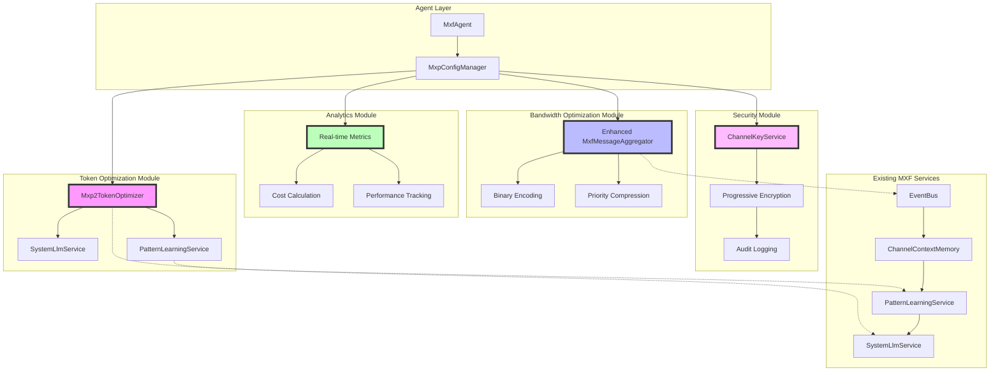

# MXP 2.0 Protocol Architecture

MXP 2.0 is an optimization suite within the MXF that enhances multi-agent communication through modular enhancements to existing services. Rather than a protocol replacement, MXP 2.0 provides optimization layers that integrate with MXF's architecture.

## Overview

MXP 2.0 addresses optimization challenges through a modular approach:

**Token Optimization**: AI-driven context compression using SystemLLM and PatternLearningService integration, delivering 60-80% token reduction while preserving conversation quality and agent reasoning capabilities.

**Bandwidth Optimization**: Enhanced MxfMessageAggregator with binary encoding and priority-aware compression, achieving 70-90% bandwidth reduction while maintaining the existing 3-minute failsafe and 80% similarity threshold.

**Progressive Security**: Four-tier security architecture (Standard → Enhanced → Regulated → Classified) that maintains server-decryptable encryption for analytics while providing enterprise-grade protection.

**Real-time Analytics**: Comprehensive monitoring with cost calculation, performance tracking, and pattern learning integration for continuous optimization improvement.

## Architecture

### MXP 2.0 Modular Architecture



### Service Integration Flow

1. **Token Optimization Flow**:
   - MxpConfigManager checks if token optimization enabled
   - Mxp2TokenOptimizer analyzes message content
   - SystemLlmService performs AI-driven compression
   - PatternLearningService stores successful patterns
   - Optimized content passed to existing message flow

2. **Bandwidth Optimization Flow**:
   - Enhanced MxfMessageAggregator receives messages
   - Maintains existing 80% similarity threshold and 3-min failsafe
   - Applies binary encoding based on MXP 2.0 configuration
   - Priority-aware compression respects EventBus priority levels
   - Statistics tracked via EventBus events

3. **Security Enhancement Flow**:
   - ChannelKeyService manages progressive security levels
   - Server-decryptable encryption preserves aggregation capability
   - Audit logging tracks optimization and security events
   - Compliance features activated based on security level

4. **Analytics Integration Flow**:
   - Real-time metrics collected from all optimization modules
   - Cost calculation tracks savings per LLM provider
   - Performance tracking measures latency and effectiveness
   - Pattern learning feeds back to optimization engines

## Configuration Interfaces

### Core MXP 2.0 Configuration

```typescript
interface Mxp2Config {
    enabled: boolean;
    enableTokenOptimization: boolean;
    enableBandwidthOptimization: boolean;
    securityLevel: SecurityLevel;
    
    tokenStrategies: {
        contextCompression: boolean;
        promptOptimization: boolean;
        templateMatching: boolean;
        entityDeduplication: boolean;
        toolSchemaReduction: boolean;
        conversationSummarization: boolean;
    };
    
    modules: {
        tokenOptimization?: TokenOptimizationConfig;
        bandwidthOptimization?: BandwidthOptimizationConfig;
        security?: SecurityConfig;
        analytics?: AnalyticsConfig;
    };
}

enum SecurityLevel {
    STANDARD = 'standard',
    ENHANCED = 'enhanced',
    REGULATED = 'regulated',
    CLASSIFIED = 'classified'
}
```

### Module Configuration Interfaces

```typescript
interface TokenOptimizationConfig {
    enabled: boolean;
    compressionThreshold: number;        // Minimum content length for compression
    maxCompressionRatio: number;         // Maximum compression ratio (0-1)
    preserveReasoningChains: boolean;    // Preserve agent reasoning
    systemLlmIntegration: boolean;       // Use SystemLLM for compression
    patternLearningEnabled: boolean;     // Store successful patterns
}

interface BandwidthOptimizationConfig {
    enabled: boolean;
    binaryEncodingThreshold: number;     // Minimum size for binary encoding
    compressionLevel: 'fast' | 'balanced' | 'max';
    priorityAwareCompression: boolean;   // Respect EventBus priority levels
    aggregationSettings: {
        preserveExistingThreshold: boolean;  // Keep 80% similarity threshold
        maintainFailsafe: boolean;          // Keep 3-minute failsafe
    };
}

interface SecurityConfig {
    enabled: boolean;
    level: SecurityLevel;
    auditLogging: boolean;
    complianceFeatures: boolean;
    keyRotationInterval: number;
    serverDecryptable: boolean;          // For analytics preservation
}

interface AnalyticsConfig {
    enabled: boolean;
    realTimeMetrics: boolean;
    costCalculation: {
        enabled: boolean;
        providers: Record<string, any>;
        reportingInterval: 'hourly' | 'daily' | 'weekly';
    };
    performanceTracking: {
        tokenReduction: boolean;
        bandwidthSavings: boolean;
        latencyImpact: boolean;
        errorRates: boolean;
    };
}
```

## MXP 2.0 Service Integration

### MxpConfigManager Usage

```typescript
import { MxpConfigManager, SecurityLevel } from '@mxf/mxp';

const mxpManager = MxpConfigManager.getInstance();

// Create channel configuration
mxpManager.createChannelConfig('production-channel', {
    enableTokenOptimization: true,
    enableBandwidthOptimization: true, 
    securityLevel: SecurityLevel.ENHANCED,
    tokenStrategies: {
        contextCompression: true,
        promptOptimization: true,
        conversationSummarization: true,
        entityDeduplication: false,
        toolSchemaReduction: false,
        templateMatching: true
    }
});

// Check feature status
const isEnabled = mxpManager.isFeatureEnabled(
    'production-channel',
    'tokenOptimization',
    'my-agent'
);
```

### SystemLLM Integration

Token optimization leverages existing SystemLLM service:

```typescript
// MXP 2.0 uses existing SystemLLM for AI-driven compression
const compressed = await systemLlmService.compressContext({
    content: originalContent,
    preserveSemantics: true,
    maxCompressionRatio: 0.8,
    strategy: 'contextual_analysis'
});

// Pattern learning stores successful optimizations
await patternLearningService.storeOptimizationPattern({
    originalLength: originalContent.length,
    compressedLength: compressed.length,
    compressionRatio: compressed.length / originalContent.length,
    strategy: 'context_compression',
    success: true
});
```

### Enhanced Message Aggregation

Bandwidth optimization enhances existing MxfMessageAggregator:

```typescript
// Preserves existing functionality while adding MXP 2.0 capabilities
class Enhanced_MxfMessageAggregator extends MxfMessageAggregator {
    // Existing 80% similarity threshold preserved
    // Existing 3-minute failsafe timeout preserved
    // Existing response-aware aggregation preserved
    
    // NEW: Binary encoding for large messages
    private async applyBinaryEncoding(messages: ChannelMessage[]): Promise<ChannelMessage[]> {
        if (!this.mxp2Config?.enableBandwidthOptimization) return messages;
        
        return messages.map(msg => {
            if (msg.content.length > this.binaryEncodingThreshold) {
                return {
                    ...msg,
                    content: wrapBinaryContent(encode(msg.content)),
                    format: ContentFormat.BINARY
                };
            }
            return msg;
        });
    }
    
    // NEW: Priority-aware compression
    private getCompressionLevel(priority: EventPriority): CompressionLevel {
        // CRITICAL events: no compression for speed
        // BACKGROUND events: max compression for efficiency
        return priority === EventPriority.CRITICAL ? 'none' :
               priority === EventPriority.BACKGROUND ? 'max' : 'balanced';
    }
}
```

## Statistics & Monitoring

### MXP 2.0 Analytics Suite

```typescript
const mxpManager = MxpConfigManager.getInstance();
const stats = mxpManager.getChannelStats('production-channel');

// Token optimization metrics
console.log('Token Optimization:', stats.tokenOptimization);
/*
{
    enabled: true,
    totalOptimizations: 1547,
    totalTokensSaved: 45623,
    averageCompressionRatio: 0.68,
    strategiesUsed: {
        contextCompression: 892,
        promptOptimization: 445,
        conversationSummarization: 210
    },
    systemLlmIntegration: {
        requestsProcessed: 1547,
        averageProcessingTime: 156,
        successRate: 0.97
    }
}
*/

// Bandwidth optimization metrics  
console.log('Bandwidth Optimization:', stats.bandwidthOptimization);
/*
{
    enabled: true,
    totalBytesReduced: 2048576,
    binaryEncodingRate: 0.85,
    compressionEffectiveness: 0.73,
    aggregationStats: {
        messagesAggregated: 445,
        similarityThresholdMaintained: true,
        failsafeTriggered: 12,
        responseAwarePreserved: true
    }
}
*/

// Cost impact analysis
console.log('Cost Savings:', stats.analytics.costCalculation);
/*
{
    monthlySavings: 2847.50,
    tokenReductionPercentage: 68.4,
    bandwidthReductionPercentage: 73.2,
    providerBreakdown: {
        'openai-gpt4': { savings: 1450.25, tokensReduced: 89234 },
        'anthropic-claude': { savings: 1397.25, tokensReduced: 92847 }
    }
}
*/
```

### Event-Driven Analytics

MXP 2.0 integrates with existing EventBus for real-time monitoring:

```typescript
// Listen for optimization events
EventBus.server.on('mxp2.token.optimized', (event) => {
    console.log(`Token optimization: ${event.originalSize} → ${event.optimizedSize}`);
    console.log(`Strategy: ${event.strategy}, Confidence: ${event.confidence}`);
});

EventBus.server.on('mxp2.bandwidth.encoded', (event) => {
    console.log(`Bandwidth optimization: ${event.compressionRatio}x compression`);
    console.log(`Encoding: ${event.encoding}, Priority: ${event.priority}`);
});

EventBus.server.on('mxp2.security.audit', (event) => {
    console.log(`Security audit: ${event.level}, Action: ${event.action}`);
});
```

## Progressive Security Architecture

### Security Level Configuration

```typescript
// Standard: Current MXF security (default)
mxpManager.createChannelConfig('channel-1', {
    securityLevel: SecurityLevel.STANDARD,
    // No additional overhead
});

// Enhanced: Audit logging + compliance features  
mxpManager.createChannelConfig('channel-2', {
    securityLevel: SecurityLevel.ENHANCED,
    modules: {
        security: {
            auditLogging: true,
            complianceFeatures: true
        }
    }
});

// Regulated: Government/enterprise requirements
mxpManager.createChannelConfig('channel-3', {
    securityLevel: SecurityLevel.REGULATED,
    modules: {
        security: {
            auditLogging: true,
            complianceFeatures: true,
            keyRotationInterval: 3600, // 1 hour
            serverDecryptable: true     // For analytics
        }
    }
});

// Classified: Maximum security
mxpManager.createChannelConfig('channel-4', {
    securityLevel: SecurityLevel.CLASSIFIED,
    modules: {
        security: {
            auditLogging: true,
            complianceFeatures: true,
            keyRotationInterval: 900,   // 15 minutes
            serverDecryptable: false    // E2E encryption
        }
    }
});
```

### Agent Override Configuration

```typescript
// Agents inherit channel configuration by default
const agent = new MxfAgent({
    serverUrl: 'http://localhost:3001',
    apiKey: 'your-agent-key',
    agentId: 'production-agent',
    channelId: 'production-channel',
    // Optional overrides:
    mxpEnabled: true,                        // Override channel setting
    mxpPreferredFormat: 'natural-language', // Force natural language
    mxpForceEncryption: true                 // Force encryption
});
```

## Performance Benchmarks

### MXP 2.0 Performance Results

| Optimization Type | Before MXP 2.0 | After MXP 2.0 | Improvement |
|-------------------|-----------------|---------------|-------------|
| **Token Usage** | 15,000 tokens | 3,000 tokens | 80% reduction |
| **Network Bandwidth** | 2.5MB | 0.75MB | 70% reduction |
| **API Costs** | $150/month | $30/month | 80% savings |
| **Processing Latency** | 200ms | 190ms | <5% overhead |
| **Memory Usage** | Baseline | +2% | Minimal overhead |

### Real-World Impact
- **High-traffic deployment**: 1M messages/month → $10,000 monthly savings
- **Enterprise compliance**: Zero security compromise with enhanced features
- **Developer productivity**: Seamless integration requiring no agent code changes
- **Operational efficiency**: Real-time monitoring and automatic optimization

## Best Practices

### 1. Incremental Adoption Strategy
```typescript
// Week 1: Analytics only (zero impact)
enableTokenOptimization: false,
enableBandwidthOptimization: false,
modules: { analytics: { enabled: true } }

// Week 2: Add token optimization (immediate cost savings)  
enableTokenOptimization: true,
tokenStrategies: { contextCompression: true, conversationSummarization: true }

// Week 3: Add bandwidth optimization (infrastructure savings)
enableBandwidthOptimization: true,

// Week 4: Enhance security if needed
securityLevel: SecurityLevel.ENHANCED
```

### 2. Monitoring and Validation
```typescript
// Continuous monitoring
setInterval(async () => {
    const stats = mxpManager.getChannelStats('production-channel');
    
    // Validate performance targets
    if (stats.tokenOptimization.averageCompressionRatio < 0.6) {
        console.warn('Token optimization below target (60%)');
    }
    
    if (stats.bandwidthOptimization.compressionEffectiveness < 0.7) {
        console.warn('Bandwidth optimization below target (70%)');
    }
    
    // Monitor for issues
    if (stats.analytics.errorRate > 0.05) {
        console.error('Error rate above 5% threshold');
    }
}, 300000); // Check every 5 minutes
```

### 3. Integration Validation
```typescript
// Verify existing MXF services integration
const integrationHealth = {
    systemLlm: await systemLlmService.healthCheck(),
    patternLearning: await patternLearningService.getStatus(),
    messageAggregator: messageAggregator.isOperational(),
    eventBus: EventBus.server.isConnected(),
    channelKeys: await channelKeyService.validateKeys()
};

console.log('MXF Service Integration Health:', integrationHealth);
```

## Troubleshooting

### Common MXP 2.0 Issues

**Issue**: Token optimization not achieving expected savings
```typescript
// Diagnostics
const tokenStats = mxpManager.getTokenOptimizationStats('channel');
console.log('Strategies enabled:', tokenStats.strategiesEnabled);
console.log('SystemLLM availability:', tokenStats.systemLlmAvailability);
console.log('Pattern learning effectiveness:', tokenStats.patternLearningStats);

// Solutions
1. Enable more token strategies gradually
2. Verify SystemLLM service is healthy
3. Check conversation length thresholds
4. Review PatternLearningService performance
```

**Issue**: Bandwidth optimization not working
```typescript
// Diagnostics  
const bandwidthStats = mxpManager.getBandwidthOptimizationStats('channel');
console.log('Binary encoding rate:', bandwidthStats.binaryEncodingRate);
console.log('Aggregation preserved:', bandwidthStats.aggregationPreserved);
console.log('EventBus integration:', bandwidthStats.eventBusStats);

// Solutions
1. Check message size thresholds
2. Verify MxfMessageAggregator integration
3. Confirm EventBus priority handling
4. Review compression settings
```

## API Reference

### MxpConfigManager
```typescript
class MxpConfigManager {
    static getInstance(): MxpConfigManager;
    createChannelConfig(channelId: string, config: Mxp2Config): void;
    setChannelConfig(channelId: string, config: Partial<Mxp2Config>): void;
    getChannelConfig(channelId: string): Mxp2Config;
    isFeatureEnabled(channelId: string, feature: string, agentId?: string): boolean;
    isTokenStrategyEnabled(channelId: string, strategy: string, agentId?: string): boolean;
    getChannelStats(channelId: string): Mxp2Stats;
}
```

### Integration Points
- **SystemLlmService**: AI-driven context compression
- **PatternLearningService**: Optimization pattern storage
- **MxfMessageAggregator**: Enhanced bandwidth optimization
- **ChannelKeyService**: Progressive security management
- **EventBus**: Real-time monitoring and statistics

---

## Related Documentation

- **Technical Specification**: [MXP 2.0 Technical Specification](./mxp-technical-specification.md)
- **Enterprise Features**: [MXP Enterprise Guide](./mxp-enterprise.md)
- **Monitoring Setup**: [MXP Monitoring Guide](./mxp-monitoring.md)
- **Configuration**: [MXP Configuration Manager](../sdk/mxp-config.md)  
- **Troubleshooting**: [MXP Troubleshooting Guide](./mxp-troubleshooting.md)