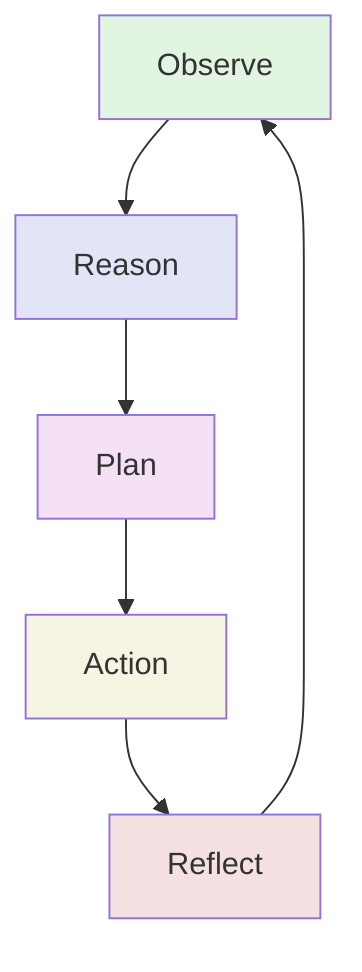

# ORPAR: MXF's Cognitive Cycle Pattern

**ORPAR** (Observe, Reason, Plan, Action, Reflect) is MXF's proprietary cognitive cycle pattern for autonomous agent behavior. It provides a structured framework for agents to process information, make decisions, and learn from outcomes.

## Overview

ORPAR is a five-phase cognitive cycle that enables agents to operate autonomously with built-in learning and adaptation capabilities. Unlike traditional control loops, ORPAR integrates AI-powered reasoning at each phase and maintains context across the entire cycle.



## The Five Phases

### 1. Observe (O)

**Purpose**: Gather and process environmental data, agent inputs, and system state.

**Implementation**:
- Agents submit observations via `ControlLoopHandlers.submitObservation()`
- Server stores observations in queue via `ControlLoop.addObservation()`
- Observations are enriched with metadata (source, timestamp, confidence)
- Fast, efficient models process observations (e.g., `gemini-2.0-flash-lite-001`)

**Observation Structure**:
```typescript
interface Observation {
    id: string;
    agentId: AgentId;
    source: string;          // 'user', 'system', 'agent'
    content: any;            // Observation data
    timestamp: number;
    metadata?: Record<string, any>;
}
```

**Key Features**:
- Cross-agent observations (agents can observe each other)
- Batch observation processing
- Priority-based observation queuing
- Automatic observation enrichment

### 2. Reason (R)

**Purpose**: Analyze observations and generate insights using AI-powered reasoning.

**Implementation**:
- `ControlLoop.processObservations()` triggers reasoning phase
- `SystemLlmService.processObservationData()` performs AI analysis
- Advanced reasoning models analyze patterns (e.g., `claude-3.5-sonnet`)
- Coordination-focused analysis identifies collaboration opportunities

**Reasoning Structure**:
```typescript
interface Reasoning {
    id: string;
    agentId: AgentId;
    content: string;         // Reasoning analysis
    timestamp: number;
    metadata?: Record<string, any>;
}
```

**AI-Powered Analysis**:
- Cross-agent collaboration patterns
- Skill synergy detection
- Communication flow optimization
- Resource coordination opportunities
- Strategic insights

### 3. Plan (P)

**Purpose**: Create actionable, prioritized plans based on reasoning.

**Implementation**:
- `ControlLoop.createPlan()` generates plans from reasoning
- `SystemLlmService.createPlan()` uses strategic planning models
- JSON schema enforcement ensures structured plans
- Plans include ordered actions with dependencies

**Plan Structure**:
```typescript
interface Plan {
    id: string;
    agentId: AgentId;
    reasoningId: string;
    actions: PlanAction[];   // Ordered actions
    timestamp: number;
    goal: string;
    description: string;
    createdAt: Date;
    status: 'created' | 'executing' | 'completed' | 'failed' | 'aborted';
    metadata?: Record<string, any>;
}

interface PlanAction {
    id: string;
    description: string;
    action: string;          // Action identifier
    parameters: any;
    priority: number;        // Lower = higher priority
    dependencies?: string[]; // Action IDs that must complete first
    status: ActionStatus;
    result?: any;
    error?: string;
}
```

**Strategic Planning Features**:
- Multi-agent coordination objectives
- Cross-agent communication strategy
- Resource sharing protocols
- Collaborative task distribution
- Success metrics definition

### 4. Action (A)

**Purpose**: Execute planned actions reliably and efficiently.

**Implementation**:
- `ControlLoop.executePlan()` executes actions in order
- Respects action dependencies and priorities
- Reliable execution models ensure consistency (e.g., `gpt-4o-mini`)
- Action results become new observations

**Execution Modes**:
- **Sequential**: Execute actions one at a time (default)
- **Parallel**: Execute independent actions simultaneously
- **Conditional**: Execute based on runtime conditions

**Action Status Tracking**:
```typescript
type ActionStatus = 'pending' | 'executing' | 'completed' | 'failed' | 'aborted' | 'skipped';
```

### 5. Reflect (R)

**Purpose**: Meta-cognitive analysis of cycle performance and learning extraction.

**Implementation**:
- `ControlLoop.reflect()` analyzes completed plans
- `SystemLlmService.generateReflection()` performs meta-cognitive evaluation
- Reflection models assess effectiveness (e.g., `claude-3.5-sonnet`)
- Insights feed into pattern learning system

**Reflection Structure**:
```typescript
interface Reflection {
    id: string;
    agentId: AgentId;
    planId: string;
    success: boolean;
    insights: string[];      // Key learnings
    improvements: string[];  // Suggested improvements
    metadata?: Record<string, any>;
    timestamp: number;
}
```

**Meta-Cognitive Analysis**:
- Multi-agent coordination effectiveness
- Cross-agent learning opportunities
- Collaborative efficiency assessment
- Communication pattern analysis
- Resource utilization optimization

## Context Persistence

ORPAR maintains context across all phases through `OraprContext`:

```typescript
interface OraprContext {
    id: string;
    agentId: string;
    channelId: string;
    cycleId: string;
    phase: OraprOperationType;
    timestamp: number;
    previousPhaseResults?: {
        observation?: any;
        reasoning?: any;
        planning?: any;
        action?: any;
        reflection?: any;
    };
    sharedContext?: {
        goals: string[];
        constraints: string[];
        resources: string[];
        insights: string[];
        confidence: number;
    };
    metadata: {
        startTime: number;
        phaseCompletionTimes: Map<OraprOperationType, number>;
        modelUsage: Map<OraprOperationType, string>;
        errors: string[];
    };
}
```

## Model Selection Strategy

Each ORPAR phase uses models optimized for specific cognitive requirements:

### OpenRouter Default Configuration
```typescript
const ORPAR_MODEL_CONFIGS = {
    observation: 'google/gemini-2.0-flash-lite-001',     // Fast data processing
    reasoning: 'anthropic/claude-3.5-sonnet',            // Advanced reasoning
    action: 'openai/gpt-4o-mini',                        // Reliable execution
    planning: 'google/gemini-2.5-pro-preview-05-06',    // Strategic planning
    reflection: 'anthropic/claude-3.5-sonnet'           // Meta-cognitive analysis
};
```

### Dynamic Complexity-Based Selection

Models automatically upgrade based on context complexity:

**Complexity Factors**:
- Completed phases (0.2 per phase)
- Error count (0.5 per error)
- Context richness (0.1 per element)
- Previous results size (0.3-0.8 based on size)
- Confidence level ((1 - confidence) * 0.5)
- Time elapsed (0.2 per hour)
- Model usage variance (0.3-0.5)

**Complexity Thresholds**:
- **Simple**: < 1.2 complexity score → Use base models
- **Moderate**: 1.2 - 3.0 → Use upgraded models
- **Complex**: > 3.0 → Use premium models

**Example Upgrade Path**:
```
observation (simple):  gemini-2.0-flash-lite-001
observation (moderate): openai/gpt-4o-mini
observation (complex):  anthropic/claude-3.5-sonnet

reasoning (simple):  claude-3.5-sonnet
reasoning (moderate): claude-3.5-sonnet:beta
reasoning (complex):  claude-3-opus

planning (simple):  gemini-2.5-pro-preview
planning (moderate): openai/o1-mini
planning (complex):  openai/o1-preview
```

## Event Flow

ORPAR cycles are fully event-driven:

```typescript
// Phase Events
ControlLoopEvents.OBSERVATION     // Observation submitted
ControlLoopEvents.REASONING       // Reasoning generated
ControlLoopEvents.PLAN            // Plan created
ControlLoopEvents.ACTION          // Action executed
ControlLoopEvents.REFLECTION      // Reflection completed

// Lifecycle Events
ControlLoopEvents.INITIALIZE      // Control loop initialization
ControlLoopEvents.INITIALIZED     // Control loop ready
ControlLoopEvents.STARTED         // Cycle execution started
ControlLoopEvents.STOPPED         // Cycle execution stopped
ControlLoopEvents.ERROR           // Error occurred
```

## Pattern Learning Integration

ORPAR integrates with MXF's pattern learning system:

```typescript
// Complete ORPAR cycles are tracked for pattern analysis
if (phase === 'reflection' && hasCompleteOrapr) {
    patternMemoryService.analyzeSequenceForPatterns(
        channelId,
        agentId,
        ['observation', 'reasoning', 'planning', 'action', 'reflection'],
        { cycle: 'complete_orapr', timestamp: Date.now() }
    );
}
```

**Pattern Analysis**:
- Sequence pattern detection
- Confidence scoring (> 0.6 threshold)
- Pattern effectiveness tracking
- Tool usage correlation
- Execution time analysis

## MCP Tools for ORPAR

MXF provides MCP tools for each ORPAR phase:

```typescript
// Available ORPAR Tools
CONTROL_LOOP_TOOLS = {
    OBSERVE: 'controlLoop_observe',      // Submit observations
    REASON: 'controlLoop_reason',        // Trigger reasoning
    PLAN: 'controlLoop_plan',            // Create/modify plans
    EXECUTE: 'controlLoop_execute',      // Execute actions
    REFLECT: 'controlLoop_reflect'       // Generate reflections
};
```

Each tool:
- Has strict JSON schema validation
- Supports priority/timeout/retry policies
- Emits appropriate control loop events
- Returns structured results

## Performance Characteristics

### Cycle Latency
- **P50**: < 100ms (simple cycles)
- **P95**: < 200ms (moderate complexity)
- **P99**: < 500ms (complex cycles)

### Throughput
- **Observations**: 10K+ observations/sec
- **Cycles**: 1K+ complete cycles/sec
- **Model Selection**: < 5ms overhead
- **Complexity Assessment**: < 10ms

### Error Recovery

Built-in error recovery with configurable policies:

```typescript
interface ErrorRecoveryConfig {
    maxConsecutiveErrors?: number;   // Default: 3
    maxRetries?: number;             // Default: 3
    retryDelay?: number;             // Default: 1000ms (exponential backoff)
    enableAutoHealing?: boolean;     // Default: true
}
```

## Usage Example

```typescript
// Initialize control loop with ORPAR
const loopId = await controlLoopHandlers.initializeControlLoop({
    agentId: 'agent-123',
    channelId: 'channel-456',
    cycleInterval: 1000,
    maxObservations: 10,
    errorRecovery: {
        maxConsecutiveErrors: 3,
        enableAutoHealing: true
    }
});

// Submit observation (Observe phase)
await controlLoopHandlers.submitObservation(loopId, {
    id: uuidv4(),
    agentId: 'agent-123',
    source: 'user',
    content: { message: 'Process this request' },
    timestamp: Date.now()
});

// Cycle automatically proceeds through:
// 1. Reason - AI analyzes observation
// 2. Plan - AI creates action plan
// 3. Action - Execute planned actions
// 4. Reflect - Learn from execution
// 5. Back to Observe - Ready for new observations
```

## Best Practices

### 1. Observation Quality
- Provide structured, consistent observations
- Include sufficient context in metadata
- Use appropriate confidence scores
- Batch related observations when possible

### 2. Model Selection
- Use default ORPAR models for most cases
- Override only for specialized requirements
- Monitor complexity scores and upgrade paths
- Balance cost vs. performance

### 3. Cycle Timing
- Set appropriate `cycleInterval` for use case
- Balance responsiveness with resource usage
- Use `minCycleInterval` protection (100ms default)
- Monitor cycle completion times

### 4. Pattern Learning
- Enable pattern learning for repetitive tasks
- Review detected patterns regularly
- Use patterns to optimize future cycles
- Share patterns across related agents

### 5. Error Handling
- Implement robust error recovery strategies
- Monitor consecutive error counts
- Use auto-healing for transient errors
- Log errors for pattern analysis

### 6. Cross-Agent Coordination
- Use `submitObservation()` with `loopOwnerId` for cross-agent observations
- Leverage reflection insights for coordination improvement
- Monitor multi-agent collaboration patterns
- Share successful strategies across agents

## Comparison with Traditional Control Loops

| Feature | Traditional Loop | ORPAR |
|---------|-----------------|-------|
| **Phases** | Sense → Think → Act | Observe → Reason → Plan → Action → Reflect |
| **AI Integration** | Optional | Native at each phase |
| **Context Persistence** | Limited | Full cycle context |
| **Learning** | External | Built-in reflection |
| **Model Selection** | Single model | Phase-optimized models |
| **Complexity Adaptation** | Manual | Automatic |
| **Pattern Recognition** | Manual | Automatic |
| **Multi-Agent** | Complex | Native support |

## Integration with MXF Components

### Memory System
- Agent memory scope for observations
- Channel memory for shared context
- Pattern memory for learning
- Relationship memory for coordination

### Task System
- Tasks trigger ORPAR cycles
- Reflection feeds task effectiveness
- Action results update task progress
- Plan completion marks task milestones

### MCP System
- ORPAR phase tools available via MCP
- Tool execution results become observations
- Tool recommendations during planning
- Error recovery suggestions

### Analytics
- Agent performance tracking
- Pattern learning metrics
- Validation performance
- Cycle efficiency analysis

## Advanced Features

### Cost-Aware Model Selection

Select models based on budget constraints:

```typescript
// Budget tiers
ULTRA_CHEAP: < $0.10/1M tokens
BUDGET: < $1.00/1M tokens
STANDARD: < $5.00/1M tokens
PREMIUM: < $15.00/1M tokens
ULTRA_PREMIUM: reasoning models
```

### Load-Balanced Model Selection

Distribute load across providers:

```typescript
// Rotate through providers based on time/load
providerRotation: ['anthropic', 'openai', 'google']
```

### Specialized Model Selection

Use specialized models for specific tasks:

```typescript
specializations: {
    reasoning: 'openai/o1-preview',
    coding: 'deepseek/deepseek-r1-preview',
    analysis: 'anthropic/claude-3-opus',
    creative: 'google/gemini-2.5-pro',
    multilingual: 'qwen/qwen-2.5-72b',
    speed: 'google/gemini-2.0-flash-lite'
}
```

## Summary

ORPAR is MXF's signature cognitive cycle pattern that enables sophisticated autonomous agent behavior through:

1. **Structured Decision-Making**: Five distinct phases ensure thorough processing
2. **AI-Powered Intelligence**: Each phase uses optimized AI models
3. **Dynamic Adaptation**: Automatic complexity-based model selection
4. **Built-In Learning**: Reflection phase enables continuous improvement
5. **Multi-Agent Coordination**: Native support for agent collaboration
6. **Event-Driven Architecture**: Real-time updates and monitoring
7. **Pattern Recognition**: Automatic detection and application of successful patterns
8. **Context Persistence**: Full cycle context maintained across phases

ORPAR represents MXF's commitment to building truly intelligent, self-improving autonomous agent systems.

## Related Documentation

- [Control Loop API](../api/control-loop.md) - REST and WebSocket APIs
- [SystemLLM Service](system-llm.md) - AI service powering ORPAR
- [Key Concepts](key-concepts.md) - Fundamental MXF concepts
- [SDK Handlers](../sdk/handlers.md) - Client-side ORPAR implementation
- [Server Services](server-services.md) - Server-side architecture
