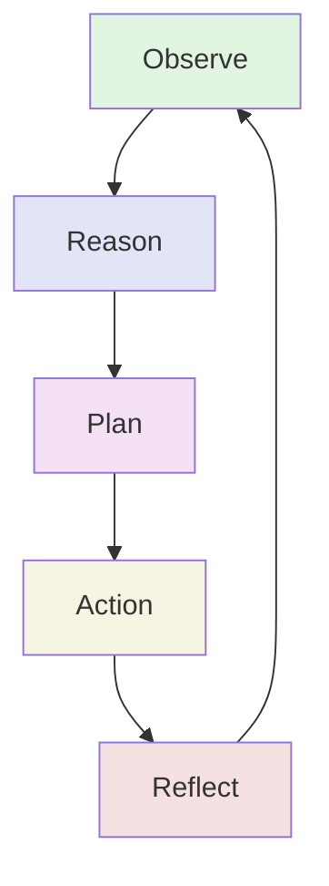

# ORPAR: MXF's Cognitive Cycle Pattern

**ORPAR** (Observe, Reason, Plan, Action, Reflect) is MXF's proprietary cognitive cycle pattern for autonomous agent behavior. It provides a structured framework for agents to process information, make decisions, and learn from outcomes.

## Overview

ORPAR is a five-phase cognitive cycle that enables agents to operate autonomously with built-in learning and adaptation capabilities. Unlike traditional control loops, ORPAR integrates AI-powered reasoning at each phase and maintains context across the entire cycle.

<div class="mermaid-fallback">



</div>

<iframe src="../diagram/orpar-control-loop.html" width="100%" height="750" style="border: none; border-radius: 10px; background: var(--bg-secondary);"></iframe>

## When to Use ORPAR

ORPAR is a powerful cognitive framework, but it's not appropriate for every scenario. Understanding when to use it—and when to skip it—will help you build more effective agent systems.

### Ideal Use Cases

**Long-Running Tasks with Structured Thought**

ORPAR is designed for tasks where deliberate, step-by-step cognitive processing matters. The five-phase cycle introduces intentional pacing that benefits complex problem-solving, multi-step reasoning, and tasks requiring adaptation over time. If your task takes multiple turns or requires the agent to build on previous observations, ORPAR provides the structure to do this effectively.

**Multi-Tool Coordination During the ACT Phase**

The ACT phase is designed to work alongside other tool calls. Agents can combine memory tools, domain-specific tools, and communication tools within the ORPAR cycle. For long-running tasks, this integration between cognitive structure and tool execution creates a powerful feedback loop—the agent observes outcomes, reasons about them, plans next steps, acts using available tools, and reflects on results.

**Tasks Requiring Explainability**

Since ORPAR forces agents to document each cognitive phase, it creates an audit trail of the agent's thinking. This is valuable for debugging, training, and demonstrating how the agent reached a conclusion.

### Model Selection Considerations

ORPAR works well with both reasoning and non-reasoning models. In some cases, **non-reasoning models produce more creative and varied results** because they lack the reinforcement learning constraints that can make reasoning models more conservative. Additionally, non-reasoning models are typically less expensive, making ORPAR a cost-effective choice for tasks that benefit from structured cognition without requiring deep reasoning at every step.

The framework already includes dynamic model selection per phase—fast models for observation, deep models for reasoning—so you can balance cost and capability based on the cognitive requirements of each phase.

### When NOT to Use ORPAR

**Simple One-Shot Tasks**

ORPAR is overkill for straightforward tasks where a reasoning model can complete the work in a single turn without structured deliberation. If your agent just needs to answer a question, make a single API call, or perform a quick transformation, skip ORPAR and let the model work directly.

**Time-Sensitive Operations**

Because ORPAR is intentionally deliberate, it adds latency. Each phase involves model calls, state tracking, and potential tool execution. For real-time interactions or latency-sensitive operations, a simpler control flow is more appropriate.

### The ORPAR Tools as Feedback Mechanisms

The ORPAR tools (`orpar_observe`, `orpar_reason`, `orpar_plan`, `orpar_act`, `orpar_reflect`) are **documentation and feedback tools**, not orchestration tools. They record what the agent did at each phase and update the system on progress. It's up to the developer to design how agents use these tools in combination with domain-specific tools to leverage the cognitive cycle effectively.

For a working example that demonstrates this pattern, see the [Twenty Questions demo](../examples/twenty-questions.md), which shows two agents using ORPAR phases alongside game-specific tools, Knowledge Graph entity tracking, MULS memory rewards, and TensorFlow ML risk assessment to play a complete game with observable cognitive cycles and phase-gated tool access.

## The Five Phases

### 1. Observe (O)

**Purpose**: Gather and process environmental data, agent inputs, and system state.

**Implementation**:
- Agents submit observations via `ControlLoopHandlers.submitObservation()`
- Server stores observations in queue via `ControlLoop.addObservation()`
- Observations are enriched with metadata (source, timestamp, confidence)
- Fast, efficient models process observations (e.g., `gemini-2.5-flash`)

**Observation Structure**:
```typescript
interface Observation {
    id: string;
    agentId: AgentId;
    source: string;          // 'user', 'system', 'agent'
    content: any;            // Observation data
    timestamp: number;
    metadata?: Record<string, any>;
}
```

**Key Features**:
- Cross-agent observations (agents can observe each other)
- Batch observation processing
- Priority-based observation queuing
- Automatic observation enrichment

### 2. Reason (R)

**Purpose**: Analyze observations and generate insights using AI-powered reasoning.

**Implementation**:
- `ControlLoop.processObservations()` triggers reasoning phase
- `SystemLlmService.processObservationData()` performs AI analysis
- Advanced reasoning models analyze patterns (e.g., `claude-opus-4.5`)
- Coordination-focused analysis identifies collaboration opportunities

**Reasoning Structure**:
```typescript
interface Reasoning {
    id: string;
    agentId: AgentId;
    content: string;         // Reasoning analysis
    timestamp: number;
    metadata?: Record<string, any>;
}
```

**AI-Powered Analysis**:
- Cross-agent collaboration patterns
- Skill synergy detection
- Communication flow optimization
- Resource coordination opportunities
- Strategic insights

### 3. Plan (P)

**Purpose**: Create actionable, prioritized plans based on reasoning.

**Implementation**:
- `ControlLoop.createPlan()` generates plans from reasoning
- `SystemLlmService.createPlan()` uses strategic planning models
- JSON schema enforcement ensures structured plans
- Plans include ordered actions with dependencies

**Plan Structure**:
```typescript
interface Plan {
    id: string;
    agentId: AgentId;
    reasoningId: string;
    actions: PlanAction[];   // Ordered actions
    timestamp: number;
    goal: string;
    description: string;
    createdAt: Date;
    status: 'created' | 'executing' | 'completed' | 'failed' | 'aborted';
    metadata?: Record<string, any>;
}

interface PlanAction {
    id: string;
    description: string;
    action: string;          // Action identifier
    parameters: any;
    priority: number;        // Lower = higher priority
    dependencies?: string[]; // Action IDs that must complete first
    status: ActionStatus;
    result?: any;
    error?: string;
}
```

**Strategic Planning Features**:
- Multi-agent coordination objectives
- Cross-agent communication strategy
- Resource sharing protocols
- Collaborative task distribution
- Success metrics definition

### 4. Action (A)

**Purpose**: Execute planned actions reliably and efficiently.

**Implementation**:
- `ControlLoop.executePlan()` executes actions in order
- Respects action dependencies and priorities
- Reliable execution models ensure consistency (e.g., `claude-haiku-4.5`)
- Action results become new observations

**Execution Modes**:
- **Sequential**: Execute actions one at a time (default)
- **Parallel**: Execute independent actions simultaneously
- **Conditional**: Execute based on runtime conditions

**Action Status Tracking**:
```typescript
type ActionStatus = 'pending' | 'executing' | 'completed' | 'failed' | 'aborted' | 'skipped';
```

### 5. Reflect (R)

**Purpose**: Meta-cognitive analysis of cycle performance and learning extraction.

**Implementation**:
- `ControlLoop.reflect()` analyzes completed plans
- `SystemLlmService.generateReflection()` performs meta-cognitive evaluation
- Reflection models assess effectiveness (e.g., `claude-opus-4.5`)
- Insights feed into pattern learning system

**Reflection Structure**:
```typescript
interface Reflection {
    id: string;
    agentId: AgentId;
    planId: string;
    success: boolean;
    insights: string[];      // Key learnings
    improvements: string[];  // Suggested improvements
    metadata?: Record<string, any>;
    timestamp: number;
}
```

**Meta-Cognitive Analysis**:
- Multi-agent coordination effectiveness
- Cross-agent learning opportunities
- Collaborative efficiency assessment
- Communication pattern analysis
- Resource utilization optimization

## Context Persistence

ORPAR maintains context across all phases through `OrparContext`:

```typescript
interface OrparContext {
    id: string;
    agentId: string;
    channelId: string;
    cycleId: string;
    phase: OrparOperationType;
    timestamp: number;
    previousPhaseResults?: {
        observation?: any;
        reasoning?: any;
        planning?: any;
        action?: any;
        reflection?: any;
    };
    sharedContext?: {
        goals: string[];
        constraints: string[];
        resources: string[];
        insights: string[];
        confidence: number;
    };
    metadata: {
        startTime: number;
        phaseCompletionTimes: Map<OrparOperationType, number>;
        modelUsage: Map<OrparOperationType, string>;
        errors: string[];
    };
}
```

## Model Selection Strategy

Each ORPAR phase uses models optimized for specific cognitive requirements:

### OpenRouter Default Configuration
```typescript
const ORPAR_MODEL_CONFIGS = {
    observation: 'google/gemini-2.5-flash',              // Fast data processing
    reasoning: 'anthropic/claude-opus-4.5',              // Advanced reasoning
    action: 'anthropic/claude-haiku-4.5',                // Reliable execution
    planning: 'google/gemini-2.5-pro-preview-06-05',    // Strategic planning
    reflection: 'anthropic/claude-opus-4.5'              // Meta-cognitive analysis
};
```

### Dynamic Complexity-Based Selection

Models automatically upgrade based on context complexity:

**Complexity Factors**:
- Completed phases (0.2 per phase)
- Error count (0.5 per error)
- Context richness (0.1 per element)
- Previous results size (0.3-0.8 based on size)
- Confidence level ((1 - confidence) * 0.5)
- Time elapsed (0.2 per hour)
- Model usage variance (0.3-0.5)

**Complexity Thresholds**:
- **Simple**: < 1.2 complexity score → Use base models
- **Moderate**: 1.2 - 3.0 → Use upgraded models
- **Complex**: > 3.0 → Use premium models

**Example Upgrade Path**:
```
observation (simple):  google/gemini-2.5-flash
observation (moderate): anthropic/claude-haiku-4.5
observation (complex):  anthropic/claude-sonnet-4.5

reasoning (simple):  anthropic/claude-opus-4.5
reasoning (moderate): anthropic/claude-opus-4.5
reasoning (complex):  anthropic/claude-opus-4.5

planning (simple):  google/gemini-2.5-pro-preview-06-05
planning (moderate): anthropic/claude-sonnet-4.5
planning (complex):  anthropic/claude-opus-4.5
```

## Event Flow

ORPAR cycles are fully event-driven:

```typescript
// Phase Events
ControlLoopEvents.OBSERVATION     // Observation submitted
ControlLoopEvents.REASONING       // Reasoning generated
ControlLoopEvents.PLAN            // Plan created
ControlLoopEvents.ACTION          // Action executed
ControlLoopEvents.REFLECTION      // Reflection completed

// Lifecycle Events
ControlLoopEvents.INITIALIZE      // Control loop initialization
ControlLoopEvents.INITIALIZED     // Control loop ready
ControlLoopEvents.STARTED         // Cycle execution started
ControlLoopEvents.STOPPED         // Cycle execution stopped
ControlLoopEvents.ERROR           // Error occurred
```

## Pattern Learning Integration

ORPAR integrates with MXF's pattern learning system:

```typescript
// Complete ORPAR cycles are tracked for pattern analysis
if (phase === 'reflection' && hasCompleteOrpar) {
    patternMemoryService.analyzeSequenceForPatterns(
        channelId,
        agentId,
        ['observation', 'reasoning', 'planning', 'action', 'reflection'],
        { cycle: 'complete_orpar', timestamp: Date.now() }
    );
}
```

**Pattern Analysis**:
- Sequence pattern detection
- Confidence scoring (> 0.6 threshold)
- Pattern effectiveness tracking
- Tool usage correlation
- Execution time analysis

## MCP Tools for ORPAR

MXF provides two approaches for ORPAR phase management:

### 1. ORPAR Cognitive Tools (Agent-Driven)

These tools enable agents to **explicitly structure their thinking** using the ORPAR pattern. When agents have these tools in their `allowedTools`, they are expected to document each phase of their cognitive process:

```typescript
// ORPAR Cognitive Tools
ORPAR_TOOLS = {
    OBSERVE: 'orpar_observe',    // Document observations
    REASON: 'orpar_reason',      // Record reasoning analysis
    PLAN: 'orpar_plan',          // Create action plan
    ACT: 'orpar_act',            // Record action execution
    REFLECT: 'orpar_reflect',    // Document reflection
    STATUS: 'orpar_status'       // Check current phase
};
```

### ORPAR State Management

Each agent maintains ORPAR state tracking per channel. This state persists across API calls within a task but should be cleared between distinct tasks to ensure agents start fresh cognitive cycles.

**Automatic Stale State Detection**

The `orpar_status` tool automatically detects stale state by comparing available tools with the current phase. If `orpar_observe` is allowed (indicating a new task/cycle should start) but the tracked phase is not OBSERVE, the state is automatically cleared:

```typescript
// Example: Agent in 'plan' phase but orpar_observe is in allowedTools
// This indicates a new task - state is automatically reset
const result = await agent.callTool('orpar_status', {});
// Returns: { currentPhase: 'none', nextTool: 'orpar_observe', note: 'Previous cycle state cleared' }
```

**Explicit State Clearing via CLEAR_STATE Event**

For explicit control, use the `OrparEvents.CLEAR_STATE` event:

```typescript
import { EventBus } from '../events/EventBus';
import { OrparEvents } from '../events/event-definitions/OrparEvents';
import { createBaseEventPayload } from '../schemas/EventPayloadSchema';

// Clear ORPAR state when starting a new task
EventBus.client.emit(OrparEvents.CLEAR_STATE, createBaseEventPayload(
    OrparEvents.CLEAR_STATE,
    agentId,
    channelId,
    { reason: 'New task starting', previousPhase: 'reflect' },
    { source: 'MyApplication' }
));
```

**Best Practice: Clear State Between Tasks**

When building turn-based or task-based applications, clear both conversation history and ORPAR state between tasks:

```typescript
// Clear conversation history for fresh context
const memoryManager = agent.getMemoryManager?.();
if (memoryManager?.clearConversationHistory) {
    memoryManager.clearConversationHistory();
}

// Clear ORPAR state via EventBus
EventBus.client.emit(OrparEvents.CLEAR_STATE, createBaseEventPayload(
    OrparEvents.CLEAR_STATE,
    agentId,
    channelId,
    { reason: 'New task starting' },
    { source: 'MyApplication' }
));
```

**Key Features:**

- **Flow Validation**: Enforces the cognitive cycle sequence
  ```
  observe → reason → plan → act → reflect → observe (new cycle)
  ```

- **Error Guidance**: Returns helpful errors if phases are skipped
  ```json
  {
    "success": false,
    "error": "Invalid ORPAR transition: Cannot go from 'observe' to 'act'. Expected: reason",
    "hint": "You must REASON about your observations before planning."
  }
  ```

- **ControlLoop Integration**: Emits corresponding `ControlLoopEvents.*` to the server

- **Per-Agent State Tracking**: Tracks cycle count, phase history, current phase

**Example Usage:**

```typescript
// Agent documents their observation
await agent.callTool('orpar_observe', {
    observations: 'The game shows 3 questions asked. Q1: "Is it alive?" → YES.',
    keyFacts: ['The secret is alive', 'It is a mammal']
});

// Agent documents their reasoning
await agent.callTool('orpar_reason', {
    analysis: 'Based on "alive" and "mammal", likely a pet or wild animal.',
    conclusions: ['Probably a common pet', 'Could be cat, dog, or hamster'],
    confidence: 0.7
});

// Agent documents their plan
await agent.callTool('orpar_plan', {
    plan: 'Ask about size to narrow down possibilities.',
    actions: [{ action: 'Ask size question', tool: 'game_askQuestion' }],
    rationale: 'Size will eliminate roughly half the remaining options.'
});

// Agent executes and documents action
await agent.callTool('game_askQuestion', { question: 'Is it smaller than a cat?' });
await agent.callTool('orpar_act', {
    action: 'Asked size question',
    toolUsed: 'game_askQuestion',
    outcome: 'Answer was YES',
    success: true
});

// Agent documents reflection
await agent.callTool('orpar_reflect', {
    reflection: 'The YES answer confirms it is small. Combined with pet category, likely hamster or mouse.',
    learnings: ['Size question was highly effective'],
    expectationsMet: true
});
```

### 2. Control Loop Tools (Server-Orchestrated)

These tools allow direct interaction with the server-side control loop:

```typescript
// Control Loop Tools
CONTROL_LOOP_TOOLS = {
    OBSERVE: 'controlLoop_observe',      // Submit observations
    REASON: 'controlLoop_reason',        // Trigger reasoning
    PLAN: 'controlLoop_plan',            // Create/modify plans
    EXECUTE: 'controlLoop_execute',      // Execute actions
    REFLECT: 'controlLoop_reflect'       // Generate reflections
};
```

### Comparison

| Feature | ORPAR Tools (`orpar_*`) | Control Loop Tools (`controlLoop_*`) |
|---------|-------------------------|-------------------------------------|
| **Primary User** | Agent's LLM | System/SDK |
| **Purpose** | Document agent thinking | Interact with server control loop |
| **Flow Validation** | Enforced | Not enforced |
| **Visibility** | Agent structures own cognition | Server orchestrates |
| **Event Emission** | Automatic | Automatic |
| **Best For** | Demo/training, explainability | Automated orchestration |

**All tools:**
- Have strict JSON schema validation
- Support priority/timeout/retry policies
- Emit appropriate control loop events
- Return structured results

## Performance Characteristics

### Cycle Latency
- **P50**: < 100ms (simple cycles)
- **P95**: < 200ms (moderate complexity)
- **P99**: < 500ms (complex cycles)

### Throughput
- **Observations**: 10K+ observations/sec
- **Cycles**: 1K+ complete cycles/sec
- **Model Selection**: < 5ms overhead
- **Complexity Assessment**: < 10ms

### Error Recovery

Built-in error recovery with configurable policies:

```typescript
interface ErrorRecoveryConfig {
    maxConsecutiveErrors?: number;   // Default: 3
    maxRetries?: number;             // Default: 3
    retryDelay?: number;             // Default: 1000ms (exponential backoff)
    enableAutoHealing?: boolean;     // Default: true
}
```

## Usage Example

```typescript
// Initialize control loop with ORPAR
const loopId = await controlLoopHandlers.initializeControlLoop({
    agentId: 'agent-123',
    channelId: 'channel-456',
    cycleInterval: 1000,
    maxObservations: 10,
    errorRecovery: {
        maxConsecutiveErrors: 3,
        enableAutoHealing: true
    }
});

// Submit observation (Observe phase)
await controlLoopHandlers.submitObservation(loopId, {
    id: uuidv4(),
    agentId: 'agent-123',
    source: 'user',
    content: { message: 'Process this request' },
    timestamp: Date.now()
});

// Cycle automatically proceeds through:
// 1. Reason - AI analyzes observation
// 2. Plan - AI creates action plan
// 3. Action - Execute planned actions
// 4. Reflect - Learn from execution
// 5. Back to Observe - Ready for new observations
```

## Best Practices

### 1. Observation Quality
- Provide structured, consistent observations
- Include sufficient context in metadata
- Use appropriate confidence scores
- Batch related observations when possible

### 2. Model Selection
- Use default ORPAR models for most cases
- Override only for specialized requirements
- Monitor complexity scores and upgrade paths
- Balance cost vs. performance

### 3. Cycle Timing
- Set appropriate `cycleInterval` for use case
- Balance responsiveness with resource usage
- Use `minCycleInterval` protection (100ms default)
- Monitor cycle completion times

### 4. Pattern Learning
- Enable pattern learning for repetitive tasks
- Review detected patterns regularly
- Use patterns to optimize future cycles
- Share patterns across related agents

### 5. Error Handling
- Implement robust error recovery strategies
- Monitor consecutive error counts
- Use auto-healing for transient errors
- Log errors for pattern analysis

### 6. Cross-Agent Coordination
- Use `submitObservation()` with `loopOwnerId` for cross-agent observations
- Leverage reflection insights for coordination improvement
- Monitor multi-agent collaboration patterns
- Share successful strategies across agents

## Comparison with Traditional Control Loops

| Feature | Traditional Loop | ORPAR |
|---------|-----------------|-------|
| **Phases** | Sense → Think → Act | Observe → Reason → Plan → Action → Reflect |
| **AI Integration** | Optional | Native at each phase |
| **Context Persistence** | Limited | Full cycle context |
| **Learning** | External | Built-in reflection |
| **Model Selection** | Single model | Phase-optimized models |
| **Complexity Adaptation** | Manual | Automatic |
| **Pattern Recognition** | Manual | Automatic |
| **Multi-Agent** | Complex | Native support |

## Integration with MXF Components

### Memory System
- Agent memory scope for observations
- Channel memory for shared context
- Pattern memory for learning
- Relationship memory for coordination

### Task System
- Tasks trigger ORPAR cycles
- Reflection feeds task effectiveness
- Action results update task progress
- Plan completion marks task milestones

### MCP System
- ORPAR phase tools available via MCP
- Tool execution results become observations
- Tool recommendations during planning
- Error recovery suggestions

### Analytics
- Agent performance tracking
- Pattern learning metrics
- Validation performance
- Cycle efficiency analysis

## Advanced Features

### Cost-Aware Model Selection

Select models based on budget constraints:

```typescript
// Budget tiers
ULTRA_CHEAP: < $0.10/1M tokens
BUDGET: < $1.00/1M tokens
STANDARD: < $5.00/1M tokens
PREMIUM: < $15.00/1M tokens
ULTRA_PREMIUM: reasoning models
```

### Load-Balanced Model Selection

Distribute load across providers:

```typescript
// Rotate through providers based on time/load
providerRotation: ['anthropic', 'openai', 'google']
```

### Specialized Model Selection

Use specialized models for specific tasks:

```typescript
specializations: {
    reasoning: 'anthropic/claude-sonnet-4.5',
    coding: 'deepseek/deepseek-r1',
    analysis: 'anthropic/claude-opus-4.5',
    creative: 'google/gemini-2.5-pro-preview-06-05',
    multilingual: 'qwen/qwen-3-32b',
    speed: 'google/gemini-2.5-flash'
}
```

## Summary

ORPAR is MXF's signature cognitive cycle pattern that enables sophisticated autonomous agent behavior through:

1. **Structured Decision-Making**: Five distinct phases ensure thorough processing
2. **AI-Powered Intelligence**: Each phase uses optimized AI models
3. **Dynamic Adaptation**: Automatic complexity-based model selection
4. **Built-In Learning**: Reflection phase enables continuous improvement
5. **Multi-Agent Coordination**: Native support for agent collaboration
6. **Event-Driven Architecture**: Real-time updates and monitoring
7. **Pattern Recognition**: Automatic detection and application of successful patterns
8. **Context Persistence**: Full cycle context maintained across phases

ORPAR represents MXF's commitment to building truly intelligent, self-improving autonomous agent systems.

## Memory System Integration

ORPAR integrates with the memory system through the ORPAR-Memory Integration layer. See [ORPAR-Memory Integration](orpar-memory-integration.md) for details on how memory retrieval and consolidation are phase-aware.

Key integration points:
- **Phase-Strata Routing**: Different phases access different memory strata
- **Surprise Signals**: High surprise can trigger additional observation cycles
- **Phase-Weighted Rewards**: Q-values updated based on phase contribution
- **Cycle Consolidation**: Memory promotion/demotion on cycle completion

## Related Documentation

- [Control Loop API](../api/control-loop.md) - REST and WebSocket APIs
- [ORPAR-Memory Integration](orpar-memory-integration.md) - Phase-aware memory coupling
- [Nested Learning](nested-learning.md) - Multi-timescale memory architecture
- [Memory Utility Learning (MULS)](memory-utility-learning.md) - Q-value based retrieval
- [SystemLLM Service](system-llm.md) - AI service powering ORPAR
- [Key Concepts](key-concepts.md) - Fundamental MXF concepts
- [SDK Handlers](../sdk/handlers.md) - Client-side ORPAR implementation
- [Server Services](server-services.md) - Server-side architecture
