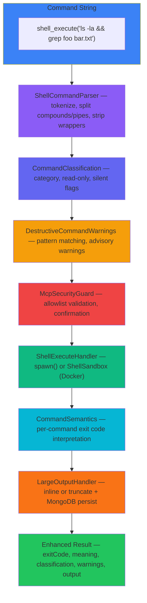

# Enhanced Shell Execution

## Overview

The **Enhanced Shell Execution** system provides MXF agents with secure, observable shell command execution. Rather than treating shell commands as opaque strings, the system parses commands into structured representations, classifies them by category and risk, interprets exit codes semantically, handles large outputs gracefully, and emits lifecycle events for full observability.

Key capabilities:

- **Recursive descent command parsing** -- compound commands, pipes, subshells, env prefixes, and wrapper commands are all understood structurally
- **Command classification** -- every command is categorized (READ, WRITE, GIT, NETWORK, etc.) with read-only safety flags for concurrency decisions
- **Destructive command warnings** -- dangerous patterns (`rm -rf`, `git push --force`, etc.) are detected and surfaced as advisory warnings
- **Semantic exit codes** -- non-zero exit codes are interpreted per-command (`grep` returning 1 means "no matches", not failure)
- **Docker sandbox** -- opt-in container isolation with no network, read-only root filesystem, dropped capabilities, and resource limits
- **Large output handling** -- outputs exceeding 512KB are truncated with a preview and persisted to MongoDB for later retrieval
- **Background task execution** -- long-running commands run asynchronously with streaming progress events and ring-buffer output accumulation
- **Event-driven observability** -- eight event types track the full execution lifecycle via EventBus

Source: `src/shared/protocols/mcp/tools/shell/`

## Architecture

The execution pipeline processes every shell command through a series of stages before spawning the process. Each stage adds metadata that enriches the final result.

<div class="mermaid-fallback">



</div>

## Command Parser

**Source:** `src/shared/protocols/mcp/tools/shell/ShellCommandParser.ts`

The `ShellCommandParser` is a recursive descent parser that replaces the original regex-based command extraction. It tokenizes shell strings character-by-character, respecting single and double quotes, backslash escapes, and operator boundaries.

### ParsedCommand Interface

```typescript
interface ParsedCommand {
    effectiveCommand: string;           // The actual command (after stripping env vars and wrappers)
    allCommands: string[];              // Every command found in compound expressions
    hasRedirections: boolean;           // Contains >, >>, <, 2>, 2>>
    hasPipes: boolean;                  // Contains |
    hasSubshells: boolean;             // Contains $() or backticks
    hasCompoundOperators: boolean;     // Contains &&, ||, ;
    envPrefixes: Record<string, string>; // FOO=bar prefixes
    wrapperCommands: string[];          // Stripped wrappers (sudo, timeout, env, etc.)
}
```

### What the Parser Extracts

| Feature | Example | Extracted |
|---------|---------|-----------|
| Compound operators | `ls && grep foo bar` | Two commands: `ls`, `grep` |
| Pipes | `cat file \| sort \| uniq` | Three commands: `cat`, `sort`, `uniq` |
| Env prefixes | `NODE_ENV=prod node app.js` | envPrefixes: `{NODE_ENV: "prod"}`, effectiveCommand: `node` |
| Wrapper commands | `sudo timeout 30 curl url` | wrappers: `["sudo", "timeout"]`, effectiveCommand: `curl` |
| Redirections | `ls > output.txt 2>&1` | hasRedirections: true |
| Subshells | `echo $(date)` | hasSubshells: true |
| Quoted strings | `grep "hello world" file` | Quotes stripped, content preserved |

### Known Wrapper Commands

The parser recognizes and strips: `timeout`, `nohup`, `sudo`, `env`, `nice`, `command`, `exec`, `time`, `strace`, `ltrace`. Each has specific logic for consuming its arguments (fixed count, flag skipping, or `KEY=VALUE` skipping) before identifying the effective command underneath.

### Security Note

The parser is designed to extract **too many** commands rather than miss any. If parsing fails, it falls back to simple whitespace splitting so the security guard always has a command to validate. False positives are safe; false negatives are not.

## Command Classification

**Source:** `src/shared/protocols/mcp/tools/shell/CommandClassification.ts`

Every command is classified by category and behavioral flags. This classification drives concurrency decisions (read-only commands can run in parallel) and output formatting (silent commands skip stdout display).

### Category Enum

| Category | Commands | Example |
|----------|----------|---------|
| `READ` | `cat`, `head`, `tail`, `less`, `wc`, `stat`, `jq`, `awk`, `sort` | `cat package.json` |
| `SEARCH` | `grep`, `rg`, `find`, `fd`, `ag`, `which`, `locate` | `grep -r "TODO" src/` |
| `LIST` | `ls`, `dir`, `tree`, `du`, `df`, `lsof` | `ls -la` |
| `WRITE` | `cp`, `mv`, `rm`, `mkdir`, `touch`, `chmod`, `ln` | `mkdir -p dist/` |
| `GIT` | `git` (subcommand-aware) | `git status` |
| `EXECUTE` | `node`, `python`, `bun`, `npm`, `make`, `cargo`, `gcc` | `npm install` |
| `NETWORK` | `curl`, `wget`, `ping`, `ssh`, `scp`, `dig` | `curl https://api.example.com` |
| `SYSTEM` | `ps`, `top`, `kill`, `systemctl`, `uname`, `whoami` | `ps aux` |
| `UNKNOWN` | Everything else | `my-custom-tool` |

### Classification Flags

Each classification includes: `isReadOnly` (safe for concurrent execution), `isSilent` (no useful stdout on success -- `mkdir`, `touch`, `mv`), and `isSemanticNeutral` (pure output commands like `echo`, `printf`, `true`).

### Compound Command Classification

For compound commands (`cmd1 && cmd2 ; cmd3`), the system classifies each subcommand independently and returns the **most dangerous** category. The `isReadOnly` flag is `true` only if **all** subcommands are read-only. Priority ordering (least to most dangerous): UNKNOWN, LIST, READ, SEARCH, GIT, SYSTEM, NETWORK, EXECUTE, WRITE.

### Git Subcommand Awareness

Git commands receive special treatment -- the classifier inspects the subcommand to determine read-only status:

- **Read-only:** `status`, `log`, `diff`, `show`, `branch` (without `-d`/`-D`), `tag` (without `-d`), `blame`, `ls-files`, `rev-parse`
- **Write:** `commit`, `push`, `pull`, `merge`, `rebase`, `checkout`, `add`, `branch -D`
- **Context-dependent:** `stash list` is read-only, `stash drop` is not. `config --get` is read-only, `config --set` is not.

### Quick Read-Only Check

```typescript
import { isReadOnlyCommand } from './CommandClassification';

if (isReadOnlyCommand('git log --oneline -10')) {
    // Safe to run concurrently with other read-only commands
}
```

## Destructive Command Warnings

**Source:** `src/shared/protocols/mcp/tools/shell/DestructiveCommandWarnings.ts`

The destructive warnings module provides **purely advisory** warnings about dangerous commands. It does **not** block execution -- that responsibility belongs to McpSecurityGuard. Warnings are surfaced in tool results and emitted as `SHELL_DESTRUCTIVE_WARNING` events.

### Detected Patterns

| Severity | Pattern | Warning |
|----------|---------|---------|
| danger | `git reset --hard` | May discard uncommitted changes |
| danger | `git push --force` / `git push -f` | May overwrite remote history |
| danger | `git clean -f` | May permanently delete untracked files |
| danger | `git checkout -- .` | May discard all working tree changes |
| danger | `rm -rf` | May recursively force-remove files |
| danger | `DROP TABLE` / `DROP DATABASE` | May drop database objects |
| danger | `kubectl delete` | May delete Kubernetes resources |
| danger | `terraform destroy` | May destroy infrastructure |
| warning | `rm -r` (without `-f`) | May recursively remove files |
| warning | `git stash drop` / `git stash clear` | May permanently remove stashed changes |
| warning | `git branch -D` | May force-delete a branch |
| warning | `--no-verify` on git commit/push/merge | Skips safety hooks |
| warning | `chmod 777` | Sets overly permissive file permissions |
| info | `git commit --amend` | May rewrite the last commit |

### Usage

```typescript
import { getDestructiveWarnings, hasDestructiveWarnings } from './DestructiveCommandWarnings';

// Quick boolean check
if (hasDestructiveWarnings('rm -rf /tmp/build')) {
    // Handle warning
}

// Get all matching warnings with severity
const warnings = getDestructiveWarnings('git push --force origin main');
// [{ warning: 'May overwrite remote history', severity: 'danger' }]
```

A single command can match multiple patterns. For example, `git push --force --no-verify` triggers both the force-push and the skip-hooks warnings.

## Semantic Exit Codes

**Source:** `src/shared/protocols/mcp/tools/shell/CommandSemantics.ts`

Without semantic exit code interpretation, agents would incorrectly classify many successful-but-empty results as errors. The `CommandSemantics` module maps per-command exit codes to human-readable meanings and distinguishes genuine errors from expected non-zero codes.

### Interpretation Table

| Command | Exit 0 | Exit 1 | Exit 2+ |
|---------|--------|--------|---------|
| `grep` / `rg` | Matches found | No matches found (not an error) | Actual error (bad regex, etc.) |
| `diff` | Files identical | Files differ (not an error) | Actual error (missing file) |
| `cmp` | Files identical | Files differ (not an error) | Actual error |
| `test` / `[` | Condition true | Condition false (not an error) | Syntax error |
| `find` | All paths traversed | Some directories inaccessible (not an error) | Expression error |
| `curl` | Success | Unsupported protocol | Specific error per code (6=DNS, 7=connect, 28=timeout, 60=SSL) |
| All others | Success | Error | Error |

### Pipeline Exit Code Resolution

For pipelines (`cmd1 | cmd2 | cmd3`), the **last** command determines the exit code (following default shell behavior). For sequential commands (`cmd1 && cmd2`), the last executed command determines the exit code. The module extracts the relevant base command by parsing pipes and compound operators.

### Usage

```typescript
import { interpretExitCode } from './CommandSemantics';

const result = interpretExitCode('grep "pattern" file.txt', 1, '', '');
// { meaning: 'No matches found', isError: false, isSemanticNonZero: true }
```

The `isSemanticNonZero` flag allows downstream consumers to distinguish between "no error, but nothing found" and "true success with output".

## Docker Sandbox

**Source:** `src/shared/protocols/mcp/tools/shell/ShellSandbox.ts`

The shell sandbox provides opt-in Docker container isolation for shell commands, using the same `ContainerExecutionManager` infrastructure as the code execution sandbox.

### Configuration

```typescript
interface ShellSandboxConfig {
    enabled: boolean;          // Default: false (opt-in)
    networkAccess: boolean;    // Default: false
    writablePaths: string[];   // Host paths mounted read-write
    mountPaths: Array<{        // Custom mount configurations
        host: string;
        container: string;
        readOnly: boolean;
    }>;
    memoryLimit: number;       // Default: 256 MB
    cpuLimit: number;          // Default: 1.0 cores
}
```

### Security Constraints

| Constraint | Setting |
|-----------|---------|
| Network | Disabled by default (`NetworkMode: none`), opt-in via config |
| Filesystem | Read-only root, tmpfs `/tmp` (64MB, noexec, nosuid) |
| Capabilities | All dropped (`CapDrop: ALL`) |
| User | Non-root (UID 1000:1000) |
| Privileges | No new privileges (`no-new-privileges:true`) |
| Memory | 256MB (no swap) |
| CPU | 1.0 cores |
| PIDs | 128 max (prevents fork bombs) |
| Project mount | Mounted at `/workspace` as read-only |
| Auto-remove | Disabled (manual cleanup for reliability) |

### Docker Image

The sandbox uses the `mxf/shell-executor:latest` image (Alpine-based with common CLI tools). Build it with:

```bash
docker build -t mxf/shell-executor:latest docker/shell-executor/
```

### Execution Model

Sandbox mode is **opt-in** (`enabled: false` by default). When Docker is unavailable and sandbox mode is requested, execution **fails with an error** -- there is no silent fallback to host execution.

## Large Output Handling

**Source:** `src/shared/protocols/mcp/tools/shell/LargeOutputHandler.ts`

Commands can produce megabytes of output. The `LargeOutputHandler` prevents tool responses from becoming unwieldy by truncating large outputs and persisting the full content to MongoDB.

### Thresholds

| Threshold | Default | Behavior |
|-----------|---------|----------|
| Inline max | 512 KB | Output at or below this size is returned in full |
| Persist max | 64 MB | Output exceeding this is truncated before persistence |
| Preview lines | 200 | Number of lines shown in the truncated preview |

### Processing Logic

1. **Small output** (at or below 512KB): returned inline, no MongoDB persistence.
2. **Large output** (above 512KB): the first 200 lines are returned as a preview with a retrieval note; the full output is persisted to MongoDB with a unique `outputId`.
3. **Oversized output** (above 64MB): truncated to 64MB before persistence, with a warning logged.

### Truncation Format

When output is truncated, the preview includes a retrieval notice:

```
[first 200 lines of output...]

--- Output truncated (2,458,624 bytes, 34,210 lines) ---
--- Full output persisted with ID: a1b2c3d4-... ---
--- Use shell_output_retrieve to get the full output ---
```

### Retrieval

Agents use `shell_output_retrieve` with the `outputId` to fetch the full persisted output. Persisted outputs have a TTL and are automatically cleaned up after expiration. If MongoDB is unreachable when persistence is attempted, the handler falls back to returning the output truncated to 512KB without persistence.

## Background Tasks

**Source:** `src/shared/services/BackgroundTaskManager.ts`

Long-running commands can be executed in the background via the `BackgroundTaskManager` singleton. The manager returns a `taskId` immediately and the agent polls for status using `shell_task_status`.

### Lifecycle

1. **Start:** `startBackground(command, options, context)` spawns the process and returns `{ taskId }`.
2. **Monitor:** `getTaskStatus(taskId)` returns current status, exit code, output preview (last 50 lines), and elapsed time.
3. **Retrieve output:** `getTaskOutput(taskId)` returns the full accumulated stdout (up to 512KB ring buffer).
4. **Cancel:** `cancelTask(taskId)` sends SIGTERM, then SIGKILL after 5 seconds if the process is still alive.
5. **Cleanup:** completed tasks are automatically removed after 1 hour.

### Resource Limits

| Limit | Value |
|-------|-------|
| Max concurrent tasks | 10 |
| Output buffer per task | 512 KB (ring-buffer, keeps latest) |
| Stale task cleanup | Every 1 hour |
| Cancellation | SIGTERM, then SIGKILL after 5 seconds |

### Ring-Buffer Output

To prevent unbounded memory growth, each task's stdout and stderr buffers use ring-buffer semantics: when the buffer exceeds 512KB, the oldest content is trimmed from the front at the nearest newline boundary. The `totalOutputBytes` counter tracks the total bytes ever received (not just what remains in the buffer).

### Progress Events

While a background task runs, the manager emits throttled `SHELL_EXECUTION_PROGRESS` events (at most one per second per task) containing:

- Latest output chunk
- Total output size so far
- Elapsed time in seconds
- Total line count

### Task Status Response

Status queries return a `BackgroundTaskInfo` with: `taskId`, `command`, `description`, `status` (`running` | `completed` | `failed` | `cancelled`), `exitCode`, `outputPreview` (last 50 lines), `outputSize` (total bytes), `startTime`, `endTime`, `elapsedSeconds`, `agentId`, and `channelId`.

## Events

**Source:** `src/shared/events/event-definitions/ShellExecutionEvents.ts`

Eight typed events track the full shell execution lifecycle. All events are emitted via `EventBus.server` and accessed under the `Events.Shell` namespace.

| Event | Emitted When |
|-------|-------------|
| `SHELL_EXECUTION_STARTED` | A shell command begins execution |
| `SHELL_EXECUTION_COMPLETED` | A command finishes successfully (semantic-aware) |
| `SHELL_EXECUTION_FAILED` | A command finishes with a true error exit code |
| `SHELL_EXECUTION_PROGRESS` | A background task produces new output (throttled to 1/sec) |
| `SHELL_DESTRUCTIVE_WARNING` | A command matches a destructive pattern |
| `SHELL_BACKGROUND_STARTED` | A background task is spawned |
| `SHELL_BACKGROUND_COMPLETED` | A background task finishes (success, failure, or cancellation) |
| `SHELL_OUTPUT_PERSISTED` | Large output is saved to MongoDB |

### Listening for Events

```typescript
import { Events } from '../events/EventNames';
import { EventBus } from '../events/EventBus';

// Monitor destructive command attempts
EventBus.server.on(Events.Shell.SHELL_DESTRUCTIVE_WARNING, (payload) => {
    console.warn(`Agent ${payload.agentId} running destructive command: ${payload.command}`);
    for (const w of payload.warnings) {
        console.warn(`  [${w.severity}] ${w.warning}`);
    }
});

// Track background task completion
EventBus.server.on(Events.Shell.SHELL_BACKGROUND_COMPLETED, (payload) => {
    console.log(`Background task ${payload.taskId} finished — exit ${payload.exitCode}`);
});
```

## See Also

- [Tool Reference: shell_execute](tool-reference.md)
- [Code Execution Service](code-execution.md)
- [Security Architecture](security.md)
- [Validation System](validation-system.md)
