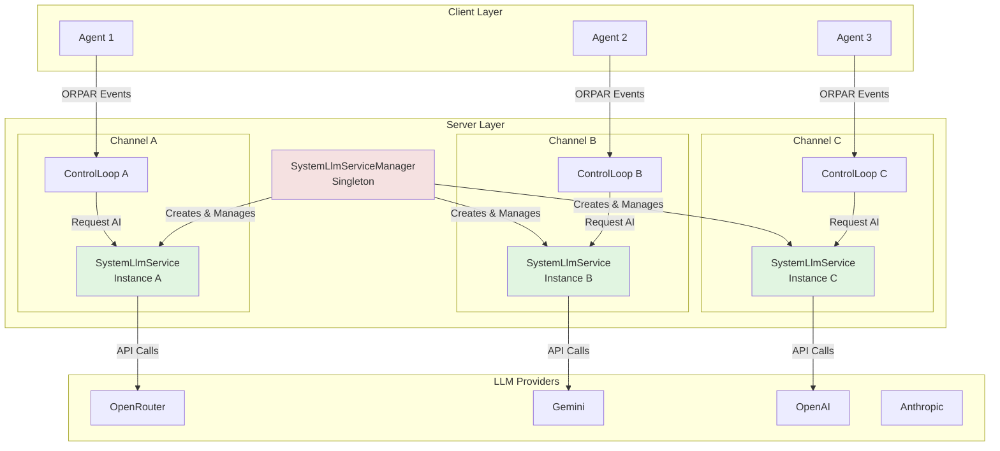

# SystemLLM Service

The **SystemLLM Service** is MXF's centralized AI intelligence layer that powers autonomous agent operations. It provides structured LLM interactions with JSON schema enforcement, dynamic model selection, and comprehensive coordination capabilities.

## Overview

SystemLLM is a server-side service that handles all AI-powered decision-making and reasoning for the MXF framework. Unlike client-side agent LLMs, SystemLLM operates with **one isolated instance per channel** for independent, concurrent operations.

**Key Characteristics**:
- **Server-Side**: Runs on the MXF server, not in agents
- **Per-Channel Isolation**: One SystemLlmService instance per channel (managed by SystemLlmServiceManager)
- **Channel Independence**: Each channel operates with its own configuration, context, and state
- **Schema-Enforced**: All outputs validated against JSON schemas
- **Multi-Provider**: Supports OpenRouter, Gemini, OpenAI, Anthropic, XAI, Ollama
- **Dynamic Selection**: Automatic model selection based on complexity and budget

## Architecture

### Per-Channel Instance Model

SystemLLM uses a **one-instance-per-channel** architecture:



**Key Benefits**:
- **Isolation**: Channel A's operations don't affect Channel B
- **Concurrency**: All channels operate simultaneously without blocking
- **Configuration**: Each channel can use different providers/models
- **Scalability**: Supports unlimited channels without bottlenecks
- **Context Preservation**: Each instance maintains its own ORPAR context

## Core Responsibilities

### 1. ORPAR Cognitive Operations

SystemLLM powers all five phases of the ORPAR cycle:

#### Observation Processing
```typescript
processObservationData(observations: Observation[], context?: OrparContext): Observable<any>
```
- **Model**: Fast, efficient (e.g., `gemini-2.0-flash-lite-001`)
- **Purpose**: Analyze agent observations for collaboration opportunities
- **Focus**: Cross-agent collaboration, skill synergy, communication optimization

#### Reasoning Analysis
```typescript
// Handled via observation processing with reasoning focus
```
- **Model**: Advanced reasoning (e.g., `claude-3.5-sonnet`)
- **Purpose**: Deep analysis and hypothesis generation
- **Focus**: Strategic insights, pattern detection, coordination strategies

#### Plan Creation
```typescript
createPlan(reasoning: Reasoning, context?: OrparContext, previousPlans?: Plan[]): Observable<Plan>
```
- **Model**: Strategic planning (e.g., `gemini-2.5-pro-preview-05-06`)
- **Purpose**: Generate executable action plans
- **Focus**: Multi-agent coordination, resource sharing, task distribution
- **Output**: JSON schema-validated Plan with ordered actions

#### Action Analysis
```typescript
analyzeActionExecution(action: PlanAction, result: any, context?: OrparContext): Observable<any>
```
- **Model**: Reliable execution (e.g., `gpt-4o-mini`)
- **Purpose**: Analyze action execution and impact
- **Focus**: Multi-agent impact, coordination opportunities, resource implications

#### Reflection Generation
```typescript
generateReflection(plan: Plan, actions: PlanAction[], results: any[], context?: OrparContext): Observable<Reflection>
```
- **Model**: Meta-cognitive (e.g., `claude-3.5-sonnet`)
- **Purpose**: Meta-cognitive analysis of cycle performance
- **Focus**: Coordination effectiveness, learning opportunities, efficiency assessment

### 2. JSON Schema Enforcement

All SystemLLM operations use strict JSON schemas:

```typescript
// Topic Extraction Schema
TOPIC_EXTRACTION_SCHEMA = {
    type: 'object',
    properties: {
        topics: {
            type: 'array',
            items: {
                type: 'object',
                properties: {
                    name: { type: 'string' },
                    description: { type: 'string' },
                    relevance: { type: 'number', minimum: 0, maximum: 1 },
                    keywords: { type: 'array', items: { type: 'string' } }
                },
                required: ['name', 'relevance']
            }
        }
    },
    required: ['topics']
};

// Reasoning Analysis Schema
REASONING_ANALYSIS_SCHEMA = {
    type: 'object',
    properties: {
        analysis: { type: 'string' },
        confidence: { type: 'number', minimum: 0, maximum: 1 },
        keyInsights: { type: 'array', items: { type: 'string' } },
        recommendations: { type: 'array', items: { type: 'string' } }
    },
    required: ['analysis', 'confidence']
};

// Plan Creation Schema
PLAN_CREATION_SCHEMA = {
    type: 'object',
    properties: {
        plan: {
            type: 'object',
            properties: {
                goal: { type: 'string' },
                description: { type: 'string' },
                actions: {
                    type: 'array',
                    items: {
                        type: 'object',
                        properties: {
                            id: { type: 'string' },
                            description: { type: 'string' },
                            action: { type: 'string' },
                            parameters: { type: 'object' },
                            priority: { type: 'number' },
                            dependencies: { type: 'array', items: { type: 'string' } },
                            status: { type: 'string', enum: ['pending', 'executing', 'completed', 'failed'] }
                        },
                        required: ['id', 'description', 'action', 'priority', 'status']
                    }
                }
            },
            required: ['goal', 'actions']
        }
    },
    required: ['plan']
};

// Reflection Schema
REFLECTION_SCHEMA = {
    type: 'object',
    properties: {
        success: { type: 'boolean' },
        insights: { type: 'array', items: { type: 'string' } },
        improvements: { type: 'array', items: { type: 'string' } },
        metrics: {
            type: 'object',
            properties: {
                effectiveness: { type: 'number', minimum: 0, maximum: 1 },
                efficiency: { type: 'number', minimum: 0, maximum: 1 }
            }
        }
    },
    required: ['success', 'insights']
};
```

### 3. Dynamic Model Selection

SystemLLM automatically selects optimal models based on multiple factors:

#### Operation-Specific Models

Each ORPAR operation has default models:

```typescript
const ORPAR_MODEL_CONFIGS: Record<LlmProviderType, OrparModelConfig> = {
    [LlmProviderType.OPENROUTER]: {
        observation: 'google/gemini-2.0-flash-lite-001',     // Fast, cheap
        reasoning: 'anthropic/claude-3.5-sonnet',            // Advanced reasoning
        action: 'openai/gpt-4o-mini',                        // Reliable execution
        planning: 'google/gemini-2.5-pro-preview-05-06',    // Strategic planning
        reflection: 'anthropic/claude-3.5-sonnet'           // Meta-cognitive
    },
    [LlmProviderType.ANTHROPIC]: {
        observation: 'claude-3-5-haiku-20241022',
        reasoning: 'claude-3-5-sonnet-20241022',
        action: 'claude-3-5-haiku-20241022',
        planning: 'claude-3-5-sonnet-20241022',
        reflection: 'claude-3-5-sonnet-20241022'
    }
    // ... other providers
};
```

#### Complexity-Based Upgrades

Models automatically upgrade based on context complexity:

```typescript
getModelForOperationWithComplexity(
    operation: OrparOperationType,
    context?: OrparContext,
    complexityOverride?: 'simple' | 'moderate' | 'complex'
): string
```

**Complexity Assessment Factors**:
- **Phase Completion** (0.2 per phase): More completed phases = higher complexity
- **Error Count** (0.5 per error): More errors = higher complexity
- **Context Richness** (0.1 per element): More context = higher complexity
- **Result Size** (0.3-0.8): Larger results = higher complexity
- **Confidence** ((1 - confidence) * 0.5): Lower confidence = higher complexity
- **Time Elapsed** (0.2 per hour): Longer cycles = higher complexity
- **Model Variance** (0.3-0.5): Frequent model changes = higher complexity

**Complexity Thresholds**:
- **Simple**: < 1.2 → Base models
- **Moderate**: 1.2 - 3.0 → Upgraded models
- **Complex**: > 3.0 → Premium models

**Example Upgrade Paths**:
```typescript
// Observation models
'google/gemini-2.0-flash-lite-001' → {
    moderate: 'openai/gpt-4o-mini',
    complex: 'anthropic/claude-3.5-sonnet'
}

// Reasoning models
'anthropic/claude-3.5-sonnet' → {
    moderate: 'anthropic/claude-3.5-sonnet:beta',
    complex: 'anthropic/claude-3-opus'
}

// Planning models
'google/gemini-2.5-pro-preview-05-06' → {
    moderate: 'openai/o1-mini',
    complex: 'openai/o1-preview'
}
```

#### Cost-Aware Selection

Select models within budget constraints:

```typescript
getCostAwareModel(
    operation: OrparOperationType,
    context?: OrparContext,
    budgetTier: 'ULTRA_CHEAP' | 'BUDGET' | 'STANDARD' | 'PREMIUM' | 'ULTRA_PREMIUM'
): string
```

**Budget Tiers** (OpenRouter):
- **ULTRA_CHEAP**: < $0.10/1M tokens (gemini-flash-lite, llama-3.2-3b)
- **BUDGET**: < $1.00/1M tokens (gpt-4o-mini, claude-haiku)
- **STANDARD**: < $5.00/1M tokens (claude-sonnet, gpt-4o)
- **PREMIUM**: < $15.00/1M tokens (gemini-pro, claude-opus)
- **ULTRA_PREMIUM**: Reasoning models (o1-preview, deepseek-r1)

#### Load-Balanced Selection

Distribute load across providers:

```typescript
getLoadBalancedModel(
    operation: OrparOperationType,
    context?: OrparContext,
    preferredProviders: string[]
): string
```

Rotates through providers based on current hour to distribute load.

#### Specialized Selection

Use specialized models for specific tasks:

```typescript
getSpecializedModel(
    operation: OrparOperationType,
    specialization: 'reasoning' | 'coding' | 'analysis' | 'creative' | 'multilingual' | 'speed',
    context?: OrparContext
): string
```

**Specialization Models**:
- **Reasoning**: o1-preview, deepseek-r1
- **Coding**: claude-sonnet, deepseek-r1
- **Analysis**: claude-opus, claude-sonnet
- **Creative**: gemini-pro, claude-opus
- **Multilingual**: qwen-2.5-72b, gemini-pro
- **Speed**: gemini-flash-lite, gpt-4o-mini

## Configuration

### Environment Variable Configuration

SystemLLM can be configured globally via environment variables:

```env
# Master switch to enable/disable SystemLLM features
SYSTEMLLM_ENABLED=true

# Provider for SystemLLM operations
# Options: openrouter, azure-openai, openai, anthropic, gemini, xai, ollama
SYSTEMLLM_PROVIDER=openrouter

# Default model for SystemLLM (optional - defaults to provider-specific model)
SYSTEMLLM_DEFAULT_MODEL=google/gemini-2.5-flash

# Enable dynamic model selection based on complexity
# Recommended: true for OpenRouter (access to 200+ models), false for single-model providers
SYSTEMLLM_DYNAMIC_MODEL_SELECTION=true
```

**Dynamic Model Selection**:
- When `true`: SystemLLM automatically selects models based on task complexity (simple/moderate/complex)
- When `false`: Uses the default model for all operations (saves overhead for single-model providers)
- Default: `true` for OpenRouter, `false` for other providers

**Provider-Specific Examples**:

```env
# Azure OpenAI Example (single model, no dynamic selection)
SYSTEMLLM_ENABLED=true
SYSTEMLLM_PROVIDER=azure-openai
SYSTEMLLM_DEFAULT_MODEL=gpt-4o-mini
SYSTEMLLM_DYNAMIC_MODEL_SELECTION=false
AZURE_OPENAI_API_KEY=your-key
AZURE_OPENAI_ENDPOINT=https://your-resource.openai.azure.com/

# OpenRouter Example (multi-model, with dynamic selection)
SYSTEMLLM_ENABLED=true
SYSTEMLLM_PROVIDER=openrouter
SYSTEMLLM_DYNAMIC_MODEL_SELECTION=true
OPENROUTER_API_KEY=your-key
```

### Service Configuration

```typescript
interface SystemLlmServiceConfig {
    providerType?: LlmProviderType;
    defaultModel?: string;
    defaultTemperature?: number;
    defaultMaxTokens?: number;
    orparModels?: Partial<OrparModelConfig>;
    enableRealTimeCoordination?: boolean;
    enableDynamicModelSelection?: boolean;  // Control complexity-based model switching
}

// Example - Code-based configuration (overrides environment variables)
const service = new SystemLlmService({
    providerType: LlmProviderType.OPENROUTER,
    defaultModel: 'anthropic/claude-3.5-sonnet',
    defaultTemperature: 0.3,
    defaultMaxTokens: 2000,
    orparModels: {
        reasoning: 'anthropic/claude-3-opus',  // Override for complex reasoning
        planning: 'openai/o1-preview'          // Override for strategic planning
    },
    enableRealTimeCoordination: true,
    enableDynamicModelSelection: true  // Enable smart model selection
});
```

### Per-Channel Configuration

**IMPORTANT**: SystemLLM creates **one instance per channel** via `SystemLlmServiceManager`. Each channel gets its own isolated SystemLlmService with independent configuration and state.

```typescript
const manager = SystemLlmServiceManager.getInstance();

// Get SystemLlmService instance for a specific channel
// Returns existing instance if already created, otherwise creates new one
const service = manager.getServiceForChannel('channel-123', {
    providerType: LlmProviderType.ANTHROPIC,
    defaultModel: 'claude-3-5-sonnet-20241022',
    orparModels: {
        observation: 'claude-3-5-haiku-20241022',
        reasoning: 'claude-3-5-sonnet-20241022',
        planning: 'claude-3-5-sonnet-20241022',
        reflection: 'claude-3-5-sonnet-20241022'
    }
});

// Returns null if SYSTEMLLM_ENABLED=false
if (!service) {
    console.log('SystemLLM is disabled');
}
```

## Advanced Features

### 1. Batch Processing

Process multiple operations in parallel:

```typescript
// Batch observation processing
batchProcessObservations(
    batches: Array<{
        agentId: string;
        observations: Observation[];
        context?: OrparContext;
    }>
): Observable<Array<{ agentId: string; result: any; error?: Error }>>

// Batch action analysis
batchAnalyzeActions(
    batches: Array<{
        actionId: string;
        action: PlanAction;
        executionResult: any;
        context?: OrparContext;
    }>
): Observable<Array<{ actionId: string; result: any; error?: Error }>>

// Batch plan creation
batchCreatePlans(
    requests: Array<{
        planId: string;
        reasoning: Reasoning;
        context?: OrparContext;
        previousPlans?: Plan[];
    }>
): Observable<Array<{ planId: string; result: Plan | null; error?: Error }>>
```

### 2. Parallel LLM Requests

Execute multiple LLM requests simultaneously with different models:

```typescript
parallelLlmRequests(
    requests: Array<{
        id: string;
        prompt: string;
        operation: OrparOperationType;
        schema?: any;
        context?: OrparContext;
        options?: any;
    }>
): Observable<Array<{ id: string; result: string; model: string; error?: Error }>>
```

### 3. Context-Aware Prompting

Build prompts with full ORPAR context:

```typescript
private buildContextAwarePrompt(basePrompt: string, context?: OrparContext): string {
    if (!context) return basePrompt;
    
    let prompt = basePrompt;
    
    // Add previous phase results
    if (context.previousPhaseResults) {
        prompt += '\n\nPREVIOUS RESULTS:\n';
        // ... include relevant prior results
    }
    
    // Add shared context
    if (context.sharedContext) {
        prompt += '\n\nSHARED CONTEXT:\n';
        prompt += `Goals: ${context.sharedContext.goals.join(', ')}\n`;
        prompt += `Constraints: ${context.sharedContext.constraints.join(', ')}\n`;
        // ... include other shared context
    }
    
    return prompt;
}
```

### 4. Metrics Collection

Comprehensive metrics tracking:

```typescript
interface SystemLlmMetrics {
    requestCount: number;
    totalResponseTime: number;
    errorCount: number;
    lastRequestTime: Date | null;
    operationBreakdown: {
        observation: number;
        reasoning: number;
        planning: number;
        action: number;
        reflection: number;
    };
    responseTimeBreakdown: Map<OrparOperationType, number>;
    modelUsage: Map<string, number>;
    errorBreakdown: Map<string, number>;
}
```

## Event System Integration

SystemLLM emits events for monitoring:

```typescript
// LLM Instruction Events
Events.System.LLM_INSTRUCTION_STARTED
Events.System.LLM_INSTRUCTION_COMPLETED
Events.System.LLM_INSTRUCTION_ERROR

// Event Payload Example
interface LlmInstructionStartedEventData {
    instructionId: string;
    operation: string;
    model?: string;
    timestamp: number;
}

interface LlmInstructionCompletedEventData {
    instructionId: string;
    operation: string;
    result: string;
    duration: number;
    timestamp: number;
}
```

## Error Handling and Recovery

### Network Error Classification

```typescript
enum NetworkErrorType {
    TIMEOUT = 'timeout',
    CONNECTION_REFUSED = 'connection_refused',
    DNS_FAILURE = 'dns_failure',
    RATE_LIMIT = 'rate_limit',
    AUTHENTICATION = 'authentication',
    INVALID_REQUEST = 'invalid_request',
    SERVER_ERROR = 'server_error',
    UNKNOWN = 'unknown'
}
```

### Retry Strategies

```typescript
async sendLlmRequestWithRecovery(
    prompt: string,
    schema: any | null,
    options: any
): Promise<string> {
    const maxRetries = 3;
    const baseDelay = 1000;
    
    for (let attempt = 1; attempt <= maxRetries; attempt++) {
        try {
            return await this.sendLlmRequest(prompt, schema, options);
        } catch (error) {
            const errorType = classifyNetworkError(error);
            
            if (errorType === NetworkErrorType.RATE_LIMIT) {
                // Exponential backoff for rate limits
                const delay = baseDelay * Math.pow(2, attempt - 1);
                await new Promise(resolve => setTimeout(resolve, delay));
                continue;
            }
            
            if (attempt === maxRetries) throw error;
        }
    }
}
```

## Performance Characteristics

### Latency

- **Model Selection**: < 5ms
- **Complexity Assessment**: < 10ms
- **Prompt Building**: < 20ms
- **LLM Request** (varies by model):
  - Fast models (flash-lite): 500-1000ms
  - Standard models (sonnet): 1000-2000ms
  - Premium models (opus): 2000-5000ms
  - Reasoning models (o1): 5000-20000ms

### Throughput

- **Concurrent Requests**: 100+ simultaneous requests
- **Batch Processing**: 1000+ operations/batch
- **Channel Instances**: Unlimited (one per channel)

### Resource Usage

- **Memory**: ~50MB per SystemLlmService instance
- **CPU**: Minimal (network I/O bound)
- **Network**: Depends on LLM provider

## Usage Examples

### Basic Usage

```typescript
import { SystemLlmService } from './src/server/socket/services/SystemLlmService';

const systemLlm = new SystemLlmService({
    providerType: LlmProviderType.OPENROUTER,
    defaultModel: 'anthropic/claude-3.5-sonnet'
});

// Process observations
const observations = [
    { id: '1', agentId: 'agent-1', source: 'user', content: 'Help me', timestamp: Date.now() }
];

systemLlm.processObservationData(observations).subscribe({
    next: (analysis) => console.log('Analysis:', analysis),
    error: (error) => console.error('Error:', error)
});
```

### ORPAR Cycle Integration

```typescript
// In ControlLoop.ts
async processObservations(observations: Observation[]): Promise<Reasoning | null> {
    const systemLlmService = new SystemLlmService();
    
    try {
        const analysis = await lastValueFrom(
            systemLlmService.processObservationData(observations, this.context)
        );
        
        const reasoning: Reasoning = {
            id: uuidv4(),
            agentId: this.agentId,
            content: analysis,
            timestamp: Date.now()
        };
        
        return reasoning;
    } catch (error) {
        logger.error('Failed to process observations:', error);
        return null;
    }
}
```

### Channel-Specific Configuration

```typescript
import { SystemLlmServiceManager } from './src/server/socket/services/SystemLlmServiceManager';

const manager = SystemLlmServiceManager.getInstance();

// Each call creates a separate SystemLlmService instance for that channel
// Dev channel: Uses fast, cheap models via OpenRouter
const devChannel = manager.getServiceForChannel('dev-channel', {
    providerType: LlmProviderType.OPENROUTER,
    orparModels: {
        observation: 'google/gemini-2.0-flash-lite-001',  // Fast & cheap for dev
        reasoning: 'openai/gpt-4o-mini',
        planning: 'openai/gpt-4o-mini',
        reflection: 'openai/gpt-4o-mini'
    }
});

// Prod channel: Uses high-quality models via Anthropic
// This is a SEPARATE instance from devChannel
const prodChannel = manager.getServiceForChannel('prod-channel', {
    providerType: LlmProviderType.ANTHROPIC,
    orparModels: {
        observation: 'claude-3-5-haiku-20241022',
        reasoning: 'claude-3-5-sonnet-20241022',         // High quality for prod
        planning: 'claude-3-5-sonnet-20241022',
        reflection: 'claude-3-5-sonnet-20241022'
    }
});

// Each instance operates independently:
// - Separate API connections
// - Independent ORPAR context
// - Isolated metrics
// - No shared state
```

## Best Practices

### 1. Model Selection

- **Use defaults** for most cases - they're optimized for cost/performance
- **Override strategically** only when you have specific requirements
- **Monitor complexity** scores to understand upgrade patterns
- **Budget wisely** using cost-aware selection for production

### 2. Prompt Engineering

- **Be specific** about coordination and collaboration needs
- **Include context** using `OrparContext` for better results
- **Use schemas** to enforce structured outputs
- **Test prompts** across different complexity levels

### 3. Error Handling

- **Implement retries** with exponential backoff
- **Handle rate limits** gracefully
- **Log errors** with sufficient context
- **Fall back** to simpler models on complex model failures

### 4. Performance Optimization

- **Batch operations** when processing multiple items
- **Use parallel requests** for independent operations
- **Cache results** when appropriate
- **Monitor metrics** to identify bottlenecks

### 5. Channel Configuration

- **One instance per channel**: SystemLlmServiceManager automatically creates isolated instances
- **Always use manager**: Call `getServiceForChannel()` to get/create channel-specific instances
- **Avoid direct instantiation**: Never create `new SystemLlmService()` directly - use the manager
- **Share configurations**: Pass same config object for similar channels
- **Automatic cleanup**: Manager handles cleanup when channels are destroyed
- **Check for null**: `getServiceForChannel()` returns `null` when `SYSTEMLLM_ENABLED=false`

## Integration with MXF Components

### ControlLoop
- Each ControlLoop uses its channel's SystemLlmService instance
- Powers all ORPAR phase operations
- Provides AI-driven decision making
- Maintains context across cycles

### PatternLearningService
- Uses channel-specific SystemLlmService instance
- Learns from successful ORPAR patterns
- Optimizes future operations
- Shares insights across agents

### ChannelService
- Triggers SystemLlmServiceManager to create per-channel instances
- Channel-specific configurations
- Independent operation per channel
- Resource isolation

### SystemLlmServiceManager (Singleton)
- **Creates one SystemLlmService instance per channel**
- Manages lifecycle of all channel instances
- Provides `getServiceForChannel(channelId, config?)` API
- Returns `null` when SystemLLM is disabled
- Automatically cleans up when channels are destroyed

### EventBus
- Emits LLM instruction events
- Receives ORPAR phase requests
- Coordinates with other services

## Summary

SystemLLM Service is the AI intelligence backbone of MXF, providing:

1. **Centralized AI Operations**: Single service for all server-side AI needs
2. **ORPAR Integration**: Powers all five cognitive cycle phases
3. **Dynamic Model Selection**: Automatic optimization based on complexity and budget
4. **JSON Schema Enforcement**: Structured, validated outputs
5. **Multi-Provider Support**: Works with all major LLM providers
6. **Performance Optimization**: Batch processing, parallel execution, caching
7. **Channel Isolation**: Independent configuration per channel
8. **Comprehensive Metrics**: Full observability of AI operations

SystemLLM enables MXF to provide truly intelligent, adaptive, multi-agent coordination at scale.

## Related Documentation

- [ORPAR Cognitive Cycle](orpar.md) - The pattern SystemLLM powers
- [Control Loop API](../api/control-loop.md) - REST and WebSocket APIs
- [Server Services](server-services.md) - Other server services
- [Key Concepts](key-concepts.md) - Fundamental MXF concepts
- [Configuration Manager](../sdk/config-manager.md) - SDK-level configuration
