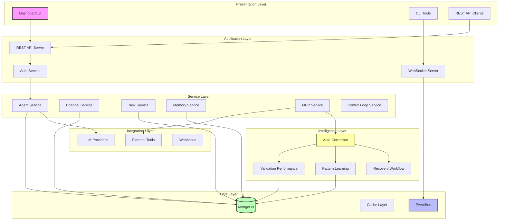
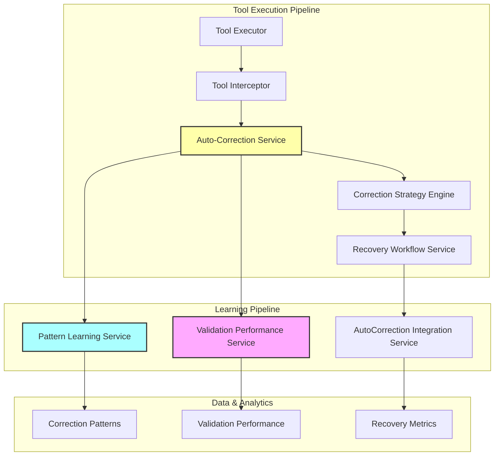
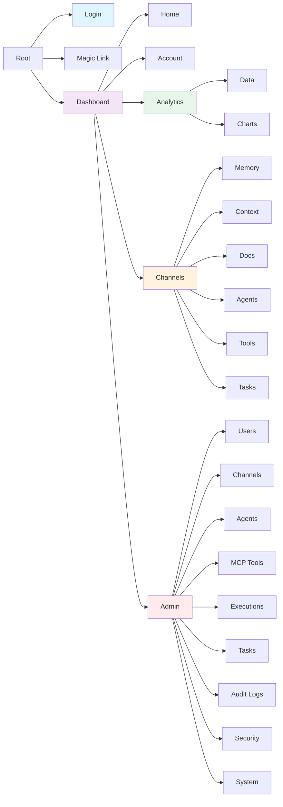
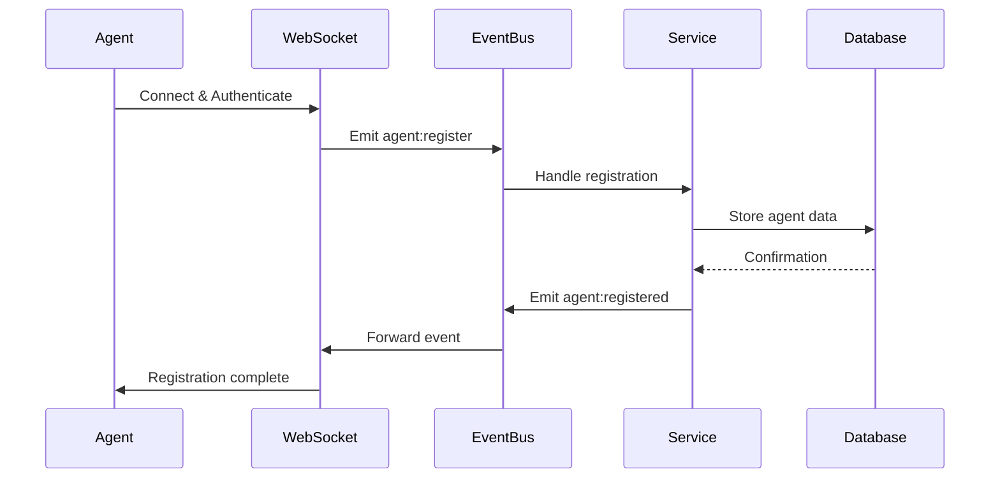
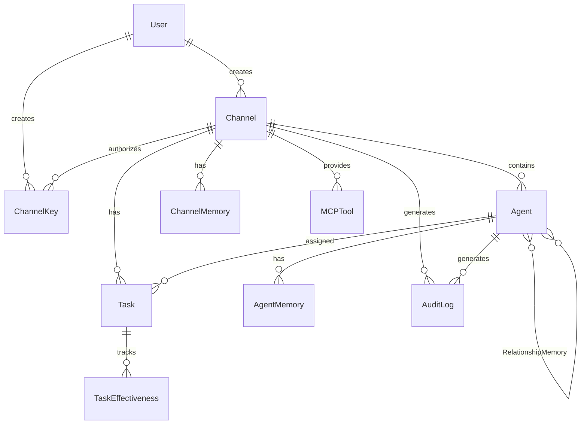

# System Overview

The Model Exchange Framework (MXF) is a comprehensive platform for building and orchestrating AI-powered multi-agent systems. This document provides a detailed overview of the system architecture, components, and design decisions.

## System Architecture

MXF employs a layered architecture that separates concerns and enables independent scaling:

<div class="mermaid-fallback">



</div>

<iframe src="../diagram/architecture-high-level.html" width="100%" height="800" style="border: none; border-radius: 10px; background: var(--bg-secondary);"></iframe>

## Core Components

### 1. Backend Server (`/src/server`)

The backend is built with Node.js and TypeScript, providing:

#### **API Layer**
- **REST API**: Express.js-based HTTP endpoints
  - CRUD operations for agents, channels, tasks
  - Authentication and user management
  - Analytics and monitoring endpoints
- **WebSocket Server**: Socket.IO for real-time communication
  - Bidirectional agent-server communication
  - Event-driven message routing
  - Real-time status updates

#### **Service Layer**
Core business logic implemented as modular services:

- **AgentService**: Agent lifecycle management
  - Registration and authentication
  - Status tracking and health monitoring
  - Capability management
  
- **ChannelService**: Channel operations
  - Channel creation and configuration
  - Participant management
  - Access control
  
- **TaskService**: Task orchestration
  - Intelligent task assignment
  - Progress tracking
  - Dependency management
  
- **MemoryService**: Persistent context
  - Multi-scope memory (agent, channel, relationship)
  - Version control
  - Garbage collection
  
- **McpService**: Tool integration
  - Tool discovery and registration
  - Execution sandboxing
  - Result caching
  
- **ControlLoopService**: ORPAR cycles
  - Observation processing
  - Reasoning and planning
  - Action execution
  - Reflection and learning
  
- **AutoCorrectionService**: Automatic error recovery
  - Parameter validation error detection
  - Intelligent correction strategy application
  - Pattern learning from successful corrections
  - Circuit breaker protection
  
- **ValidationPerformanceService**: Validation metrics
  - Success/failure rate tracking
  - Performance trend analysis
  - Agent performance scoring
  
- **PatternLearningService**: ML-driven improvements
  - Parameter pattern extraction
  - Cross-agent learning
  - Confidence scoring
  - Pattern evolution

#### **Data Layer**
- **MongoDB**: Primary data store
  - Document-based storage for flexibility
  - Indexed queries for performance
  - Transaction support for consistency
  
- **EventBus**: Event-driven architecture
  - RxJS-based reactive programming
  - Decoupled component communication
  - Event replay capabilities

### 2. SDK (`/src/sdk`)

TypeScript SDK for building agents:

#### **Core Classes**
- **MxfClient**: Base client functionality
  - WebSocket connection management
  - Event handling
  - Memory operations
  - Tool execution
  
- **MxfAgent**: AI-powered agent
  - LLM integration
  - Automatic response generation
  - Tool selection
  - Task completion workflows

#### **Service Architecture**
Modular services within the SDK:
- **MxfEventHandlerService**: Event processing
- **MxfSystemPromptManager**: Prompt generation
- **MxfMemoryManager**: Client-side memory
- **MxfTaskExecutionManager**: Task workflows
- **MxfMcpClientManager**: MCP client management

### 3. Intelligence Layer

AI-powered systems for validation, learning, and error recovery:

#### **ValidationPerformanceService**
Real-time validation performance tracking and analytics:
- **Success Rate Monitoring**: Track tool execution success rates
- **Error Pattern Analysis**: Identify common failure modes
- **Agent Performance Scoring**: Evaluate agent effectiveness
- **Trend Analysis**: Historical performance insights
- **Automated Alerts**: Notification of performance degradation

#### **PatternLearningService**
Machine learning for parameter optimization:
- **Pattern Extraction**: Learn from successful tool executions
- **Cross-Agent Learning**: Share insights between agents
- **Parameter Recommendations**: Suggest optimal parameters
- **Confidence Scoring**: Evaluate pattern reliability
- **Pattern Evolution**: Adapt patterns based on feedback

#### **AutoCorrectionService**
Intelligent automatic error correction system:
- **Error Detection**: Real-time validation error identification
- **Correction Strategies**: Multiple correction approaches
  - Type conversion (string ↔ number, boolean parsing)
  - Missing parameter inference
  - Unknown property removal
  - Constraint violation adjustment
- **Pattern Application**: Use learned patterns for corrections
- **Safety Validation**: Ensure corrections maintain semantic intent
- **Learning Integration**: Improve from correction outcomes

#### **RecoveryWorkflowService**
Orchestrates complex error recovery workflows:
- **Exponential Backoff**: Intelligent retry strategies
- **Circuit Breaker**: Prevent cascading failures
- **Fallback Mechanisms**: Alternative tool suggestions
- **Recovery Analytics**: Track recovery success rates
- **Workflow Optimization**: Improve recovery processes

#### **Integration Architecture**
The Intelligence Layer integrates seamlessly with existing components:

<div class="mermaid-fallback">



</div>

<iframe src="../diagram/validation-system.html" width="100%" height="680" style="border: none; border-radius: 10px; background: var(--bg-secondary);"></iframe>

### 4. Dashboard (`/dashboard`)

Vue 3-based web interface:

#### **Technology Stack**
- **Vue 3**: Reactive UI framework
- **Vuetify 3**: Material Design components
- **Pinia**: State management
- **Vue Router**: SPA routing
- **Axios**: HTTP client

#### **Dashboard Sitemap**

<div class="mermaid-fallback">



</div>

<iframe src="../diagram/navigation-sitemap.html" width="100%" height="600" style="border: none; border-radius: 10px; background: var(--bg-secondary);"></iframe>

#### **Features**
- Real-time agent monitoring
- Channel management interface
- Task coordination dashboard
- Analytics and reporting
- System configuration
- User and security management (Admin)

### 5. Shared Components (`/src/shared`)

Common code between server and client:

- **Type Definitions**: TypeScript interfaces
  - Core MXF types (Agent, Channel, Task)
  - Auto-correction types (CorrectionResult, ValidationError)
  - Pattern learning types (EnhancedParameterPattern)
- **Schemas**: Data validation schemas
- **Events**: Event name constants
  - Auto-correction events (correction:*, pattern:*)
  - Circuit breaker events (circuit-breaker:*)
- **Models**: Mongoose schemas
  - PatternLearningModels for ML patterns
  - Enhanced ToolExecution with correction tracking
- **Services**: Shared service implementations  
  - AutoCorrectionService and strategy engine
  - ValidationPerformanceService with metrics
  - PatternLearningService with ML capabilities
- **Utils**: Shared utilities

## Communication Architecture

### Event-Driven Design

MXF uses an event-driven architecture for maximum flexibility:

<div class="mermaid-fallback">



</div>

<iframe src="../diagram/architecture-communication-flow.html" width="100%" height="600" style="border: none; border-radius: 10px; background: var(--bg-secondary);"></iframe>

### Message Flow

1. **Agent to Server**: WebSocket events
2. **Server Processing**: EventBus routing
3. **Service Handling**: Business logic
4. **Data Persistence**: MongoDB operations
5. **Response Path**: Reverse flow

## Authentication & Security

### Dual Authentication System

1. **JWT Authentication** (Dashboard/API)
   - User login with email/password
   - Token-based session management
   - Role-based access control

2. **API Key Authentication** (Agents)
   - Channel-specific keys
   - Cryptographic key generation
   - Timing-attack resistant validation

### Security Layers

- **Transport**: TLS/SSL encryption
- **Application**: Input validation, sanitization
- **Data**: Encryption at rest
- **Access**: Role-based permissions

## Data Model

### Core Entities

<div class="mermaid-fallback">



</div>

<iframe src="../diagram/data-model-er.html" width="100%" height="620" style="border: none; border-radius: 10px; background: var(--bg-secondary);"></iframe>

### MongoDB Collections

**Core Collections (15 total):**
1. **users** - User accounts and authentication
2. **channels** - Communication channels
3. **agents** - AI agent registrations
4. **tasks** - Task management and assignment
5. **channelkeys** - API authentication keys
6. **mcptools** - MCP tool definitions
7. **channelmemories** - Channel-level shared memory
8. **agentmemories** - Agent-level private memory
9. **relationshipmemories** - Inter-agent relationship tracking
10. **auditlogs** - System audit trail
11. **documents** - Document storage
12. **taskeffectiveness** - Task completion analytics
13. **parameterpatterns** - Tool parameter pattern learning
14. **patternevolutions** - Pattern evolution tracking
15. **patternsharinganalytics** - Cross-channel pattern analytics

### Memory Architecture

**Three Memory Scopes:**
1. **Agent Memory** (`agentmemories`) - Private to individual agent, includes conversation history, notes, custom data
2. **Channel Memory** (`channelmemories`) - Shared within channel, includes conversation history, shared state, notes
3. **Relationship Memory** (`relationshipmemories`) - Shared between two specific agents, tracks interactions and shared knowledge

## Scalability & Performance

### Horizontal Scaling

- **Stateless Services**: Enable multiple instances
- **Shared State**: MongoDB for consistency
- **Load Balancing**: Nginx/HAProxy compatible
- **Session Affinity**: Sticky sessions for WebSocket

### Performance Optimizations

- **Connection Pooling**: Reused database connections
- **Query Indexing**: Optimized MongoDB queries
- **Event Batching**: Reduced network overhead
- **Result Caching**: MCP tool result caching
- **Lazy Loading**: On-demand resource loading

### Benchmarks

- **Message Throughput**: 10K+ msg/sec
- **Concurrent Connections**: 1000+ agents
- **API Response Time**: P95 < 200ms
- **WebSocket Latency**: P95 < 50ms

## Deployment Options

### 1. Development
```bash
# Single instance, hot reload
npm run dev
```

### 2. Production Monolith
```bash
# Compiled TypeScript, PM2 process manager
npm run build
npm run start
```

### 3. Containerized
```dockerfile
# Multi-stage Docker build
FROM node:20-alpine AS builder
# ... build steps
FROM node:20-alpine
# ... runtime
```

### 4. Kubernetes
```yaml
# Horizontal pod autoscaling
apiVersion: apps/v1
kind: Deployment
metadata:
  name: mxf-server
spec:
  replicas: 3
  # ... k8s config
```

### 5. Serverless
- API Gateway + Lambda functions
- Managed MongoDB Atlas
- CloudFlare Workers for edge

## Monitoring & Observability

### Logging
- **Custom Logger**: Structured logging
- **Log Levels**: Error, Warn, Info, Debug
- **Log Aggregation**: ELK Stack compatible

### Metrics
- **Custom Metrics**: Agent activity, task completion
- **System Metrics**: CPU, memory, network
- **Business Metrics**: User engagement, API usage

### Tracing
- **OpenTelemetry**: Distributed tracing
- **Span Context**: Request flow tracking
- **Performance Analysis**: Bottleneck identification

## Integration Ecosystem

### LLM Providers
- **OpenAI**: GPT-4, GPT-3.5
- **Anthropic**: Claude 3 family
- **Google**: Gemini models
- **XAI**: Grok models
- **Custom**: BYO model support

### External Services
- **Databases**: PostgreSQL, Redis adapters
- **Message Queues**: RabbitMQ, Kafka
- **Storage**: S3, GCS, Azure Blob
- **Monitoring**: Datadog, New Relic
- **CI/CD**: GitHub Actions, GitLab CI

## Evolution & Maturity

### Implemented Enhancements (Phases 3/4)
1. ✅ **Validation Performance Tracking**: Real-time success metrics
2. ✅ **Pattern Learning System**: ML-driven parameter optimization  
3. ✅ **Auto-Correction System**: Intelligent error recovery
4. ✅ **Circuit Breaker Protection**: Cascading failure prevention
5. ✅ **Enhanced Meta-Tools**: AI-powered tool recommendations

### Future Architecture

### Planned Enhancements (Phase 5+)
1. **ML Integration**: Neural networks for pattern matching
2. **Multi-Region**: Geographic distribution
3. **Federation**: Cross-instance communication
4. **GraphQL API**: Complex query support
5. **Edge Computing**: Local agent execution

### Research Areas
- Quantum computing integration
- Neuromorphic computing support
- Reasoning architectures
- Swarm intelligence protocols

---

## Next Steps

1. Review [Architecture Diagram](architecture-diagram.md) for visual representation
2. Understand [Key Concepts](key-concepts.md) for MXF terminology
3. Learn about [Data Flow](data-flow.md) patterns
4. Explore [Security](security.md) model in detail
5. Check [Development Lifecycle](development-lifecycle.md) for best practices