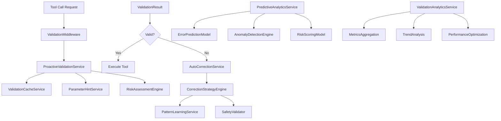

# MXF Validation & Error Prevention System

## Overview

The MXF Validation & Error Prevention System is a comprehensive, multi-layered architecture that prevents errors before they occur, automatically corrects parameter issues, and continuously learns from patterns to improve system reliability. The system is designed for low-latency operation while providing robust validation capabilities.

## System Architecture

### Core Components

<div class="mermaid-fallback">



</div>

<iframe src="../diagram/validation-system.html" width="100%" height="680" style="border: none; border-radius: 10px; background: var(--bg-secondary);"></iframe>

### Service Layer Architecture

#### 1. ValidationMiddleware
- **Role**: Transparent interception of all tool calls
- **Performance**: <5ms overhead per call
- **Features**: Request/response transformation, error handling
- **Integration**: Seamless integration with existing tool execution pipeline

#### 2. ProactiveValidationService
- **Role**: Core validation orchestration
- **Validation Levels**: ASYNC, BLOCKING, STRICT
- **Caching**: Multi-layer caching (Memory, Redis, MongoDB)
- **Risk Assessment**: Real-time risk scoring and mitigation

#### 3. AutoCorrectionService
- **Role**: Intelligent error recovery and parameter correction
- **Strategies**: Type correction, parameter inference, alternative suggestions
- **Loop Prevention**: Guards prevent infinite retry cycles
- **Learning Integration**: Continuous improvement from correction patterns

#### 4. PredictiveAnalyticsService
- **Role**: ML-based error prevention and anomaly detection
- **Models**: Random Forest + Gradient Boosting ensemble
- **Pattern Learning**: Continuous improvement from historical data
- **Real-time**: Low-latency inference

## Validation Flow

### 1. Pre-execution Validation

```typescript
interface ValidationFlow {
    // 1. Tool call interception
    intercept: (toolCall: ToolCallRequest) => ValidationContext;
    
    // 2. Cache lookup
    checkCache: (context: ValidationContext) => CachedResult | null;
    
    // 3. Schema validation
    validateSchema: (parameters: any, schema: JSONSchema) => SchemaValidation;
    
    // 4. Business logic validation
    validateBusinessLogic: (toolName: string, parameters: any) => BusinessValidation;
    
    // 5. Risk assessment
    assessRisk: (operation: Operation) => RiskAssessment;
    
    // 6. Prediction check
    predictErrors: (context: ValidationContext) => ErrorPrediction;
}
```

### 2. Validation Levels

| Level | Use Case | Latency Target | Cache TTL | Risk Threshold |
|-------|----------|----------------|-----------|----------------|
| ASYNC | Low-risk read operations | <20ms | 5 minutes | Low |
| BLOCKING | Medium-risk operations | Low latency | 2 minutes | Medium |
| STRICT | High-risk system operations | <100ms | 30 seconds | High |

### 3. Auto-Correction Strategies

#### Type Mismatch Correction
```typescript
interface TypeCorrectionStrategy {
    detectMismatch: (expected: string, actual: any) => boolean;
    correctValue: (value: any, targetType: string) => CorrectionResult;
    confidence: number; // 0.0 - 1.0
}

// Example corrections:
// "123" → 123 (string to number)
// "true" → true (string to boolean)
// [1,2,3] → "1,2,3" (array to string)
```

#### Missing Parameter Correction
```typescript
interface MissingParameterStrategy {
    inferFromContext: (toolName: string, existingParams: any) => InferredValues;
    useDefaults: (schema: JSONSchema) => DefaultValues;
    suggestAlternatives: (intent: string) => AlternativeTools[];
}
```

#### Parameter Constraint Violation
```typescript
interface ConstraintCorrectionStrategy {
    validateConstraints: (value: any, constraints: Constraints) => ValidationResult;
    adjustToConstraints: (value: any, constraints: Constraints) => AdjustedValue;
    suggestValidRange: (constraints: Constraints) => SuggestionRange;
}
```

## Machine Learning Models

### 1. Error Prediction Model

#### Feature Engineering
```typescript
interface FeatureVector {
    // Tool characteristics
    toolComplexity: number;
    toolCategory: string;
    historicalErrorRate: number;
    
    // Parameter features
    parameterCount: number;
    parameterTypes: string[];
    parameterComplexity: number;
    
    // Agent context
    agentExperience: number;
    agentErrorHistory: number[];
    currentWorkload: number;
    
    // System context
    timeOfDay: number;
    systemLoad: number;
    recentErrorRate: number;
}
```

#### Model Architecture
- **Algorithm**: Ensemble (Random Forest + Gradient Boosting)
- **Training**: Online learning with concept drift detection
- **Features**: Multiple engineered features
- **Pattern Learning**: Continuous improvement from outcomes
- **Latency**: Low-latency inference

### 2. Anomaly Detection

#### Multi-Algorithm Approach
```typescript
interface AnomalyDetectionEngine {
    // Statistical anomalies
    statisticalDetection: (data: TimeSeries) => StatisticalAnomalies;
    
    // Parameter anomalies
    parameterAnomalies: (params: any, historicalParams: any[]) => ParameterAnomalies;
    
    // Behavioral anomalies
    behavioralAnomalies: (agentBehavior: BehaviorPattern) => BehavioralAnomalies;
    
    // Pattern anomalies
    patternAnomalies: (currentPattern: Pattern, knownPatterns: Pattern[]) => PatternAnomalies;
}
```

#### Detection Algorithms
1. **Isolation Forest**: Parameter value anomalies
2. **Statistical Process Control**: Performance anomalies
3. **LSTM Autoencoders**: Sequence pattern anomalies
4. **One-Class SVM**: Behavioral anomalies

### 3. Risk Scoring Model

#### Multi-Factor Risk Assessment
```typescript
interface RiskScoring {
    calculateRisk: (operation: Operation) => RiskScore;
    
    factors: {
        errorProbability: { weight: 0.3, score: number };
        toolComplexity: { weight: 0.2, score: number };
        agentExperience: { weight: 0.2, score: number };
        systemLoad: { weight: 0.15, score: number };
        patternMatch: { weight: 0.15, score: number };
    };
    
    mitigationStrategies: MitigationStrategy[];
}
```

## Performance Optimization

### 1. Caching Strategy

#### Multi-Level Cache Architecture
```typescript
interface CacheArchitecture {
    // L1: Memory Cache (Ultra-fast)
    memoryCache: {
        maxSize: "100MB";
        ttl: "5 minutes";
        hitRatio: "high";
        accessTime: "<1ms";
    };
    
    // L2: Redis Cache (Distributed)
    redisCache: {
        maxSize: "1GB";
        ttl: "30 minutes";
        hitRatio: "high";
        accessTime: "<5ms";
    };
    
    // L3: MongoDB Cache (Persistent)
    mongoCache: {
        retention: "7 days";
        patterns: "long-term";
        accessTime: "<20ms";
    };
}
```

#### Cache Key Strategy
```typescript
function generateCacheKey(
    toolName: string,
    parameters: any,
    context: { agentType?: string, channelType?: string, riskLevel?: string }
): string {
    return crypto.createHash('sha256')
        .update(JSON.stringify({ 
            tool: toolName, 
            params: normalizeParameters(parameters),
            context: context 
        }))
        .digest('hex');
}
```

### 2. Performance Goals

| Metric | Goal | Monitoring |
|--------|------|------------|
| Validation Latency | Low latency | P95 tracking |
| Cache Hit Rate | High | Real-time monitoring |
| Error Prediction | Effective | Continuous validation |
| Auto-correction | Effective | Pattern analysis |
| System Availability | High | Health checks |

### 3. Bottleneck Detection

#### Automated Performance Analysis
```typescript
interface BottleneckDetection {
    // Latency analysis
    analyzeLatency: () => LatencyBottlenecks;
    
    // Resource utilization
    analyzeResources: () => ResourceBottlenecks;
    
    // Cache performance
    analyzeCachePerformance: () => CacheBottlenecks;
    
    // Database performance
    analyzeDatabasePerformance: () => DatabaseBottlenecks;
}
```

## Analytics & Insights

### 1. Real-time Metrics

#### Core Metrics Dashboard
```typescript
interface ValidationMetrics {
    // Volume metrics
    totalValidations: Counter;
    validationsPerSecond: Gauge;
    
    // Quality metrics
    validationSuccessRate: Gauge;
    errorPreventionCount: Counter;
    falsePositiveRate: Gauge;
    
    // Performance metrics
    averageLatency: Histogram;
    cacheHitRate: Gauge;
    throughput: Gauge;
    
    // Learning metrics
    patternMatchRate: Gauge;
    correctionSuccessRate: Gauge;
    modelAccuracy: Gauge;
}
```

### 2. Trend Analysis

#### Statistical Analysis Engine
```typescript
interface TrendAnalysis {
    // Trend detection
    detectTrends: (timeSeries: TimeSeries) => TrendType;
    
    // Seasonality analysis
    detectSeasonality: (timeSeries: TimeSeries) => SeasonalPatterns;
    
    // Forecasting
    forecast: (historical: TimeSeries, periods: number) => Forecast;
    
    // Anomaly trending
    trendAnomalies: (metrics: Metrics[]) => AnomalyTrends;
}
```

### 3. A/B Testing Framework

#### Experimental Design
```typescript
interface ABTestFramework {
    // Test configuration
    createExperiment: (config: ExperimentConfig) => Experiment;
    
    // Statistical analysis
    analyzeResults: (experiment: Experiment) => StatisticalResults;
    
    // Decision support
    makeRecommendation: (results: StatisticalResults) => Recommendation;
}

interface ExperimentConfig {
    name: string;
    hypothesis: string;
    variants: ExperimentVariant[];
    metrics: string[];
    significance: number; // 0.95 for 95% confidence
    minimumSampleSize: number;
    maxDuration: number; // milliseconds
}
```

## Integration Points

### 1. Event-Driven Architecture

#### Event Flow
```typescript
interface ValidationEvents {
    // Pre-validation events
    VALIDATION_STARTED: ValidationStartedEvent;
    VALIDATION_COMPLETED: ValidationCompletedEvent;
    VALIDATION_FAILED: ValidationFailedEvent;
    
    // Auto-correction events
    CORRECTION_ATTEMPTED: CorrectionAttemptedEvent;
    CORRECTION_SUCCEEDED: CorrectionSucceededEvent;
    CORRECTION_FAILED: CorrectionFailedEvent;
    
    // Learning events
    PATTERN_LEARNED: PatternLearnedEvent;
    PATTERN_UPDATED: PatternUpdatedEvent;
    MODEL_RETRAINED: ModelRetrainedEvent;
    
    // Analytics events
    METRICS_UPDATED: MetricsUpdatedEvent;
    ANOMALY_DETECTED: AnomalyDetectedEvent;
    PERFORMANCE_ALERT: PerformanceAlertEvent;
}
```

### 2. Service Dependencies

#### Dependency Graph
```typescript
interface ServiceDependencies {
    // Core dependencies
    eventBus: EventBus;
    logger: Logger;
    database: MongoDB;
    cache: Redis;
    
    // Optional dependencies
    llmService?: SystemLlmService;
    patternService?: PatternLearningService;
    analyticsService?: AnalyticsService;
    
    // Fallback behavior when services unavailable
    gracefulDegradation: DegradationStrategy;
}
```

### 3. Configuration Management

#### Dynamic Configuration
```typescript
interface ValidationConfig {
    // Validation settings
    defaultLevel: ValidationLevel;
    maxLatency: number;
    cacheEnabled: boolean;
    
    // Auto-correction settings
    correctionEnabled: boolean;
    maxRetries: number;
    confidenceThreshold: number;
    
    // ML settings
    predictionEnabled: boolean;
    modelVersion: string;
    retrainInterval: number;
    
    // Performance settings
    cacheSize: number;
    cacheTTL: number;
    parallelValidation: boolean;
}
```

## Security Considerations

### 1. Data Privacy

#### Sensitive Data Handling
```typescript
interface PrivacyProtection {
    // Data anonymization
    anonymizeParameters: (params: any) => AnonymizedParams;
    
    // Pattern sharing controls
    allowPatternSharing: boolean;
    sharingScope: 'channel' | 'global' | 'none';
    
    // Audit logging
    auditValidationAccess: (request: ValidationRequest) => AuditLog;
}
```

### 2. Security Validation

#### Security-First Validation
```typescript
interface SecurityValidation {
    // Input sanitization
    sanitizeInput: (input: any) => SanitizedInput;
    
    // Path traversal protection
    validateFilePaths: (path: string) => PathValidation;
    
    // Command injection prevention
    validateCommands: (command: string) => CommandValidation;
    
    // Rate limiting
    enforceRateLimit: (agentId: string) => RateLimitResult;
}
```

## Deployment & Operations

### 1. Rollout Strategy

#### Phased Deployment
1. **Phase 1**: Enable for read-only operations (0% risk)
2. **Phase 2**: Enable for low-risk write operations
3. **Phase 3**: Enable for medium-risk operations with monitoring
4. **Phase 4**: Full deployment with all features enabled

### 2. Monitoring Strategy

#### Health Checks
```typescript
interface HealthMonitoring {
    // Service health
    checkValidationService: () => HealthStatus;
    checkCacheService: () => HealthStatus;
    checkMLService: () => HealthStatus;
    
    // Performance health
    checkLatency: () => LatencyHealth;
    checkThroughput: () => ThroughputHealth;
    checkAccuracy: () => AccuracyHealth;
    
    // Resource health
    checkMemoryUsage: () => ResourceHealth;
    checkCPUUsage: () => ResourceHealth;
    checkDiskUsage: () => ResourceHealth;
}
```

### 3. Alerting Strategy

#### Critical Alerts
```typescript
interface AlertingStrategy {
    // Performance alerts
    highLatency: { threshold: "100ms", severity: "warning" };
    lowThroughput: { threshold: "100 ops/sec", severity: "warning" };
    
    // Accuracy alerts
    lowAccuracy: { threshold: "60%", severity: "critical" };
    highFalsePositives: { threshold: "5%", severity: "warning" };
    
    // System alerts
    serviceDown: { threshold: "immediate", severity: "critical" };
    highErrorRate: { threshold: "1%", severity: "warning" };
}
```

## Future Enhancements

### 1. ML Capabilities
- **Deep Learning Models**: LSTM/Transformer models for sequence prediction
- **Federated Learning**: Cross-organization pattern sharing without data exposure
- **Reinforcement Learning**: Self-improving correction strategies
- **Graph Neural Networks**: Relationship-aware validation

### 2. Enhanced User Experience
- **Natural Language Validation**: Describe validation rules in natural language
- **Visual Validation Designer**: GUI for creating custom validation rules
- **Collaborative Validation**: Team-based validation rule management
- **Smart Suggestions**: Proactive suggestions based on user patterns

### 3. Enterprise Features
- **Multi-tenant Isolation**: Complete isolation between organizations
- **Compliance Reporting**: SOC2, GDPR, HIPAA compliance reporting
- **Custom Model Training**: Organization-specific model training
- **Integration APIs**: REST/GraphQL APIs for external system integration

## Conclusion

The MXF Validation & Error Prevention System represents a comprehensive approach to ensuring reliable, safe, and efficient tool execution in multi-agent environments. Through proactive validation, intelligent auto-correction, and continuous learning, the system provides enterprise-grade reliability while maintaining high performance and user experience.

The system's modular architecture allows for incremental adoption, graceful degradation, and continuous improvement, making it suitable for production deployments across various scales and use cases.