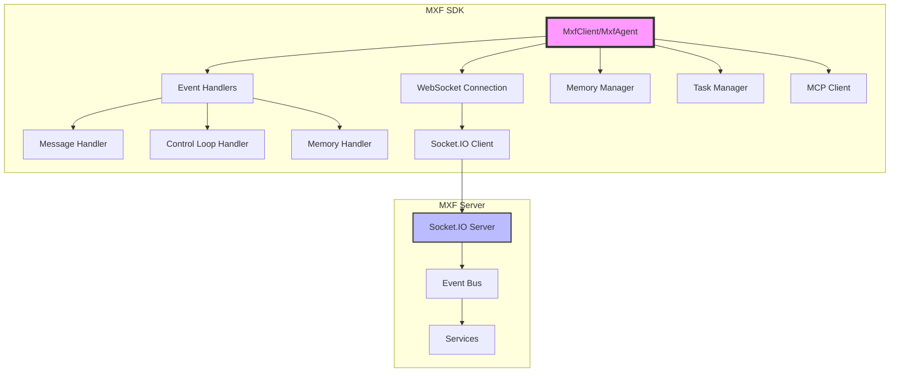

# MXF SDK Documentation

The MXF SDK provides TypeScript/JavaScript classes for building agents that connect to the Model Exchange Framework via WebSocket communication. It enables real-time messaging, task handling, memory management, and tool execution through the Model Context Protocol (MCP).

## SDK Sections

### Core Documentation
- [Authentication & Installation](authentication.md)
- [Core Interfaces](interfaces.md)
- [Code Examples](examples.md)
- [Event System](events.md)
- [MCP Integration](mcp.md)

### Configuration & Management
- [**Configuration Manager**](config-manager.md) - Feature toggles, LLM selection, agent types
- [**MXP 2.0 Configuration**](mxp-config.md) - Token optimization, bandwidth, security
- [**SDK Managers**](managers.md) - MCP, Memory, Prompt, and Task managers
- [**SDK Handlers**](handlers.md) - Control loop, tools, messaging, tasks

### Prompt Examples
- [System Prompt Reference](system-prompt-example.md)
- [Agent Config Prompt Examples](agent-config-prompt-example.md)
- [Task Prompt Examples](task-prompt-example.md)
- [Conversation Prompt Examples](conversation-prompt-example.md)

## Overview

The SDK has **ONE** main entry point:

- **`MxfSDK`**: Primary SDK class - ONLY way to create agents
  - Handles domain key authentication and user authentication
  - Creates and manages agent instances via `sdk.createAgent()`
  - Provides channel and key management methods

**Important**: `MxfAgent` is not exported from the SDK. All agent creation must go through `MxfSDK.createAgent()`.

### Key Features

- **Real-time WebSocket Communication**: Event-driven architecture with Socket.IO
- **Agent Management**: Register, authenticate, and manage agent lifecycle
- **Channel Operations**: Join channels, send messages, receive broadcasts
- **Memory System**: Agent, channel, and relationship memory with MongoDB persistence
- **Semantic Search**: Meilisearch-powered memory search for intelligent context retrieval
- **Memory Search Tools**: 3 specialized tools for searching conversations, actions, and patterns
- **Task Management**: Receive, execute, and report on assigned tasks
- **MCP Tool Integration**: 100+ built-in tools plus external MCP server integration (global and channel-scoped) - See [Tool Reference](../mxf/tool-reference.md)
- **Control Loop Support**: ORPAR (Observe-Reason-Act-Progress-Reflect) cycle
- **MXP Protocol**: Efficient binary messaging with bandwidth optimization
- **Validation & Auto-Correction**: Proactive error prevention with intelligent fixes

## Installation

The SDK is part of the MXF monorepo and should be built from source:

```bash
# Clone the repository
git clone https://github.com/BradA1878/model-exchange-framework.git
cd model-exchange-framework

# Install dependencies
npm install

# Build the project
npm run build
```

## Quick Start

### Prerequisites

1. **Domain Key**: Obtain from MXF server operator via secure channel
2. **User Credentials**: Username/password or JWT token from server operator
3. **Agent Keys**: Generate via SDK CLI (see below)

### Step 1: Initialize SDK

```typescript
import { MxfSDK, Events } from '@mxf/sdk';
import type { MxfAgent } from '@mxf/sdk';

// Initialize SDK with domain key and user authentication
const sdk = new MxfSDK({
    serverUrl: 'http://localhost:3001',
    domainKey: process.env.MXF_DOMAIN_KEY!,  // REQUIRED
    // Authentication: Use JWT token OR username/password
    userId: 'your-user-id',
    userToken: process.env.MXF_USER_TOKEN   // JWT token
    // OR use username/password for socket-based auth:
    // username: 'demo-user',
    // password: process.env.MXF_USER_PASSWORD
});

// Connect the SDK
await sdk.connect();
```

### Step 2: Generate Channel and Keys (CLI)

```bash
# Create a channel
npm run sdk:cli -- channel:create \
  --id research-channel \
  --name "Research Channel" \
  --email your@email.com \
  --password your-password

# Generate agent keys
npm run sdk:cli -- key:generate \
  --channel research-channel \
  --agents agent-123,llm-agent-001 \
  --email your@email.com \
  --password your-password \
  --output credentials.json
```

### Step 3: Create Agent

```typescript
// Create agent through SDK (ONLY way)
const agent = await sdk.createAgent({
    agentId: 'agent-123',
    name: 'Research Agent',
    channelId: 'research-channel',
    keyId: 'your-key-id',
    secretKey: 'your-secret-key',
    llmProvider: 'openrouter',
    defaultModel: 'anthropic/claude-3.5-sonnet',
    capabilities: ['research', 'analysis']
});

// Connect the agent
await agent.connect();

// Send a message to the channel
await agent.channelService.sendMessage('Hello from Research Agent!');

// Handle incoming messages
agent.on(Events.Message.AGENT_MESSAGE, (payload) => {
    console.log('Received:', payload.data.content);
    console.log('From:', payload.data.senderId);
});
```

### LLM-Powered Agent with Full Configuration

```typescript
import { MxfSDK, Events } from '@mxf/sdk';

// Initialize SDK (done once)
const sdk = new MxfSDK({
    serverUrl: 'http://localhost:3001',
    domainKey: process.env.MXF_DOMAIN_KEY!,
    username: 'demo-user',
    password: process.env.MXF_USER_PASSWORD
});
await sdk.connect();

// Create LLM-powered agent with all options
const llmAgent = await sdk.createAgent({
    // Required fields
    agentId: 'llm-agent-001',
    name: 'AI Assistant',
    channelId: 'support-channel',
    keyId: 'your-key-id',
    secretKey: 'your-secret-key',
    llmProvider: 'openrouter',
    defaultModel: 'anthropic/claude-3.5-sonnet',
    
    // Optional: Agent identity
    agentConfigPrompt: 'You are a helpful AI assistant specialized in customer support.',
    description: 'Customer support agent',
    capabilities: ['support', 'troubleshooting'],
    
    // Optional: LLM settings
    apiKey: process.env.OPENROUTER_API_KEY,
    temperature: 0.7,
    maxTokens: 100000,
    reasoning: { enabled: false },
    
    // Optional: Tool access control
    allowedTools: ['messaging_send', 'messaging_coordinate', 'task_complete'],
    circuitBreakerExemptTools: ['game_move', 'game_action'],  // Tools exempt from loop detection

    // Optional: Behavioral settings
    maxIterations: 15,                 // Max LLM iterations per task (default: 10)

    // Optional: MXP settings
    mxpEnabled: false,                 // Enable efficient binary messaging
    mxpPreferredFormat: 'auto',        // auto | mxp | natural-language
    mxpForceEncryption: false,         // Force encryption for all messages

    // Optional: Metadata
    metadata: { department: 'support', priority: 'high' }
});

await llmAgent.connect();

// The agent will automatically:
// - Respond to messages using its LLM
// - Discover and use allowed tools
// - Maintain conversation history
// - Participate in autonomous coordination
```

## Core API

### Connection Management

```typescript
// Connect to server (lazy - only connects when needed)
await agent.connect();

// Check connection status
const status = agent.getConnectionStatus();

// Disconnect
await agent.disconnect();
```

### Messaging

```typescript
// Send message to current channel
await agent.channelService.sendMessage('Hello world', {
    priority: 'high'
});

// Send message with structured content
await agent.channelService.sendMessage({
    format: 'text',
    data: 'Hello world'
}, { priority: 'high' });

// Send direct message to another agent
await agent.channelService.sendMessage('Private message', {
    recipientId: 'target-agent-id',
    type: 'direct'
});

// Broadcast to all agents in channel
await agent.channelService.sendMessage('Announcement for everyone', {
    type: 'broadcast'
});
```

### Memory Operations

```typescript
// Agent Memory (private to this agent)
await agent.channelService.updateMemory('agent', 'preferences', {
    theme: 'dark',
    language: 'en'
});
const agentMemory = await agent.channelService.getMemory('agent', 'preferences');

// Channel Memory (shared with all agents in channel)
await agent.channelService.updateMemory('channel', 'shared-context', {
    topic: 'Research Project X',
    phase: 'planning'
});
const channelMemory = await agent.channelService.getMemory('channel', 'shared-context');

// Delete memory
await agent.channelService.deleteMemory('agent', 'old-preference');

// List all memory keys
const agentKeys = await agent.channelService.listMemoryKeys('agent');
const channelKeys = await agent.channelService.listMemoryKeys('channel');
```

### Task Handling

```typescript
import { Events } from '@mxf/sdk';

// Create a task for agents
await agent.channelService.createTask({
    taskId: 'research-task-001',
    title: 'Analyze Market Data',
    description: 'Analyze Q4 2024 market data and provide insights',
    assignedAgents: ['analyst-agent'],
    priority: 'high',
    metadata: {
        deadline: '2025-12-31',
        department: 'analytics'
    }
});

// Listen for task assignments
agent.on(Events.Task.ASSIGNED, (payload) => {
    console.log('New task assigned:', payload.data.taskId);
    console.log('Description:', payload.data.description);
});

// Listen for task completion
agent.on(Events.Task.COMPLETED, (payload) => {
    console.log('Task completed:', payload.data.taskId);
    console.log('Result:', payload.data.result);
});

// Listen for task progress updates
agent.on(Events.Task.PROGRESS_UPDATED, (payload) => {
    console.log('Task progress:', payload.data.progress);
});

// Agents complete tasks by using the task_complete tool via LLM
```

### Tool Execution (MCP)

Agents automatically discover and use tools via LLM reasoning. Monitor tool usage via events:

```typescript
import { Events } from '@mxf/sdk';

// Listen for tool calls
agent.on(Events.Mcp.TOOL_CALL, (payload) => {
    console.log('Tool called:', payload.data.toolName);
    console.log('Arguments:', payload.data.arguments);
});

// Listen for tool results
agent.on(Events.Mcp.TOOL_RESULT, (payload) => {
    console.log('Tool:', payload.data.toolName);
    console.log('Result:', payload.data.result);
});

// Listen for tool errors
agent.on(Events.Mcp.TOOL_ERROR, (payload) => {
    console.error('Tool error:', payload.data.toolName, payload.data.error);
});

// Control tool access via allowedTools during agent creation
const restrictedAgent = await sdk.createAgent({
    // ... other config
    allowedTools: ['messaging_send', 'task_complete']  // Only these tools
});
```

### Control Loop Operations

The ORPAR control loop runs automatically in LLM-powered agents. Monitor via events:

```typescript
import { Events } from '@mxf/sdk';

// Listen to control loop phases
agent.on(Events.ControlLoop.OBSERVATION, (payload) => {
    console.log('Observation phase:', payload.data);
});

agent.on(Events.ControlLoop.REASONING, (payload) => {
    console.log('Reasoning phase:', payload.data);
});

agent.on(Events.ControlLoop.PLAN, (payload) => {
    console.log('Planning phase:', payload.data);
});

agent.on(Events.ControlLoop.ACTION, (payload) => {
    console.log('Action phase:', payload.data);
});

agent.on(Events.ControlLoop.REFLECTION, (payload) => {
    console.log('Reflection phase:', payload.data);
});
```

## Event System

The SDK provides **two ways to listen to events** with a public events whitelist for security:

### Agent-Level Events (Multi-Channel)

Listen to events across all channels the agent participates in:

```typescript
import { Events } from '@mxf/sdk';

// Message events
agent.on(Events.Message.AGENT_MESSAGE, (payload) => {
    console.log('From:', payload.data.senderId);
    console.log('Channel:', payload.channelId);
    console.log('Content:', payload.data.content);
});

agent.on(Events.Message.CHANNEL_MESSAGE, (payload) => {
    console.log('Channel message:', payload.data.content);
});

// Task events
agent.on(Events.Task.ASSIGNED, (payload) => {
    console.log('Task assigned:', payload.data.taskId);
});

agent.on(Events.Task.COMPLETED, (payload) => {
    console.log('Task completed:', payload.data.taskId);
});

agent.on(Events.Task.PROGRESS_UPDATED, (payload) => {
    console.log('Progress:', payload.data.progress);
});

// Tool events
agent.on(Events.Mcp.TOOL_CALL, (payload) => {
    console.log('Tool:', payload.data.toolName);
});

agent.on(Events.Mcp.TOOL_RESULT, (payload) => {
    console.log('Result:', payload.data.result);
});

// Agent lifecycle events
agent.on(Events.Agent.CONNECTED, (payload) => {
    console.log('Agent connected');
});

agent.on(Events.Agent.DISCONNECTED, (payload) => {
    console.log('Agent disconnected');
});

agent.on(Events.Agent.ERROR, (payload) => {
    console.error('Agent error:', payload.data.error);
});

// Channel events
agent.on(Events.Channel.AGENT_JOINED, (payload) => {
    console.log('Agent joined:', payload.data.agentId);
});

agent.on(Events.Channel.AGENT_LEFT, (payload) => {
    console.log('Agent left:', payload.data.agentId);
});
```

### Channel-Level Events (Single-Channel, Auto-Filtered)

Listen to events only within a specific channel (automatically filtered by channelId):

```typescript
// Events are automatically scoped to this agent's channel
agent.channelService.on(Events.Message.AGENT_MESSAGE, (payload) => {
    // payload.channelId will always be this agent's channel
    console.log('Message in my channel:', payload.data.content);
});

agent.channelService.on(Events.Task.ASSIGNED, (payload) => {
    console.log('Task in my channel:', payload.data.taskId);
});

// Remove listener
agent.channelService.off(Events.Message.AGENT_MESSAGE);
```

### Event Categories

**Message Events**: Communication between agents
- `Events.Message.CHANNEL_MESSAGE`
- `Events.Message.AGENT_MESSAGE`
- `Events.Message.CHANNEL_MESSAGE_DELIVERED`
- `Events.Message.AGENT_MESSAGE_DELIVERED`
- `Events.Message.MESSAGE_SEND_FAILED`

**Task Events**: Task lifecycle
- `Events.Task.ASSIGNED`
- `Events.Task.COMPLETED`
- `Events.Task.FAILED`
- `Events.Task.PROGRESS_UPDATED`
- `Events.Task.CREATED`

**MCP/Tool Events**: Tool execution
- `Events.Mcp.TOOL_CALL`
- `Events.Mcp.TOOL_RESULT`
- `Events.Mcp.TOOL_ERROR`
- `Events.Mcp.TOOL_REGISTERED`

**Memory Events**: Memory operations
- `Events.Memory.GET_RESULT`
- `Events.Memory.UPDATE_RESULT`
- `Events.Memory.CREATE_RESULT`
- `Events.Memory.DELETE_RESULT`

**Control Loop Events**: ORPAR phases
- `Events.ControlLoop.OBSERVATION`
- `Events.ControlLoop.REASONING`
- `Events.ControlLoop.PLAN`
- `Events.ControlLoop.ACTION`
- `Events.ControlLoop.REFLECTION`

**Agent Events**: Agent lifecycle
- `Events.Agent.CONNECTED`
- `Events.Agent.DISCONNECTED`
- `Events.Agent.REGISTERED`
- `Events.Agent.ERROR`
- `Events.Agent.JOIN_CHANNEL`
- `Events.Agent.LEAVE_CHANNEL`

**Channel Events**: Channel operations
- `Events.Channel.AGENT_JOINED`
- `Events.Channel.AGENT_LEFT`
- `Events.Channel.CREATED`
- `Events.Channel.UPDATED`

**Note**: Internal system events are not accessible via the SDK for security reasons.

## Architecture



## Advanced Usage

### Multiple Agents from Single SDK

Create multiple agents from one SDK instance (efficient connection reuse):

```typescript
import { MxfSDK, Events } from '@mxf/sdk';

// Initialize SDK once
const sdk = new MxfSDK({
    serverUrl: 'http://localhost:3001',
    domainKey: process.env.MXF_DOMAIN_KEY!,
    username: 'demo-user',
    password: process.env.MXF_USER_PASSWORD
});
await sdk.connect();

// Create multiple agents
const coordinator = await sdk.createAgent({
    agentId: 'coordinator',
    name: 'Team Coordinator',
    channelId: 'team-channel',
    keyId: 'coord-key',
    secretKey: 'coord-secret',
    llmProvider: 'openrouter',
    defaultModel: 'anthropic/claude-3.5-sonnet'
});

const analyst = await sdk.createAgent({
    agentId: 'analyst',
    name: 'Data Analyst',
    channelId: 'team-channel',
    keyId: 'analyst-key',
    secretKey: 'analyst-secret',
    llmProvider: 'openrouter',
    defaultModel: 'anthropic/claude-3.5-sonnet'
});

// Connect all agents
await Promise.all([
    coordinator.connect(),
    analyst.connect()
]);
```

### Channel and Key Management via SDK

The SDK provides methods for channel and key management:

```typescript
// Create a channel programmatically
const channel = await sdk.createChannel('new-channel', {
    name: 'New Channel Name',                // REQUIRED
    description: 'Channel for specific project',
    metadata: { project: 'ProjectX' }
});

// Create a channel with tool restrictions
const restrictedChannel = await sdk.createChannel('restricted-channel', {
    name: 'Restricted Channel',
    description: 'Channel with limited tool access',
    allowedTools: ['messaging_send', 'task_complete'],  // Channel-level tool restrictions
    systemLlmEnabled: true,                             // Enable SystemLLM (default: true)
    metadata: { access: 'limited' }
});

// Create a channel with pre-registered MCP servers
const gameChannel = await sdk.createChannel('game-channel', {
    name: 'Game Channel',
    description: 'Channel for game interactions',
    mcpServers: [{                                       // Pre-register MCP servers
        id: 'game-server',
        name: 'Game Server',
        command: 'npx',
        args: ['-y', '@mcp/game-tools'],
        keepAliveMinutes: 30
    }]
});

// Generate agent keys for a channel
const keyInfo = await sdk.generateKey('new-channel', 'new-agent-id', 'Agent Key Description');
console.log('Key ID:', keyInfo.keyId);
console.log('Secret Key:', keyInfo.secretKey);
```

### Tool Access Control

Implement principle of least privilege with `allowedTools`:

```typescript
// Full tool access (default)
const adminAgent = await sdk.createAgent({
    agentId: 'admin',
    // No allowedTools = access to all tools
    // ... other config
});

// Restricted tool access (recommended for production)
const restrictedAgent = await sdk.createAgent({
    agentId: 'restricted',
    allowedTools: [
        'messaging_send',
        'messaging_coordinate',
        'task_complete',
        'channel_context_get'
    ],
    // ... other config
});
```

## Tool Access Control

The MXF SDK provides fine-grained control over which tools agents can access through the `allowedTools` configuration. This enables role-based security, prevents unauthorized tool usage, and ensures agents only have access to tools appropriate for their function.

### Overview

The `allowedTools` property is an optional array of tool names that restricts which MCP tools an agent can access. This filtering happens at three levels:

1. **SDK Level**: Tools are filtered when sent to the agent
2. **Meta-tools Level**: `tools_recommend` and `tools_discover` only suggest allowed tools
3. **System Prompt Level**: Tool documentation only shows allowed tools

### Configuration Options

#### **Unrestricted Access (Development/Admin)**

```typescript
// Omit allowedTools for full access to all tools
const adminAgent = await sdk.createAgent({
    agentId: 'admin-agent',
    name: 'Admin Agent',
    // No allowedTools property = all tools available
    channelId: 'admin-channel',
    keyId: 'admin-key',
    secretKey: 'admin-secret',
    llmProvider: 'openrouter',
    defaultModel: 'anthropic/claude-3.5-sonnet'
});
```

#### **Restricted Access (Production - Recommended)**

```typescript
// Example: Customer Service Agent (communication only)
const serviceAgent = await sdk.createAgent({
    agentId: 'service-agent',
    name: 'Customer Service Agent',
    channelId: 'support-channel',
    keyId: 'service-key',
    secretKey: 'service-secret',
    llmProvider: 'openrouter',
    defaultModel: 'anthropic/claude-3.5-sonnet',
    allowedTools: [
        'messaging_send',        // Send messages to customers
        'messaging_coordinate',  // Coordinate with other agents
        'tools_recommend',       // Discover appropriate tools
        'channel_context_get'    // Access customer context
    ]
});

// Example: Data Analysis Agent (analysis + storage)
const analysisAgent = await sdk.createAgent({
    agentId: 'analysis-agent', 
    name: 'Data Analysis Agent',
    channelId: 'analytics-channel',
    keyId: 'analysis-key',
    secretKey: 'analysis-secret',
    llmProvider: 'openrouter',
    defaultModel: 'anthropic/claude-3.5-sonnet',
    allowedTools: [
        'filesystem_read',       // Read data files
        'memory_store',          // Store analysis results
        'memory_retrieve',       // Retrieve cached data
        'task_complete',         // Mark analysis tasks complete
        'tools_recommend'        // Tool discovery
    ]
});

// Example: Orchestrator Agent (coordination + task management)
const orchestratorAgent = await sdk.createAgent({
    agentId: 'orchestrator',
    name: 'Task Orchestrator',
    channelId: 'coordination-channel',
    keyId: 'orchestrator-key', 
    secretKey: 'orchestrator-secret',
    llmProvider: 'openrouter',
    defaultModel: 'anthropic/claude-3.5-sonnet',
    allowedTools: [
        'messaging_send',        // Coordinate with agents
        'messaging_coordinate',  // Multi-party coordination
        'messaging_broadcast',   // Broadcast announcements
        'task_complete',         // Complete orchestration tasks
        'controlLoop_plan',      // Plan agent workflows
        'tools_recommend',       // Tool discovery
        'tools_discover'         // Interactive tool exploration
    ]
});
```

### Tool Categories

Common MXF tools can be grouped by function. For the complete reference, see the **[Tool Reference](../mxf/tool-reference.md)**.

#### **Communication Tools**
- `messaging_send` - Send direct messages
- `messaging_coordinate` - Multi-party coordination
- `messaging_broadcast` - Broadcast to all agents

#### **File & System Tools**  
- `filesystem_read` - Read files
- `filesystem_write` - Write files
- `filesystem_list` - List directories
- `shell_execute` - Execute shell commands

#### **Memory & Context Tools**
- `memory_store` - Store data in memory
- `memory_retrieve` - Retrieve stored data
- `channel_context_get` - Get channel context
- `agent_context_get` - Get agent context

#### **Task & Control Tools**
- `task_complete` - Mark tasks as complete
- `controlLoop_plan` - Plan agent workflows
- `controlLoop_execute` - Execute planned actions

#### **Meta Tools**
- `tools_recommend` - AI-powered tool recommendations
- `tools_discover` - Interactive tool discovery

### Security Best Practices

#### **Principle of Least Privilege**
```typescript
// ✅ Good: Agent only has tools it needs
const chatbotAgent = await sdk.createAgent({
    agentId: 'chatbot',
    name: 'Customer Service Bot',
    channelId: 'support',
    keyId: 'key-123',
    secretKey: 'secret-456',
    allowedTools: ['messaging_send', 'tools_recommend']
});

// ❌ Bad: Agent has unnecessary powerful tools
const dangerousAgent = await sdk.createAgent({
    agentId: 'chatbot',
    name: 'Customer Service Bot',
    channelId: 'support',
    keyId: 'key-123',
    secretKey: 'secret-456',
    allowedTools: ['messaging_send', 'filesystem_write', 'shell_execute'] // Too much access!
});
```

#### **Role-Based Tool Assignment**
```typescript
// Different agents for different responsibilities
const roles = {
    customer_service: ['messaging_send', 'channel_context_get'],
    data_processor: ['filesystem_read', 'memory_store', 'task_complete'],  
    system_admin: undefined, // Unrestricted access for admin tasks
    coordinator: ['messaging_coordinate', 'messaging_broadcast', 'task_complete']
};
```

### Validation & Debugging

The SDK provides helpful logging when tools are filtered:

```bash
# When an agent tries to use a forbidden tool
🚫 TOOL ACCESS: controlLoop_plan not in allowedTools for agent service-agent

# When filtering is applied
🔒 TOOL FILTERING: Restricted to 4/189 allowed tools for agent service-agent
```

### Migration Guide

If you're adding `allowedTools` to existing agents:

```typescript
// Before: Unrestricted access (implicit)
const legacyAgent = await sdk.createAgent({
    agentId: 'legacy-agent',
    name: 'Legacy Agent',
    channelId: 'legacy-channel',
    keyId: 'key-123',
    secretKey: 'secret-456'
});

// After: Explicit tool restrictions  
const secureAgent = await sdk.createAgent({
    agentId: 'legacy-agent',
    name: 'Legacy Agent',
    channelId: 'legacy-channel',
    keyId: 'key-123',
    secretKey: 'secret-456',
    allowedTools: [
        // Add only the tools this agent actually needs
        'messaging_send',
        'tools_recommend'
    ]
});
```

**Testing Tip**: Start with unrestricted access during development, then gradually add restrictions as you identify which tools each agent actually uses.

## Best Practices

1. **Connection Management**: Use the lazy connection pattern - the client connects automatically when needed
2. **Error Handling**: Always wrap async operations in try-catch blocks
3. **Memory Scopes**: Use appropriate memory scopes (agent vs channel) for data isolation
4. **Event Cleanup**: Remove event listeners when agent is no longer needed
5. **Type Safety**: Leverage TypeScript interfaces for compile-time safety

## Next Steps

- Review the [Authentication Guide](authentication.md) for secure connection setup
- Explore [Core Interfaces](interfaces.md) for detailed type information
- Check out [Code Examples](examples.md) for practical implementations
- Learn about the [Event System](events.md) for real-time communication
- Understand [MCP Integration](mcp.md) for tool execution

---

For more details on the server-side implementation, see the [API Documentation](../api/index.md) and [MXF Architecture](../mxf/index.md).