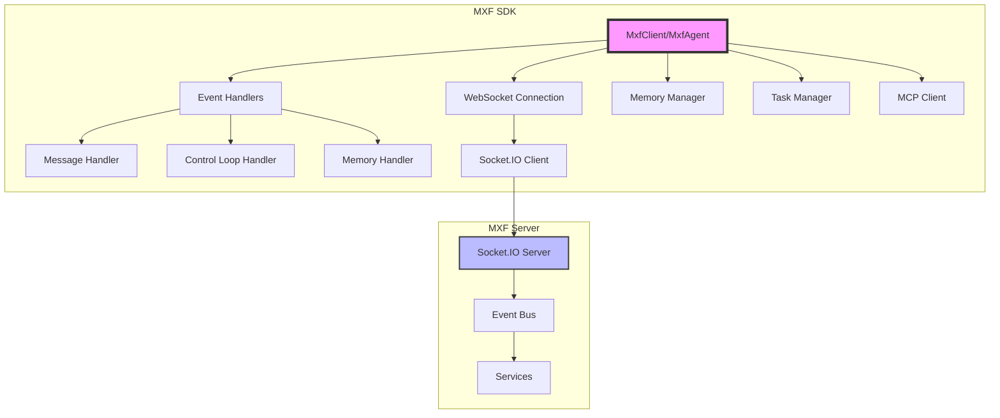

# MXF SDK Documentation

The MXF SDK provides TypeScript/JavaScript classes for building agents that connect to the Model Exchange Framework via WebSocket communication. It enables real-time messaging, task handling, memory management, and tool execution through the Model Context Protocol (MCP).

## SDK Sections

### Core Documentation
- [Authentication & Installation](authentication.md)
- [Core Interfaces](interfaces.md)
- [Code Examples](examples.md)
- [Event System](events.md)
- [MCP Integration](mcp.md)

### Configuration & Management
- [**Configuration Manager**](config-manager.md) - Feature toggles, LLM selection, agent types
- [**MXP 2.0 Configuration**](mxp-config.md) - Token optimization, bandwidth, security
- [**SDK Managers**](managers.md) - MCP, Memory, Prompt, and Task managers
- [**SDK Handlers**](handlers.md) - Control loop, tools, messaging, tasks

### Prompt Examples
- [System Prompt Reference](system-prompt-example.md)
- [Agent Config Prompt Examples](agent-config-prompt-example.md)
- [Task Prompt Examples](task-prompt-example.md)
- [Conversation Prompt Examples](conversation-prompt-example.md)

### Development & Debugging
- [Debug Mode & Logging](../troubleshooting.md#debug-mode--logging) - Enable/disable logging for server and SDK

## Overview

The SDK has **ONE** main entry point:

- **`MxfSDK`**: Primary SDK class - ONLY way to create agents
  - Handles domain key authentication and user authentication
  - Creates and manages agent instances via `sdk.createAgent()`
  - Provides channel and key management methods

**Important**: `MxfAgent` is exported only as a TypeScript type. The runtime class is
not a supported constructor; create every agent through `MxfSDK.createAgent()`.

### Key Features

- **Real-time WebSocket Communication**: Event-driven architecture with Socket.IO
- **Agent Management**: Register, authenticate, and manage agent lifecycle
- **Channel Operations**: Join channels, send messages, receive broadcasts
- **Memory System**: Agent, channel, and relationship memory with MongoDB persistence
- **Semantic Search**: Meilisearch-powered memory search for intelligent context retrieval
- **Memory Search Tools**: 3 specialized tools for searching conversations, actions, and patterns
- **Task Management**: Receive, execute, and report on assigned tasks
- **MCP Tool Integration**: 100+ built-in tools plus external MCP server integration (global and channel-scoped) - See [Tool Reference](../mxf/tool-reference.md)
- **Control Loop Support**: ORPAR (Observe-Reason-Plan-Act-Reflect) cognitive cycle with agent-driven tools
- **ORPAR Tools**: 6 tools (`orpar_observe`, `orpar_reason`, `orpar_plan`, `orpar_act`, `orpar_reflect`, `orpar_status`) for explicit cognitive structuring
- **MXP Protocol**: Efficient binary messaging with bandwidth optimization
- **Validation & Auto-Correction**: Proactive error prevention with intelligent fixes

## Installation

Install the SDK package:

```bash
bun add @mxf-dev/sdk
# (@mxf-dev/core is pulled in automatically)
```

To build from source instead (for contributing):

```bash
git clone https://github.com/BradA1878/model-exchange-framework.git
cd mxf
bun install

# Build the project
bun run build
```

## Quick Start

### Prerequisites

1. **Domain Key**: Obtain from MXF server operator via secure channel
2. **Access Token**: Personal Access Token (PAT) - generate via dashboard or `bun run server:cli -- demo:setup`
3. **Agent Keys**: Generate via SDK CLI (see below)

### Step 1: Initialize SDK

```typescript
import { MxfSDK, Events } from '@mxf-dev/sdk';
import type { MxfAgent } from '@mxf-dev/sdk';

// Initialize SDK with domain key and access token (recommended)
const sdk = new MxfSDK({
    serverUrl: 'http://localhost:3001',
    domainKey: process.env.MXF_DOMAIN_KEY!,  // REQUIRED
    accessToken: process.env.MXF_ACCESS_TOKEN!  // Personal Access Token (recommended)
});

// Connect the SDK
await sdk.connect();
```

The promise resolves only after user authentication succeeds. The administrative
socket retries transient transport failures continuously by default; set a finite
`reconnectionAttempts` when the application needs bounded retry. Authentication
rejection and configured retry exhaustion reject the promise.

### Step 2: Generate Channel and Keys (CLI)

```bash
# Create a channel
bun run mxf channel:create \
  --id research-channel \
  --name "Research Channel" \
  --email your@email.com \
  --password your-password

# Generate agent keys
bun run mxf key:generate \
  --channel research-channel \
  --agents agent-123,llm-agent-001 \
  --email your@email.com \
  --password your-password \
  --output credentials.json
```

### Step 3: Create Agent

```typescript
// Create agent through SDK (ONLY way)
const agent = await sdk.createAgent({
    agentId: 'agent-123',
    name: 'Research Agent',
    channelId: 'research-channel',
    keyId: 'your-key-id',
    secretKey: 'your-secret-key',
    llmProvider: 'openrouter',
    defaultModel: '~anthropic/claude-sonnet-latest',
    capabilities: ['research', 'analysis']
});

// Connect the agent
await agent.connect();

// Send a message to the channel
await agent.mxfService.sendMessage('Hello from Research Agent!');

// Handle incoming messages
agent.on(Events.Message.AGENT_MESSAGE, (payload) => {
    console.log('Received:', payload.data.content.data);
    console.log('From:', payload.data.senderId);
});
```

> **Note:** Model ids change often. The ids in these docs are a snapshot of what was
> available when they were written; providers add, rename, and retire models all the
> time. Check your provider's current list before relying on an id — for OpenRouter,
> <https://openrouter.ai/models>. For Claude on OpenRouter, `~anthropic/claude-opus-latest`,
> `~anthropic/claude-sonnet-latest`, and `~anthropic/claude-haiku-latest` resolve to the
> newest release in each family, so they are the ids to use unless you need a specific
> version. `~anthropic/claude-fable-latest` is the same kind of alias for the top-tier
> family; it is priced well above the others and nothing in MXF selects it by default.

### LLM-Powered Agent with Full Configuration

```typescript
import { MxfSDK, Events } from '@mxf-dev/sdk';

// Initialize SDK with access token (recommended)
const sdk = new MxfSDK({
    serverUrl: 'http://localhost:3001',
    domainKey: process.env.MXF_DOMAIN_KEY!,
    accessToken: process.env.MXF_ACCESS_TOKEN!
});
await sdk.connect();

// Create LLM-powered agent with all options
const llmAgent = await sdk.createAgent({
    // Required fields
    agentId: 'llm-agent-001',
    name: 'AI Assistant',
    channelId: 'support-channel',
    keyId: 'your-key-id',
    secretKey: 'your-secret-key',
    llmProvider: 'openrouter',
    defaultModel: '~anthropic/claude-sonnet-latest',
    
    // Optional: Agent identity
    agentConfigPrompt: 'You are a helpful AI assistant specialized in customer support.',
    description: 'Customer support agent',
    capabilities: ['support', 'troubleshooting'],
    
    // Optional: LLM settings
    apiKey: process.env.OPENROUTER_API_KEY,
    temperature: 0.7,
    maxTokens: 100000,
    reasoning: { enabled: false },
    
    // Optional: Tool access control
    allowedTools: ['messaging_send', 'messaging_coordinate', 'task_complete'],
    circuitBreakerExemptTools: ['game_move', 'game_action'],  // Tools exempt from loop detection

    // Optional: Behavioral settings
    maxIterations: 15,                 // Max LLM iterations per task (default: 10)

    // Optional: MXP settings
    mxpEnabled: false,                 // Enable efficient binary messaging
    mxpPreferredFormat: 'auto',        // auto | mxp | natural-language
    mxpForceEncryption: false,         // Force encryption for all messages

    // Optional: Metadata
    metadata: { department: 'support', priority: 'high' }
});

await llmAgent.connect();

// The agent will automatically:
// - Respond to messages using its LLM
// - Discover and use allowed tools
// - Maintain conversation history
// - Participate in autonomous coordination
```

## Core API

### Connection Management

```typescript
// Connect to server (lazy - only connects when needed)
await agent.connect();

// Check connection status
const connected = agent.isConnected();

// Disconnect
await agent.disconnect();
```

### Dynamic Tool Management

Dynamically update an agent's allowed tools at runtime. This is essential for phase-gated tool access patterns like ORPAR cognitive cycles.

```typescript
// Update agent's allowed tools dynamically
await agent.updateAllowedTools([
    'orpar_observe',
    'game_getState',
    'memory_read'
]);

// After server-side changes, refresh the local tool cache
const tools = await agent.refreshTools();
console.log(`Agent now has access to ${tools.length} tools`);
```

**Phase-Gated Example (ORPAR):**

```typescript
// Define tools for each ORPAR phase
const PHASE_TOOLS = {
    observe: ['orpar_observe', 'game_getState', 'memory_read'],
    reason: ['orpar_reason'],
    plan: ['orpar_plan', 'planning_create'],
    act: ['orpar_act', 'game_performAction'],
    reflect: ['orpar_reflect', 'task_complete', 'memory_write']
};

// Listen to ORPAR phase events and update tools
agent.on(Events.ControlLoop.OBSERVATION, async () => {
    await agent.updateAllowedTools(PHASE_TOOLS.observe);
});

agent.on(Events.Orpar.REASON, async () => {
    await agent.updateAllowedTools(PHASE_TOOLS.reason);
});

agent.on(Events.Orpar.PLAN, async () => {
    await agent.updateAllowedTools(PHASE_TOOLS.plan);
});

agent.on(Events.Orpar.ACT, async () => {
    await agent.updateAllowedTools(PHASE_TOOLS.act);
});

agent.on(Events.Orpar.REFLECT, async () => {
    await agent.updateAllowedTools(PHASE_TOOLS.reflect);
});
```

**How It Works:**

1. `updateAllowedTools(tools)` - Updates both server-side AgentService AND refreshes local tool cache
2. `refreshTools()` - Force-refreshes the local tool cache from the server (useful after external changes)

The update is immediate and affects the next LLM iteration's tool selection.

### Messaging

```typescript
// Send message to current channel
await agent.mxfService.sendMessage('Hello world', {
    metadata: { priority: 10 }
});

// Send message with structured content
await agent.mxfService.sendMessage({
    action: 'status',
    state: 'ready'
});

// Address one recipient. The sender is always the authenticated agent identity.
await agent.mxfService.sendMessage('Private message', {
    receiverId: 'target-agent-id'
});
```

### Memory Operations

```typescript
// Canonical channel memory returns the persisted document on both read and write.
const updatedChannelMemory = await agent.mxfService.updateSharedMemory({
    notes: { topic: 'Research Project X' },
    sharedState: { phase: 'planning' }
});
const channelMemory = await agent.mxfService.getSharedMemory();

// Agent-private key/value memory uses the authorized MCP memory tools.
await agent.executeTool('agent_memory_write', {
    key: 'preferences',
    value: { theme: 'dark', language: 'en' },
    memorySection: 'notes'
});
const agentMemory = await agent.executeTool('agent_memory_read', {
    key: 'preferences',
    memorySection: 'notes'
});
```

### Task Handling

```typescript
import { Events } from '@mxf-dev/sdk';

// Creation resolves to the server-persisted task ID; callers do not choose it.
const taskId = await agent.mxfService.createTask({
    title: 'Analyze Market Data',
    description: 'Analyze Q4 2024 market data and provide insights',
    assignedAgentIds: ['analyst-agent'],
    priority: 'high',
    metadata: {
        deadline: '2025-12-31',
        department: 'analytics'
    }
});

// Only an assigned participant can authoritatively complete/fail/cancel it.
await agent.mxfService.completeTask(taskId, { reportId: 'report-42' });
await agent.mxfService.failTask(taskId, 'Input dataset is unreadable');
await agent.mxfService.cancelTask(taskId, 'Work is no longer required');

// Listen for task assignments
agent.on(Events.Task.ASSIGNED, (payload) => {
    console.log('New task assigned:', payload.data.taskId);
    console.log('Description:', payload.data.task.description);
});

// Listen for task completion
agent.on(Events.Task.COMPLETED, (payload) => {
    console.log('Task completed:', payload.data.taskId);
    console.log('Result:', payload.data.result);
});

// Listen for task progress updates
agent.on(Events.Task.PROGRESS_UPDATED, (payload) => {
    console.log('Task progress:', payload.data.progress);
});

// The lifecycle methods resolve only after the matching server acknowledgement.
```

### Tool Execution (MCP)

Agents automatically discover and use tools via LLM reasoning. Monitor tool usage via events:

```typescript
import { Events } from '@mxf-dev/sdk';

// Listen for tool calls
agent.on(Events.Mcp.TOOL_CALL, (payload) => {
    console.log('Tool called:', payload.data.toolName);
    console.log('Arguments:', payload.data.arguments);
});

// Listen for tool results
agent.on(Events.Mcp.TOOL_RESULT, (payload) => {
    console.log('Tool:', payload.data.toolName);
    console.log('Result:', payload.data.result);
});

// Listen for tool errors
agent.on(Events.Mcp.TOOL_ERROR, (payload) => {
    console.error('Tool error:', payload.data.toolName, payload.data.error);
});

// Control tool access via allowedTools during agent creation
const restrictedAgent = await sdk.createAgent({
    // ... other config
    allowedTools: ['messaging_send', 'task_complete']  // Only these tools
});
```

### Control Loop Operations

The ORPAR control loop runs automatically in LLM-powered agents. Monitor via events:

```typescript
import { Events } from '@mxf-dev/sdk';

// Listen to control loop phases
agent.on(Events.ControlLoop.OBSERVATION, (payload) => {
    console.log('Observation phase:', payload.data);
});

agent.on(Events.ControlLoop.REASONING, (payload) => {
    console.log('Reasoning phase:', payload.data);
});

agent.on(Events.ControlLoop.PLAN, (payload) => {
    console.log('Planning phase:', payload.data);
});

agent.on(Events.ControlLoop.ACTION, (payload) => {
    console.log('Action phase:', payload.data);
});

agent.on(Events.ControlLoop.REFLECTION, (payload) => {
    console.log('Reflection phase:', payload.data);
});
```

## Event System

The SDK provides **two ways to listen to events** with a public events whitelist for security:

### Agent-Level Events (Multi-Channel)

Listen to events across all channels the agent participates in:

```typescript
import { Events } from '@mxf-dev/sdk';

// Message events
agent.on(Events.Message.AGENT_MESSAGE, (payload) => {
    console.log('From:', payload.data.senderId);
    console.log('Channel:', payload.channelId);
    console.log('Content:', payload.data.content.data);
});

agent.on(Events.Message.CHANNEL_MESSAGE, (payload) => {
    console.log('Channel message:', payload.data.content.data);
});

// Task events
agent.on(Events.Task.ASSIGNED, (payload) => {
    console.log('Task assigned:', payload.data.taskId);
});

agent.on(Events.Task.COMPLETED, (payload) => {
    console.log('Task completed:', payload.data.taskId);
});

agent.on(Events.Task.PROGRESS_UPDATED, (payload) => {
    console.log('Progress:', payload.data.progress);
});

// Tool events
agent.on(Events.Mcp.TOOL_CALL, (payload) => {
    console.log('Tool:', payload.data.toolName);
});

agent.on(Events.Mcp.TOOL_RESULT, (payload) => {
    console.log('Result:', payload.data.result);
});

// Agent lifecycle events
agent.on(Events.Agent.CONNECTED, (payload) => {
    console.log('Agent connected');
});

agent.on(Events.Agent.DISCONNECTED, (payload) => {
    console.log('Agent disconnected');
});

agent.on(Events.Agent.ERROR, (payload) => {
    console.error('Agent error:', payload.data.error);
});

// Channel events
agent.on(Events.Channel.AGENT_JOINED, (payload) => {
    console.log('Agent joined:', payload.data.agentId);
});

agent.on(Events.Channel.AGENT_LEFT, (payload) => {
    console.log('Agent left:', payload.data.agentId);
});
```

### Channel-Level Events (Single-Channel, Auto-Filtered)

Listen to events only within a specific channel (automatically filtered by channelId):

```typescript
// Events are automatically scoped to this agent's channel
agent.mxfService.on(Events.Message.AGENT_MESSAGE, (payload) => {
    // payload.channelId will always be this agent's channel
    console.log('Message in my channel:', payload.data.content.data);
});

agent.mxfService.on(Events.Task.ASSIGNED, (payload) => {
    console.log('Task in my channel:', payload.data.taskId);
});

// Remove listener
agent.mxfService.off(Events.Message.AGENT_MESSAGE);
```

### Event Categories

**Message Events**: Communication between agents
- `Events.Message.CHANNEL_MESSAGE`
- `Events.Message.AGENT_MESSAGE`
- `Events.Message.CHANNEL_MESSAGE_DELIVERED`
- `Events.Message.AGENT_MESSAGE_DELIVERED`
- `Events.Message.MESSAGE_SEND_FAILED`

**Task Events**: Task lifecycle
- `Events.Task.ASSIGNED`
- `Events.Task.COMPLETED`
- `Events.Task.FAILED`
- `Events.Task.PROGRESS_UPDATED`
- `Events.Task.CREATED`

**MCP/Tool Events**: Tool execution
- `Events.Mcp.TOOL_CALL`
- `Events.Mcp.TOOL_RESULT`
- `Events.Mcp.TOOL_ERROR`
- `Events.Mcp.TOOL_REGISTERED`

**Memory Events**: Memory operations
- `Events.Memory.GET_RESULT`
- `Events.Memory.UPDATE_RESULT`
- `Events.Memory.CREATE_RESULT`
- `Events.Memory.DELETE_RESULT`

**Control Loop Events**: ORPAR phases
- `Events.ControlLoop.OBSERVATION`
- `Events.ControlLoop.REASONING`
- `Events.ControlLoop.PLAN`
- `Events.ControlLoop.ACTION`
- `Events.ControlLoop.REFLECTION`

**Agent Events**: Agent lifecycle
- `Events.Agent.CONNECTED`
- `Events.Agent.DISCONNECTED`
- `Events.Agent.REGISTERED`
- `Events.Agent.ERROR`
- `Events.Agent.JOIN_CHANNEL`
- `Events.Agent.LEAVE_CHANNEL`

**Channel Events**: Channel operations
- `Events.Channel.AGENT_JOINED`
- `Events.Channel.AGENT_LEFT`
- `Events.Channel.CREATED`
- `Events.Channel.UPDATED`

**Note**: Internal system events are not accessible via the SDK for security reasons.

## Architecture

<div class="mermaid-fallback">


```mermaid
graph TB
    subgraph "MXF SDK"
        A[MxfClient/MxfAgent] --> B[WebSocket Connection]
        A --> C[Event Handlers]
        A --> D[Memory Manager]
        A --> E[Task Manager]
        A --> F[MCP Client]

        C --> G[Message Handler]
        C --> H[Control Loop Handler]
        C --> I[Memory Handler]

        B --> J[Socket.IO Client]
    end

    subgraph "MXF Server"
        J --> K[Socket.IO Server]
        K --> L[Event Bus]
        L --> M[Services]
    end

    style A fill:#f9f,stroke:#333,stroke-width:4px
    style K fill:#bbf,stroke:#333,stroke-width:2px
```

</div>

<iframe src="../diagram/architecture-high-level.html" width="100%" height="800" style="border: none; border-radius: 10px; background: var(--bg-secondary);"></iframe>

## Advanced Usage

### Multiple Agents from Single SDK

Create multiple agents from one SDK instance (efficient connection reuse):

```typescript
import { MxfSDK, Events } from '@mxf-dev/sdk';

// Initialize SDK once with access token (recommended)
const sdk = new MxfSDK({
    serverUrl: 'http://localhost:3001',
    domainKey: process.env.MXF_DOMAIN_KEY!,
    accessToken: process.env.MXF_ACCESS_TOKEN!
});
await sdk.connect();

// Create multiple agents
const coordinator = await sdk.createAgent({
    agentId: 'coordinator',
    name: 'Team Coordinator',
    channelId: 'team-channel',
    keyId: 'coord-key',
    secretKey: 'coord-secret',
    llmProvider: 'openrouter',
    defaultModel: '~anthropic/claude-sonnet-latest'
});

const analyst = await sdk.createAgent({
    agentId: 'analyst',
    name: 'Data Analyst',
    channelId: 'team-channel',
    keyId: 'analyst-key',
    secretKey: 'analyst-secret',
    llmProvider: 'openrouter',
    defaultModel: '~anthropic/claude-sonnet-latest'
});

// Connect all agents
await Promise.all([
    coordinator.connect(),
    analyst.connect()
]);
```

### Channel and Key Management via SDK

The SDK provides methods for channel and key management:

```typescript
// Create a channel programmatically
const channel = await sdk.createChannel('new-channel', {
    name: 'New Channel Name',                // REQUIRED
    description: 'Channel for specific project',
    metadata: { project: 'ProjectX' }
});

// Create a channel with tool restrictions
const restrictedChannel = await sdk.createChannel('restricted-channel', {
    name: 'Restricted Channel',
    description: 'Channel with limited tool access',
    allowedTools: ['messaging_send', 'task_complete'],  // Channel-level tool restrictions
    systemLlmEnabled: true,                             // Enable SystemLLM (default: true)
    metadata: { access: 'limited' }
});

// Create a channel with pre-registered MCP servers
const gameChannel = await sdk.createChannel('game-channel', {
    name: 'Game Channel',
    description: 'Channel for game interactions',
    mcpServers: [{                                       // Pre-register MCP servers
        id: 'game-server',
        name: 'Game Server',
        command: 'bunx',
        args: ['-y', '@mcp/game-tools'],
        keepAliveMinutes: 30
    }]
});

// Generate agent keys for a channel
const keyInfo = await sdk.generateKey('new-channel', 'new-agent-id', 'Agent Key Description');
console.log('Key ID:', keyInfo.keyId);
console.log('Secret Key:', keyInfo.secretKey);
```

### Tool Access Control

Implement principle of least privilege with `allowedTools`:

```typescript
// Omitting allowedTools selects MXF's curated core-tool set.
const coreAgent = await sdk.createAgent({
    agentId: 'core-agent',
    // ... other required config
});

// An explicit empty list denies every tool.
const conversationalAgent = await sdk.createAgent({
    agentId: 'conversation-only',
    allowedTools: [],
    // ... other required config
});

// Restricted tool access (recommended for production)
const restrictedAgent = await sdk.createAgent({
    agentId: 'restricted',
    allowedTools: [
        'messaging_send',
        'messaging_coordinate',
        'task_complete',
        'channel_context_get'
    ],
    // ... other config
});
```

## Tool Access Control

The MXF SDK provides fine-grained control over which tools agents can access through the `allowedTools` configuration. This enables role-based security, prevents unauthorized tool usage, and ensures agents only have access to tools appropriate for their function.

### Overview

The `allowedTools` property requests a tool policy within the maximum grant carried
by the authenticated channel key. It can narrow that credential grant but cannot
expand it. Its three states are intentionally distinct:

- `undefined`: MXF's curated `CORE_MXF_TOOLS` set (plus enabled memory-search tools)
- `[]`: no tools
- non-empty array: exactly that requested subset, if every name is in the key grant

Filtering is enforced at the server's discovery and execution boundaries as well as
inside the SDK; prompt filtering is not the security boundary.

1. **Credential boundary**: A client cannot self-grant beyond its channel key
2. **Server boundary**: Discovery and execution use the same effective policy
3. **SDK/prompt boundary**: The model sees only the effective tool set

Internal tools are named by their tool name (`messaging_send`, `task_complete`). Tools from external and channel MCP servers are named by the raw name the origin server reports — the names returned in `toolsDiscovered` at registration. The registry's canonical form, `<serverId>__<toolName>`, is accepted in `allowedTools` as well, but the raw name is the one to use: a channel server's registry id contains `:`, which LLM providers reject in function names. See [External MCP Servers](external-mcp-servers.md#tool-names).

### Configuration Options

#### **Curated Core Access**

```typescript
// Omit allowedTools to use CORE_MXF_TOOLS, not the full registry.
const coreAgent = await sdk.createAgent({
    agentId: 'core-agent',
    name: 'Core Agent',
    channelId: 'work-channel',
    keyId: 'agent-key',
    secretKey: 'agent-secret',
    llmProvider: 'openrouter',
    defaultModel: '~anthropic/claude-sonnet-latest'
});
```

#### **Restricted Access (Production - Recommended)**

```typescript
// Example: Customer Service Agent (communication only)
const serviceAgent = await sdk.createAgent({
    agentId: 'service-agent',
    name: 'Customer Service Agent',
    channelId: 'support-channel',
    keyId: 'service-key',
    secretKey: 'service-secret',
    llmProvider: 'openrouter',
    defaultModel: '~anthropic/claude-sonnet-latest',
    allowedTools: [
        'messaging_send',        // Send messages to customers
        'messaging_coordinate',  // Coordinate with other agents
        'tools_recommend',       // Discover appropriate tools
        'channel_context_get'    // Access customer context
    ]
});

// Example: Data Analysis Agent (analysis + storage)
const analysisAgent = await sdk.createAgent({
    agentId: 'analysis-agent', 
    name: 'Data Analysis Agent',
    channelId: 'analytics-channel',
    keyId: 'analysis-key',
    secretKey: 'analysis-secret',
    llmProvider: 'openrouter',
    defaultModel: '~anthropic/claude-sonnet-latest',
    allowedTools: [
        'filesystem_read',       // Read data files
        'memory_store',          // Store analysis results
        'memory_retrieve',       // Retrieve cached data
        'task_complete',         // Mark analysis tasks complete
        'tools_recommend'        // Tool discovery
    ]
});

// Example: Orchestrator Agent (coordination + task management)
const orchestratorAgent = await sdk.createAgent({
    agentId: 'orchestrator',
    name: 'Task Orchestrator',
    channelId: 'coordination-channel',
    keyId: 'orchestrator-key', 
    secretKey: 'orchestrator-secret',
    llmProvider: 'openrouter',
    defaultModel: '~anthropic/claude-sonnet-latest',
    allowedTools: [
        'messaging_send',        // Coordinate with agents
        'messaging_coordinate',  // Multi-party coordination
        'messaging_broadcast',   // Broadcast announcements
        'task_complete',         // Complete orchestration tasks
        'controlLoop_plan',      // Plan agent workflows
        'tools_recommend',       // Tool discovery
        'tools_discover'         // Interactive tool exploration
    ]
});
```

### Tool Categories

Common MXF tools can be grouped by function. For the complete reference, see the **[Tool Reference](../mxf/tool-reference.md)**.

#### **Communication Tools**
- `messaging_send` - Send direct messages
- `messaging_coordinate` - Multi-party coordination
- `messaging_broadcast` - Broadcast to all agents

#### **File & System Tools**  
- `filesystem_read` - Read files
- `filesystem_write` - Write files
- `filesystem_list` - List directories
- `shell_execute` - Execute shell commands

#### **Memory & Context Tools**
- `memory_store` - Store data in memory
- `memory_retrieve` - Retrieve stored data
- `channel_context_get` - Get channel context
- `agent_context_get` - Get agent context

#### **Task & Control Tools**
- `task_complete` - Mark tasks as complete
- `controlLoop_plan` - Plan agent workflows
- `controlLoop_execute` - Execute planned actions

#### **Meta Tools**
- `tools_recommend` - AI-powered tool recommendations
- `tools_discover` - Interactive tool discovery

### Security Best Practices

#### **Principle of Least Privilege**
```typescript
// ✅ Good: Agent only has tools it needs
const chatbotAgent = await sdk.createAgent({
    agentId: 'chatbot',
    name: 'Customer Service Bot',
    channelId: 'support',
    keyId: 'key-123',
    secretKey: 'secret-456',
    allowedTools: ['messaging_send', 'tools_recommend']
});

// ❌ Bad: Agent has unnecessary powerful tools
const dangerousAgent = await sdk.createAgent({
    agentId: 'chatbot',
    name: 'Customer Service Bot',
    channelId: 'support',
    keyId: 'key-123',
    secretKey: 'secret-456',
    allowedTools: ['messaging_send', 'filesystem_write', 'shell_execute'] // Too much access!
});
```

#### **Role-Based Tool Assignment**
```typescript
// Different agents for different responsibilities
const roles = {
    customer_service: ['messaging_send', 'channel_context_get'],
    data_processor: ['filesystem_read', 'memory_store', 'task_complete'],  
    system_agent: undefined, // Curated core tools, not unrestricted access
    coordinator: ['messaging_coordinate', 'messaging_broadcast', 'task_complete']
};
```

### Validation & Debugging

The SDK provides helpful logging when tools are filtered:

```bash
# When an agent tries to use a forbidden tool
🚫 TOOL ACCESS: controlLoop_plan not in allowedTools for agent service-agent

# When filtering is applied
🔒 TOOL FILTERING: Restricted to 4/189 allowed tools for agent service-agent
```

### Migration Guide

If you're adding `allowedTools` to existing agents:

```typescript
// Before: Curated core access (implicit)
const legacyAgent = await sdk.createAgent({
    agentId: 'legacy-agent',
    name: 'Legacy Agent',
    channelId: 'legacy-channel',
    keyId: 'key-123',
    secretKey: 'secret-456'
});

// After: Explicit tool restrictions
const secureAgent = await sdk.createAgent({
    agentId: 'legacy-agent',
    name: 'Legacy Agent',
    channelId: 'legacy-channel',
    keyId: 'key-123',
    secretKey: 'secret-456',
    allowedTools: [
        // Add only the tools this agent actually needs
        'messaging_send',
        'tools_recommend'
    ]
});
```

**Testing Tip**: Generate the channel key with the maximum tools the role may ever
need, then request the smallest per-agent subset. Privileged host tools
(`shell_execute`, filesystem/code tools) and network tools remain disabled unless the
server operator explicitly enables `MXF_UNSAFE_HOST_TOOLS_ENABLED=true` or
`MXF_UNSAFE_NETWORK_TOOLS_ENABLED=true`.

### Dynamic Tool Updates

For scenarios where tool access needs to change at runtime (e.g., phase-gated ORPAR workflows), use the dynamic tool management methods:

```typescript
// Update tools dynamically based on current phase or context
await agent.updateAllowedTools(['orpar_observe', 'game_getState']);

// See "Dynamic Tool Management" section in Core API for full details
```

This is particularly useful for:
- **ORPAR cognitive cycles** - Different tools per phase (observe, reason, plan, act, reflect)
- **Game state machines** - Role-specific tools based on game phase
- **Progressive trust models** - Gradually enabling more tools as trust is established

## Best Practices

1. **Connection Management**: Use the lazy connection pattern - the client connects automatically when needed
2. **Error Handling**: Always wrap async operations in try-catch blocks
3. **Memory Scopes**: Use appropriate memory scopes (agent vs channel) for data isolation
4. **Event Cleanup**: Remove event listeners when agent is no longer needed
5. **Type Safety**: Leverage TypeScript interfaces for compile-time safety

## Next Steps

- Review the [Authentication Guide](authentication.md) for secure connection setup
- Explore [Core Interfaces](interfaces.md) for detailed type information
- Check out [Code Examples](examples.md) for practical implementations
- Learn about the [Event System](events.md) for real-time communication
- Understand [MCP Integration](mcp.md) for tool execution

---

For more details on the server-side implementation, see the [API Documentation](../api/index.md) and [MXF Architecture](../mxf/index.md).
