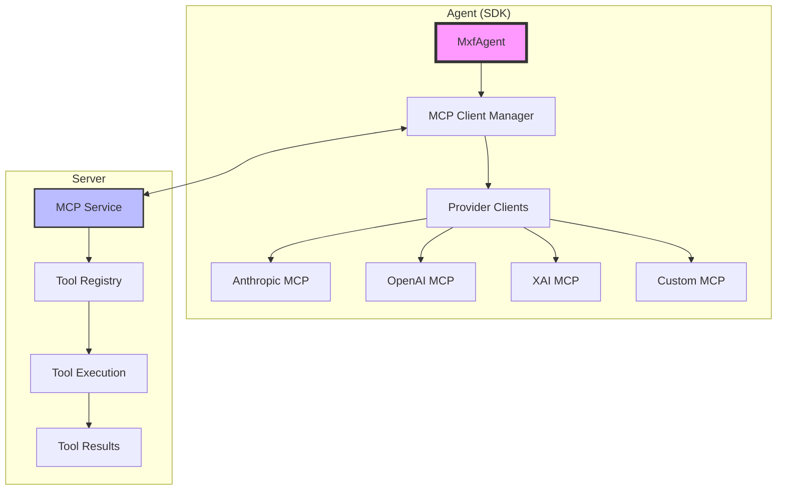

# MCP (Model Context Protocol) Integration

The MXF SDK provides comprehensive support for the Model Context Protocol (MCP), enabling agents to execute tools, access resources, and extend functionality through a standardized interface.

## Overview

MCP integration in MXF allows:
- Dynamic tool discovery and execution
- Resource management (prompts, templates, data)
- Provider-specific implementations (Anthropic, OpenAI, XAI, etc.)
- Custom tool development
- Hybrid client-server tool execution

## Network Stability & Reliability

MXF includes sophisticated network recovery and error handling capabilities built into all MCP provider clients:

### Network Recovery Manager

**Automatic Retry Logic with Circuit Breaker:**
- **Exponential Backoff**: Intelligent retry delays that increase exponentially (with jitter)
- **Circuit Breaker Pattern**: Prevents cascading failures by temporarily blocking requests after repeated failures
- **Error Classification**: Distinguishes between retryable (network, timeout) and non-retryable (auth, validation) errors
- **Configurable Thresholds**: Customize max retries, circuit breaker threshold, and cooldown periods

**Circuit Breaker States:**
- **CLOSED**: Normal operation, all requests allowed
- **OPEN**: Service temporarily unavailable after threshold failures
- **HALF_OPEN**: Testing if service has recovered

```typescript
// Network recovery is built-in, but can be configured
const agent = await sdk.createAgent({
    agentId: 'resilient-agent',
    name: 'Resilient Agent',
    channelId: 'main',
    keyId: 'key-123',
    secretKey: 'secret-456',
    llmConfig: {
        provider: 'openrouter',
        networkRecovery: {
            maxRetries: 3,
            circuitBreakerThreshold: 5,
            circuitBreakerCooldownMs: 60000,
            enableDetailedLogging: true
        }
    }
});

```

### JSON Recovery Manager

**Sophisticated Response Parsing:**
- Handles truncated or malformed JSON responses from LLM providers
- 4 recovery strategies automatically applied:
  1. **last_valid_index**: Use last complete JSON object before truncation
  2. **last_complete_object**: Find last fully closed object
  3. **remove_trailing**: Strip incomplete trailing content
  4. **close_brackets**: Auto-close unclosed brackets/braces

```typescript
// JSON recovery is automatic in all providers
// Handles cases like:
// - Truncated responses due to token limits
// - Incomplete tool call arrays
// - Malformed JSON from streaming
// - Missing closing brackets

// Recovery is logged automatically:
// "Successfully recovered using strategy: last_valid_index"
```

### Multi-Provider Tool Format Conversion

**Unified Tool Handling Across Providers:**
- Automatic conversion between provider-specific tool formats
- Supports: OpenRouter, OpenAI, Anthropic, xAI, Gemini, Azure OpenAI, Ollama
- Handles differences in tool_calls, function calling, and tool_use formats
- Safe argument parsing with fallbacks

```typescript
// Framework automatically handles format differences:
// OpenAI: { type: 'function', function: { name, arguments } }
// Anthropic: { type: 'tool_use', id, name, input }
// Gemini: { name, args }
// xAI: { name, parameters }

// You write code once, it works everywhere
const result = await agent.executeTool({
    name: 'web_search',
    arguments: { query: 'latest news' }
});
// Tool format is converted automatically for your provider
```

### Message Content Extraction

**Robust Content Handling:**
- Extracts text, images, and tool results from any provider format
- Handles nested content arrays gracefully
- Safe extraction with fallbacks
- Content type detection and validation

**Error Handling Coverage:**
- ✅ Network timeouts → Automatic retry
- ✅ Rate limits → Exponential backoff
- ✅ Truncated responses → JSON recovery
- ✅ Malformed tool calls → Safe parsing
- ✅ Service unavailable → Circuit breaker
- ✅ Invalid arguments → Fallback to empty object
- ✅ Provider differences → Format conversion

## Supported LLM Providers

MXF supports multiple LLM providers through dedicated MCP client implementations:

| Provider | Models | Features | API Key Required |
|----------|--------|----------|------------------|
| **OpenRouter** | 200+ models from various providers | Unified API, model routing, cost optimization | Yes - [Get key](https://openrouter.ai/) |
| **Anthropic** | Claude 3 (Opus, Sonnet, Haiku) | Extended thinking, vision, tool use | Yes - [Get key](https://console.anthropic.com/) |
| **OpenAI** | GPT-4, GPT-4 Turbo, GPT-3.5 | Function calling, vision, streaming | Yes - [Get key](https://platform.openai.com/) |
| **Google AI** | Gemini Pro, Gemini Ultra | Multimodal, long context, code generation | Yes - [Get key](https://ai.google.dev/) |
| **Azure OpenAI** | GPT-4, GPT-3.5 (Azure-hosted) | Enterprise security, compliance, SLA | Yes - [Azure Portal](https://azure.microsoft.com/en-us/products/ai-services/openai-service) |
| **xAI** | Grok, Grok-2 | Real-time data, reasoning, humor | Yes - [Get key](https://x.ai/) |
| **Ollama** | Llama, Mistral, Phi, etc. | Local execution, privacy, offline | No - [Install Ollama](https://ollama.ai/) |
| **Custom** | Your own models | Full control, custom protocols | Depends on implementation |

**Provider Selection:**
- **Development/Testing**: Ollama (free, local)
- **Production/Scale**: OpenRouter (access to many models), Anthropic (quality), OpenAI (reliability)
- **Enterprise**: Azure OpenAI (compliance, SLA)
- **Cost-Conscious**: OpenRouter (competitive pricing), Ollama (free)
- **Specialized Needs**: Custom provider implementation

## Architecture

<div class="mermaid-fallback">



</div>

<iframe src="../diagram/mcp-tool-integration.html" width="100%" height="700" style="border: none; border-radius: 10px; background: var(--bg-secondary);"></iframe>

## Tool Execution

### Basic Tool Usage

```typescript
// Execute a tool
const result = await agent.executeTool({
    name: 'web_search',
    arguments: {
        query: 'latest AI research papers',
        limit: 10
    }
});

console.log('Search results:', result);
```

### List Available Tools

```typescript
// Get all available tools (includes global + channel-scoped tools)
const tools = await agent.getAvailableTools();

tools.forEach(tool => {
    console.log(`Tool: ${tool.name}`);
    console.log(`Description: ${tool.description}`);
    console.log(`Schema:`, tool.inputSchema);
    console.log(`Scope: ${tool.scope}`);  // 'global' or 'channel'
});
```

### Channel-Scoped Tools

Agents automatically see tools from channel-scoped MCP servers:

```typescript
// Register a channel-scoped MCP server
await agent.registerChannelMcpServer({
    id: 'game-tools',
    name: 'Game Tools',
    command: 'npx',
    args: ['-y', '@mcp/chess'],
    keepAliveMinutes: 10
});

// Tools from chess server now available (only to this channel)
const tools = await agent.getAvailableTools();
const gameTools = tools.filter(t => t.scope === 'channel');
console.log('Game tools:', gameTools.map(t => t.name));

// Execute channel tool (same as any other tool)
await agent.executeTool('chess_move', { from: 'e2', to: 'e4' });
```

See [External MCP Servers](external-mcp-servers.md#server-scopes-global-vs-channel) for more details.

### Tool with Complex Arguments

```typescript
// Execute data analysis tool
const analysis = await agent.executeTool({
    name: 'data_analyzer',
    arguments: {
        dataset: {
            source: 'csv',
            path: '/data/sales.csv'
        },
        operations: ['mean', 'median', 'std'],
        groupBy: 'region',
        filters: {
            date: { from: '2024-01-01', to: '2024-12-31' }
        }
    }
});
```

## Provider-Specific Implementations

### Anthropic MCP Client

```typescript
// Configure Anthropic-specific tools
const agent = await sdk.createAgent({
    agentId: 'anthropic-agent',
    name: 'Anthropic Agent',
    channelId: 'main',
    keyId: 'key-123',
    secretKey: 'secret-456',
    llmProvider: 'anthropic',
    defaultModel: 'claude-3-opus-20240229',
    apiKey: process.env.ANTHROPIC_API_KEY,
    mcpConfig: {
        anthropic: {
            enabledTools: ['web_search', 'code_interpreter'],
            maxTokens: 4096
        }
    }
});
```

### OpenAI MCP Client

```typescript
// Configure OpenAI function calling
const agent = await sdk.createAgent({
    agentId: 'openai-agent',
    name: 'OpenAI Agent',
    channelId: 'main',
    keyId: 'key-123',
    secretKey: 'secret-456',
    llmProvider: 'openai',
    defaultModel: 'gpt-4-turbo',
    apiKey: process.env.OPENAI_API_KEY,
    mcpConfig: {
        openai: {
            functions: 'auto', // or specific function names
            functionCallBehavior: 'auto'
        }
    }
});
```

### XAI MCP Client

```typescript
// Configure XAI tools
const agent = await sdk.createAgent({
    agentId: 'xai-agent',
    name: 'XAI Agent',
    channelId: 'main',
    keyId: 'key-123',
    secretKey: 'secret-456',
    llmProvider: 'xai',
    defaultModel: 'grok-2',
    apiKey: process.env.XAI_API_KEY,
    mcpConfig: {
        xai: {
            toolChoice: 'auto',
            parallelToolCalls: true
        }
    }
});
```

## Custom Tool Development

### Define a Custom Tool

```typescript
const customTool = {
    name: 'sentiment_analyzer',
    description: 'Analyzes sentiment of text',
    inputSchema: {
        type: 'object',
        properties: {
            text: {
                type: 'string',
                description: 'Text to analyze'
            },
            language: {
                type: 'string',
                enum: ['en', 'es', 'fr', 'de'],
                default: 'en'
            }
        },
        required: ['text']
    },
    handler: async (args: any) => {
        // Tool implementation
        const sentiment = await analyzeSentiment(args.text, args.language);
        return {
            sentiment: sentiment.score,
            confidence: sentiment.confidence,
            emotions: sentiment.emotions
        };
    }
};

// Register the tool
await agent.registerTool(customTool);
```

### Tool with Side Effects

```typescript
const emailTool = {
    name: 'send_email',
    description: 'Sends an email message',
    confirmationRequired: true, // Require user confirmation
    inputSchema: {
        type: 'object',
        properties: {
            to: { type: 'string', format: 'email' },
            subject: { type: 'string' },
            body: { type: 'string' },
            attachments: {
                type: 'array',
                items: { type: 'string' }
            }
        },
        required: ['to', 'subject', 'body']
    },
    handler: async (args: any, context: ToolContext) => {
        // Check permissions
        if (!context.permissions.includes('email:send')) {
            throw new Error('Permission denied: email:send');
        }
        
        // Send email
        const result = await emailService.send(args);
        
        // Log action
        await context.log({
            action: 'email_sent',
            recipient: args.to,
            timestamp: new Date()
        });
        
        return result;
    }
};
```

## Resource Management

### Accessing Resources

```typescript
// Get available resources
const resources = await agent.getResources();

// Read a specific resource
const promptTemplate = await agent.getResource({
    type: 'prompt',
    name: 'research_assistant'
});

console.log('Prompt:', promptTemplate.content);
```

### Resource Types

```typescript
// Prompt resources
const analysisPrompt = await agent.getResource({
    type: 'prompt',
    name: 'data_analysis',
    variables: {
        dataset: 'sales_2024',
        metrics: ['revenue', 'growth']
    }
});

// Template resources
const reportTemplate = await agent.getResource({
    type: 'template',
    name: 'monthly_report',
    format: 'markdown'
});

// Data resources
const configData = await agent.getResource({
    type: 'data',
    name: 'app_config',
    version: '2.0'
});
```

## Hybrid Tool Execution

MXF supports hybrid tool execution where tools can run on either client or server:

```typescript
// Server-side tool (runs on MXF server)
const serverResult = await agent.executeTool({
    name: 'database_query',
    location: 'server',
    arguments: {
        query: 'SELECT * FROM users WHERE active = true',
        database: 'production'
    }
});

// Client-side tool (runs locally)
const clientResult = await agent.executeTool({
    name: 'file_reader',
    location: 'client',
    arguments: {
        path: './local/data.json'
    }
});

// Auto mode (MXF decides optimal location)
const autoResult = await agent.executeTool({
    name: 'image_processor',
    location: 'auto',
    arguments: {
        image: 'photo.jpg',
        operations: ['resize', 'compress']
    }
});
```

## Tool Schemas and Validation

### JSON Schema Validation

```typescript
const calculatorTool = {
    name: 'calculator',
    description: 'Performs mathematical calculations',
    inputSchema: {
        type: 'object',
        properties: {
            operation: {
                type: 'string',
                enum: ['add', 'subtract', 'multiply', 'divide']
            },
            operands: {
                type: 'array',
                items: { type: 'number' },
                minItems: 2,
                maxItems: 10
            },
            precision: {
                type: 'integer',
                minimum: 0,
                maximum: 10,
                default: 2
            }
        },
        required: ['operation', 'operands']
    },
    outputSchema: {
        type: 'object',
        properties: {
            result: { type: 'number' },
            formula: { type: 'string' }
        }
    }
};
```

### Runtime Validation

```typescript
// Tool with custom validation
const apiTool = {
    name: 'api_caller',
    validate: async (args: any) => {
        // Custom validation logic
        if (!args.endpoint.startsWith('https://')) {
            throw new Error('Only HTTPS endpoints allowed');
        }
        
        if (args.method === 'DELETE' && !args.confirmationToken) {
            throw new Error('DELETE operations require confirmation token');
        }
        
        return true;
    },
    handler: async (args: any) => {
        // Tool implementation
    }
};
```

## Error Handling

### Tool Execution Errors

```typescript
try {
    const result = await agent.executeTool({
        name: 'risky_operation',
        arguments: { /* ... */ }
    });
} catch (error) {
    if (error.code === 'TOOL_NOT_FOUND') {
        console.error('Tool does not exist');
    } else if (error.code === 'VALIDATION_ERROR') {
        console.error('Invalid arguments:', error.details);
    } else if (error.code === 'EXECUTION_ERROR') {
        console.error('Tool execution failed:', error.message);
    } else if (error.code === 'PERMISSION_DENIED') {
        console.error('Insufficient permissions');
    }
}
```

### Retry Logic

```typescript
// Tool execution with retry
const executeWithRetry = async (toolRequest: ToolRequest, maxRetries = 3) => {
    let lastError;
    
    for (let i = 0; i < maxRetries; i++) {
        try {
            return await agent.executeTool(toolRequest);
        } catch (error) {
            lastError = error;
            if (error.code === 'RATE_LIMIT') {
                // Exponential backoff
                await new Promise(resolve => 
                    setTimeout(resolve, Math.pow(2, i) * 1000)
                );
            } else if (error.code === 'TEMPORARY_FAILURE') {
                continue;
            } else {
                throw error; // Non-retryable error
            }
        }
    }
    
    throw lastError;
};
```

## Tool Discovery and Metadata

### Dynamic Tool Discovery

```typescript
// Discover tools by capability
const searchTools = await agent.discoverTools({
    capability: 'search',
    tags: ['web', 'api']
});

// Discover tools by provider
const anthropicTools = await agent.discoverTools({
    provider: 'anthropic'
});

// Get tool metadata
const toolInfo = await agent.getToolMetadata('web_search');
console.log('Version:', toolInfo.version);
console.log('Author:', toolInfo.author);
console.log('Last updated:', toolInfo.lastUpdated);
console.log('Usage stats:', toolInfo.usage);
```

## Enhanced Meta-Tools (Phase 3)

MXF Phase 3 introduces validation-aware meta-tools that provide intelligent recommendations based on historical success patterns and validation insights.

### Validation-Aware Tool Recommendations

```typescript
// Get enhanced tool recommendations with validation insights
const recommendations = await agent.executeTool({
    name: 'tools_recommend',
    arguments: {
        intent: 'I need to process customer data from CSV files',
        context: 'Working with sales data for quarterly analysis',
        maxRecommendations: 5,
        includeValidationInsights: true,
        includeParameterExamples: true,
        includePatternRecommendations: true
    }
});

console.log('Recommended tools:', recommendations.recommendedTools);

// Each recommended tool includes validation insights
recommendations.recommendedTools.forEach(tool => {
    console.log(`Tool: ${tool.name}`);
    console.log(`Success Rate: ${tool.validationInsights?.successRate || 'N/A'}`);
    console.log(`Common Errors:`, tool.validationInsights?.commonErrors || []);
    
    // Use parameter examples from successful patterns
    if (tool.parameterExamples) {
        console.log('Successful parameter examples:');
        tool.parameterExamples.forEach(example => {
            console.log(`  - ${example.description} (confidence: ${example.confidence})`);
            console.log(`    Parameters:`, example.example);
        });
    }
});

// Check agent performance insights
if (recommendations.validationInsights) {
    console.log(`Agent Performance Score: ${recommendations.validationInsights.agentPerformanceScore}`);
    console.log(`Risk Level: ${recommendations.validationInsights.riskLevel}`);
    console.log('Learning Opportunities:', recommendations.validationInsights.learningOpportunities);
}
```

### Error-Based Recovery Recommendations

```typescript
// When a tool execution fails, get intelligent recovery recommendations
try {
    await agent.executeTool({
        name: 'write_file',
        arguments: {
            path: '/data/report.txt',
            content: 12345 // Wrong type - should be string
        }
    });
} catch (error) {
    console.log('Tool execution failed:', error.message);
    
    // Get error-specific recommendations
    const recovery = await agent.executeTool({
        name: 'tools_recommend_on_error',
        arguments: {
            failedTool: 'write_file',
            errorMessage: error.message,
            failedParameters: {
                path: '/data/report.txt',
                content: 12345
            },
            intent: 'I was trying to save a report to a file',
            maxAlternatives: 3,
            includeParameterCorrections: true,
            includeLearningRecommendations: true
        }
    });
    
    console.log('Error Type:', recovery.errorType); // 'typeMismatch'
    console.log('Alternative Tools:', recovery.alternatives);
    console.log('Parameter Corrections:', recovery.parameterCorrections);
    console.log('Prevention Tips:', recovery.preventionTips);
    
    // Try using the suggested parameter correction
    if (recovery.parameterCorrections.length > 0) {
        const correction = recovery.parameterCorrections[0];
        console.log('Trying suggested correction:', correction.suggested);
        
        try {
            await agent.executeTool({
                name: 'write_file',
                arguments: correction.suggested
            });
            console.log('Correction successful!');
        } catch (retryError) {
            console.log('Correction failed, trying alternative tool...');
            
            // Try the first alternative
            if (recovery.alternatives.length > 0) {
                const alternative = recovery.alternatives[0];
                console.log(`Trying alternative: ${alternative.name}`);
                // Use parameter examples if available
                if (alternative.parameterExamples?.length > 0) {
                    await agent.executeTool({
                        name: alternative.name,
                        arguments: alternative.parameterExamples[0].example
                    });
                }
            }
        }
    }
}
```

### Parameter Pattern Learning

```typescript
// The system automatically learns from successful executions
const successfulExecution = await agent.executeTool({
    name: 'read_file',
    arguments: {
        path: '/data/sales_2024.csv'
    }
});

// This success pattern is automatically stored and can be suggested
// to other agents with similar intents

// Later, when another agent asks for recommendations:
const recommendations = await agent.executeTool({
    name: 'tools_recommend',
    arguments: {
        intent: 'I need to read sales data',
        includeParameterExamples: true
    }
});

// The recommendation will include the successful pattern:
// parameterExamples: [{
//     example: { path: '/data/sales_2024.csv' },
//     description: 'Successful pattern used 15 times',
//     confidence: 0.92,
//     usageCount: 15
// }]
```

### Advanced Tool Validation

```typescript
// Validate tools before execution to prevent errors
const validation = await agent.executeTool({
    name: 'tools_validate',
    arguments: {
        toolNames: ['read_file', 'data_analyzer', 'unknown_tool'],
        checkConfiguration: true
    }
});

console.log(`${validation.availableCount}/${validation.totalChecked} tools available`);

// Check individual results
validation.results.forEach(result => {
    if (result.available) {
        console.log(`✓ ${result.toolName} (${result.source})`);
    } else {
        console.log(`✗ ${result.toolName}: ${result.error}`);
    }
});

// Only proceed with available tools
const availableTools = validation.results
    .filter(r => r.available)
    .map(r => r.toolName);

for (const toolName of availableTools) {
    await agent.executeTool({
        name: toolName,
        arguments: { /* appropriate arguments */ }
    });
}
```

### Interactive Tool Discovery with Filtering

```typescript
// Discover tools with advanced filtering
const discovery = await agent.executeTool({
    name: 'tools_discover',
    arguments: {
        category: 'filesystem',
        source: 'external',
        namePattern: 'file',
        includeSchema: true,
        limit: 10
    }
});

console.log(`Found ${discovery.filteredCount} tools out of ${discovery.totalAvailable}`);
console.log('Category groups:', discovery.categoryGroups);

// Explore available tools
discovery.tools.forEach(tool => {
    console.log(`\n${tool.name} (${tool.source})`);
    console.log(`  Description: ${tool.description}`);
    console.log(`  Category: ${tool.category}`);
    
    if (tool.inputSchema) {
        console.log('  Required parameters:', tool.inputSchema.required || []);
        console.log('  Properties:', Object.keys(tool.inputSchema.properties || {}));
    }
});
```

### Workflow Planning with Validation Insights

```typescript
// Plan workflows using validation-aware recommendations
const workflowPlan = await agent.executeTool({
    name: 'workflow_plan',
    arguments: {
        goal: 'Process customer feedback data and generate insights report',
        constraints: ['Must be completed within 10 minutes', 'Use only high-reliability tools'],
        preferredTools: ['read_file', 'sentiment_analyzer'],
        maxSteps: 8
    }
});

console.log(`Planned workflow: ${workflowPlan.totalSteps} steps`);
console.log(`Estimated time: ${workflowPlan.estimatedTime} minutes`);

// Execute the planned workflow
for (const step of workflowPlan.workflow) {
    console.log(`\nStep ${step.stepNumber}: ${step.action}`);
    console.log(`Using tool: ${step.tool}`);
    console.log(`Reasoning: ${step.reasoning}`);
    
    // Get recommendations for each step
    const stepRecommendations = await agent.executeTool({
        name: 'tools_recommend',
        arguments: {
            intent: step.description,
            includeValidationInsights: true,
            maxRecommendations: 3
        }
    });
    
    // Choose the tool with highest success rate
    const bestTool = stepRecommendations.recommendedTools
        .sort((a, b) => (b.validationInsights?.successRate || 0) - (a.validationInsights?.successRate || 0))[0];
    
    console.log(`Best tool for this step: ${bestTool.name} (${Math.round((bestTool.validationInsights?.successRate || 0) * 100)}% success rate)`);
    
    // Use parameter examples if available
    const params = bestTool.parameterExamples?.[0]?.example || {};
    
    try {
        await agent.executeTool({
            name: bestTool.name,
            arguments: params
        });
        console.log(`✓ Step completed successfully`);
    } catch (error) {
        console.log(`✗ Step failed: ${error.message}`);
        
        // Get error recovery recommendations
        const recovery = await agent.executeTool({
            name: 'tools_recommend_on_error',
            arguments: {
                failedTool: bestTool.name,
                errorMessage: error.message,
                intent: step.description
            }
        });
        
        console.log('Recovery suggestions:', recovery.preventionTips);
    }
}
```

### Graceful Degradation

The enhanced meta-tools work even when validation services are unavailable:

```typescript
// Tools will gracefully fall back to basic functionality
const recommendations = await agent.executeTool({
    name: 'tools_recommend',
    arguments: {
        intent: 'analyze data patterns',
        includeValidationInsights: true, // Will be ignored if service unavailable
        includeParameterExamples: true   // Will be ignored if service unavailable
    }
});

// Check if enhanced features were available
if (recommendations.validationInsights) {
    console.log('Using enhanced validation insights');
} else if (recommendations.fallbackMode) {
    console.log('Using fallback mode - validation services unavailable');
    console.log('Service status:', recommendations.serviceStatus);
}

// Basic recommendations are always available
console.log('Recommended tools:', recommendations.recommendedTools);
```

## Auto-Correction Integration (Phase 4)

Phase 4 introduces automatic error correction capabilities that work transparently with tool execution. The auto-correction system detects parameter validation errors and attempts to fix them automatically using learned patterns.

### Basic Auto-Correction Usage

```typescript
// Auto-correction happens automatically during tool execution
try {
    // This would normally fail due to type mismatch
    const result = await agent.executeTool({
        name: 'write_file',
        arguments: {
            path: '/output/report.txt',
            content: 12345 // Number instead of string
        }
    });
    
    console.log('File written successfully:', result);
    // Auto-correction converted 12345 to "12345" automatically
    
} catch (error) {
    // If auto-correction fails, you get the original error plus correction insights
    console.error('Tool execution failed:', error.message);
    console.log('Correction attempts:', error.correctionAttempts);
    console.log('Suggested fixes:', error.suggestedCorrections);
}
```

### Enhanced Error Diagnosis

```typescript
// Get detailed error analysis with auto-correction insights
const diagnosis = await agent.executeTool({
    name: 'error_diagnose',
    arguments: {
        error: 'Expected string but received number for parameter: content',
        toolName: 'write_file',
        parameters: {
            path: '/output/report.txt',
            content: 12345
        },
        enableAutoCorrection: true,
        includeAlternatives: true,
        maxCorrections: 3
    }
});

console.log('Error diagnosis:', diagnosis.diagnosis);
console.log('Auto-correction available:', diagnosis.autoCorrection.available);

if (diagnosis.autoCorrection.available) {
    console.log('Suggested corrections:');
    diagnosis.autoCorrection.corrections.forEach(correction => {
        console.log(`- ${correction.description} (confidence: ${correction.confidence})`);
        console.log(`  Risk level: ${correction.riskLevel}`);
        console.log(`  Corrected parameters:`, correction.correctedParameters);
    });
    
    // Apply the best correction automatically
    if (diagnosis.autoCorrection.appliedCorrection) {
        const corrected = diagnosis.autoCorrection.appliedCorrection;
        console.log('Applied correction:', corrected.type);
        
        try {
            const result = await agent.executeTool({
                name: 'write_file',
                arguments: corrected.correctedParameters
            });
            console.log('Correction successful:', result);
        } catch (error) {
            console.error('Correction failed:', error.message);
        }
    }
}

// Prevention tips for future
console.log('Prevention tips:', diagnosis.preventionTips);
console.log('Learning insights:', diagnosis.learningInsights);
```

### Auto-Correction System Status

```typescript
// Check auto-correction system health
const status = await agent.executeTool({
    name: 'auto_correction_status',
    arguments: {
        includeMetrics: true,
        includeActiveCorrections: true,
        timeRange: '24h'
    }
});

console.log('System status:', status.systemStatus);
console.log('Success rate:', status.metrics.successRate);
console.log('Average correction time:', status.metrics.averageCorrectionTime, 'ms');

// Check strategy performance
Object.entries(status.strategyPerformance).forEach(([strategy, performance]) => {
    console.log(`${strategy}: ${Math.round(performance.successRate * 100)}% success rate`);
});

// Monitor active corrections
if (status.activeCorrections.length > 0) {
    console.log('Active corrections:');
    status.activeCorrections.forEach(correction => {
        console.log(`- ${correction.toolName} (attempt ${correction.attempt})`);
    });
}
```

### Configure Auto-Correction Settings

```typescript
// Update auto-correction configuration
const config = await agent.executeTool({
    name: 'auto_correction_configure',
    arguments: {
        settings: {
            enabled: true,
            maxRetries: 3,
            confidenceThreshold: 0.8, // Higher threshold for safety
            enableLearning: true,
            enableCircuitBreaker: true,
            strategies: {
                typeConversion: {
                    enabled: true,
                    confidence: 0.9 // Very high confidence for type conversions
                },
                missingParameters: {
                    enabled: true,
                    confidence: 0.75
                },
                unknownProperties: {
                    enabled: true,
                    confidence: 0.85
                },
                constraintViolations: {
                    enabled: false // Disable for sensitive operations
                }
            }
        },
        applyImmediately: true
    }
});

console.log('Configuration updated:', config.configurationUpdated);
console.log('Changes applied:', config.changesApplied);
```

### Test Auto-Correction Capabilities

```typescript
// Test auto-correction with sample scenarios
const testResults = await agent.executeTool({
    name: 'auto_correction_test',
    arguments: {
        testCases: [
            {
                name: 'string_to_number_conversion',
                toolName: 'calculator',
                parameters: {
                    operation: 'add',
                    a: '5', // String instead of number
                    b: '3'
                },
                expectedError: 'typeMismatch',
                expectedCorrection: {
                    a: 5,
                    b: 3
                }
            },
            {
                name: 'missing_file_extension',
                toolName: 'write_file',
                parameters: {
                    path: '/data/report', // Missing extension
                    content: 'Hello World'
                },
                expectedError: 'constraintViolation',
                expectedCorrection: {
                    path: '/data/report.txt'
                }
            }
        ],
        runDiagnostics: true,
        includePerformanceMetrics: true
    }
});

console.log('Test results:');
testResults.testResults.forEach(result => {
    console.log(`${result.testName}: ${result.passed ? '✓ PASS' : '✗ FAIL'}`);
    if (result.passed) {
        console.log(`  Correction type: ${result.details.correctionType}`);
        console.log(`  Confidence: ${result.confidence}`);
        console.log(`  Execution time: ${result.executionTime}ms`);
    } else {
        console.log(`  Reason: ${result.reason}`);
        console.log('  Suggestions:', result.suggestions);
    }
});

console.log('Overall success rate:', testResults.overallResults.successRate);
console.log('System diagnostics:', testResults.diagnostics);
```

### Get Auto-Correction Insights

```typescript
// Analyze correction patterns and performance
const insights = await agent.executeTool({
    name: 'auto_correction_insights',
    arguments: {
        timeRange: '7d',
        includePatterns: true,
        includeAgentBreakdown: true,
        includeToolBreakdown: true,
        minPatternUsage: 5
    }
});

console.log('Overall metrics:');
console.log(`- Total corrections: ${insights.overallMetrics.totalCorrections}`);
console.log(`- Success rate: ${Math.round(insights.overallMetrics.successRate * 100)}%`);
console.log(`- Time saved: ${insights.overallMetrics.totalTimeSaved} seconds`);
console.log(`- Errors prevented: ${insights.overallMetrics.errorsPrevented}`);

// Top performing patterns
console.log('\nTop patterns:');
insights.topPatterns.forEach(pattern => {
    console.log(`${pattern.name}:`);
    console.log(`  Usage: ${pattern.usageCount} times`);
    console.log(`  Success rate: ${Math.round(pattern.successRate * 100)}%`);
    console.log(`  Tools: ${pattern.toolsApplied.join(', ')}`);
});

// Tool-specific insights
console.log('\nTool breakdown:');
insights.toolBreakdown.forEach(tool => {
    console.log(`${tool.toolName}:`);
    console.log(`  Corrections applied: ${tool.correctionsApplied}`);
    console.log(`  Success rate: ${Math.round(tool.successRate * 100)}%`);
    console.log(`  Common errors: ${tool.commonErrors.join(', ')}`);
    console.log('  Recommendations:', tool.recommendations);
});

// Check trends
console.log('\nTrends:');
console.log(`Success rate improvement: ${Math.round(insights.trends.successRateImprovement * 100)}%`);
console.log(`New patterns learned: ${insights.trends.newPatternsLearned}`);
console.log('System recommendations:', insights.recommendations);
```

### Manual Correction Triggers

```typescript
// Sometimes you might want to trigger corrections manually
async function attemptCorrection(toolName: string, parameters: any, error: any) {
    try {
        const correction = await agent.executeTool({
            name: 'error_diagnose',
            arguments: {
                error: error.message,
                toolName: toolName,
                parameters: parameters,
                enableAutoCorrection: true,
                maxCorrections: 3
            }
        });
        
        if (correction.autoCorrection.available) {
            const appliedCorrection = correction.autoCorrection.appliedCorrection;
            console.log('Applying correction:', appliedCorrection.type);
            
            // Execute with corrected parameters
            return await agent.executeTool({
                name: toolName,
                arguments: appliedCorrection.correctedParameters
            });
        } else {
            throw new Error('No suitable correction available');
        }
    } catch (correctionError) {
        console.error('Correction failed:', correctionError.message);
        throw correctionError;
    }
}

// Usage
try {
    await agent.executeTool({
        name: 'calculator',
        arguments: { operation: 'add', a: 'five', b: 'three' }
    });
} catch (error) {
    console.log('Tool failed, attempting correction...');
    const result = await attemptCorrection('calculator', 
        { operation: 'add', a: 'five', b: 'three' }, 
        error
    );
    console.log('Correction successful:', result);
}
```

### Monitoring Tool Execution

**Note**: Auto-correction and circuit breaker events are currently internal and not exposed via `agent.on()`.

For monitoring tool execution, use the available public MCP events:

```typescript
import { Events } from '@mxf/sdk';

// Monitor tool execution
agent.on(Events.Mcp.TOOL_CALL, (data) => {
    console.log(`Tool called: ${data.toolName}`);
});

agent.on(Events.Mcp.TOOL_RESULT, (result) => {
    console.log('Tool execution completed:', result);
});

agent.on(Events.Mcp.TOOL_ERROR, (error) => {
    console.error(`Tool execution failed: ${error.toolName}`, error.message);
    // Handle error (retry, fallback, etc.)
});
```

> **Future Enhancement**: Detailed correction and circuit breaker events may be added to PUBLIC_EVENTS in future releases.

### Advanced Correction Strategies

```typescript
// Configure custom correction behavior
const agent = await sdk.createAgent({
    agentId: 'correcting-agent',
    name: 'Auto-Correcting Agent',
    channelId: 'main',
    keyId: 'key-123',
    secretKey: 'secret-456',
    autoCorrectionConfig: {
        enabled: true,
        strategies: {
            // Conservative approach - only high-confidence corrections
            conservative: {
                confidenceThreshold: 0.9,
                maxRetries: 2,
                enabledStrategies: ['typeConversion'],
                requireUserConfirmation: true
            },
            
            // Aggressive approach - try more corrections
            aggressive: {
                confidenceThreshold: 0.6,
                maxRetries: 5,
                enabledStrategies: ['typeConversion', 'missingParameters', 'unknownProperties'],
                requireUserConfirmation: false
            },
            
            // Learning mode - focus on pattern discovery
            learning: {
                confidenceThreshold: 0.7,
                maxRetries: 3,
                enabledStrategies: ['all'],
                enhancedLearning: true,
                storeLowConfidenceAttempts: true
            }
        },
        
        // Default strategy
        defaultStrategy: 'conservative',
        
        // Tool-specific overrides
        toolOverrides: {
            'calculator': { strategy: 'aggressive' }, // Math operations are usually safe
            'file_delete': { strategy: 'conservative', requireConfirmation: true },
            'api_call': { enabled: false } // Disable for external APIs
        }
    }
});

// Use specific strategy for a tool execution
const result = await agent.executeTool({
    name: 'data_processor',
    arguments: { /* potentially incorrect parameters */ },
    autoCorrectionStrategy: 'learning' // Override default strategy
});
```

### Integration with Existing Error Handling

```typescript
// Enhanced error handling with auto-correction awareness
async function robustToolExecution(toolName: string, args: any, options: any = {}) {
    const maxAttempts = options.maxAttempts || 3;
    let lastError;
    
    for (let attempt = 1; attempt <= maxAttempts; attempt++) {
        try {
            console.log(`Attempt ${attempt}: Executing ${toolName}`);
            
            const result = await agent.executeTool({
                name: toolName,
                arguments: args,
                // Auto-correction is enabled by default
                // It will attempt corrections before we even see the error
            });
            
            console.log(`✓ Success on attempt ${attempt}`);
            return result;
            
        } catch (error) {
            lastError = error;
            console.log(`✗ Attempt ${attempt} failed: ${error.message}`);
            
            // Check if auto-correction was attempted
            if (error.autoCorrectionAttempted) {
                console.log('Auto-correction was attempted but failed:');
                error.correctionAttempts.forEach((attempt, index) => {
                    console.log(`  ${index + 1}. ${attempt.strategy}: ${attempt.result}`);
                });
                
                // If auto-correction failed, try manual alternatives
                if (attempt < maxAttempts) {
                    console.log('Trying manual error recovery...');
                    
                    const recovery = await agent.executeTool({
                        name: 'tools_recommend_on_error',
                        arguments: {
                            failedTool: toolName,
                            errorMessage: error.message,
                            failedParameters: args,
                            maxAlternatives: 2
                        }
                    });
                    
                    // Try parameter corrections first
                    if (recovery.parameterCorrections.length > 0) {
                        const correction = recovery.parameterCorrections[0];
                        console.log('Trying parameter correction:', correction.reason);
                        args = correction.suggested;
                        continue; // Retry with corrected parameters
                    }
                    
                    // Try alternative tools
                    if (recovery.alternatives.length > 0) {
                        const alternative = recovery.alternatives[0];
                        console.log(`Trying alternative tool: ${alternative.name}`);
                        toolName = alternative.name;
                        if (alternative.parameterExamples?.length > 0) {
                            args = alternative.parameterExamples[0].example;
                        }
                        continue; // Retry with alternative tool
                    }
                }
            }
            
            // If this wasn't an auto-correctable error, break early
            if (!error.correctable && attempt < maxAttempts) {
                console.log('Error is not correctable, stopping retries');
                break;
            }
            
            // Wait before retry (exponential backoff)
            if (attempt < maxAttempts) {
                const delay = Math.pow(2, attempt - 1) * 1000;
                console.log(`Waiting ${delay}ms before retry...`);
                await new Promise(resolve => setTimeout(resolve, delay));
            }
        }
    }
    
    // All attempts failed
    console.error(`All ${maxAttempts} attempts failed`);
    console.error('Final error:', lastError.message);
    
    // Get final recommendations
    try {
        const finalRecommendations = await agent.executeTool({
            name: 'tools_recommend_on_error',
            arguments: {
                failedTool: toolName,
                errorMessage: lastError.message,
                failedParameters: args,
                includePreventionTips: true
            }
        });
        
        console.log('Prevention tips for future:', finalRecommendations.preventionTips);
        console.log('Consider these alternatives:', finalRecommendations.alternatives.map(a => a.name));
        
    } catch (recommendationError) {
        console.log('Could not get error recommendations');
    }
    
    throw lastError;
}

// Usage
try {
    const result = await robustToolExecution('complex_operation', {
        data: 'some data',
        format: 'json'
    }, {
        maxAttempts: 5
    });
    
    console.log('Operation completed successfully:', result);
} catch (error) {
    console.error('Operation failed permanently:', error.message);
}
```

### Tool Categories

```typescript
// Get tools by category
const categories = await agent.getToolCategories();

for (const category of categories) {
    console.log(`\n${category.name}:`);
    const tools = await agent.getToolsByCategory(category.id);
    tools.forEach(tool => {
        console.log(`  - ${tool.name}: ${tool.description}`);
    });
}
```

## Performance Optimization

### Tool Result Caching

```typescript
// Enable tool result caching
const agent = await sdk.createAgent({
    agentId: 'cached-agent',
    name: 'Caching Agent',
    channelId: 'main',
    keyId: 'key-123',
    secretKey: 'secret-456',
    mcpConfig: {
        caching: {
            enabled: true,
            ttl: 3600, // 1 hour
            maxSize: 100 // MB
        }
    }
});

// Force cache refresh
const freshResult = await agent.executeTool({
    name: 'expensive_calculation',
    arguments: { /* ... */ },
    options: {
        skipCache: true
    }
});
```

### Parallel Tool Execution

```typescript
// Execute multiple tools in parallel
const [searchResults, analysis, summary] = await Promise.all([
    agent.executeTool({
        name: 'web_search',
        arguments: { query: 'AI trends 2024' }
    }),
    agent.executeTool({
        name: 'sentiment_analysis',
        arguments: { text: newsArticle }
    }),
    agent.executeTool({
        name: 'text_summarizer',
        arguments: { text: reportContent }
    })
]);
```

## Security Considerations

### Tool Permissions

```typescript
// Configure tool permissions
const agent = await sdk.createAgent({
    agentId: 'restricted-agent',
    name: 'Restricted Agent',
    channelId: 'main',
    keyId: 'key-123',
    secretKey: 'secret-456',
    mcpConfig: {
        permissions: {
            allowedTools: ['web_search', 'calculator'],
            deniedTools: ['file_system', 'shell_execute'],
            requireConfirmation: ['email_send', 'api_post']
        }
    }
});

// Check permissions before execution
const canExecute = await agent.canExecuteTool('file_delete');
if (!canExecute) {
    console.log('Permission denied for file_delete tool');
}
```

### Sandboxed Execution

```typescript
// Execute tool in sandbox
const result = await agent.executeTool({
    name: 'code_executor',
    arguments: {
        code: userProvidedCode,
        language: 'javascript'
    },
    options: {
        sandbox: {
            enabled: true,
            timeout: 5000, // 5 seconds
            memoryLimit: '128MB',
            allowedModules: ['lodash', 'moment']
        }
    }
});
```

## Best Practices

1. **Always validate tool inputs** - Use schema validation to ensure type safety
2. **Handle errors gracefully** - Implement proper error handling and fallbacks
3. **Cache expensive operations** - Use built-in caching for performance
4. **Respect rate limits** - Implement backoff strategies for external APIs
5. **Log tool usage** - Track tool execution for debugging and analytics
6. **Use appropriate timeouts** - Prevent hanging operations
7. **Implement permission checks** - Ensure security for sensitive operations
8. **Document custom tools** - Provide clear descriptions and examples

## Next Steps

- Review [Event System](events.md) for tool-related events
- See [Code Examples](examples.md) for practical tool implementations
- Explore [Core Interfaces](interfaces.md) for type definitions
- Check the [API Documentation](../api/index.md) for server-side tool management